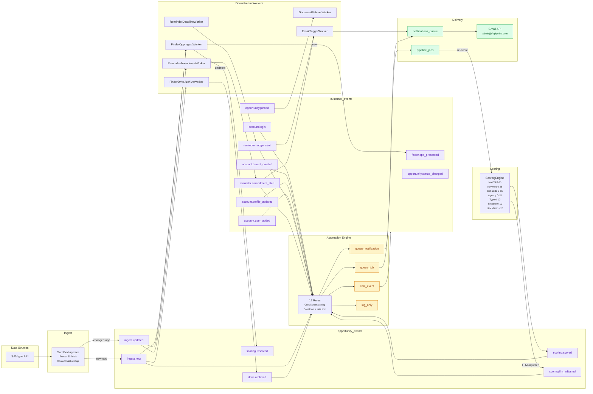
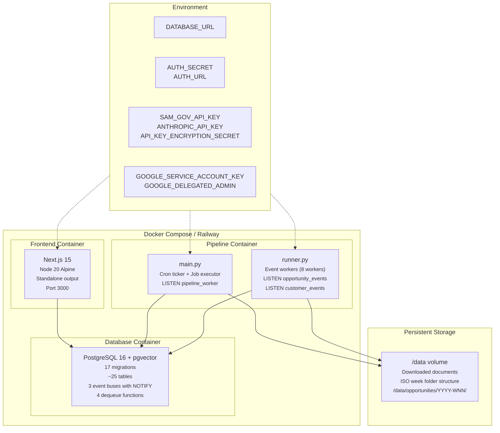
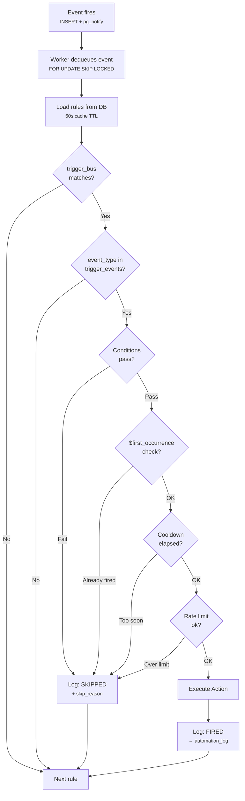
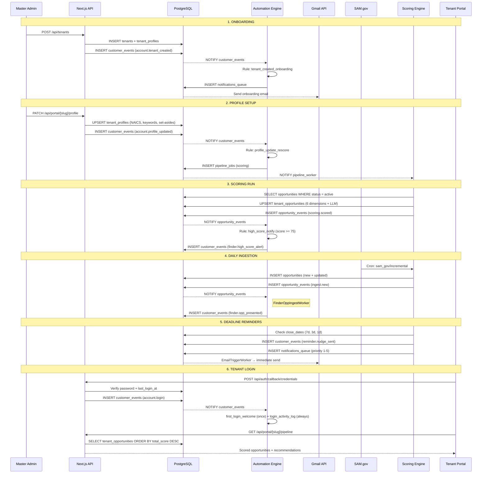
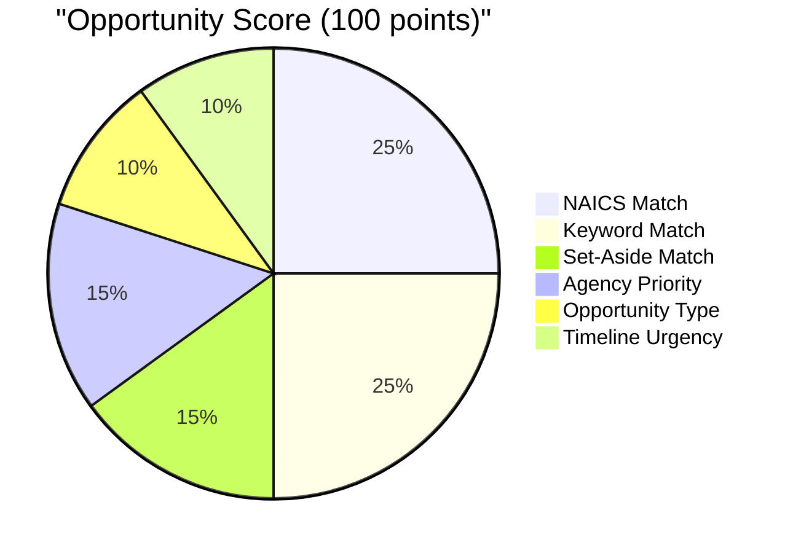

# GovWin Platform — System Architecture

> Complete data flow map of every component, external service, event channel, and scheduled job.
> Updated: 2026-03-25 — reflects automation framework, event system overhaul, CMS fixes.

---

## High-Level System Overview

```mermaid
graph TB
    subgraph INTERNET["Internet"]
        USER["Tenant Users<br/><small>tenant_admin / tenant_user</small>"]
        ADMIN["Master Admin"]
        PUBLIC["Public Visitors"]
    end

    subgraph EDGE["Edge / Middleware"]
        MW["Next.js Middleware<br/><small>Auth gate + tenant isolation</small>"]
    end

    subgraph NEXTJS["Next.js Application — Port 3000"]
        direction TB
        subgraph PAGES_PUBLIC["Public Pages (marketing)"]
            HOME["/ Homepage"]
            ABOUT["/about"]
            TEAM["/team"]
            GETSTARTED["/get-started<br/><small>+ Checkout Modal</small>"]
            CUSTOMERS["/customers"]
            TIPS["/tips"]
            ANNOUNCE["/announcements"]
        end

        subgraph PAGES_AUTH["Auth"]
            LOGIN["/login<br/><small>NextAuth.js v5 / JWT</small>"]
        end

        subgraph PAGES_ADMIN["Admin Dashboard — master_admin only"]
            AD_DASH["/admin/dashboard"]
            AD_TENANTS["/admin/tenants<br/><small>+ /[tenantId] detail</small>"]
            AD_PIPELINE["/admin/pipeline"]
            AD_SOURCES["/admin/sources"]
            AD_EVENTS["/admin/events<br/><small>3 stream tabs</small>"]
            AD_AUTO["/admin/automation<br/><small>Rules + Exec Log</small>"]
            AD_CMS["/admin/content<br/><small>CMS Editor</small>"]
        end

        subgraph PAGES_PORTAL["Tenant Portal — tenant-scoped"]
            TP_DASH["/portal/[slug]/dashboard"]
            TP_PIPE["/portal/[slug]/pipeline<br/><small>Scored opportunities</small>"]
            TP_DOCS["/portal/[slug]/documents"]
            TP_PROF["/portal/[slug]/profile<br/><small>Search parameters</small>"]
        end

        subgraph API["API Routes — /api/*"]
            direction TB
            API_AUTH["/api/auth/*<br/><small>NextAuth handlers</small>"]
            API_TENANTS["/api/tenants<br/><small>CRUD + users</small>"]
            API_OPPS["/api/opportunities<br/><small>+ /[id]/actions</small>"]
            API_CONTENT["/api/content<br/><small>CMS draft/publish/rollback</small>"]
            API_EVENTS["/api/events<br/><small>3 streams + filters</small>"]
            API_AUTO["/api/automation<br/><small>Rules + log + toggle</small>"]
            API_PORTAL["/api/portal/[slug]/*<br/><small>profile, drive, docs</small>"]
            API_PIPE["/api/pipeline<br/><small>Jobs + schedules</small>"]
            API_SYSTEM["/api/system<br/><small>Config + health</small>"]
            API_ADMIN["/api/admin<br/><small>Stats + metrics</small>"]
        end

        subgraph LIB["Shared Libraries — /lib"]
            LIB_AUTH["auth.ts<br/><small>NextAuth config + JWT callbacks</small>"]
            LIB_DB["db.ts<br/><small>sql + pool + helpers</small>"]
            LIB_EVENTS["events.ts<br/><small>emitCustomerEvent<br/>emitOpportunityEvent<br/>emitContentEvent</small>"]
            LIB_CONTENT["content.ts<br/><small>mergeContent deep merge</small>"]
        end
    end

    subgraph PIPELINE["Python Pipeline — Worker Process"]
        direction TB
        subgraph MAIN_LOOP["main.py — Job Executor"]
            CRON["Cron Ticker<br/><small>60s interval</small>"]
            JOB_EXEC["Job Executor<br/><small>dequeue_job → execute</small>"]
        end

        subgraph INGEST["Ingest Layer"]
            SAM_INGEST["SamGovIngester<br/><small>Full + incremental<br/>50 fields extracted</small>"]
        end

        subgraph SCORING["Scoring Layer"]
            SCORE_ENG["ScoringEngine<br/><small>6 dimensions + LLM adj<br/>100-point scale</small>"]
        end

        subgraph WORKERS["Event Workers — runner.py"]
            W_FINDER_I["FinderOppIngestWorker<br/><small>→ opp_presented events</small>"]
            W_FINDER_D["FinderDriveArchiveWorker<br/><small>→ drive sync jobs</small>"]
            W_DOC["DocumentFetcherWorker<br/><small>→ download attachments</small>"]
            W_REMIND_D["ReminderDeadlineWorker<br/><small>→ 7d/3d/1d nudges</small>"]
            W_REMIND_A["ReminderAmendmentWorker<br/><small>→ amendment alerts</small>"]
            W_EMAIL["EmailTriggerWorker<br/><small>→ immediate send</small>"]
            W_AUTO_C["AutomationCustomerWorker<br/><small>→ rule engine</small>"]
            W_AUTO_O["AutomationOpportunityWorker<br/><small>→ rule engine</small>"]
        end

        subgraph AUTO["Automation Engine"]
            A_ENGINE["engine.py<br/><small>Load rules → match → conditions<br/>→ cooldown → rate limit</small>"]
            A_ACTIONS["actions.py<br/><small>emit_event | queue_notification<br/>queue_job | log_only</small>"]
        end

        subgraph EMAIL["Email Service"]
            EMAILER["emailer.py<br/><small>Gmail API via service account<br/>HTML templates</small>"]
        end

        EVENTS_PY["events.py<br/><small>Shared emitters<br/>pipeline_actor / system_actor</small>"]
        CRYPTO["crypto.py<br/><small>AES-256-GCM<br/>API key encrypt/decrypt</small>"]
    end

    subgraph EXTERNAL["External Services"]
        SAM_API["SAM.gov API<br/><small>Federal opportunities</small>"]
        CLAUDE_API["Anthropic Claude API<br/><small>LLM scoring analysis</small>"]
        GMAIL_API["Gmail API<br/><small>Domain-wide delegation<br/>admin@rfppipeline.com</small>"]
        GDRIVE_API["Google Drive API<br/><small>Service account<br/>Opportunity archival</small>"]
    end

    subgraph DB["PostgreSQL 16 + pgvector"]
        direction TB
        DB_CORE[("Core Tables<br/><small>users • tenants • tenant_profiles<br/>accounts • sessions</small>")]
        DB_OPP[("Opportunity Tables<br/><small>opportunities • tenant_opportunities<br/>documents • amendments</small>")]
        DB_EVENTS[("Event Tables<br/><small>opportunity_events<br/>customer_events<br/>content_events</small>")]
        DB_CONTROL[("Control Plane<br/><small>pipeline_jobs • pipeline_schedules<br/>pipeline_runs • source_health<br/>notifications_queue</small>")]
        DB_AUTO[("Automation<br/><small>automation_rules<br/>automation_log</small>")]
        DB_CONTENT[("Content<br/><small>site_content • content_events<br/>drive_files • email_log</small>")]
    end

    %% User flows
    PUBLIC --> MW
    USER --> MW
    ADMIN --> MW
    MW --> PAGES_PUBLIC
    MW --> PAGES_AUTH
    MW --> PAGES_ADMIN
    MW --> PAGES_PORTAL

    %% Page → API
    PAGES_ADMIN --> API
    PAGES_PORTAL --> API
    PAGES_AUTH --> API_AUTH

    %% API → Libraries
    API --> LIB_AUTH
    API --> LIB_DB
    API --> LIB_EVENTS
    API_CONTENT --> LIB_CONTENT

    %% Libraries → DB
    LIB_DB --> DB
    LIB_EVENTS --> DB_EVENTS
    LIB_AUTH --> DB_CORE

    %% Pipeline → DB
    MAIN_LOOP --> DB_CONTROL
    SAM_INGEST --> DB_OPP
    SCORE_ENG --> DB_OPP
    WORKERS --> DB_EVENTS
    AUTO --> DB_AUTO
    EMAILER --> DB_CONTROL

    %% Pipeline → External
    SAM_INGEST --> SAM_API
    SCORE_ENG --> CLAUDE_API
    EMAILER --> GMAIL_API
    W_FINDER_D --> GDRIVE_API

    %% Event emission → Workers
    SAM_INGEST --> EVENTS_PY
    SCORE_ENG --> EVENTS_PY
    EVENTS_PY --> DB_EVENTS

    %% Automation flow
    W_AUTO_C --> A_ENGINE
    W_AUTO_O --> A_ENGINE
    A_ENGINE --> A_ACTIONS

    %% Cron → Jobs
    CRON --> JOB_EXEC
    JOB_EXEC --> SAM_INGEST
    JOB_EXEC --> SCORE_ENG
    JOB_EXEC --> EMAILER

    %% Crypto
    SCORE_ENG --> CRYPTO

    classDef external fill:#fef3c7,stroke:#d97706,color:#92400e
    classDef db fill:#dbeafe,stroke:#2563eb,color:#1e40af
    classDef api fill:#f0fdf4,stroke:#16a34a,color:#166534
    classDef worker fill:#faf5ff,stroke:#7c3aed,color:#5b21b6
    classDef auto fill:#fff1f2,stroke:#e11d48,color:#9f1239
    classDef page fill:#f8fafc,stroke:#64748b,color:#334155

    class SAM_API,CLAUDE_API,GMAIL_API,GDRIVE_API external
    class DB_CORE,DB_OPP,DB_EVENTS,DB_CONTROL,DB_AUTO,DB_CONTENT db
    class API_AUTH,API_TENANTS,API_OPPS,API_CONTENT,API_EVENTS,API_AUTO,API_PORTAL,API_PIPE,API_SYSTEM,API_ADMIN api
    class W_FINDER_I,W_FINDER_D,W_DOC,W_REMIND_D,W_REMIND_A,W_EMAIL,W_AUTO_C,W_AUTO_O worker
    class A_ENGINE,A_ACTIONS auto
```

---

## Event Flow — Complete Data Pipeline

---

## Database Schema — Entity Relationships

```mermaid
erDiagram
    users {
        text id PK
        text email UK
        text role "master_admin | tenant_admin | tenant_user"
        uuid tenant_id FK
        text password_hash
        boolean temp_password
        boolean is_active
    }

    tenants {
        uuid id PK
        text slug UK
        text name
        text plan "starter | professional | enterprise"
        text status "active | trial | suspended | churned"
        text product_tier "finder | reminder | binder | grinder"
        int max_active_opps
        text uei_number
        text cage_code
        jsonb features
    }

    tenant_profiles {
        uuid id PK
        uuid tenant_id FK "UNIQUE"
        text_arr primary_naics
        text_arr secondary_naics
        jsonb keyword_domains
        jsonb agency_priorities
        boolean is_small_business
        boolean is_sdvosb
        boolean is_wosb
        boolean is_hubzone
        boolean is_8a
        int min_surface_score
        int high_priority_score
    }

    opportunities {
        uuid id PK
        text source "sam_gov"
        text source_id
        text title
        text description
        text agency
        text agency_code
        text_arr naics_codes
        text set_aside_type
        text opportunity_type
        timestamptz posted_date
        timestamptz close_date
        text solicitation_number
        text content_hash
        text status
        jsonb document_urls
        jsonb raw_data
    }

    tenant_opportunities {
        uuid id PK
        uuid tenant_id FK
        uuid opportunity_id FK
        numeric total_score "0-100"
        numeric naics_score "0-25"
        numeric keyword_score "0-25"
        numeric set_aside_score "0-15"
        numeric agency_score "0-15"
        numeric type_score "0-10"
        numeric timeline_score "0-10"
        numeric llm_adjustment "-20 to +20"
        text pursuit_status "unreviewed | pursuing | monitoring | passed"
        text pursuit_recommendation "pursue | monitor | pass"
        text priority_tier "GENERATED: high | medium | low"
    }

    documents {
        uuid id PK
        uuid opportunity_id FK
        text filename
        text original_url
        text local_path
        text file_hash
        text download_status "pending | downloaded | error"
    }

    opportunity_events {
        uuid id PK
        uuid opportunity_id FK
        text event_type "ingest._star_ | scoring._star_ | drive._star_"
        text source
        text field_changed
        uuid correlation_id
        jsonb metadata "actor + trigger + refs + payload"
        boolean processed
    }

    customer_events {
        uuid id PK
        uuid tenant_id FK
        text user_id FK
        text event_type "account._star_ | finder._star_ | reminder._star_"
        uuid opportunity_id
        text entity_type
        uuid correlation_id
        jsonb metadata "actor + trigger + refs + payload"
        boolean processed
    }

    content_events {
        uuid id PK
        text page_key
        text event_type "content._star_"
        text user_id
        jsonb content_snapshot
        text diff_summary
        uuid correlation_id
        jsonb metadata
    }

    automation_rules {
        uuid id PK
        text name UK
        text trigger_bus
        text_arr trigger_events
        jsonb conditions
        text action_type "emit_event | queue_notification | queue_job | log_only"
        jsonb action_config
        boolean enabled
        int cooldown_seconds
        int max_fires_per_hour
    }

    automation_log {
        uuid id PK
        uuid rule_id FK
        uuid trigger_event_id
        text trigger_event_type
        boolean fired
        text skip_reason
        jsonb action_result
        jsonb event_metadata
    }

    pipeline_jobs {
        uuid id PK
        text source
        text run_type "full | incremental | score | notify"
        text status "pending | running | completed | failed"
        text triggered_by
        jsonb parameters
        jsonb result
    }

    pipeline_schedules {
        uuid id PK
        text source UK
        text cron_expression
        boolean enabled
        timestamptz next_run_at
    }

    notifications_queue {
        uuid id PK
        uuid tenant_id FK
        text notification_type
        text subject
        text status "pending | sent | failed"
        int priority "1 urgent - 5 low"
        int attempt
    }

    site_content {
        uuid id PK
        text page_key UK
        jsonb draft_content
        jsonb published_content
        jsonb seo_metadata
        boolean auto_publish
    }

    drive_files {
        text id PK
        text gid UK "Google Drive file ID"
        text name
        text type "FOLDER | DOCUMENT | SPREADSHEET"
        uuid tenant_id FK
        text parent_gid
    }

    audit_log {
        uuid id PK
        text user_id FK
        uuid tenant_id FK
        text action
        text entity_type
        jsonb old_value
        jsonb new_value
    }

    users ||--o{ tenants : "belongs_to"
    tenants ||--|| tenant_profiles : "has_one"
    tenants ||--o{ tenant_opportunities : "scored_opps"
    tenants ||--o{ customer_events : "activity"
    tenants ||--o{ notifications_queue : "emails"
    tenants ||--o{ drive_files : "files"
    tenants ||--o{ audit_log : "audit"
    opportunities ||--o{ tenant_opportunities : "scored_for"
    opportunities ||--o{ opportunity_events : "lifecycle"
    opportunities ||--o{ documents : "attachments"
    automation_rules ||--o{ automation_log : "evaluations"
    pipeline_schedules ||--o{ pipeline_jobs : "triggers"
```

---

## Deployment Architecture

---

## Automation Rule Evaluation Flow

---

## Tenant Lifecycle — End-to-End Sequence

---

## Scoring Breakdown

LLM adjustment: -20 to +20 applied on top for opportunities scoring above 50.

---

## Component Inventory

### Frontend — 22 Pages

| Route | Access | Description |
|-------|--------|-------------|
| `/` | Public | Homepage (CMS-driven) |
| `/about` | Public | About page |
| `/team` | Public | Team page |
| `/get-started` | Public | Pricing + checkout modal |
| `/customers` | Public | Customer stories |
| `/tips` | Public | Tips & resources |
| `/announcements` | Public | Platform announcements |
| `/login` | Public | NextAuth.js credentials + magic link |
| `/dashboard` | Auth | Redirect hub |
| `/admin/dashboard` | master_admin | System metrics |
| `/admin/tenants` | master_admin | Tenant management |
| `/admin/tenants/[id]` | master_admin | Tenant detail + users |
| `/admin/pipeline` | master_admin | Pipeline jobs + schedules |
| `/admin/sources` | master_admin | Data source health |
| `/admin/events` | master_admin | 3-stream event viewer |
| `/admin/automation` | master_admin | Automation rules + exec log |
| `/admin/content` | master_admin | CMS editor |
| `/portal/[slug]/dashboard` | tenant | Tenant dashboard |
| `/portal/[slug]/pipeline` | tenant | Scored opportunities |
| `/portal/[slug]/documents` | tenant | Document library |
| `/portal/[slug]/profile` | tenant_admin | Search parameter config |

### API — 12 Route Groups

| Route | Methods | Purpose |
|-------|---------|---------|
| `/api/auth/*` | GET, POST | NextAuth.js handlers |
| `/api/tenants` | GET, POST | Tenant CRUD |
| `/api/tenants/[id]` | GET, PATCH | Tenant detail + update |
| `/api/tenants/[id]/users` | GET, POST | User management |
| `/api/opportunities` | GET | Opportunity listing |
| `/api/opportunities/[id]/actions` | POST | Pin, status change |
| `/api/content` | GET, POST, PATCH, DELETE | CMS operations |
| `/api/events` | GET | Event streams (3 tabs) |
| `/api/automation` | GET, PATCH | Rules + log + toggle |
| `/api/portal/[slug]/profile` | GET, PATCH | Tenant profile |
| `/api/portal/[slug]/drive` | POST | Drive provisioning |
| `/api/pipeline` | GET, POST | Jobs + schedules |

### Python Pipeline — 20 Files, 8 Event Workers

| Worker | Bus | Events | Action |
|--------|-----|--------|--------|
| FinderOppIngestWorker | opportunity | ingest.new, ingest.updated | Present opps to tenants |
| FinderDriveArchiveWorker | opportunity | ingest.new | Queue Drive sync |
| DocumentFetcherWorker | opportunity | ingest.document_added | Download attachments |
| ReminderDeadlineWorker | customer | (scheduled) | 7d/3d/1d deadline nudges |
| ReminderAmendmentWorker | opportunity | ingest.updated | Alert tenants of changes |
| EmailTriggerWorker | customer | reminder.* | Flush notification queue |
| AutomationCustomerWorker | customer | all account/finder/reminder/* | Rule engine evaluation |
| AutomationOpportunityWorker | opportunity | all ingest/scoring/drive/* | Rule engine evaluation |

### Database — 17 Migrations, ~25 Tables

| Migration | Tables Added |
|-----------|-------------|
| 001 | users, tenants, tenant_profiles, accounts, sessions, verification_tokens, download_links, tenant_uploads, audit_log |
| 002 | system_config, api_key_registry, pipeline_schedules, rate_limit_state, pipeline_jobs, pipeline_runs, source_health, notifications_queue |
| 003 | opportunities, tenant_opportunities, documents, amendments |
| 006 | drive_files, email_log, integration_executions |
| 007 | opportunity_events, customer_events + dequeue functions + NOTIFY triggers |
| 012 | site_content, content_events |
| 016 | correlation_id columns + enhanced NOTIFY payloads |
| 017 | automation_rules, automation_log + 12 seeded rules |

### External Integrations

| Service | Purpose | Auth |
|---------|---------|------|
| SAM.gov API | Federal opportunity data | API key |
| Anthropic Claude | LLM scoring analysis | API key (AES-256-GCM encrypted in DB) |
| Gmail API | Notification delivery | Service account + domain-wide delegation |
| Google Drive API | Opportunity document archival | Service account |

---

## V1 Status Assessment

### Complete and Operational

- Multi-tenant auth with role-based access (master_admin, tenant_admin, tenant_user)
- Tenant isolation at middleware, API, and SQL levels
- SAM.gov ingestion with 50-field extraction and content hash dedup
- 6-dimension scoring engine with LLM adjustment
- 3 event buses with LISTEN/NOTIFY, standardized metadata, correlation chains
- 8 event-driven workers with atomic dequeue (FOR UPDATE SKIP LOCKED)
- Automation framework with 12 rules, condition engine, 4 action types
- Gmail notification delivery with HTML templates
- CMS with draft/publish/rollback and deep merge
- Admin dashboard: tenants, pipeline, sources, events, automation, content
- Tenant portal: dashboard, pipeline viewer, documents, profile editor
- 7 public marketing pages (CMS-driven content)
- Error boundaries (global + page-level)
- Audit logging across all mutation endpoints
- Docker Compose + standalone Dockerfiles for Railway deployment

### Needed for V1 Launch

- End-to-end smoke test with live SAM.gov API key
- Gmail service account configuration + domain verification
- Google Drive service account + shared drive setup
- Production DATABASE_URL + connection pooling (PgBouncer)
- Rate limiting on public API endpoints
- HTTPS/TLS termination (Railway handles this)
- Monitoring/alerting on source_health + pipeline_jobs failures
- Backup strategy for PostgreSQL
