# RFPPIPELINE — System Architecture

> Complete data flow map of every component, external service, event channel, and scheduled job.
> Use this to review before building forward.

---

## High-Level Architecture (Mermaid)

```mermaid
graph TB
    subgraph External["External Services"]
        SAM["SAM.gov API<br/>1000 req/day"]
        GRANTS["Grants.gov API<br/>(planned)"]
        SBIR["SBIR API<br/>(planned)"]
        USASP["USASpending API<br/>(planned)"]
        CLAUDE_API["Claude API<br/>claude-sonnet-4"]
        GDRIVE["Google Drive API<br/>Service Account"]
        GMAIL["Gmail API<br/>(planned)"]
    end

    subgraph Frontend["Next.js Frontend (Railway)"]
        MW["Middleware<br/>Auth + Route Guard"]
        AUTH_PAGES["Login Page"]
        ADMIN["Admin Dashboard<br/>master_admin only"]
        PORTAL["Tenant Portal<br/>per-tenant scoped"]

        subgraph API["API Routes"]
            API_AUTH["/api/auth/[...nextauth]"]
            API_SYS["/api/system"]
            API_PIPE["/api/pipeline"]
            API_OPP["/api/opportunities"]
            API_ACT["/api/opportunities/[id]/actions"]
            API_TEN["/api/tenants"]
            API_TEN_D["/api/tenants/[id]"]
            API_PROF["/api/portal/[slug]/profile"]
            API_DOCS["/api/portal/[slug]/documents"]
            API_DRV["/api/portal/[slug]/drive"]
            API_ADRV["/api/admin/drive"]
            API_HEALTH["/api/health"]
        end
    end

    subgraph Pipeline["Python Pipeline (Railway Worker)"]
        MAIN["main.py<br/>Job Worker"]
        SAM_ING["SamGovIngester"]
        SCORING["ScoringEngine"]

        subgraph Workers["Event Workers (runner.py)"]
            W_FINDER_I["finder.ingest<br/>Surfaces opps to tenants"]
            W_FINDER_D["finder.drive_archive<br/>Archives to weekly folders"]
            W_REM_DL["reminder.deadline<br/>7d/3d/1d nudges"]
            W_REM_AM["reminder.amendment<br/>Amendment alerts"]
        end
    end

    subgraph DB["PostgreSQL"]
        T_OPP["opportunities"]
        T_TOPP["tenant_opportunities"]
        T_TEN["tenants"]
        T_USERS["users"]
        T_PROF["tenant_profiles"]
        T_ACTIONS["tenant_actions"]
        T_DOCS["documents"]
        T_AMEND["amendments"]
        T_JOBS["pipeline_jobs"]
        T_RUNS["pipeline_runs"]
        T_HEALTH["source_health"]
        T_NOTIF["notifications_queue"]
        T_CONFIG["system_config"]
        T_DRIVE["drive_files"]
        T_INTEG["integration_executions"]
        T_OPP_EVT["opportunity_events"]
        T_CUST_EVT["customer_events"]

        NOTIFY_PW{{"NOTIFY<br/>pipeline_worker"}}
        NOTIFY_OE{{"NOTIFY<br/>opportunity_events"}}
        NOTIFY_CE{{"NOTIFY<br/>customer_events"}}
    end

    %% External → Pipeline
    SAM -->|"HTTP GET paginated"| SAM_ING
    CLAUDE_API -->|"LLM analysis"| SCORING

    %% Pipeline → DB
    SAM_ING -->|"INSERT/UPDATE"| T_OPP
    SAM_ING -->|"INSERT"| T_OPP_EVT
    SAM_ING -->|"INSERT"| T_AMEND
    SCORING -->|"UPSERT"| T_TOPP
    SCORING -->|"INSERT"| T_OPP_EVT
    MAIN -->|"UPDATE"| T_JOBS
    MAIN -->|"INSERT"| T_RUNS
    MAIN -->|"UPDATE"| T_HEALTH

    %% DB NOTIFY → Workers
    NOTIFY_PW -.->|"wake"| MAIN
    NOTIFY_OE -.->|"wake"| W_FINDER_I
    NOTIFY_OE -.->|"wake"| W_FINDER_D
    NOTIFY_OE -.->|"wake"| W_REM_AM
    NOTIFY_CE -.->|"wake"| W_REM_DL

    %% Workers → DB
    W_FINDER_I -->|"INSERT"| T_CUST_EVT
    W_FINDER_D -->|"INSERT"| T_JOBS
    W_REM_DL -->|"INSERT"| T_CUST_EVT
    W_REM_DL -->|"INSERT"| T_NOTIF
    W_REM_AM -->|"INSERT"| T_CUST_EVT
    W_REM_AM -->|"INSERT"| T_NOTIF

    %% Triggers
    T_JOBS -->|"trigger"| NOTIFY_PW
    T_OPP_EVT -->|"trigger"| NOTIFY_OE
    T_CUST_EVT -->|"trigger"| NOTIFY_CE

    %% Frontend → DB
    API_AUTH -->|"SELECT/UPDATE"| T_USERS
    API_SYS -->|"SELECT"| T_CONFIG
    API_PIPE -->|"INSERT"| T_JOBS
    API_OPP -->|"SELECT"| T_TOPP
    API_ACT -->|"INSERT/UPDATE"| T_ACTIONS
    API_ACT -->|"INSERT"| T_CUST_EVT
    API_ACT -->|"SELECT check_opp_cap()"| T_TEN
    API_TEN -->|"SELECT/INSERT"| T_TEN
    API_TEN_D -->|"SELECT/PATCH"| T_TEN
    API_PROF -->|"SELECT/PATCH"| T_PROF
    API_DOCS -->|"SELECT"| T_DOCS

    %% Frontend → Drive
    API_DRV -->|"list/create/share"| GDRIVE
    API_DRV -->|"INSERT/UPDATE"| T_DRIVE
    API_DRV -->|"INSERT"| T_CUST_EVT
    API_DRV -->|"INSERT"| T_INTEG
    API_ADRV -->|"create global structure"| GDRIVE
    API_ADRV -->|"UPDATE"| T_CONFIG
    API_ADRV -->|"INSERT"| T_DRIVE
```



---

## Component Inventory

### External Services

| Service | Auth | Rate Limit | Status | Call Sites |
|---------|------|------------|--------|------------|
| **SAM.gov API** | API key (rotates 90d) | 1000/day | Live | `SamGovIngester.run()` |
| **Claude API** | API key | Tracked, no hard cap | Live | `ScoringEngine._run_llm_analysis()` |
| **Google Drive** | Service account + delegation | N/A | Live | `google-drive.ts` (15+ functions) |
| **Gmail** | Service account + delegation | N/A | **Planned** | notifications_queue consumer |
| **Grants.gov** | TBD | TBD | **Planned** | Scheduled, no ingester yet |
| **SBIR** | TBD | TBD | **Planned** | Scheduled, no ingester yet |
| **USASpending** | TBD | TBD | **Planned** | Scheduled, no ingester yet |

### Processes (Railway)

| Process | Entry Point | Listens On | Role |
|---------|------------|------------|------|
| **Next.js** | `next start` | HTTP (PORT) | API routes, SSR pages, static assets |
| **Pipeline Worker** | `python -m main` | `NOTIFY pipeline_worker` | Dequeue jobs, run ingest + scoring |
| **Event Workers** | `python -m workers.runner` | `NOTIFY opportunity_events`, `NOTIFY customer_events` | React to events, emit downstream events |

---

## NOTIFY Channels & Event Flow

```
┌─────────────────────────────────────────────────────────────────────┐
│                     PostgreSQL NOTIFY Channels                       │
├─────────────────────────────────────────────────────────────────────┤
│                                                                     │
│  pipeline_worker ──────────────► main.py (dequeue_job)              │
│    trigger: INSERT pipeline_jobs                                    │
│    payload: { job_id, source, run_type, priority }                  │
│                                                                     │
│  opportunity_events ──────────► FinderOppIngestWorker               │
│    trigger: INSERT opportunity_events        FinderDriveArchiveWorker│
│    payload: { event_id, opp_id,              ReminderAmendmentWorker│
│              event_type, source }                                   │
│                                                                     │
│  customer_events ─────────────► ReminderDeadlineWorker              │
│    trigger: INSERT customer_events           (future: Binder, Grinder)│
│    payload: { event_id, tenant_id,                                  │
│              event_type, opp_id }                                   │
│                                                                     │
└─────────────────────────────────────────────────────────────────────┘
```

### Event Cascade Example: New SAM.gov Opportunity

```
SAM.gov API
    │
    ▼
SamGovIngester._upsert_opportunity()
    │
    ├──► INSERT opportunities (new row)
    │
    └──► INSERT opportunity_events (event_type='ingest.new')
              │
              │  NOTIFY 'opportunity_events' fires
              │
              ├──► FinderOppIngestWorker picks up
              │       │
              │       └──► For each tenant with this opp scored:
              │               INSERT customer_events ('finder.opp_presented')
              │                   │
              │                   │  NOTIFY 'customer_events' fires
              │                   └──► (future workers react)
              │
              └──► FinderDriveArchiveWorker picks up
                      │
                      └──► INSERT pipeline_jobs (source='drive_sync', run_type='archive_opp')
                               │
                               │  NOTIFY 'pipeline_worker' fires
                               └──► main.py dequeues and archives to Drive
```

### Event Cascade Example: Amendment Detected

```
SAM.gov API (content_hash changed)
    │
    ▼
SamGovIngester._upsert_opportunity()
    │
    ├──► UPDATE opportunities (content changed)
    ├──► INSERT amendments (legacy)
    │
    └──► INSERT opportunity_events (event_type='ingest.updated')
              │
              │  NOTIFY 'opportunity_events' fires
              │
              ├──► FinderOppIngestWorker
              │       └──► INSERT opportunity_events ('scoring.rescored')
              │               └──► Next scoring run re-scores this opp
              │
              └──► ReminderAmendmentWorker
                      └──► For each reminder+ tenant tracking this opp:
                              ├── INSERT customer_events ('reminder.amendment_alert')
                              └── INSERT notifications_queue (email pending)
```

### Event Cascade Example: Tenant Pursues an Opportunity

```
Portal UI → POST /api/opportunities/[id]/actions
    │
    ├──► check_opp_cap(tenant_id)  →  can_attach? (10 active max)
    │       └── If over cap: return 429 OPP_CAP_REACHED
    │
    ├──► UPDATE tenant_opportunities SET pursuit_status='pursuing'
    │
    ├──► INSERT customer_events ('finder.opp_attached')
    │       │
    │       │  NOTIFY 'customer_events' fires
    │       └──► (future: Binder creates project folder, Grinder queues draft)
    │
    └──► INSERT tenant_actions (action_type='status_change')
```

---

## Google Drive Folder Architecture

```
/RFPPIPELINE/                              ← provisionGlobalDrive()
│
├── /Opportunities/                        ← Global, weekly-partitioned
│   ├── master_index.gsheet                ← Running index of all opps
│   ├── /2026-W11/                         ← getOrCreateWeeklyFolder()
│   │   ├── /SAM-HC1028-25-R-0042-Enterprise-Cloud/
│   │   │   ├── original_rfp.pdf
│   │   │   └── attachment_1.pdf
│   │   └── /SAM-47QTCA-25-R-0089-Cybersecurity/
│   │       └── ...
│   └── /2026-W12/
│       └── ...
│
├── /Customers/                            ← Per-tenant, tier-aware
│   ├── /Acme Federal/                     ← provisionTenantDrive('Acme Federal', 'reminder')
│   │   ├── /Finder/                       ← All tiers
│   │   │   ├── Acme Federal - Pipeline Snapshot.gsheet
│   │   │   ├── /Curated/                  ← AI-generated per-opp summaries
│   │   │   │   └── HC1028-25-R-0042-summary.gdoc
│   │   │   └── /Saved/                    ← Shortcuts to master opp folders
│   │   │       └── Enterprise Cloud → /Opportunities/2026-W11/SAM-HC.../
│   │   ├── /Reminders/                    ← Reminder+ tier
│   │   │   ├── Acme Federal - Deadline Tracker.gsheet
│   │   │   └── Acme Federal - Amendment Log.gsheet
│   │   ├── /Binder/                       ← Binder+ tier
│   │   │   ├── /Active Projects/
│   │   │   │   └── /Enterprise Cloud - HC1028-25-R-0042/
│   │   │   │       ├── Requirements Matrix.gsheet
│   │   │   │       └── Compliance Checklist.gsheet
│   │   │   ├── /Company Profile/
│   │   │   └── /Teaming/
│   │   ├── /Grinder/                      ← Grinder tier only
│   │   │   └── /Proposals/
│   │   │       └── /Enterprise Cloud - HC1028-25-R-0042/
│   │   │           ├── Proposal Draft v1.gdoc
│   │   │           └── Compliance Matrix.gsheet
│   │   └── /Uploads/                      ← All tiers
│   │
│   └── /CyberShield LLC/
│       └── ...
│
└── /System/
    ├── /templates/                        ← Master templates (copied to tenants)
    └── /logs/
```

---

## Product Tiers & Feature Matrix

```
                    ┌──────────┬──────────┬──────────┬──────────┐
                    │  FINDER  │ REMINDER │  BINDER  │ GRINDER  │
                    │  (base)  │ (tier 2) │ (tier 3) │ (tier 4) │
┌───────────────────┼──────────┼──────────┼──────────┼──────────┤
│ Opp Scoring       │    ✓     │    ✓     │    ✓     │    ✓     │
│ Search/Filter     │    ✓     │    ✓     │    ✓     │    ✓     │
│ Reactions         │    ✓     │    ✓     │    ✓     │    ✓     │
│ Pipeline Snapshot │    ✓     │    ✓     │    ✓     │    ✓     │
│ Curated Summaries │    ✓     │    ✓     │    ✓     │    ✓     │
│ Saved Shortcuts   │    ✓     │    ✓     │    ✓     │    ✓     │
├───────────────────┼──────────┼──────────┼──────────┼──────────┤
│ Deadline Nudges   │          │    ✓     │    ✓     │    ✓     │
│ Amendment Alerts  │          │    ✓     │    ✓     │    ✓     │
│ Deadline Tracker  │          │    ✓     │    ✓     │    ✓     │
│ Amendment Log     │          │    ✓     │    ✓     │    ✓     │
├───────────────────┼──────────┼──────────┼──────────┼──────────┤
│ Project Folders   │          │          │    ✓     │    ✓     │
│ Req Matrix        │          │          │    ✓     │    ✓     │
│ Compliance Check  │          │          │    ✓     │    ✓     │
│ PWin Assessment   │          │          │    ✓     │    ✓     │
│ Company Profile   │          │          │    ✓     │    ✓     │
│ Teaming           │          │          │    ✓     │    ✓     │
├───────────────────┼──────────┼──────────┼──────────┼──────────┤
│ AI Proposal Draft │          │          │          │    ✓     │
│ Compliance Matrix │          │          │          │    ✓     │
│ Exec Summary Gen  │          │          │          │    ✓     │
├───────────────────┼──────────┼──────────┼──────────┼──────────┤
│ Max Active Opps   │    10    │    10    │    10    │    10    │
│ (+10 per $99)     │    ✓     │    ✓     │    ✓     │    ✓     │
│ Drive Folders     │  2 deep  │  3 deep  │  5 deep  │  6 deep  │
└───────────────────┴──────────┴──────────┴──────────┴──────────┘
```

---

## Scheduled Jobs

| Schedule | Source | Run Type | Cron (UTC) | Priority | What It Does |
|----------|--------|----------|------------|----------|--------------|
| 5:00 AM | `scoring` | score | `0 5 * * *` | 3 | Re-score all opps × all tenants |
| 6:00 AM | `sam_gov` | full | `0 6 * * *` | 1 | Fetch new/updated SAM.gov opps |
| 6:00 AM | `grants_gov` | full | `0 6 * * *` | 2 | (planned) Grants.gov ingest |
| 7:00 AM | `sbir` | full | `0 7 * * 1` | 3 | (planned) SBIR weekly ingest |
| 7:00 AM | `digest` | notify | `0 7 * * *` | 5 | (planned) Email digest delivery |
| 7:00 AM | `tenant_snapshots` | sync | `0 7 * * *` | 6 | Refresh Drive pipeline snapshots |
| 8:00 AM | `reminder_nudges` | notify | `0 8 * * *` | 4 | Check deadlines, send nudges |
| 8:00 AM | `usaspending` | intel | `0 8 * * 0` | 4 | (planned) Spending intel weekly |
| Every 2h | `reminder_amendments` | notify | `0 */2 * * *` | 5 | Check for amendments, alert tenants |
| Every 4h | `refresh` | refresh | `0 */4 * * *` | 2 | Refresh open opp statuses |

---

## API Route Map

### Public
| Method | Route | Purpose |
|--------|-------|---------|
| GET | `/api/health` | Railway health check |
| POST | `/api/auth/[...nextauth]` | Login (credentials) |

### Master Admin Only
| Method | Route | Purpose |
|--------|-------|---------|
| GET | `/api/system` | System status (jobs, tenants, health, keys, limits) |
| GET | `/api/pipeline?view=jobs\|schedules\|runs` | Pipeline monitoring |
| POST | `/api/pipeline` | Trigger pipeline job |
| GET | `/api/pipeline/schedules` | List cron schedules |
| GET | `/api/tenants` | List all tenants + stats |
| POST | `/api/tenants` | Create tenant |
| GET | `/api/tenants/[id]` | Tenant detail + profile + users |
| PATCH | `/api/tenants/[id]` | Update tenant |
| POST | `/api/tenants/[id]/users` | Add user to tenant |
| GET | `/api/admin/drive` | Global Drive config |
| POST | `/api/admin/drive` | Provision global /RFPPIPELINE/ structure |

### Tenant-Scoped (tenant_user, tenant_admin, master_admin)
| Method | Route | Purpose |
|--------|-------|---------|
| GET | `/api/opportunities?tenantSlug=X` | Paginated pipeline (tenant_pipeline VIEW) |
| POST | `/api/opportunities/[id]/actions` | Record action (thumbs, comment, status_change) |
| GET | `/api/opportunities/[id]/actions` | List actions for opp |
| GET | `/api/portal/[slug]/profile` | Tenant + profile |
| PATCH | `/api/portal/[slug]/profile` | Update profile (NAICS, keywords, etc.) |
| GET | `/api/portal/[slug]/documents` | Opp documents |
| GET | `/api/portal/[slug]/drive` | List Drive files |
| POST | `/api/portal/[slug]/drive` | Provision tenant Drive (tier-aware) |
| GET | `/api/portal/[slug]/drive/[gid]` | File metadata |
| DELETE | `/api/portal/[slug]/drive/[gid]` | Trash file |

---

## Database Tables (26 tables, 4 views, 3 functions)

### Core Domain
| Table | Rows Grow By | Key Indexes |
|-------|-------------|-------------|
| `opportunities` | ~100/day (SAM.gov) | source+source_id UNIQUE, FTS on title+desc |
| `tenant_opportunities` | tenants × opps | tenant_id+opp_id UNIQUE, pursuit_status, priority_tier |
| `tenant_actions` | user clicks | tenant_id+opp_id+created_at |
| `documents` | per opp attachment | opp_id, drive_gid |
| `amendments` | per opp update | opp_id+detected_at |

### Event Bus
| Table | Rows Grow By | Key Indexes |
|-------|-------------|-------------|
| `opportunity_events` | every ingest/score cycle | opp_id+created_at, event_type, unprocessed partial |
| `customer_events` | every tenant action/alert | tenant_id+created_at, event_type, unprocessed partial |

### Multi-Tenancy
| Table | Rows Grow By | Key Indexes |
|-------|-------------|-------------|
| `tenants` | admin creates | slug UNIQUE |
| `tenant_profiles` | 1 per tenant | tenant_id UNIQUE |
| `users` | admin creates | email UNIQUE, tenant_id |

### Control Plane
| Table | Rows Grow By | Key Indexes |
|-------|-------------|-------------|
| `pipeline_jobs` | scheduled + manual | status+priority+triggered_at |
| `pipeline_runs` | 1 per completed job | job_id |
| `system_config` | static (admin edits) | key PRIMARY |
| `notifications_queue` | worker emits | status+scheduled_for |
| `rate_limit_state` | static (counters) | source PRIMARY |
| `source_health` | static (updated) | source PRIMARY |

### Drive & Integrations
| Table | Rows Grow By | Key Indexes |
|-------|-------------|-------------|
| `drive_files` | provisioning + sync | gid UNIQUE, opp_id, artifact_type, week_label |
| `integration_executions` | per Drive/Gmail op | function_name+created_at |

### Views
| View | Purpose |
|------|---------|
| `tenant_pipeline` | Main portal query — joins opps + scores + reactions + deadlines |
| `tenant_analytics` | Per-tenant summary stats |
| `opportunity_tenant_coverage` | Cross-tenant opp overlap |
| `tenant_active_opps` | Cap enforcement — active count vs max |

### Key Functions
| Function | Purpose |
|----------|---------|
| `dequeue_job(worker_id)` | Atomic job pickup (FOR UPDATE SKIP LOCKED) |
| `dequeue_opportunity_events(types[], worker, limit)` | Atomic event pickup for opp workers |
| `dequeue_customer_events(types[], worker, limit)` | Atomic event pickup for customer workers |
| `check_opp_cap(tenant_id)` | Returns can_attach, active_count, max_allowed |
| `get_iso_week_label(ts)` | ISO week string: '2026-W12' |
| `get_system_status()` | Admin dashboard JSONB blob |
| `get_remaining_quota(source)` | Rate limit check |

---

## Key Architecture Decisions

| Decision | Rationale |
|----------|-----------|
| **Append-only event tables** | Auditability + worker automation. Nothing overwritten. |
| **NOTIFY channels** | Real-time wake (no polling). Workers sleep until events arrive. |
| **FOR UPDATE SKIP LOCKED** | Safe concurrent dequeue. Multiple workers, zero double-processing. |
| **postgres.js `toCamel` transform** | DB is snake_case, JS is camelCase. Auto-converted at boundary. Python pipeline uses snake_case natively. |
| **Tier-inclusive hierarchy** | Each tier includes all lower tiers. Upgrade = add folders, never remove. |
| **Namespaced workers** | `finder.*`, `reminder.*`, `binder.*`, `grinder.*` — scale independently per tier. |
| **Drive as artifact store** | Tenants already live in Google Workspace. No new tool to learn. |
| **Service account delegation** | Single SA delegates as admin@rfppipeline.com. No per-user OAuth. |
| **Opp cap as upsell lever** | Base 10 active opps. $99 per +10. Enforced at DB level. |

---

## What's Not Built Yet

| Component | Status | Blocked By |
|-----------|--------|------------|
| Gmail email delivery | Planned | Notification queue consumer needed |
| Grants.gov ingester | Scheduled, no code | API research |
| SBIR ingester | Scheduled, no code | API research |
| USASpending ingester | Scheduled, no code | API research |
| Binder workers | Event types defined | UI + worker code |
| Grinder workers | Event types defined | Claude proposal generation prompts |
| Drive weekly folder auto-rotation | Function exists | Wire into post-ingest job |
| Sheets API content population | Functions exist | Google Sheets API integration |
| Tenant snapshot refresh | Scheduled | Sheets API |
| Knowledge base UI/API | Tables exist (migration 004) | Frontend pages |
| Portal comments/notes UI | Schema exists | Frontend component |
