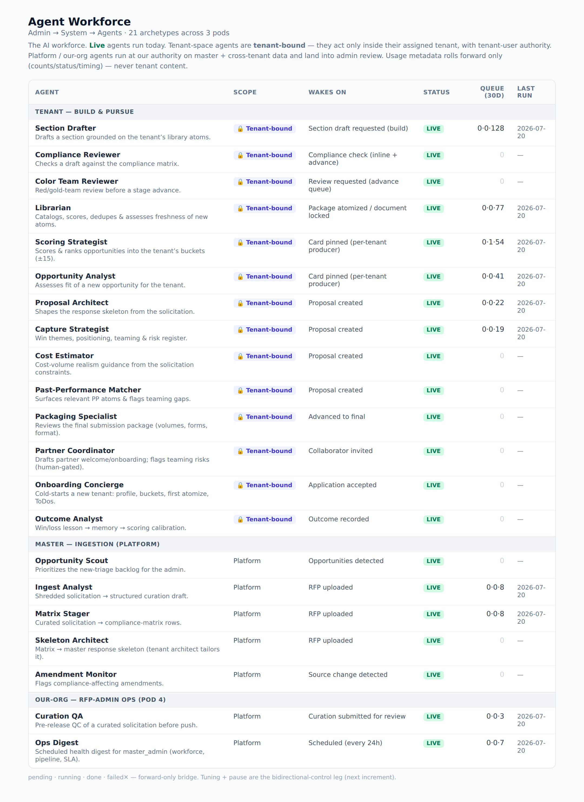

# Our-Org Agent Workforce — RFP-Pipeline's own agents (POD 1–4)

**Companion to `docs/AGENT_WORKFORCE.md`** (customer + master workforce) and `docs/AGENT_ROADMAP.md`.
Those agents serve the *customers'* proposals and the *master* ingestion pipeline. This doc is the
**our-org** workforce — agents that run **RFP Pipeline the business** (market → sell → onboard →
support → operate), at **our authority** (master_admin / rfp_admin), mostly on the CMS/CRM + admin
surface. Four pods; **POD 4 is built**, POD 1–3 are the forward plan.



---

## The admin-side automation pattern (why POD 4 needed NEW workflows)

Most of our automation workflows are **tenant-side** — they fire on proposal lifecycle events
(`proposal.created`, `proposal.advanced`, `collaborator.invited`, …). The **admin/ops side** had far
fewer. POD 4 deliberately adds admin-side automation, and it surfaced the two workflow *shapes* we were
missing:

1. **Event-with-condition on an existing admin event** (no new emit needed).
   `curation_qa` fires on the EXISTING `finder:solicitation.triaged` event, gated by
   `condition: toState == "review_requested"` — i.e. only the *request_review* transition (curation
   done, pre-push). This is the cheapest way to add an admin gate: find the state-machine event that
   already fires and attach a conditional workflow.
2. **Scheduled (cron-shaped) trigger** — genuinely new for this engine.
   The workflow engine is **event-only** (`EventTrigger` = namespace/type/phase, no cron). `ops_digest`
   needs "every 24h", so we added a **scheduler in the pipeline main loop** (`run_ops_digest_scheduler`)
   that emits `system:ops.digest_requested` on an interval → the normal event → workflow path runs. This
   is the reusable bridge from "on a schedule" to "an event fires"; future scheduled agents reuse it.

Both keep every #117/#120 invariant: advisory → guardrail → land-or-review, injection fence where any
untrusted text is read, runaway caps, and **independent** steps so a failed/skipped agent never
dead-ends the admin flow.

---

## POD 4 — RFP-Admin Ops (BUILT)

| Agent | Scope | Job | Trigger → workflow | Lands as |
|---|---|---|---|---|
| **curation_qa** | platform | Pre-release QC of a curated solicitation: completeness, compliance-matrix + master-skeleton sanity, customer-readiness | `finder:solicitation.triaged` (toState=review_requested) → **`OnSolicitationReviewRequested`** | advisory QA report → reviewer (notify) before push |
| **ops_digest** | platform | Scheduled health digest: workforce usage, pipeline health, SLA breaches, alerts | `system:ops.digest_requested` (scheduler) → **`OnOpsDigestRequested`** | advisory digest → NOTIFY master_admin |

Both are **platform-scope** (our-org QC / ops), so they read master + cross-tenant aggregates at our
authority. Per the #120 fabric rule, platform-scope agents (tenant_id=None) run on the **bypass**
connection — NOT the NOBYPASS agent pool — because an empty `app.tenant_id` would make RLS deny the
cross-tenant rows `ops_digest` legitimately needs. `curation_qa` keeps the injection fence (raw
solicitation text); `ops_digest` reads AGGREGATE COUNTS only (no untrusted free text → no injection
surface).

### Admin considerations

- **Oversight:** both appear in `/admin/agents` → **Agent Workforce**, under the *Our-org — RFP-admin
  ops* pod (roster + live queue stats + per-tenant rollup). The roster is the tuning/monitoring surface.
- **Curation QA gate routing:** the QA report is **advisory** — it never changes status or pushes. When
  an admin submits curation for review, the reviewer gets a `curation_qa_ready` notification and reviews
  the findings before approving/returning/pushing. If the agent is unavailable, the review still proceeds
  (independent notify).
- **Ops digest delivery + tuning:** delivered to **master_admin** via `ops_digest_ready`. Cadence is
  tunable with the **`OPS_DIGEST_INTERVAL_HOURS`** env (default 24h, floored at 5 min); the scheduler
  sleeps the interval first, so a deploy restart never triggers a digest storm. Single-replica assumption
  (the processor dedups by trigger_event_id).
- **Updating a POD-4 agent:** prompt/guardrail/model live per-archetype in the pipeline
  (`pipeline/src/agents/archetypes/{curation_qa,ops_digest}.py`); the roster surfaces them for oversight,
  and the per-agent tuning editor (edit prompt/guardrails/model, pause) is the shared next increment.

---

## POD 1–3 — the rest of the our-org workforce (forward plan)

These sit mostly on the **CMS/CRM** service (its own `govtech_cms` DB, bridged via `system_events`), so
several wire as CMS-side workers rather than pipeline `AI_INVOKE` steps — confirm insertion points at
build time, same as POD 4. All produce OUTBOUND, customer-facing content, so the guardrail profile adds
**brand-voice + no-fabricated-claims + human-approve-before-send** (agents never auto-send external comms).

- **POD 1 — Marketing / Content:** `content_marketer` (blog/landing/case-study into the content
  pipeline — `OnCmsContentRequested` exists), `social_amplifier` (schedule social from published content).
- **POD 2 — Sales / CRM:** `lead_qualifier` (score/enrich inbound applications/signups), `nurture_drafter`
  (personalized drip emails by lead stage — email automation exists).
- **POD 3 — Customer Success:** `activation_watcher` (our-side companion to the tenant `onboarding_agent`:
  watch activation, draft check-ins, flag at-risk), `support_triage` (triage support/CS ToDos, draft
  replies, escalate).

**Recommended order after POD 4:** POD 3 `activation_watcher` (protects the tenants the Onboarding
Concierge just cold-started) → POD 1 `content_marketer` (workflow exists) → POD 2 `lead_qualifier`
(feeds the funnel) → the rest.

---

## Verify

```
cd pipeline/src && PYTHONPATH=. python3 -m pytest ../tests/test_pod4_wiring.py ../tests/test_agents.py -q
```
Drive-tested: the scheduler emit lands a valid `system:ops.digest_requested` row that matches
`OnOpsDigestRequested`; the QA gate matches `finder:solicitation.triaged` only when
`toState==review_requested`. Fabric registers **21 archetypes**. LLM reasoning runs on deploy.
