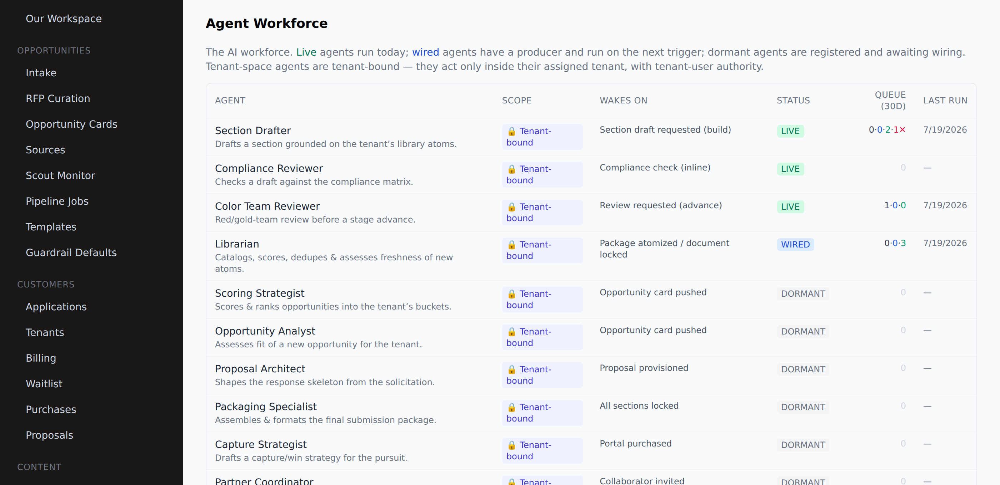
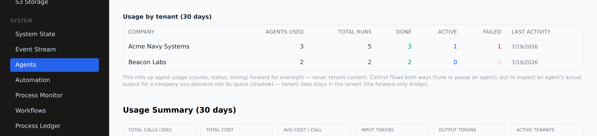

# The Agent Workforce — wiring, oversight, tenant-discretion (#117)

> **As-built correction (deepest-review sweep).** See **docs/START_END_FRAMEWORK.md** §4 for the verified
> agent×scope map. Corrections: every one of the 25 archetypes now has a concrete invocation site (a
> producer or an `AI_INVOKE` step) — the "15 dormant" framing is stale; `research_scout` is invocable via a
> queue producer (`ai/research/route.ts`), just not as an `AI_INVOKE` step. The injection fence was hardened
> this pass: `section_drafter`'s raw RFP `full_text` is now canonically fenced (it bypassed the central
> `ContextAssembler` fence), and the guardrail verdict is now actually enforced at the draft-landing site.

**Audience:** RFP-admin ops (setup + monitoring), engineering (wiring), marketing (how to talk about it).
**As-built:** the pipeline `AgentFabric` auto-registers **25 archetypes** (`_ARCHETYPE_CLASSES` in
`fabric.py`) — **dormant ≠ dead**: all are registry-wired and invocable; "dormant" means only that no
producer/step fires one yet. This doc is the pattern for waking them, the tenant-isolation rules they run
under, and the RFP-admin oversight surface. The fabric mechanics + how to add an archetype are in
`docs/AGENT_FABRIC_DESIGN.md §0`; the automation spine they plug into is `docs/AUTOMATION_SPINE_MAP.md`.

---

## 1. The workforce (what the agents are)

Ten specialist AI agents, each a role with its own prompt, tools, and trigger:

| Agent | Scope | Wakes on | Status | What it does |
|---|---|---|---|---|
| **Section Drafter** | tenant | Section draft requested (build) | live | Drafts a section grounded on the tenant's library atoms. |
| **Compliance Reviewer** | tenant | Compliance check (inline + `tool.proposal.check_compliance`) | live | Checks a draft against the compliance matrix. |
| **Color Team Reviewer** | tenant | Review requested (advance queue) | live | Red/gold-team review before a stage advance. |
| **Librarian** | tenant | Package atomized / document locked (producer) | **live (#117)** | Catalogs, scores, dedupes & assesses freshness of new atoms. |
| **Scoring Strategist** | tenant | Card **pinned** (per-tenant producer) | **live (#117)** | Scores & ranks opportunities into the tenant's buckets (±15, lands beside the algo score). |
| **Opportunity Analyst** | tenant | Card **pinned** (per-tenant producer) | **live (#117)** | Assesses fit of a new opportunity for the tenant. |
| **Proposal Architect** | tenant | Proposal created (`AI_INVOKE`) | **live (#117)** | Shapes/reviews the response skeleton from the solicitation. |
| **Packaging Specialist** | tenant | Advanced to final (`AI_INVOKE`) | **live (#117)** | Reviews the final submission package (volumes, forms, format). |
| **Capture Strategist** | tenant | Proposal created (`AI_INVOKE`) | **live (#117)** | Win themes, positioning, teaming & risk register to seed the build. |
| **Partner Coordinator** | tenant | Collaborator invited (`AI_INVOKE`, new `OnCollaboratorInvited`) | **live (#117)** | Drafts partner welcome/onboarding + flags teaming risks (human-gated). |

**As of #117 all ten archetypes are awake as workflow actors.** Six were greenfielded onto the current
spine this run (tenant-discretion + injection-fence + `library_atoms`); each is locked by a
`test_<agent>_wiring.py`. LLM reasoning runs live on deploy (Railway `ANTHROPIC_API_KEY`); in-sandbox we
verify routing + producer/step + tool SQL against the live schema.

**Then the fabric grew to 19 (#127–#129, see `docs/archive/AGENT_ROADMAP.md`)** — 9 new agents on the same
pattern (advisory, injection-fenced, independent AI_INVOKE/producer, each with a wiring test):

| Agent | Scope | Wakes on | What it does |
|---|---|---|---|
| **Onboarding Concierge** (`onboarding_agent`) | 🔒 tenant | Application accepted (`OnApplicationAccepted`) | Cold-starts a tenant: profile/buckets/first-atomize/getting-started ToDos. |
| **Opportunity Scout** (`opportunity_scout`) | 🌐 platform | Opportunities detected | Prioritizes the new-triage backlog for the admin. |
| **Ingest Analyst** (`ingest_analyst`) | 🌐 platform | RFP uploaded | Shredded solicitation → structured curation draft. |
| **Matrix Stager** (`matrix_stager`) | 🌐 platform | RFP uploaded | Curated solicitation → compliance-matrix rows. |
| **Skeleton Architect** (`skeleton_architect`) | 🌐 platform | RFP uploaded | Matrix → master response skeleton (tenant architect tailors it). |
| **Outcome Analyst** (`outcome_analyst`) | 🔒 tenant | Outcome recorded | Win/loss lesson → memory → scoring calibration. |
| **Amendment Monitor** (`amendment_monitor`) | 🌐 platform | Source change detected | Flags compliance-affecting amendments. |
| **Cost Estimator** (`cost_estimator`) | 🔒 tenant | Proposal created | Cost-volume realism guidance. |
| **PP Matcher** (`pp_matcher`) | 🔒 tenant | Proposal created | Surfaces PP atoms + flags teaming gaps. |

**And now the fabric registers 25** — a further 6 on the same pattern (our-org RFP-admin ops + the CMS
content loop), so the whole platform runs on one fabric:

| Agent | Scope | Wakes on | What it does |
|---|---|---|---|
| **Curation QA** (`curation_qa`) | 🌐 platform (our-org) | Solicitation triaged (pre-release) | Pre-release QA gate on a curated solicitation — ready / blocking issues for the admin. |
| **Ops Digest** (`ops_digest`) | 🌐 platform (our-org) | Ops digest requested (scheduled) | Rolls the ops river into an admin digest (`AI_INVOKE` in `OnOpsDigestRequested`). |
| **Content Generator** (`content_generator`) | 🌐 our-org CMS | Content requested | Drafts marketing/content-pipeline copy. |
| **Content Curator** (`content_curator`) | 🌐 our-org CMS | Content resurface requested | Selects/repurposes existing content for resurfacing. |
| **Social Scheduler** (`social_scheduler`) | 🌐 our-org CMS | Social schedule requested | Schedules social posts across the content calendar. |
| **Research Scout** (`research_scout`) | 🌐 our-org | Research requested (`handle_event` only) | Produces research briefs; **not yet in `TOOL_ACTION_TO_ARCHETYPE`** (can't back an `AI_INVOKE` step until mapped). |

🌐 **platform-scope** agents (incl. the our-org ops/CMS set) run at our authority on master/our-org data (no
tenant to bind to), so tenant-discretion is N/A — but they keep the **mandatory injection fence** (they read
the most untrusted text in the system) and land into an admin review. **Full suite: 332
agent/workflow/guardrail/security tests green.**

---

## 2. The wiring pattern (integration, not reinvention)

Waking an archetype is two moves — the capabilities already exist as tools:

1. **Realign the archetype to the current spine.** The dormant agents were written against the
   retired `library_units` model. Greenfield them onto `library_atoms` + `atom_tags` (the taxonomy),
   `proposal_sections`, `tenant_opportunity_cards`, `tenant_bucket_scores`. Memory is plain DB text
   (`episodic_memories`, ILIKE) + S3 as needed — **no vector search** for cataloging/patterning.
2. **Wire the producer.** Enqueue the agent's task at the lifecycle point with
   `requestAgentTask({ tenantId, agentRole, taskType, input })` (`frontend/lib/agent-client.ts` →
   `agent_task_queue`). The pipeline's `process_task_queue` dequeues and runs it. (The live
   `section_drafter` is invoked directly by its workflow; `color_team` and the rest use the queue.)

**Reference implementation:** the **Librarian** (`pipeline/src/agents/archetypes/librarian.py`) — modern
`library_atoms`/`atom_tags` tools (SQL verified against the live schema), producer in the
atomize-package route, wiring proven by `pipeline/tests/test_librarian_wiring.py` (7/7). The agent's
LLM reasoning runs live on deploy (Railway key); in-sandbox we verify routing + producer + tool SQL.

**Tools go through the canonical registry.** Agent actions map to the frontend tool registry
(`POST /api/tools/:name` — `library.save_atom`, `proposal.draft_section`, `solicitation.*`, …), which is
role-scoped, tenant-scoped, and audited (one `tool.invoke.start`/`end` per call).

---

## 3. Tenant-discretion (the isolation rule) — non-negotiable

**Platform-scope agents** (ingest, triage, scouting) run at our scope. **Tenant-space agents** (Librarian,
Section Drafter, …) are **role-bound to their assigned tenant — tenant_user authority, nothing more.**

- The agent's `tenant_id` is fixed by the **trusted task context** (the `agent_task_queue` row the
  frontend enqueues), **never chosen by the model**.
- The model-facing tool schemas expose **no `tenant_id`** field, so the LLM literally cannot reference
  another tenant (locked by a test in `test_librarian_wiring.py`).
- Every query is tenant-scoped; the agent can't do admin-only things (force-advance, curation, cross-tenant).

---

## 4. The bridge invariant (forward-only data; bidirectional control)

Agent oversight is part of the **master + mirror forward-only bridge** (see
`docs/MASTER_MIRROR_OPP_DESIGN.md`):

- **Info conveyed forward only.** Usage **metadata** (counts, status, timing) rolls up to the RFP admin
  for oversight — **never tenant content**.
- **Control is bidirectional.** The admin can tune or pause an agent (down); usage flows up.
- **Tenant data stays in the tenant.** To inspect an agent's actual **output** for a company, the admin
  **descends into its RLS space (shadow)** — the only backflow. The rollup query selects **aggregate
  counts only**, never content.

---

## 5. RFP-admin oversight (Admin → System → Agents)

`/admin/agents` → **Agent Workforce**:

- **Roster** — every agent with scope (🔒 tenant-bound vs platform), trigger, live/wired/dormant status,
  and 30-day queue stats (pending·running·done·failed + last run).
- **Usage by tenant** — per-company totals (agents used, runs, done, active, failed, last activity) — who
  is working the agents and where failures cluster.
- **Spend** — Claude cost per archetype/tenant/instance from `agent_task_log` (tokens × per-model pricing,
  `cost_usd`), the input to the runaway caps (§8). **Budget rollups** that fold the wider run cost
  (Claude ± Railway DB / S3) into a per-tenant/per-instance total are the next increment (spine gap #5).

**Tuning (next increment).** Prompts, guardrails, and model per archetype live in the pipeline and are
surfaced here for oversight; an inline per-agent tuning editor (edit prompt/guardrails/model, pause) is the
next build, gated to rfp_admin — the "bidirectional control" leg.

---

## 6. Continuation — the other agents (apply §2)

**Placement decision (confirmed).** Agents split into two shapes, and it's how each "sits in a
workflow template as an actor" — both are agents-as-actors + kickoff trigger; the fan-out ones just fan out:

- **Fan-out, per-tenant** (scoring_strategist, opportunity_analyst) act on *(this tenant, this
  opportunity)* ⇒ run **once per tenant** via a **per-tenant producer** (`requestAgentTask` → the
  Librarian pattern), so they stay **tenant-bound (§3)**. They're the AI actors in each tenant's
  card-arrival loop.
- **Single-entity** (proposal_architect, packaging_specialist, capture_strategist, partner_coordinator)
  act on one proposal/portal ⇒ drop in as a **declarative `AI_INVOKE` `Step`** in that entity's workflow,
  literally a step actor beside the human steps. The `TOOL_ACTION_TO_ARCHETYPE` map is already registered.

| Agent | Shape | Trigger / producer site | AI_INVOKE action |
|---|---|---|---|
| **scoring_strategist** | fan-out | card push → bucket-scored (per tenant) → producer | `tool.opportunity.score` |
| **opportunity_analyst** | fan-out | card push (per tenant) → producer | `tool.opportunity.analyze` |
| **proposal_architect** | single-entity step | proposal provision workflow | `tool.proposal.architect` |
| **packaging_specialist** | single-entity step | all-sections-locked workflow | `tool.proposal.package` |
| **capture_strategist** | single-entity step | portal-purchased workflow | `tool.capture.generate_strategy` |
| **partner_coordinator** | single-entity step | collaborator-invited workflow | `tool.partner.coordinate` |

**Status (#117 COMPLETE):** all six are wired and locked by wiring tests.
- `librarian` — producer in the atomize-package route (per cocoon).
- `scoring_strategist` + `opportunity_analyst` — per-tenant producers on the **pin** route (bounded to
  pinned cards; both enqueue with the enriched `{opportunity, base_score}` input).
- `proposal_architect` + `capture_strategist` — `AI_INVOKE` steps in `OnProposalCreated` (both independent
  of `draft_sections`).
- `packaging_specialist` — `AI_INVOKE` step in `OnProposalAdvancedToFinal` (independent of the export loop).
- `partner_coordinator` — `AI_INVOKE` step in the new `OnCollaboratorInvited` workflow (kickoff trigger
  `proposal:collaborator.invited`; independent review-notify so it never dead-ends).

Each is verified like the Librarian: a `test_<agent>_wiring.py` (registered, maps to its action / handles
its trigger, modern tools, **tool schemas expose no `tenant_id`**, **injection-fenced**, execute_tool binds
the trusted tenant, and — for the step actors — it is an independent `AI_INVOKE` step so it can't dead-end
the workflow). LLM reasoning runs live on deploy (Railway key).

**Next:** the two foundation items in §7 (NOBYPASSRLS agent role + `app.tenant_id`; guardrail-gated landing),
then the **master-side + onboarding batch** — see `docs/archive/AGENT_ROADMAP.md`.

## 7. Landing + security (CONFIRMED — applies to all agents)

**7a. The landing step (advisory → surface).** AI_INVOKE / agent-task results are *advisory, never
auto-applied* by the fabric. Each agent needs an explicit **land-or-review** step to close its loop:
- **Auto-apply only where bounded/safe:** `scoring_strategist`'s ±15 adjustment lands **alongside** the
  algorithmic score — into `tenant_bucket_scores.factors` (jsonb, e.g. `{ai_adjustment, ai_rationale}`),
  **never overwriting** `score`; the card ranking reads both.
- **HITL-gate anything that mutates customer content:** `librarian` catalog → a tenant-admin review queue;
  `proposal_architect` skeleton, `packaging_specialist` package, drafts → a review/lock gate. The landing
  action goes through the **audited frontend tool registry** (`POST /api/tools/:name`), not raw SQL.

**7b. Tenant isolation for the Python agents — 🚩 BIG FLAG (verified against the live DB).**
1. **Tenant-discretion (done):** tool schemas expose no `tenant_id`; the trusted tenant comes from the task
   context; the model can never reference another tenant. This is the guarantee **today**.
2. **RLS backstop — BUILT in code (mig 117 + fabric), one deploy step from live.** The as-built state
   (supersedes the pre-117 "must be fixed" flag): `library_atoms` / `tenant_bucket_scores` /
   `tenant_opportunity_cards` are `FORCE ROW LEVEL SECURITY`; **mig 117** adds the missing policies +
   `FORCE ROW LEVEL SECURITY` on `proposals` / `proposal_sections` / `tenant_profiles` / `atom_tags`, and
   **mig 116/119** cover `episodic_memories`. **mig 117** also creates the dedicated **`rfp_agent`
   `NOBYPASSRLS`** role. `fabric.invoke_agent` (`pipeline/src/agents/fabric.py`) acquires a NOBYPASSRLS pool
   when `AGENT_DATABASE_URL` is set and runs `SELECT set_config('app.tenant_id', $1, false)` per invocation
   for tenant-scoped agents, resetting it in `finally` so a pooled conn is never left scoped (platform-scope
   agents stay on the caller/bypass conn — an empty GUC would deny every row). **Proven in sandbox:** as
   `rfp_agent`, a cross-tenant / unset read returns 0 rows. It is **inert under today's bypass role**, so the
   one **pending step is the deploy CUTOVER** — provision the `rfp_agent` login member + `AGENT_DATABASE_URL`
   so the agent path connects as it; then RLS becomes the real backstop over the explicit `WHERE tenant_id`.
   Until cutover, **tenant-discretion + explicit `WHERE tenant_id` is the isolation** — every agent query
   MUST carry it (reviewed per agent).
3. **Writes through the registry:** agent write/landing actions call the RLS+role+audited frontend tools,
   never DB-direct — one `tool.invoke.start`/`end` audit pair per action.

**7c. Guardrails gate the landing — 🚩 FLAG.** An agent's output does not land raw. Before any auto-apply
or surface, it passes the tenant's **guardrails** (`guardrail_templates` / guardrail defaults): bound the
scoring adjustment to ±15, strip/deny disallowed content, enforce the compliance floor, cap cost. A
guardrail failure routes to HITL review instead of applying. The landing action (through the frontend
registry) is where the guardrail check runs — so "advisory → guardrail → land or review" is the loop, never
"advisory → land."

## 8. Runtime safety contract (every agent must satisfy)

| Property | Status | How |
|---|---|---|
| **No prompt injection** | ✅ all 25 (per-agent tests) | Untrusted tenant text (atoms/RFP/opportunity/partner identity) is fenced (`--- BEGIN/END USER CONTENT ---` / `UNTRUSTED …`) with a treat-as-data / ignore-embedded-instructions guard in `build_messages`. Each `test_<agent>_wiring.py` asserts the fence. |
| **No runaway** | ✅ enforced by the runtime | `MAX_TOOL_ROUNDS=20` + `PER_CALL_CEILING_USD=$0.50` mid-loop + rate limit 50 calls/hr/tenant + $50/mo budget (fabric). Producers stay **bounded** — one task per package / per tenant, never per-atom; and an agent's output event must **not re-trigger the same agent** (no self-loop); task enqueue is idempotent. |
| **No dead-ending a workflow/automation** | ✅ enforced by the runtime | The processor catches/logs/continues (never crashes the poll loop); an unmapped or failed `AI_INVOKE` action is a **safe skip** (no fabric call, no DB write); agent output is **advisory** (never writes business tables directly); the fabric returns an error status dict, **never raises**. So a failing agent-actor degrades gracefully — the human loop continues. `AI_INVOKE` steps also carry `on_failure`/`on_timeout`/`retry_count`. |
| **Tenant isolation** | discretion ✅; RLS ✅ **built** (deploy-gated) | §7b: tenant-discretion holds today; **RLS backstop built** — mig 117 adds the `rfp_agent` NOBYPASSRLS role + FORCE-RLS on the gap tables (proposals/proposal_sections/tenant_profiles/atom_tags), and `fabric.invoke_agent` sets/resets `app.tenant_id` per call. **Proven in sandbox**: as `rfp_agent`, a cross-tenant / unset read returns 0 rows. Deploy step: provision a login member + `AGENT_DATABASE_URL`. |
| **Guardrail-gated landing** | ✅ **built** | §7c: `agents/guardrails.py::enforce_guardrails` runs in `invoke_agent`; every result carries a `guardrail` verdict (`apply` bounded, or `review`). Disallowed content → review; scoring adjustment clamped to ±15; fail-safe to review on error. Locked by `test_guardrails.py`. |

Stress/pen tests per agent assert: (1) an injected instruction inside tenant content is ignored; (2) a
flood of tasks stays within rate/budget and never per-atom fans out; (3) a forced agent failure leaves the
workflow/automation advancing (safe skip), not stuck; (4) a cross-tenant `tenant_id` can't be reached
(discretion) and — once the role lands — is RLS-denied.
