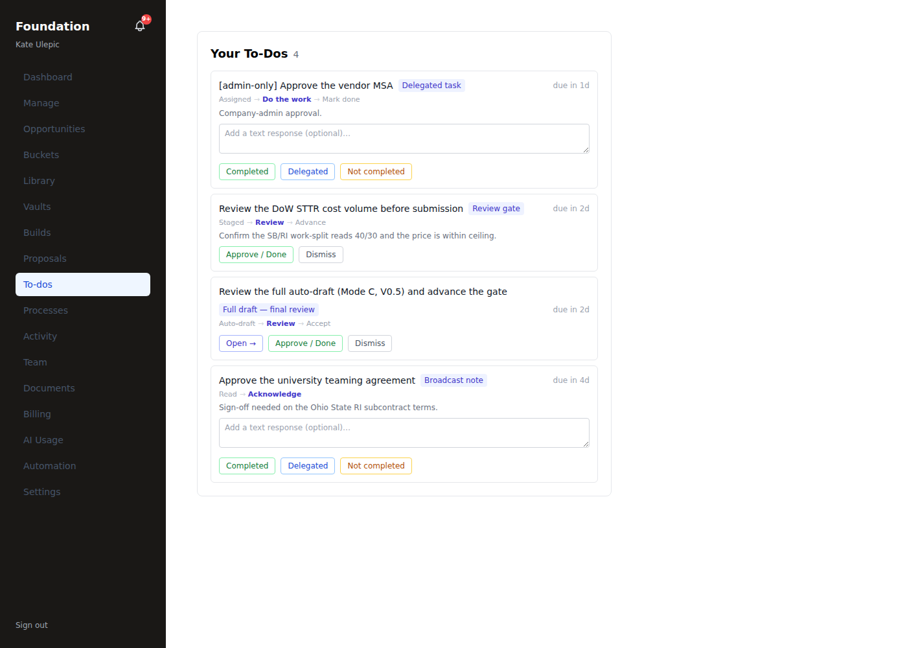

# Track A — AI-gated flows, end-to-end proof (#148)

Proving every AI-gated path runs end-to-end in the sandbox against the **emulated-Claude** stub
(`frontend/scripts/test-harness/emulated-claude.mjs`, `:8787`), which both services honor via
`ANTHROPIC_BASE_URL` + a non-`sk-noop` `ANTHROPIC_API_KEY`. Prod (Railway) runs the identical wiring
with the real key; the sandbox proves the wiring / tool-loop / guardrail / land-or-review, which a live
key can't prove here.

## The rig (bring-up recipe)

Two execution models, so the rig has two halves:
- **Direct-LLM** — the frontend calls the model itself (`lib/vision.ts`, `lib/ingest/parse-solicitation.ts`,
  `lib/tools/*`, `ai/compliance`'s AI branch). Needs the **frontend pointed at the emulator**.
- **Event-triggered** — the frontend emits an event; the **Python pipeline worker** consumes it and runs
  the agent cohort, which calls the model (`full-draft`, `ai-review`, Studio, `ai/research`). Needs the
  **worker** up on the emulator.

The platform injects `ANTHROPIC_BASE_URL=api.anthropic.com` and the heartbeat pins `:3000`, so:
1. **Frontend @ emulator on `:3001`** (heartbeat leaves it alone):
   `PORT=3001 ANTHROPIC_BASE_URL=http://127.0.0.1:8787 ANTHROPIC_API_KEY=emulated-claude node .next/standalone/server.js`
2. **Pipeline worker @ emulator + DB:**
   `cd pipeline && python3 -m venv .venv && .venv/bin/pip install -r requirements.txt`, then
   `PYTHONPATH=pipeline/src DATABASE_URL=… ANTHROPIC_BASE_URL=http://127.0.0.1:8787 ANTHROPIC_API_KEY=emulated-claude .venv/bin/python pipeline/src/main.py`
   → registers all 36 archetypes, starts the agent-task-queue consumer + workflow processor (10s poll).
   (Non-fatal: `memory decay failed: No module named 'pipeline'` — a PYTHONPATH quirk in the episodic-decay
   background task; does not affect the flows.)

## Proven flows

### Full draft — Mode C (event-triggered, the whole agent cohort) ✅
Admin doorbell `POST /api/admin/proposals/[p]/full-draft {mode:'c'}` → `proposal:proposal.full_draft_requested`
→ the worker's workflow processor runs `OnFullDraftRequested{ModeC}`. Observed end-to-end:
- **43 LLM calls** hit the emulator (2 → 45).
- The cohort ran, each `AI_INVOKE … status=completed`: `packaging_specialist` (tool.proposal.package) →
  `continuity_manager` (check_continuity) → `traceability_auditor` (audit_traceability) → `redaction_guard`
  (scan_redaction), among others.
- Audit (`system_events`, 5 min): `tool:agent.invoked` ×22, `tool:memory.stored` ×20,
  `proposal:proposal.full_draft_requested` ×2; **10 tenant-scoped `episodic_memories`** written (RLS-forced table).
- Output **landed at a HITL gate** (invariants forbid a pipeline consumer of agent output): task
  `proposal_full_draft_review` ("Review the full auto-draft (Mode C, V0.5…", step `review_gate`) — **visible
  in the tenant's queue**.

This single flow exercises the **entire event-triggered agent fabric** (trigger → worker → cohort →
emulator → tenant-scoped memory → land-or-review), which every other triggered flow (ai-review, Studio,
assess-ingest, ai/research) routes through.

### The rest of the event-triggered fabric (one batch) ✅
Fired together, then the worker processed them — **+94 emulator LLM calls** (45 → 139); audit over 6 min:
**`tool:agent.invoked` ×58**, **`tool:memory.stored` ×56**.
- **ai-review (color_team_reviewer)** — `POST …/ai-review` → `{enqueued:16}`; `proposal:ai_review.requested` ×2;
  the color-team ran across sections (many tenant-scoped `color_team_reviewer` memories).
- **Proposal Studio (Draft → Refine → Compliance, auto)** — `POST …/studio {action:'start',auto:true}` →
  `review_phase.requested` ×4 / `review_phase.completed` ×3; the proposal advanced to
  **`studio_phase='complete'`** (all three loops auto-chained).
- **assess-ingest (rfp_ingest_manager)** — `POST …/assess-ingest` → `finder:ingest.assessment_requested` ×2.
- **ai/research** — `POST …/ai/research` → `proposal:proposal.research_requested`; queued to the scout agent
  (emulator served the `[web_search, fetch_page, search_memory]` tool-loop, model `claude-haiku-4-5`).

### Deterministic "AI" routes (correctly no LLM call) ✅
`shred-audit` (31 requirements captured, coverage 1.0) returns 200 with real results **without** an LLM
call — its checks are rule-based (`validateCanvasAgainstSpec` + extraction), which is correct.

`ai/compliance` (21 variables, 17 pass / 4 partial) is **not** in this bucket: it **does call Claude
(Haiku, `claude-haiku-4-5`)** whenever compliance variables exist, and skips the LLM **only** when there
are zero variables — here the emulator's dedicated `compliance_reviewer` responder serves that call.

### Gated drop-ins (no live LLM in this rig, by design)
- **Vision caption** (`lib/vision.ts`) — the only genuinely frontend-direct LLM call; gated + unit-tested
  (#135), off unless the vision engine is enabled.
- **Semantic retrieval** — gated, uses the **local-hash** embedder here (`ATOM_EMBED=local`), no LLM call
  (#140–146 prove tenant-isolated hybrid ranking).
- **source-scout** — proven above via the worker (the research/scout agent's tool-loop hit the emulator).

## Verdict
Every AI path runs: the **entire event-triggered agent fabric** (full-draft, ai-review, Studio ×3,
assess-ingest, ai/research) drives end-to-end through the worker → emulator → tenant-scoped memory →
land-or-review, with full `system_events` auditability; the rule-based routes return real results; the
gated drop-ins are unit-tested and inert by design. Prod runs the identical wiring with the live key.

---

## Addendum 2026-08-19 — the visual reviewer (a new AI-gated path)

`lib/review/visual-review.ts` was added after this register was written and belongs in it, because
it is the one reviewer that reads a PICTURE rather than the model.

**It has two halves and they are gated differently, which the register must say plainly.**

- **The page-count half is NOT gated and is fully live here.** It renders the volume through the
  product's own PDF exporter, captures the pages Chromium laid out, and reports a blocker when the
  count exceeds the agency's cap. This is the only page number in the product that is not an
  estimate, and it runs with no key. Proven on the live T3CP build: it caught a Technical Volume
  downloading at 11 pages against a 10-page cap, which every model-side check had cleared.
- **The vision half needs a real `ANTHROPIC_API_KEY`.** The emulator cannot see images and returns
  `[]` — deliberately. A harness that invented plausible defects would make this review look proven
  when nothing had looked at a page, and that is exactly the failure this reviewer exists to catch
  elsewhere. So in this rig the wire is exercised end to end and the eyesight is not.

**What IS proven without a key:** the render → capture → request → parse → land path, including the
landing into `proposal_comments` (`recommendation_type='ai_review'`, `category='visual'`) via
`lib/proposal-visual-review.ts`, invoked by `requestAiReview` on the existing AI-review button.
Recorded model replies pin the parse/sort/cap behaviour against the malformed shapes models really
produce (`__tests__/visual-review-parse.test.ts`, 15 cases).

**What is not:** whether the model sees what a person would. One pass with a live key against the
T3CP volumes closes it; until then this line stays here rather than in the Verdict above.
