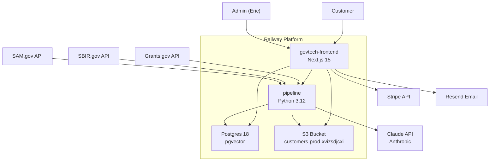
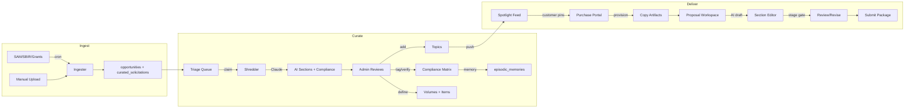
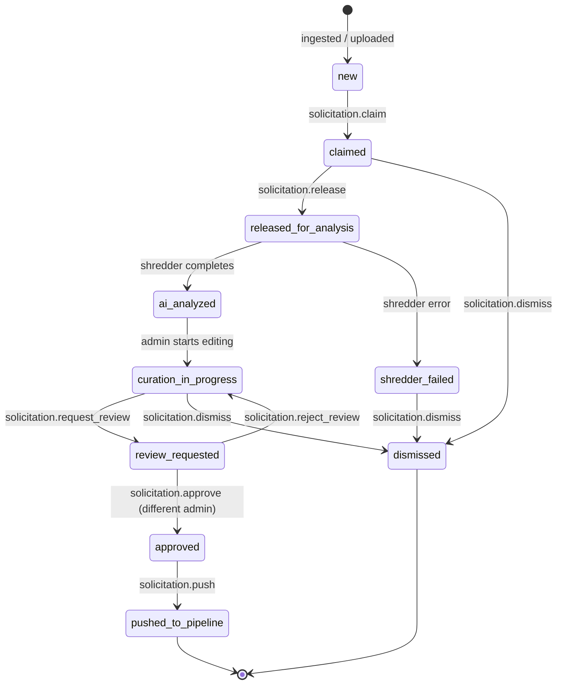
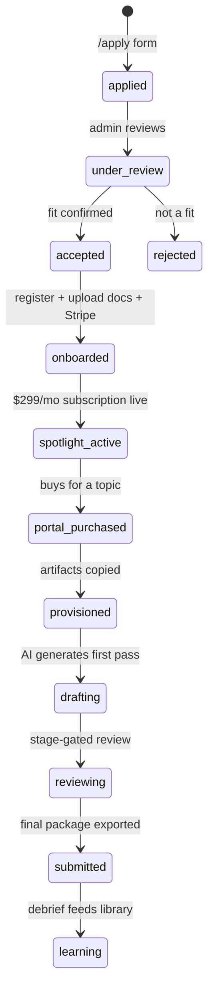
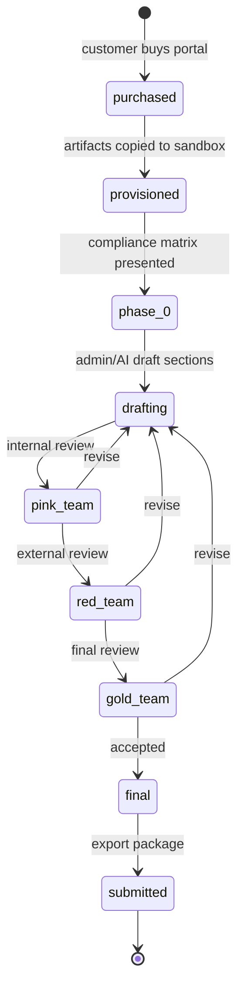

# RFP Pipeline — Day 365 Architecture

**Status:** Living document. Last updated: 2026-04-24.
**Audience:** Engineering (Claude sessions), founder, future hires.

RFP Pipeline is a SaaS platform pairing isolated, company-specific AI
with expert human curation so small businesses can pursue SBIR, STTR,
BAA, and OTA funding without burning a month of payroll per submission.
Launch: June 1, 2026. Founding cohort: 20 seats. Pricing: $299/mo
Spotlight + $999/$1,999 per Proposal Portal.

---

## 1. System Architecture



## 2. Data Flow — RFP to Proposal



## 3. Solicitation State Machine



## 4. Customer Lifecycle



## 5. Proposal Lifecycle



## 6. Feature Modules — Status Matrix

| # | Module | Status | Key Files | Schema Tables |
|---|--------|--------|-----------|---------------|
| A | **Ingestion & Source Mgmt** | BUILT | `pipeline/src/ingest/{base,dispatcher,sam_gov,sbir_gov,grants_gov}.py` | `opportunities`, `pipeline_jobs`, `pipeline_schedules` |
| B | **Shredder & Compliance** | BUILT | `pipeline/src/shredder/{runner,extractor,namespace,compliance_mapping,sync_extract}.py`, `prompts/v1/*.txt` | `solicitation_compliance`, `compliance_variables` |
| C | **Admin Curation Workspace** | BUILT | `frontend/components/rfp-curation/{curation-workspace,pdf-viewer,tag-popover,triage-queue,upload-form}.tsx` | `curated_solicitations`, `solicitation_annotations` |
| D | **Solicitations → Topics → Volumes** | BUILT | migrations 012-015, `frontend/lib/tools/opportunity-{add-topic,bulk-add-topics}.ts`, `volume-*.ts` | `solicitation_documents`, `solicitation_volumes`, `volume_required_items` |
| E | **HITL Memory & Pre-fill** | BUILT | `frontend/lib/tools/curation-memory.ts`, `frontend/app/api/admin/compliance-suggest/route.ts` | `episodic_memories` (namespace column) |
| F | **Customer Onboarding & Billing** | STUB | `frontend/app/api/stripe/{checkout,webhook}/route.ts` (501) | `applications` (BUILT), `tenants`/`tenant_users` (schema exists) |
| G | **Spotlight Feed & Matching** | PLANNED | — | `opportunities` (topics with tech_focus_areas), customer profile (needs schema) |
| H | **Proposal Portal & Workspace** | STUB | `frontend/app/api/portal/[tenantSlug]/proposals/*/route.ts` (501) | `proposals`, `proposal_sections`, `proposal_compliance_matrix` (schema exists) |
| I | **Library Management** | STUB | — | `library_units`, `library_assets` (schema exists, not populated) |
| J | **Agent Fabric** | STUB | `pipeline/src/agents/{fabric,context,memory,tools}.py`, 10 archetypes (all `pass`) | `agent_archetypes`, `agent_task_queue`, `agent_task_log` |
| K | **Collaboration & Access** | STUB | `frontend/app/api/portal/[tenantSlug]/proposals/[id]/collaborators/route.ts` (501) | `proposal_collaborator_access` (schema exists) |
| L | **Notifications & Reminders** | STUB | `pipeline/src/workers/{emailer,reminder}.py` (stubs) | — |
| M | **Marketing & Applications** | BUILT | `frontend/app/(marketing)/{page,about,value,resources,infosec,apply}/*` | `applications`, `waitlist` |
| N | **Auth & RBAC** | BUILT | `frontend/auth.ts`, `frontend/lib/rbac.ts`, `frontend/middleware.ts` | `users` |
| O | **S3 Artifacts & Isolation** | BUILT | `pipeline/src/storage/{s3_client,paths,portal_provisioner}.py`, `frontend/lib/storage/{s3-client,paths}.ts` | `solicitation_documents.content_hash` |
| P | **Source Anchors & Provenance** | BUILT | `frontend/lib/types/source-anchor.ts`, stored in annotations + compliance JSONB | `solicitation_annotations.source_location` |

## 7. Test Coverage

| Layer | Tests | Status |
|-------|-------|--------|
| Pipeline unit + e2e | 152 | All pass (5 live-mode skip) |
| Frontend unit | 175 | All pass |
| **Total** | **327** | **All green** |

## 8. Storage & Artifact Architecture

### SourceAnchor Schema (universal across all features)

```typescript
interface SourceAnchor {
  document_id?: string;       // which file
  document_name?: string;     // human-readable filename
  page: number;               // 1-based page number
  page_count?: number;        // for multi-page spans
  excerpt: string;            // verbatim source text
  excerpt_context?: string;   // broader surrounding text
  char_offset?: number;       // 0-based offset in full text
  char_length?: number;       // character count
  rects?: AnchorRect[];       // %-based bounding boxes (0-100)
  section_key?: string;       // structural context
  section_title?: string;
  created_by?: string;        // actor or 'ai:shredder'
  created_at?: string;
  method?: 'manual_selection' | 'ai_extraction' | 'pattern_match';
}
```

Used in: solicitation_annotations, compliance custom_variables, episodic_memories, library atoms (future), proposal sections (future).

### Artifact Lifecycle

```
Upload PDF → S3 rfp-pipeline/{oppId}/source.pdf
  → Shredder extracts → S3 rfp-pipeline/{oppId}/text.md
  → Claude atomizes → S3 rfp-pipeline/{oppId}/shredded/{section}.md
  → Metadata written → S3 rfp-pipeline/{oppId}/metadata.json
  → Portal purchased → COPY ALL to customers/{tenant}/proposals/{propId}/rfp-snapshot/
  → Customer agents read ONLY from rfp-snapshot/ (never master)
```

## 9. Event Architecture

Every side-effect writes to `system_events`:

| Namespace | Phase | Key Types |
|-----------|-------|-----------|
| `finder.*` | 1 | `opportunity.ingested`, `rfp.triage_claimed`, `rfp.released_for_analysis`, `rfp.shredding.start/end`, `rfp.review_requested/approved/rejected`, `rfp.curated_and_pushed`, `rfp.annotation_saved`, `topic.added/bulk_added`, `volume.added/deleted`, `required_item.added/updated/deleted`, `artifact.stored`, `artifacts.written` |
| `tool.*` | 0.5b | `tool.invoke.start/end` (every tool call via registry) |
| `identity.*` | 0.5 | `user.signed_in/out`, `password_changed` |
| `system.*` | 0.5 | `migration.applied`, `error.unhandled` |
| `capture.*` | 2 | (planned) `tenant.created`, `subscription.started`, `proposal.purchased` |
| `proposal.*` | 3 | (planned) `section.drafted`, `stage.advanced`, `review.requested`, `submitted` |
| `agent.*` | 4 | (planned) `task.queued/started/completed`, `memory.written`, `tool.invoked` |

## 10. API Pattern — Dual-Use Tool Registry

```
Tool definition (defineTool):
  name, namespace, inputSchema (zod), requiredRole, tenantScoped, handler

Three entry points, same handler:
  1. Frontend API: POST /api/tools/[name] → registry.invoke()
  2. Agent dispatch: agent fabric → registry.invoke()
  3. Automation: rule engine → registry.invoke()

Every invocation:
  → role check → tenant scope check → input parse
  → tool.invoke.start event → handler() → tool.invoke.end event
  → capacity metric recorded
```


## 11. Critical Path to June 1 Launch

### Week 1 (Apr 24 – May 1): Foundation Closes

| # | Task | Depends On | Status |
|---|------|-----------|--------|
| 1.1 | Merge current branch (15+ commits) + verify S3 upload + shredder artifacts | — | READY |
| 1.2 | Run shredder against real uploaded BAA (needs ANTHROPIC_API_KEY on pipeline) | 1.1 | BLOCKED on key |
| 1.3 | Verify highlight round-trip: tag → persist → reload → render → navigate | 1.1 | READY |
| 1.4 | Add `previous_value` to compliance save events for full change history | — | TODO |
| 1.5 | Auto-extract-and-anchor flow (shredder → pending highlights → accept/reject walk-through) | 1.2 | TODO |

### Week 2 (May 1 – May 8): Customer Onboarding

| # | Task | Depends On | Status |
|---|------|-----------|--------|
| 2.1 | Application review admin page (`/admin/applications`) with accept/reject buttons | — | TODO |
| 2.2 | Acceptance email (Resend integration) with onboarding link | 2.1 | TODO |
| 2.3 | Customer registration flow (from invite link → create user → set password → tenant row) | 2.2 | TODO |
| 2.4 | Stripe Checkout integration ($299/mo subscription) | 2.3 | TODO |
| 2.5 | Stripe webhook handler (subscription.created → activate tenant) | 2.4 | TODO |
| 2.6 | Customer initial library upload page (capability statement, past perf, key personnel) | 2.5 | TODO |
| 2.7 | Library atomization: uploaded docs → `library_units` + `library_assets` rows | 2.6 | TODO |

### Week 3 (May 8 – May 15): Spotlight Feed

| # | Task | Depends On | Status |
|---|------|-----------|--------|
| 3.1 | Customer profile schema (tech_focus_areas[], naics_codes[], target_programs[], target_agencies[]) | 2.3 | TODO |
| 3.2 | Spotlight ranking engine V1: keyword/category overlap scoring | 3.1, topics pushed | TODO |
| 3.3 | `/portal/[slug]/spotlight` page — ranked topic list with pin/unpin | 3.2 | TODO |
| 3.4 | Topic detail page (customer view) — compliance summary + parent solicitation + "Buy Portal" CTA | 3.3 | TODO |
| 3.5 | Deadline reminder emails (Resend, cron-triggered from pipeline_schedules) | 2.2 | TODO |
| 3.6 | Admin "force-pin topic for customer" tool (white-glove for founding cohort) | 3.3 | TODO |

### Week 4 (May 15 – May 22): Proposal Portal Purchase + Workspace

| # | Task | Depends On | Status |
|---|------|-----------|--------|
| 4.1 | Stripe Checkout for per-proposal purchase ($999 / $1,999 based on topic's phase) | 2.4 | TODO |
| 4.2 | Portal provisioning on successful payment (call `provision_portal_artifacts`) | 4.1 | TODO |
| 4.3 | Proposal workspace page (`/portal/[slug]/proposals/[id]`) — Phase 0 view | 4.2 | TODO |
| 4.4 | Phase 0: compliance matrix presentation (from rfp-snapshot/compliance.json) | 4.3 | TODO |
| 4.5 | Phase 0: gap analysis — required docs vs uploaded library, show missing items | 4.4, 2.7 | TODO |
| 4.6 | AI first-pass draft: Review Agent reads rfp-snapshot + library → drafts sections | 4.5 | TODO |
| 4.7 | Section editor (TipTap) with accept/reject/revise per section | 4.6 | TODO |

### Week 5 (May 22 – May 29): Collaboration + Stage Gates + Polish

| # | Task | Depends On | Status |
|---|------|-----------|--------|
| 5.1 | Collaborator invitation (email + role + section scope + phase scope) | 4.3 | TODO |
| 5.2 | Stage-gate progression (Phase 0 → Drafting → Pink Team → Red Team → Gold Team → Final) | 4.7 | TODO |
| 5.3 | Export package builder (assemble PDFs + forms + attachments into submission ZIP) | 5.2 | TODO |
| 5.4 | Post-submission debrief capture → feed back into customer library | 5.3 | TODO |
| 5.5 | Admin dashboard polish (application queue, active subscribers, portal health) | — | TODO |
| 5.6 | Customer dashboard polish (Spotlight stats, active portals, deadlines) | 3.3 | TODO |

### Week 6 (May 29 – Jun 1): Launch Prep

| # | Task | Depends On | Status |
|---|------|-----------|--------|
| 6.1 | End-to-end smoke test: apply → accept → onboard → Spotlight → pin → purchase → draft → submit | all above | TODO |
| 6.2 | Founding-cohort onboarding (accept first 5-10 applications, personal onboarding calls) | 2.1 | TODO |
| 6.3 | Production monitoring (error alerts, queue depth, S3 usage, Stripe revenue) | — | TODO |
| 6.4 | Tag `v1.0-launch` | 6.1 | TODO |

## 12. Post-Launch Roadmap (Day 60 – Day 365)

| Phase | Timeline | Key Features |
|-------|----------|-------------|
| **Phase 2: Capture** | Jun – Aug 2026 | Real ingester API calls (not just stubs), automated topic extraction from SAM.gov, customer portal self-service, proposal history, library browsing |
| **Phase 3: Proposal Excellence** | Sep – Nov 2026 | Multi-round review workflows, color team stages with comments, version history with diff, export templates per agency, past-performance database |
| **Phase 4: Agent Fabric** | Dec 2026 – Mar 2027 | Per-customer agent provisioning, embeddings + vector search for library/Spotlight, Claude-powered section drafting with context from library + past proposals, learning loop (outcome → preference → calibration), agent memory compaction |
| **Phase 5: Scale** | Mar – Jun 2027 | SOC 2 Type II certification, multi-expert roster, automated Spotlight ranking (ML on click-through data), agency-specific proposal templates, API for partner integrations, mobile app |

## 13. Security Model

| Layer | Mechanism | Status |
|-------|-----------|--------|
| **Customer isolation** | RLS on all tenant-scoped tables + S3 prefix `customers/{slug}/` | Schema BUILT, enforcement PARTIAL (RLS policies defined in 001_baseline but not all queries use ctx.tenantId yet) |
| **Proposal isolation** | Separate S3 path per proposal + `proposal_id` filter on all queries | Schema BUILT, enforcement via portal_provisioner BUILT |
| **Agent isolation** | Per-customer agent context window contains ONLY that customer's data | PLANNED — agent fabric is all stubs |
| **Collaborator isolation** | `proposal_collaborator_access` table with section + phase scoping | Schema BUILT, enforcement PLANNED |
| **No model training** | Anthropic Claude API with enterprise no-training terms | ACTIVE — production API key |
| **Structured memory** | `episodic_memories` with tenant_id + namespace, NOT in model weights | BUILT — every HITL decision stored with full provenance |
| **Encryption** | HTTPS everywhere, PG at-rest encryption (Railway managed), AES-256-GCM for API keys | BUILT |
| **Auth** | NextAuth v5 + bcrypt(12) + JWT + temp_password + middleware role gates | BUILT |
| **Audit** | `system_events` stream with actor + timestamp + payload on every side-effect | BUILT |

## 14. Database Migrations (001 – 015)

| Migration | What It Does |
|-----------|-------------|
| 001 | Baseline: 80+ tables, pgvector, RLS, all enums |
| 002-004 | Seed: system config, compliance variables, agent archetypes |
| 005 | Dedupe pipeline_schedules |
| 006 | Normalize user emails (lowercase) |
| 007 | system_events table (unified audit stream) |
| 008 | Capacity columns + system_health materialized view |
| 009 | Phase 1 curation extensions (namespace, triage_actions, annotations, content_hash unique, FTS trigger) |
| 010 | pipeline_jobs.kind (ingest vs shred_solicitation) + shredder_failed status |
| 011 | applications table (founding cohort pipeline) |
| 012 | solicitation_documents + solicitation_volumes + volume_required_items |
| 013 | Topics as opportunities (solicitation_id FK, topic_number/branch/status, solicitation_summary view) |
| 014 | Phase-aware volumes (applies_to_phase[] on volumes + items) |
| 015 | Document dedup (content_hash unique) + round tracking on solicitations |

