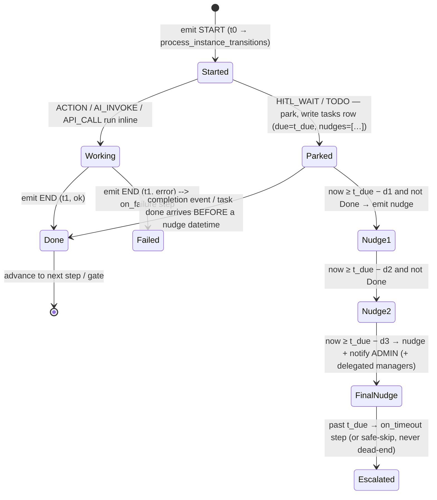
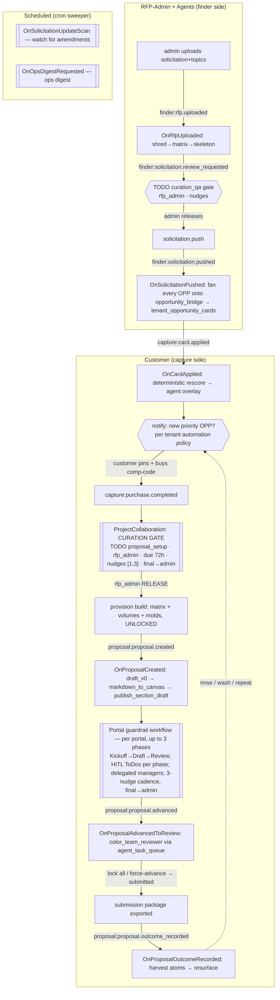

# Automation Spine — End-to-End Map (for review, 2026-07-22)

**TL;DR.** The start→end pattern you described is already the engine's contract, not a
thing to build from scratch. A workflow is a **declarative template** (trigger + a DAG of
steps); every step emits a **start** and an **end** into the `system_events` river; all
instance state lives in `process_instances` + `process_instance_transitions` + the `tasks`
ledger — so the runtime holds **no memory**, and two stateless reconcilers (an event poller
and a time sweeper) re-derive "what started, when, did it finish before its nudge" on every
tick. Cold restart = replay from the river. "Zero-day full functionality" is therefore
**wiring the remaining lifecycle templates onto this spine + the customer-facing grammar
that parameterizes them per tenant** — not new infrastructure.

This doc maps: (1) the primitive, (2) the two reconcilers, (3) the template model, (4) the
full lifecycle as chained workflows, (5) the customer automation grammar, (6) monitoring,
(7) the gap list to zero-day.

---

## 1. The primitive: the start→end gate

Every step of every workflow is the same three-beat unit, and it is the unit you described:



The whole gate is answerable from timestamps in the river:

| Question | Answered by |
|---|---|
| Did it **start**? at what datetime? | a `process_instance_transitions` row (or the trigger event) with `created_at` |
| Did it **complete**? | the paired `phase='end'` transition / `tasks.status='done'` / the awaited `wait_for` event |
| Complete **before** the staged nudge datetime? | `now()` vs `tasks.due_at − nudge_schedule[n]` |
| Not yet? | the time sweeper emits nudge *n*; the **last nudge always adds the admin** (final notice) |
| Way overdue? | `on_timeout` compensation step — declared, validated at boot, never a dead-end |

**Why this gives you what you want:** state is *derived*, never *held* → **stateless**;
every start/end is a row → **monitorable**; nudges + escalation + timeouts are declarative
per step → **managed**; and because the reconcilers are idempotent, a crash mid-flight is a
non-event — the next tick re-derives the exact same "next thing to do".

---

## 2. The two reconcilers (both stateless, both read the river)

```mermaid
flowchart LR
    subgraph River["system_events (append-only audit river)"]
      E[start / end events + payload + correlationId]
    end
    subgraph State["derived state (no memory held)"]
      PI[process_instances]
      PT[process_instance_transitions]
      TK[tasks (nudge_schedule, due_at, status)]
    end
    A[["① EVENT PROCESSOR (trigger-driven)\nrun_workflow_processor — poll loop"]]
    B[["② TIME SWEEPER (cron-driven)\nnudge / timeout / scheduled"]]
    E -->|"5-min lookback poll,\nexcl. system:workflow.*"| A
    A -->|"match trigger → spawn / advance;\nresume paused HITL on the awaited event"| PI
    A --> PT
    A -->|"TODO step → write task"| TK
    A -->|emits its own start/end| E
    TK -->|"now ≥ due − nudge[n] & not done"| B
    PI -->|"past timeout"| B
    B -->|"emit nudge / final-notice-to-admin / on_timeout"| E
    B -->|"scheduled: ops_digest, update_scan"| E
```

- **① Event processor** (`workflows/processor.py::run_workflow_processor`) — the ONLY
  execution path. Polls `system_events` with a **5-minute lookback** (cold-restart safety),
  excludes `system:workflow.*` (no self-trigger), and for each new event: matches registered
  triggers → spawns a managed `process_instance` (idempotent via unique
  `(workflow_name, trigger_event_id)` + an in-proc processed-set), drives the DAG, and
  **resumes any paused HITL instance whose `wait_for` event just landed**. Retrying instances
  are re-polled and advanced.
- **② Time sweeper** (`workflows/manager.py`) — the clock side. Sweeps open `tasks`: for each,
  if `now()` crossed a `nudge_schedule` datetime and the task isn't done → emit a nudge; the
  **final** nudge routes to `_final_notice_user_ids` = **the tenant admin (always) + any
  delegated managers** on the portal's `guardrail_config`. Past-due instances hit `on_timeout`.
  The same sweeper fires **scheduled** workflows (ops digest, solicitation update-scan) — cron
  shape, no external trigger needed.

Both loops reconstruct everything from `{system_events, process_instances,
process_instance_transitions, tasks}`. There is no in-memory workflow state to lose.

---

## 3. The template model (declarative · validated-at-boot · extensible)

A workflow is `trigger: EventTrigger` + `steps: list[Step]` (a `depends_on` DAG). `Step.step_type`:

| StepType | What it does | Emits start/end |
|---|---|---|
| `ACTION` | dotted-string → `importlib` dispatch (e.g. `shred`, `rescore`, `draft_v0`) | yes |
| `AI_INVOKE` | an agent archetype (mapped in `TOOL_ACTION_TO_ARCHETYPE`); advisory→guardrail→land-or-review | yes (+ `tool.*`) |
| `API_CALL` | call another service | yes |
| `TODO` | **human gate** — parks + writes a `tasks` row (assignee, `nudge_days`, `due_in_minutes`, entity ref); resumes on completion | yes |
| `HITL_WAIT` | park until a specific `wait_for` event lands | yes |
| `NOTIFY` | hand to the CRM `event_listener` for email delivery | yes |
| `CONDITION` | branch on a payload predicate | yes |

`Workflow.validate()` **hard-rejects** a bad template at registration: missing trigger,
empty steps, `depends_on`/`on_timeout`/`on_failure` naming a non-existent step, `TODO` without
`task_type`+assignee, an `AI_INVOKE` action not wired to an archetype (a guaranteed silent
skip), a `depends_on` cycle, or an `input_map` ref to a non-ancestor step. New templates
auto-discover at boot and sync to the `process_templates` catalog.

**The exemplar — `ProjectCollaboration`** (the generic, per-instance-parameterized multi-actor
gate; this is the "OPP-card-as-workflow" shape you called out):

```
Step "collaborate"  TODO   task_type/assignee_role/nudge_days/due_in_minutes ← ALL from payload
Step "notify_done"  NOTIFY depends_on="collaborate"   → fires when the human completes
```

Launched imperatively via `launchProjectCollaboration({ taskType, assigneeRole, nudgeDays,
dueMinutes, entityRef, scope })` for ANY scope — the same template backs the 72h curation
gate (`proposal_setup`, `rfp_admin`, nudges `[1,3]`), a color-team review, a content publish,
etc. **One template, N instances, each with its own actors/nudges/due.** Two spawn modes:
**event-triggered** (auto, on a matched river event) and **imperatively-launched** (on demand).

---

## 4. The zero-day lifecycle, mapped as chained workflows

Subscribe → Spotlight → Buy → Curate → Release → Build (V0→V1) → Close out → repeat — each
arrow is a `phase='end'` event that triggers the next template.



Per-stage detail (trigger · actors · gates · staged nudges · cron-vs-trigger · status):

| Stage | Workflow (trigger) | Actor(s) | Gate / step kind | Nudges → escalation | Spawn | Status |
|---|---|---|---|---|---|---|
| Ingest | `OnRfpUploaded` (`finder:rfp.uploaded`) | agents: ingest→matrix→skeleton | ACTION + AI_INVOKE | — | trigger | wired |
| Curation QA | `OnSolicitationReviewRequested` (`finder:solicitation.review_requested`) | rfp_admin, curation_qa agent | TODO gate | staged → admin | trigger | wired |
| Fan-out | `OnSolicitationPushed` (`finder:solicitation.pushed`) | system | ACTION (bridge→cards) | — | trigger | wired |
| Rescore | `OnCardApplied` (`capture:card.applied`) | scoring agent | ACTION + AI overlay | — | trigger | wired |
| **Buy → Curate** | `ProjectCollaboration` via `capture:purchase.completed` | tenant_admin → **rfp_admin** | **TODO** proposal_setup, due **72h** | **[1,3]** → **admin** | imperative | wired |
| Release/Provision | (release route) → `proposal.created` | rfp_admin | ACTION | — | trigger | wired |
| Draft V0 | `OnProposalCreated` (`proposal:proposal.created`) | section_drafter agent | AI_INVOKE | — | trigger | wired |
| **Build V0→V1** | Portal **guardrail workflow** (per-portal template) | tenant_admin + **delegated managers** + collaborators | **TODO per phase** (≤3 phases) | **≤3 nudges** → **admin+managers** | imperative (on accept) | wired |
| Color-team | `OnProposalAdvancedToReview` (`proposal:proposal.advanced`) | color_team_reviewer agent | AI_INVOKE via `agent_task_queue` | — | trigger | wired |
| Collaborator onboarding | `OnCollaboratorInvited` (`proposal:collaborator.invited`) | collaborator | NOTIFY + TODO | staged | trigger | wired |
| Close out / learn | `OnProposalOutcomeRecorded` (`proposal:proposal.outcome_recorded`) | outcome_analyst agent | AI_INVOKE (harvest→resurface) | — | trigger | wired |
| Amendment watch | `OnSolicitationUpdateScan` | scout agents | scheduled ACTION | — | **cron** | wired (dormant scouts) |
| Ops digest | `OnOpsDigestRequested` | ops_digest agent | scheduled AI_INVOKE | — | **cron** | wired |

---

## 5. The customer automation grammar (the per-tenant policy that parameterizes it all)

Templates are generic; the **tenant's global automation policy** supplies the
`recipients × trigger × timing × escalation` for each instance — the one grammar, two vocabularies:

- **Discovery side (buckets/OPPs):** *who* to alert *when* an OPP changes / enters top-N /
  matches a focus agency, timed off open/close dates. → parameterizes the `notify` beats after
  `OnCardApplied`.
- **Build side (portals):** the phase actors, their ToDo due dates, and the escalating 3-nudge
  cadence whose **final notice always reaches the tenant admin + delegated managers**. →
  parameterizes the guardrail workflow's TODO steps.

This policy is **global (tenant-level), not per-bucket** — it's the payload that flows into
`nudge_days` / `assignee_role` / `due_in_minutes` on the TODO steps.

---

## 6. Monitoring & management (already a query, by design)

Because every beat is a row, oversight is SQL, not instrumentation:

- **"Did it start / when / is it late?"** → `process_instances` (status, started_at) ⋈
  `process_instance_transitions` (per-step start/end) ⋈ `tasks` (due_at, next nudge).
- **`/admin/workflows`** — the roster + per-instance live state; **`/admin/agents`** — the
  agent workforce roster + per-tenant usage over the forward-only bridge.
- **The river itself** — `system_events` start/end pairs are the immutable audit trail; a
  missing `end` for a given `correlationId` past its timeout *is* the alert.

---

## 7. Gap list to "zero-day full functionality" (the build, ranked)

The spine is built; these are the wiring jobs on top of clean rivers:

1. **Global automation policy layer (customer grammar → real trigger config).** The
   `recipients × trigger × timing × escalation` UI exists; land it as the per-tenant config
   that feeds `nudge_days`/`assignee_role`/`due_in_minutes` into instances (discovery notify
   beats + build nudge cadence). *(The one genuinely-open piece.)* **→ Full spec:
   `docs/AUTOMATION_POLICY_DESIGN.md` (#190) — the `tenant_automation_policies` table, the
   `resolveAutomationPolicy()` injection point, supersession of the 6-boolean prefs, the
   agent-fabric integration, and the open gotchas.**
2. **Cron dispatch** for the scheduled sweeper (nudge sweep + `OnSolicitationUpdateScan` +
   `OnOpsDigestRequested`) — confirm the cron cadence + the fail-safe (a missed tick just
   re-derives next tick; no state lost).
3. **Wake the dormant agent archetypes** one at a time per `AGENT_WORKFORCE.md` (all 25 are
   registry-wired; dormant ≠ dead) — each is either an `AI_INVOKE` step or a per-tenant producer,
   gated advisory→guardrail→land-or-review, injection-fenced, RLS-backstopped.
4. **Uniform start→end coverage audit** — confirm every step (esp. the newly-woken agent steps)
   emits both phases so the "did it complete before the nudge" gate never has a blind spot.
   (Route-level coverage is already 94/97; this extends it to every workflow step.)
5. **Budget rollups** — Claude cost (± Railway DB / S3) per instance/tenant, surfaced on
   `/admin/agents`, with runaway caps (round/cost/rate/budget) already specified in the fabric.

## 8. Extensibility (the payoff)

A new multi-step, multi-actor flow is a new declarative template — a `Step` DAG with a trigger,
TODO gates carrying their own assignees/nudges, `on_timeout` compensation, and (optionally)
`AI_INVOKE` agent steps — validated at boot, auto-registered, catalog-synced, and instantly
monitorable because it emits the same start/end beats as everything else. The OPP-card→purchase
→build lifecycle is just the first instantiation of this grammar; the next workflow is a file,
not a subsystem.
