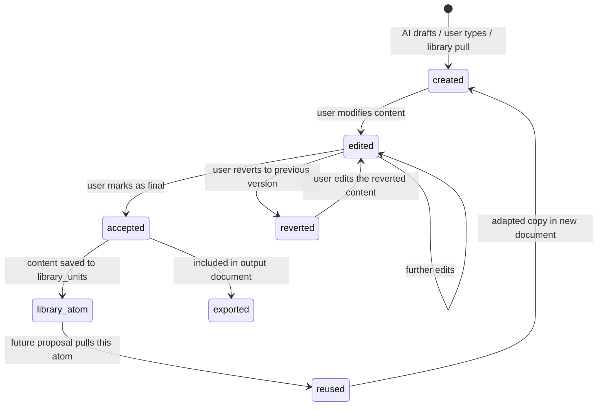

# Canvas Document Architecture — RFP Pipeline

**Status:** Design document. Pre-implementation.
**Last updated:** 2026-04-25.

The canvas document system is the unified content creation, editing,
and export layer for all proposal artifacts. Every document — technical
volume, cost volume, slide deck, cover sheet — is a JSON canvas
populated with typed atoms (text blocks, images, tables, headings,
captions, footnotes, TOCs). The same JSON renders as a WYSIWYG editor
in the browser AND exports to pixel-accurate Word, PowerPoint, or PDF.

---

## 1. Core Concept: Atoms on a Canvas

```
┌─────────────────────────────────────────────────────────┐
│  Canvas (8.5" × 11" @ 72dpi = 612 × 792 pts)          │
│  ┌───────────────────────────────────────────────────┐  │
│  │  Header Zone: {topic_number} — {company_name}    │  │
│  ├───────────────────────────────────────────────────┤  │
│  │                                                   │  │
│  │  [heading] 1.0 Technical Approach                 │  │
│  │                                                   │  │
│  │  [text_block] Our approach leverages novel         │  │
│  │  ablative materials developed under prior SBIR    │  │
│  │  Phase I (AF241-001). The key innovation is...    │  │
│  │                                                   │  │
│  │  [image] Figure 1: System Architecture Diagram    │  │
│  │  [caption] Fig. 1 — Overview of the proposed...   │  │
│  │                                                   │  │
│  │  [table] Table 1: Performance Comparison          │  │
│  │  | Metric | Baseline | Proposed | Improvement |   │  │
│  │  |--------|----------|----------|-------------|   │  │
│  │                                                   │  │
│  │  [text_block] 1.1 Phase I Objectives              │  │
│  │  The objectives of the proposed effort are...     │  │
│  │                                                   │  │
│  ├───────────────────────────────────────────────────┤  │
│  │  Footer Zone: {company_name} | Page {n} of {N}   │  │
│  └───────────────────────────────────────────────────┘  │
└─────────────────────────────────────────────────────────┘
```

An **atom** is any discrete content unit: a paragraph, a heading, an
image with caption, a table, a bulleted list, a footnote. Each atom is:

- **Independently editable** — click to edit, drag to reposition
- **Independently reusable** — accept → library with full provenance
- **Independently auditable** — who created/edited/accepted, when, from what source
- **Format-agnostic** — the atom's content is the same whether it renders
  on a Word page, a slide, or a web preview

A **canvas** is a set of rules that govern how atoms lay out:
- Page dimensions (8.5×11, 16:9 slide, custom)
- Margins (1", 0.75", custom)
- Header/footer templates with variable substitution
- Font defaults (family, size, line spacing)
- Column layout (single, double)
- Maximum pages/slides

---

## 2. JSON Schema

### CanvasDocument (stored in proposal_sections.content JSONB)

```typescript
interface CanvasDocument {
  version: 1;
  document_id: string;         // proposal_sections.id

  // Canvas rules — derived from volume_required_items at portal
  // provisioning time, locked for the lifetime of this document.
  canvas: {
    format: 'letter' | 'slide_16_9' | 'slide_4_3' | 'custom';
    width: number;              // points (72 dpi)
    height: number;             // points
    margins: {
      top: number; right: number; bottom: number; left: number;
    };
    header: {
      template: string;         // "{topic_number} — {company_name}"
      height: number;
      font: FontSpec;
    } | null;
    footer: {
      template: string;         // "{company_name} | Page {n} of {N}"
      height: number;
      font: FontSpec;
    } | null;
    font_default: FontSpec;
    line_spacing: number;       // multiplier (1.0, 1.15, 1.5, 2.0)
    max_pages: number | null;   // from volume_required_items.page_limit
    max_slides: number | null;
  };

  // Ordered list of content atoms
  nodes: CanvasNode[];

  // Document-level metadata
  metadata: {
    title: string;
    volume_id: string;          // solicitation_volumes.id
    required_item_id: string;   // volume_required_items.id
    proposal_id: string;
    solicitation_id: string;
    created_at: string;
    last_modified_at: string;
    last_modified_by: string;   // user id
    version_number: number;     // increments on every save
    status: 'empty' | 'ai_drafted' | 'in_progress' | 'review' | 'accepted';
  };
}

interface FontSpec {
  family: string;               // 'Times New Roman'
  size: number;                 // points (10, 11, 12)
  weight?: 'normal' | 'bold';
  style?: 'normal' | 'italic';
}
```

### CanvasNode (each content atom)

```typescript
interface CanvasNode {
  id: string;                   // stable UUID per atom
  type: NodeType;
  content: NodeContent;         // type-specific payload
  style: Partial<FontSpec> & {  // overrides canvas defaults
    alignment?: 'left' | 'center' | 'right' | 'justify';
    indent?: number;            // points from left margin
    space_before?: number;      // points
    space_after?: number;
  };

  // Provenance — WHERE did this atom come from?
  provenance: {
    source: 'ai_draft' | 'library' | 'manual' | 'imported' | 'template';
    library_unit_id?: string;   // if pulled from library
    source_anchor?: SourceAnchor; // if traced to an RFP requirement
    drafted_by?: string;        // user id or 'ai:review_agent'
    drafted_at?: string;
  };

  // Audit trail — WHO changed this atom?
  history: NodeEdit[];

  // Library eligibility — should this atom be saved to the library
  // when the user accepts/finalizes the section?
  library_eligible: boolean;
  library_tags?: string[];      // pre-populated from context
}

type NodeType =
  | 'heading'        // h1, h2, h3 with auto-numbering
  | 'text_block'     // paragraph with rich inline formatting
  | 'bulleted_list'  // unordered list
  | 'numbered_list'  // ordered list
  | 'image'          // with caption, alt text, s3_key
  | 'table'          // rows × columns with cell content
  | 'caption'        // figure/table caption (auto-numbered)
  | 'footnote'       // linked from inline text
  | 'toc'            // auto-generated from heading nodes
  | 'page_break'     // explicit page/slide boundary
  | 'url'            // hyperlink block
  | 'spacer';        // vertical whitespace

interface NodeEdit {
  actor_id: string;
  actor_name: string;
  action: 'created' | 'edited' | 'replaced' | 'moved' | 'accepted' | 'reverted';
  timestamp: string;
  previous_content?: string;    // for revert capability
  comment?: string;             // reviewer's note
}
```

---

## 3. Canvas Presets (from volume_required_items)

When a proposal portal is provisioned, each `volume_required_item`
generates a canvas preset:

| Item Type | Canvas Format | Dimensions | Margins | Typical Use |
|-----------|--------------|------------|---------|-------------|
| `word_doc` | letter | 612×792 pts | 72 all | Technical volume, past performance |
| `slide_deck` | slide_16_9 | 960×540 pts | 40 all | AFWERX CSO, commercialization |
| `pdf` | letter | 612×792 pts | 72 all | Cover sheet, forms |
| `spreadsheet` | (template) | N/A | N/A | Cost volume — form-based, not canvas |

The canvas rules are LOCKED at provisioning time — they come from
the expert-curated compliance matrix and cannot be changed by the
customer (they can't decide to use 0.5" margins when the RFP says 1").

---

## 4. Atom Lifecycle



### From atom to library unit

When a user accepts a node (marks a section as complete), each
`library_eligible` atom gets written to `library_units`:

```typescript
{
  tenant_id: ctx.tenantId,
  content: node.content,
  content_type: node.type,        // 'text_block', 'image', 'table'
  category: 'technical_approach', // from the section's required_item
  tags: [
    'agency:USAF', 'program:SBIR', 'phase:Phase1',
    'topic:AF261-001', 'section:technical_approach',
    'outcome:pending',            // updated later to 'awarded'/'rejected'
  ],
  source_anchor: node.provenance.source_anchor,
  original_proposal_id: metadata.proposal_id,
  original_node_id: node.id,
  atom_hash: sha256(node.content), // for dedup
  created_by: ctx.actor.id,
}
```

The original atom in the accepted document is IMMUTABLE — it becomes
the audit record. The library unit is a COPY that future proposals
can pull and modify (creating a new atom with `provenance.source = 'library'`
and `provenance.library_unit_id` pointing back).

---

## 5. Editor UX

### The Canvas Editor Component

```
┌─────────────────────────────────────┬──────────────────────┐
│                                     │  Section Info         │
│  WYSIWYG Canvas                     │  ─────────────────── │
│  (actual page dimensions)           │  Volume 2: Technical  │
│                                     │  Page limit: 15       │
│  ┌─────────────────────────────┐    │  Font: TNR 10pt       │
│  │ [heading] 1.0 Technical...  │    │  Pages used: 8 of 15  │
│  │                             │    │                       │
│  │ [text_block] Our approach...│    │  Compliance ✓✓✓✗✓    │
│  │ ░░░░░░░░░░░░░░░░░░░░░░░░░ │    │  ─────────────────── │
│  │ (click to edit inline)      │    │  Source Anchors        │
│  │                             │    │  p.24: "not exceed 15" │
│  │ [image placeholder]         │    │  p.31: "PI must be..." │
│  │ Drop image or select from   │    │  ─────────────────── │
│  │ library                     │    │  Library Matches       │
│  │                             │    │  3 reusable atoms from │
│  │ [table] ...                 │    │  AF241-001 proposal    │
│  │                             │    │  ─────────────────── │
│  └─────────────────────────────┘    │  History               │
│                                     │  Eric: edited 1.0 ...  │
│  Page 8 of 15 ████████░░░░░░░      │  AI: drafted 1.1 ...   │
│                                     │  Tim: accepted 1.0     │
└─────────────────────────────────────┴──────────────────────┘
```

### Key interactions

- **Click a node** → edit inline (text cursor, or image picker, or table editor)
- **Drag a node** → reposition within the page flow
- **Right-click a node** → context menu: Edit, Delete, Move, Send to Library, View Source (shows the RFP anchor), History, Revert
- **Sidebar: Library Matches** → shows atoms from previous proposals that match this section's requirements. Click to insert as a new node with `provenance.source = 'library'`
- **Sidebar: Compliance** → real-time validation: page count, font, required subsections present/missing
- **Sidebar: History** → per-node change log with actor names, timestamps, diffs
- **Bottom bar: Page counter** → visual progress toward the page limit

### Collaboration model

V1 (launch): **Turn-based.** One user edits at a time. Lock icon shows who has the section open. Other collaborators see read-only + comment.

V2: **Real-time.** TipTap + Yjs for collaborative cursors. Each collaborator's edits are attributed per-node in the history array. The canvas re-renders in real-time for all participants.

---

## 6. Export Engine

### Export pipeline

```
CanvasDocument JSON
  ↓
  Node walker (iterates nodes in order)
  ↓
  ├── Word (.docx): docx npm package
  │   Each node → docx Paragraph/Table/Image with exact styles
  │   Header/footer from canvas.header/footer templates
  │   Page breaks from canvas.max_pages + content flow
  │
  ├── PowerPoint (.pptx): pptxgenjs npm package
  │   Each node → slide content element
  │   Each page_break node → new slide
  │   Speaker notes from node.provenance or comments
  │
  ├── PDF: headless Chromium rendering the canvas HTML → PDF
  │   Pixel-accurate to the editor view
  │   Header/footer baked into the page template
  │
  └── HTML: the canvas renderer itself (for web preview / sharing)
```

### Format-specific considerations

**Word (.docx):**
- `docx` npm package handles fonts, margins, headers, footers, TOC
- Each text_block → one or more Paragraph objects
- Each heading → Paragraph with heading style + numbering
- Each table → Table object with cell styles
- Each image → ImageRun with dimensions from the node's position
- Page breaks → PageBreak element between nodes

**PowerPoint (.pptx):**
- `pptxgenjs` handles slide creation + layout
- Canvas rule: `slide_16_9` → each "page" is a slide
- Headings → slide title zone
- Text blocks → body zone
- Images → positioned media
- Tables → slide table
- Speaker notes populated from node.provenance + comments

**PDF:**
- Render the canvas HTML (the same React component the editor uses)
  in a headless browser (Puppeteer on the pipeline service)
- Print-to-PDF with exact dimensions matching the canvas rules
- This guarantees pixel-accuracy between editor and output
- Alternative: use `@react-pdf/renderer` for server-side PDF generation
  without a headless browser (lighter, faster, but less visual fidelity)


---

## 7. Template System

### What templates are

A template is a pre-built CanvasDocument with placeholder atoms that
the AI and user populate for a specific proposal. Templates encode
the STRUCTURE of a proposal artifact — which sections go where, in
what order, with what formatting — but not the CONTENT (which comes
from the customer's library + AI drafting).

### Template sources

1. **RFP Pipeline team creates templates** from real submitted proposals.
   Eric uploads a winning Phase I technical volume → the RFP Pipeline
   Shredder Agent atomizes it → each atom becomes a template node with
   `content: '[PLACEHOLDER: Technical approach — describe your method]'`
   and `library_tags: ['section:technical_approach']`. The structure
   (heading order, page allocation, table placement) is preserved.

2. **Agency-specific templates** for common formats:
   - DoD SBIR Phase I Technical Volume (15pp standard)
   - DoD SBIR Phase II Technical Volume (30pp + commercialization)
   - AFWERX CSO Phase I Slide Deck (25 slides)
   - NSF SBIR Phase I Project Description
   - Generic BAA White Paper (5-10pp)

3. **Customer-evolved templates** — when a customer completes a proposal,
   the accepted document structure (nodes stripped of sensitive content
   but retaining layout + section order + formatting) becomes a
   customer-specific template for their next proposal of the same type.

### Template storage

Templates are CanvasDocument JSON stored in:
- `rfp-admin/system/templates/` in S3 (RFP Pipeline team templates)
- `customers/{tenant}/templates/` in S3 (customer-evolved templates)

Indexed in the DB via a `document_templates` table (future migration):

```sql
CREATE TABLE document_templates (
  id UUID PRIMARY KEY DEFAULT gen_random_uuid(),
  name TEXT NOT NULL,
  description TEXT,
  template_type TEXT NOT NULL,      -- 'technical_volume', 'cost_volume', 'slide_deck'
  agency TEXT,                      -- 'DoD', 'NSF', 'AFWERX', null=generic
  program_type TEXT,                -- 'sbir_phase_1', 'baa', 'cso'
  storage_key TEXT NOT NULL,        -- S3 key to the JSON
  canvas_preset JSONB NOT NULL,     -- canvas rules (dimensions, margins, fonts)
  node_count INTEGER,
  created_by UUID REFERENCES users(id),
  is_system BOOLEAN DEFAULT false,  -- true = RFP Pipeline team template
  tenant_id UUID REFERENCES tenants(id), -- null = system-wide
  metadata JSONB DEFAULT '{}',
  created_at TIMESTAMPTZ DEFAULT now()
);
```

### Template application flow

```
1. Customer purchases portal for topic AF261-001
2. Portal provisioner creates the proposal workspace
3. For each volume_required_item:
   a. Find best-matching template:
      - Customer's own templates for this agency+program first
      - Then system templates for this agency+program
      - Then generic templates for this item_type
   b. Copy the template JSON → new CanvasDocument for this section
   c. Populate placeholder atoms with library matches:
      - For each template node with '[PLACEHOLDER: technical_approach]'
      - Search library_units WHERE category='technical_approach'
        AND tags @> '{agency:USAF}' ORDER BY outcome_score DESC
      - Insert the best-matching library atom as the node's content
      - Set provenance.source = 'library', provenance.library_unit_id
   d. AI Review Agent fills remaining placeholders:
      - Reads the RFP requirement (from rfp-snapshot/compliance.json)
      - Reads the customer's profile + library context
      - Generates content for each unfilled placeholder
      - Sets provenance.source = 'ai_draft'
4. Customer opens the workspace → sees pre-populated sections
   with a mix of library content (green) and AI drafts (yellow)
   ready for review + editing
```

---

## 8. The Color Team Automation

### How node-level tracking enables automated color teams

Every node carries its `history` array with actor attribution. This
means the system knows:

- WHO drafted each paragraph (AI vs. employee vs. collaborator)
- WHO reviewed and accepted each section
- WHICH library atom each block came from (and that atom's win/loss record)
- Whether the content addresses the SPECIFIC evaluation criteria
  (via source_anchor pointing back to the RFP's eval criteria section)

The Color Team Simulator agent uses this metadata:

**Pink Team (completeness check):**
- Walk all nodes → verify every required subsection has content
- Check page count against limit
- Flag sections with only AI content (no human review yet)
- Flag missing required elements (no cost table in cost volume, etc.)

**Red Team (compliance + quality):**
- Each node's source_anchor → verify it addresses the cited requirement
- Check font/margin compliance at the node level
- Score each section against the evaluation criteria weights
- Compare content density to winning proposals from the library

**Gold Team (final review):**
- Full document read for coherence
- Cross-section consistency (does the schedule match the technical approach?)
- Budget ↔ technical alignment
- Executive summary matches the detailed content

Each team's output is a structured review stored as system_events
with per-node findings, scores, and recommendations. The customer
sees a review dashboard with pass/fail per section + specific feedback
anchored to the exact nodes that need attention.

---

## 9. Pre-Launch Template Creation

### The process for creating initial templates

Before June 1, Eric uploads 5-10 real submitted proposals (with
customer permission or from his own prior work). The RFP Pipeline
Shredder processes each one:

1. **Upload the proposal PDF** via the same manual upload path
2. **Shredder atomizes** → sections + text blocks + tables + images
3. **Eric curates** → marks which atoms are structural (keep as
   template) vs. content-specific (strip for library)
4. **Template generator** (new tool) → takes the curated document
   and produces a CanvasDocument JSON with:
   - Structural atoms preserved (headings, section order, table layouts)
   - Content atoms replaced with typed placeholders:
     `[PLACEHOLDER: past_performance_narrative]`
     `[PLACEHOLDER: technical_approach_paragraph]`
     `[PLACEHOLDER: key_personnel_bio]`
   - Canvas rules set from the original document's formatting
5. **Template stored** in `rfp-admin/system/templates/` with metadata

### Target template set for launch

| # | Template | Format | Agency | Program |
|---|----------|--------|--------|---------|
| 1 | Technical Volume — Phase I Standard | Word (15pp) | DoD | SBIR Phase I |
| 2 | Technical Volume — Phase II Standard | Word (30pp) | DoD | SBIR Phase II |
| 3 | AFWERX CSO Slide Deck | PPTX (25 slides) | USAF | CSO |
| 4 | Cost Volume — Phase I | Excel template | DoD | SBIR Phase I |
| 5 | Past Performance Volume | Word (5pp) | Generic | All |
| 6 | Key Personnel Section | Word (3pp) | Generic | All |
| 7 | Commercialization Plan | Word (5pp) | DoD | SBIR Phase II |
| 8 | Abstract / Executive Summary | Word (1pp) | Generic | All |

These 8 templates cover ~90% of founding-cohort proposal needs.
Additional templates are created as customer demand reveals gaps.

---

## 10. Integration with Existing Architecture

### How the canvas connects to everything

| Existing Component | Canvas Integration |
|---|---|
| `volume_required_items` | → Canvas rules (font, margins, page limit, header/footer) |
| `solicitation_compliance` | → Compliance sidebar in editor (real-time validation) |
| `SourceAnchor` | → Node provenance (each atom traces to RFP source text) |
| `library_units` | → Library sidebar in editor (reusable atoms for insertion) |
| `episodic_memories` | → AI drafting context (what worked before for this program) |
| `system_events` | → Every node edit/accept/revert emits an event with actor + diff |
| `portal_provisioner` | → Creates the initial CanvasDocument from template + library |
| `compliance.save_variable_value` | → Compliance values validate against canvas content |
| Shredder | → Atomizes uploaded proposals into template candidates |
| Review Agent | → Fills placeholder atoms with drafted content |
| Compliance Checker | → Validates completed canvas against matrix |
| Color Team Sim | → Reviews completed canvas with per-node scoring |

### Schema additions needed (future migration)

```sql
-- Template catalog
CREATE TABLE document_templates (...); -- described in §7

-- Canvas version history (for revert)
CREATE TABLE canvas_versions (
  id UUID PRIMARY KEY DEFAULT gen_random_uuid(),
  section_id UUID NOT NULL REFERENCES proposal_sections(id),
  version_number INTEGER NOT NULL,
  content JSONB NOT NULL,           -- full CanvasDocument JSON
  created_by UUID REFERENCES users(id),
  created_at TIMESTAMPTZ DEFAULT now(),
  UNIQUE (section_id, version_number)
);

-- Library unit outcome tracking
ALTER TABLE library_units
  ADD COLUMN IF NOT EXISTS outcome TEXT
    CHECK (outcome IN ('pending','awarded','rejected','withdrawn')),
  ADD COLUMN IF NOT EXISTS outcome_score REAL DEFAULT 0.5,
  ADD COLUMN IF NOT EXISTS original_proposal_id UUID REFERENCES proposals(id),
  ADD COLUMN IF NOT EXISTS original_node_id TEXT,
  ADD COLUMN IF NOT EXISTS atom_hash TEXT;
```

