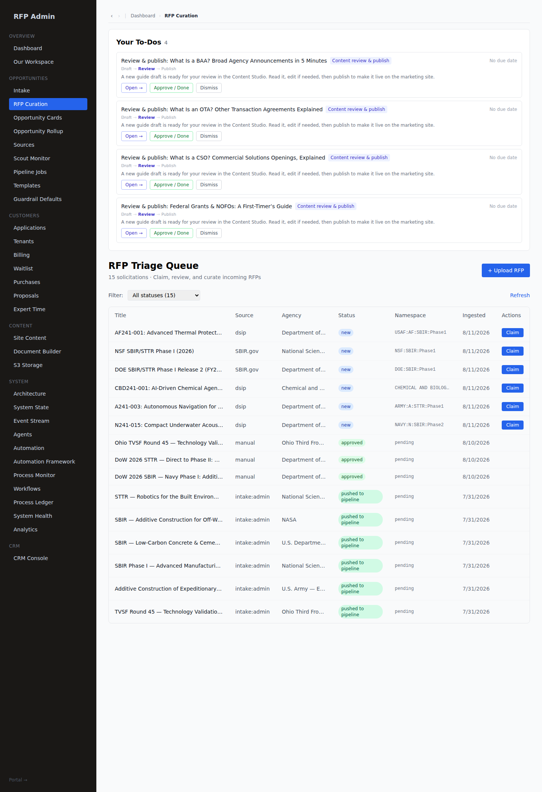
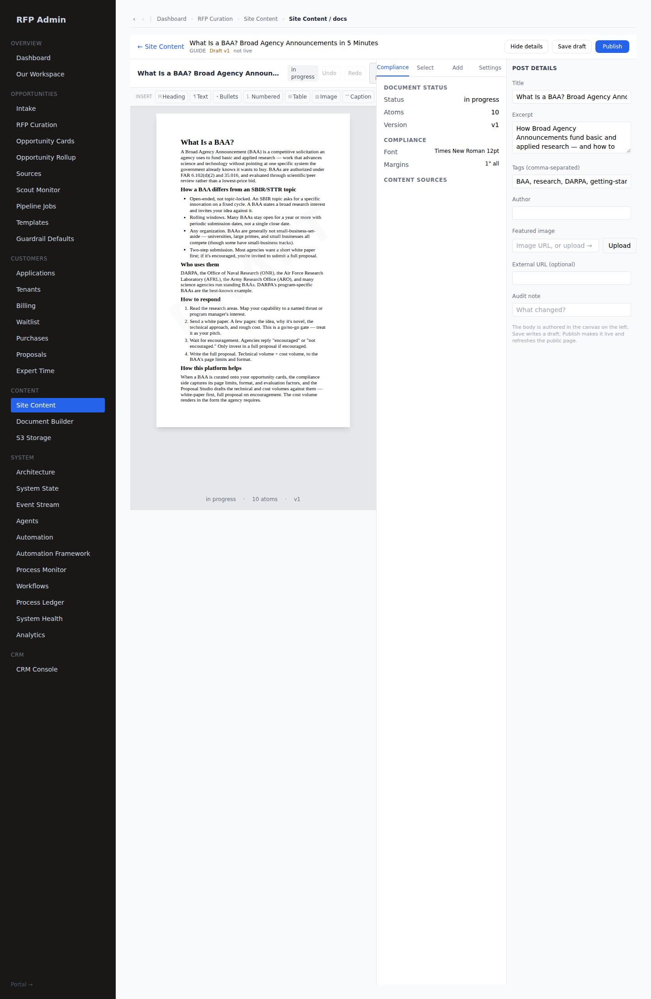

# Content queue — guides drafted + queued for review (#168)

Front-facing content is authored **canvas-native** through the real Content Studio pipeline
(markdown → `canvasFromDocBody` → CanvasDocument → server-side HTML projection) and lands as a
**draft** with a `content_publish` HITL ToDo. **Nothing goes live until a human publishes it.**

Three waves have been queued. Wave 1 is published-or-queued from mig 176; waves 2 and 3 are queued
from mig 211.

---

## Wave 1 — program primers: *which vehicle am I looking at?*

The platform serves **SBIR · STTR · BAA · OTA · CSO · Grants**, but the published guides covered
only SBIR/STTR and DSIP. These four close that gap.

| Guide | Slug | Covers |
|---|---|---|
| What Is a BAA? Broad Agency Announcements in 5 Minutes | `what-is-a-baa` | FAR 6.102/35.016 research solicitation; white-paper → full proposal; DARPA/ONR/AFRL |
| What Is an OTA? Other Transaction Agreements Explained | `what-is-an-ota` | 10 U.S.C. §4021/4022/4023; prototype → follow-on production; consortia |
| What Is a CSO? Commercial Solutions Openings, Explained | `what-is-a-cso` | 10 U.S.C. §3458; solutions-based commercial buy; pitch-first; DIU |
| Federal Grants & NOFOs: A First-Timer's Guide | `federal-grants-nofo-primer` | 2 CFR 200 assistance; NOFO on Grants.gov; SF-424 family |

Authored by `frontend/scripts/seed-program-guides.mts`, captured as **mig 176**. The BAA guide has
since been reviewed and published; the other three are still in the queue.

## Wave 2 — where bids are lost

| Guide | Slug | Covers |
|---|---|---|
| The Cost Volume: Where Good Proposals Get Kicked Back | `sbir-cost-volume-guide` | the five burden layers and the base each applies to; the five mistakes that cost awards |
| Rejected Without Being Read: The Compliance Rules That Do the Damage | `proposal-compliance-basics` | page limits, fonts, margins, file naming, the deadline as a timestamp |
| Planning Phase II While You Write Phase I | `sbir-phase-two-transition` | the data, partners and commercialization story Phase II is decided on |

Authored by `frontend/scripts/seed-followon-guides.mts`.

## Wave 3 — the three questions the first two waves still leave open

| Guide | Slug | Covers |
|---|---|---|
| Build the Compliance Matrix Before You Write a Word | `compliance-matrix-primer` | one row per obligation; finding "shall" statements; splitting compound requirements; the matrix as the outline |
| Registrations to Get Done Before You Bid | `registrations-before-you-bid` | Login.gov → SAM/UEI/CAGE → SBIR.gov SBC → agency portals; annual SAM renewal |
| Teaming: Subcontractors, Consultants, and the STTR Research Partner | `teaming-and-subcontracts` | SBIR 2/3 and 1/2 work-split floors; STTR 40/30; PI primary employment; allocation-of-rights |

Authored by `frontend/scripts/seed-practice-guides.mts`.

**This wave was cut from five to three.** A cost-volume guide and a page-limits guide were drafted
and then deleted, because wave 2 already covers both — a reviewer's queue holding two guides on one
topic is worse than a queue missing one. Where wave 3 touches the same ground it goes deeper rather
than restating: teaming owns the work-split rule the cost guide mentions in a bullet, registrations
owns the SAM lifecycle the compliance guide names in a sentence.

---

## Truth discipline

These guides are held to the ingest-provenance rule (docs/INGEST_PROVENANCE.md): *a value the
product did not read from the solicitation must never look like one it did.* Marketing content is
under the same obligation.

So they state **structure** as fact — a cost volume has direct labour, indirect rates and ODCs;
STTR splits 40/30; a NOFO states its review criteria — and route every **agency-specific number**
back to the solicitation. A page limit or a fee ceiling printed here as though it were a fact would
be a fabricated citation with our name on it, and it would rot the first time an agency changed it.

## How it's queued for review

Each draft raises a **`content_publish` HITL ToDo** (`lib/tasks`) assigned to `rfp_admin`, carrying
the `content_pages` row id as its entity. In the admin queue it shows the **Draft → Review → Publish**
trail with **Open → / Approve·Done / Dismiss**; **Open →** deep-links (`/admin/site/content/[id]` →
resolver) straight into the **Content Studio** editor, where the admin reads the canvas, edits, and
**Publishes** — which promotes the draft to `active` and projects the public HTML.

## Guardrails

- **Nothing publishes itself.** Every seeded row is `status='draft'`, and the public marketing site
  renders only `active` documents. The seed scripts assert `active=0` on their own slugs.
- **Canvas is the source of truth.** `metadata.canvas` holds the CanvasDocument; the public
  `blocks[0].body` is its server-side HTML projection — a client cannot inject an arbitrary body.
- **Publishing drains the queue.** `publishDocument`/`publishPage` complete the `content_publish`
  ToDo that asked for the review, matched by `page_key` (a publish rewrites rows, so the id a ToDo
  holds goes stale). Nothing did this before 2026-08 — see bug log **B105**, and **mig 210**, which
  applies the same rule once over history and cancels ToDos orphaned by earlier seed re-runs.
- **Inline markdown never reaches a page.** The seed parser used to copy `**bold**` and
  `[text](url)` through literally, so saving a legacy page in the Studio published its own markdown
  source (bug log **B104**). It now reads emphasis into `inline_formats`, flattens a link to
  `text (url)` — the canvas has no href to put one in — and strips emphasis from list items and
  headings, which have no `inline_formats` field.

## Durability

A seed script is **not** durability. Wave 2 was written, committed and run, and then a sandbox
rebuild removed all three guides, because nothing but the script knew they existed.

- **Mig 176** — wave 1 (four drafts + ToDos), hand-written.
- **Mig 211** — waves 2 and 3 (six drafts + ToDos), generated **from the live rows** by
  `frontend/scripts/gen-guide-queue-seed.mts`, so what lands on a rebuilt database is byte-identical
  to what was reviewed rather than a re-render that might differ. Proven by deleting two guides and
  re-applying the file: page and ToDo hashes match exactly.

Both are `ON CONFLICT (id) DO NOTHING`, and the generator emits only page_keys named on its command
line, so a guide that has already been published — someone's decision — is never dragged back into
the queue by a rebuild.

## Verdict

**Nine guides drafted canvas-native and queued** through the real `content_publish` HITL flow, with
three fixes landed along the way: the publish now closes its own review ToDo (B105), the Studio no
longer publishes raw markdown when it opens a legacy page (B104), and the seed scripts stopped
stranding items in the queue (B106). Durable via migs 176 + 211.
