# Customer Onboarding Guide

**From application to a submittable package — and everything the canvas can do in between.**

> **Every screenshot in this guide was taken from the running product**, driven as a real
> `tenant_admin` (Kate Ulepic, Foundation) through the real login. Nothing here is mocked, drawn, or
> remembered.
>
> Re-capture with `cd frontend && node scripts/capture-guides.mjs --only customer`. It visits every
> documented route as that actor, **clicks its way into every panel this guide describes**, and
> **fails the run** if a surface 404s, redirects somewhere the guide doesn't say, renders an error
> boundary, throws in the browser, or if a panel it was told to open didn't open. A figure in this
> guide is a figure that harness produced on the current build.

---

## Contents

| Part | What it covers |
|---|---|
| **1 · Getting in** | Applying, first login, the dashboard, the Command Center |
| **2 · Your library** | Upload → atomize → review → browse. The content everything else is built from |
| **3 · Finding work** | The opportunity feed, buckets, pinning, buying a portal |
| **4 · Starting a build** | The 72-hour curation window, workflow setup, the workspace |
| **5 · The canvas** | The long one. One canvas, three surfaces, and every control on them |
| **6 · Finishing** | Lock, the compliance gate, the download, recording the outcome |
| **7 · Around the build** | To-dos, team, standalone documents, templates |

---

## What RFP Pipeline is

RFP Pipeline pairs isolated AI with expert human curation so small businesses can win federal and
state R&D funding (SBIR, STTR, BAA, OTA, CSO, and state programs like Ohio TVSF).

The shape of it, in one line: **you bring your own content; an RFP expert brings the solicitation's
rules; the product keeps the two honest against each other while you write.**

Three properties are worth knowing up front, because they explain most of the design:

- **Your data is yours alone.** Nothing in the system reads or writes across company boundaries.
  When something arrives from outside — an opportunity, a template, a starter library — it arrives
  as a **copy into your workspace**, never as a shared object you and another company both point at.
- **AI is advisory.** Every AI action in the product proposes; none of them locks a section,
  advances a stage, or submits anything. You accept, or you don't.
- **The ruler is one ruler.** The page count the editor shows you while you type is the same
  measurement the download gate enforces. They cannot disagree, because they are the same code.

### Pricing

Founding-cohort launch target: **August 2026.**

| Product | Price | Notes |
|---|---|---|
| **Spotlight** | **$499/mo** | 3-month minimum |
| **Proposal portal — Phase I** | **$1,999** | per portal |
| **Proposal portal — Phase II** | **$4,999** | standalone |
| **Proposal portal — Phase II (linked)** | **$3,999** | when your linked Phase I is already in the system + library |

During the founding cohort, proposal portals are purchased with a **comp code** — a $0 recorded
purchase. Live self-serve checkout is coming.

---

# Part 1 · Getting in

## 1.1 Apply for the founding cohort

From the RFP Pipeline homepage, click **Apply for Early Access** and fill in the form:

| Field | What to enter |
|---|---|
| Company Name | Your legal business name |
| Contact Email | Your primary email |
| Phone | Business phone |
| DUNS / UEI | Your SAM.gov unique entity identifier |
| CAGE Code | If you have one |
| NAICS Codes | Comma-separated, the codes you perform under |
| SAM Registration | Whether you're registered on SAM.gov |
| Company Size | Number of employees |
| Years in Business | How long you've been operating |
| Clearance Level | Highest facility clearance |
| Tech Focus Areas | Your core capabilities — "additive construction, robotics, materials science" |
| Target Agencies | DoD, DOE, NASA, NIH, NSF … |
| Target Program Types | SBIR Phase I, SBIR Phase II, STTR, BAA, CSO, OTA |
| Past Performance Summary | Relevant past contracts, briefly |
| Why RFP Pipeline | What you want out of the platform |

An admin reviews applications within 24–48 hours. Acceptance creates your company workspace and your
user account.

## 1.2 First login

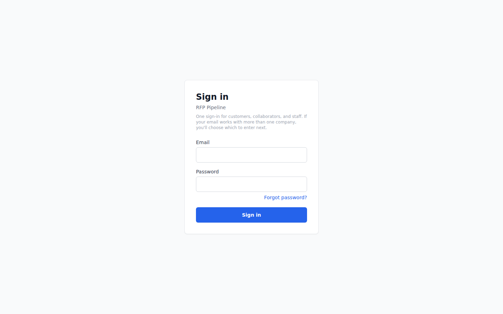

You'll get a temporary password. Sign in with it at `/login` and you'll be sent straight to **Change
Password** — enter the temporary one, then a permanent one of at least 12 characters, twice. Then
you land in your portal.

## 1.3 Your dashboard

`/portal/{your-company}/dashboard`

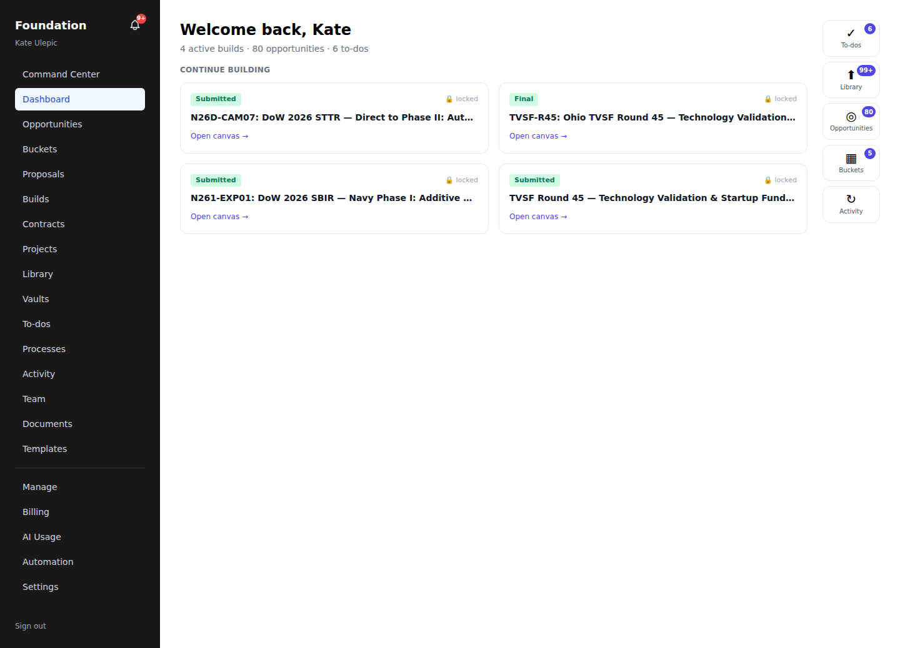

- **"Welcome back, {name}"** and a one-line roll-up: *active builds · opportunities · to-dos*
- **Count tiles** down the right — To-dos, Library, Opportunities, Buckets, Activity. Each opens a
  drawer.
- **Centre — CONTINUE BUILDING**: one card per active build, stamped with its stage (**Drafting** ·
  **Final** · **Submitted**), a 🔒 badge once locked, and **Open canvas →** straight into the work.
- With no builds yet, an admin gets a **Get started** checklist (upload documents, set up the
  company profile, review matched opportunities, start a build). A team member with nothing assigned
  gets *"You're on the team — nothing is assigned to you yet"* instead of a checklist that leads
  nowhere.

**The sidebar:**

| Group | Items |
|---|---|
| Work | **Command Center**, **Dashboard** |
| Pursue | **Opportunities** (the card feed), **Buckets** (the lenses that rank it) |
| Build | **Proposals**, **Builds** (your purchased portals), **Contracts** |
| Content | **Library** (atoms), **Vaults**, **Documents**, **Templates** |
| Coordinate | **To-dos**, **Processes**, **Activity**, **Team** |
| Admin | **Manage**, **Billing**, **AI Usage**, **Automation**, **Settings** |

## 1.4 The Command Center

`/portal/{slug}/command` — "what changed since I last looked", across opportunities, to-dos,
workflows and activity, with an unread watermark. It is the fastest way back in after a few days
away.

---

# Part 2 · Your library

Everything the AI writes is built out of **your** content. The library is where that content lives,
and the quality of your library sets the ceiling on the quality of your drafts.

A piece of content can have four **grains**, from coarse to fine:

| Grain | What it is |
|---|---|
| **Foundation** | A whole source document — a past proposal, a capability statement, a deck |
| **Section** | A named part of one — "Past Performance", "Technical Approach" |
| **Group** | A run of blocks that belong together and move as one |
| **Primitive (atom)** | A single paragraph, table, figure, or list |

Upload, atomize and review are **tabs on one page** at `/portal/{slug}/atoms`. The three older
routes — `/library/upload`, `/library/review`, `/library` — are retired and redirect here. (Those
redirects are asserted on every capture run, so if one ever stops redirecting, this guide breaks
rather than quietly misleading you.)

## 2.1 Upload

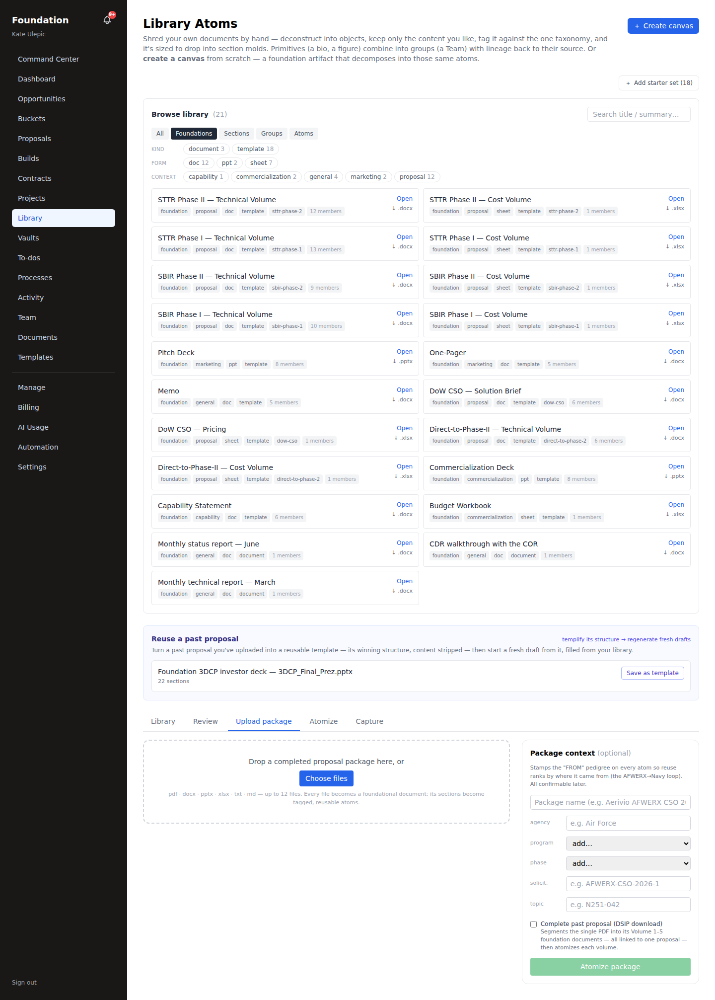

**Formats:** PDF · DOCX · DOC · PPTX · PPT · TXT · MD  **Batch limit:** 50 MB

Drag files onto the drop zone or click to browse, then **Upload All**. Each file moves through
*Uploading* → *Atomizing…* → *Done*, or *Error* with a reason.

The system reads real structure, not just text:

- **DOCX** — headings, paragraphs, lists, tables, and inline bold/italic, taken from the Word styles
- **PPTX** — each slide becomes its own atom, with title and content
- **PDF** — text extracted with heading detection and list parsing
- **TXT / MD** — Markdown headings and structure recognised

**What to upload first**, in priority order:

1. Past performance narratives — your strongest completed contracts
2. Capability statement
3. Key personnel bios and resumes
4. Previous winning proposals — the single best signal there is
5. Technical approach documents
6. Cost volume templates and budget justification language

## 2.2 Atomize by hand

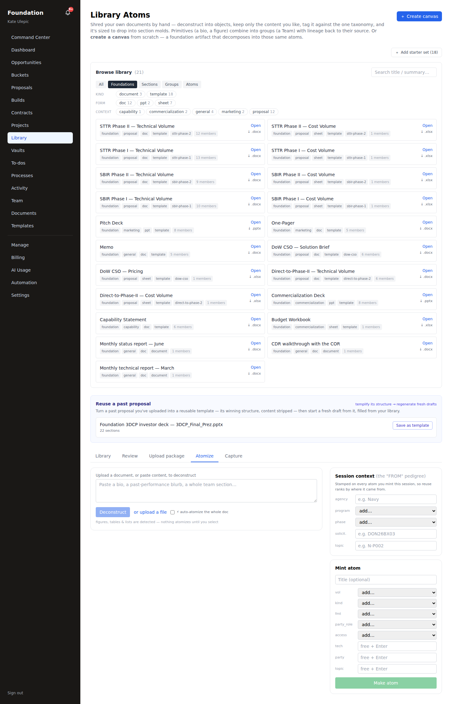

When the automatic shred gets a document wrong — a scanned PDF, a dense slide, a form — the
**Atomize** tab is the hand path. Drop the document, see it *rendered*, draw boxes around the parts
worth keeping, and tag them. The machine proposes regions first; you correct them.

## 2.3 Review

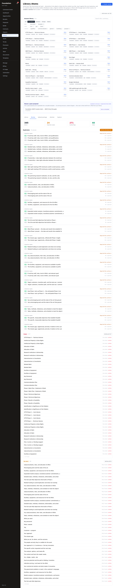

This is where you set the quality of your library, and it is worth the ten minutes.

Each atom card shows its heading, a content preview, a **category** the system guessed, a
**confidence badge** (green > 70% · yellow 40–70% · red < 40%), and editable **tags**.

| Action | When |
|---|---|
| **Accept** | Good reusable unit, category correct |
| **Reject** | Boilerplate, running headers, a citations slide, page furniture |
| **Change category** | The guess is wrong — "general" that is really "past_performance" |
| **Edit tags** | Add the specifics: `DARPA`, `autonomy`, `Phase II` |
| **Accept All** | You trust the auto-categorisation across the batch |

> **Reject more than feels natural.** A real example from the fixture behind these screenshots: a
> company's pitch deck contained a slide that was nothing but source URLs. It was extracted as an
> atom, accepted without review, and later a drafting pass pulled it into a technical section — so a
> Navy SBIR narrative ended up quoting the history of the Ford assembly line. The atom was doing
> exactly what it was told. **Anything that isn't content a reviewer should read is a reject.**

## 2.4 Browse

**Browse library** spans **All · Foundations · Sections · Groups · Atoms**. Each row carries its
grain, title, word count, **taxonomy tags** (`agency:` `fmt:` `kind:` `sol:` `vol:`), where it came
from (**UPLOADED** / **RETURNED**), whether it's yours (**MINE**), who added it, and its status —
with an **Archive** action.

Also here:

- **Reuse a past proposal** — turn an uploaded past proposal into a reusable skeleton: winning
  structure kept, content stripped, then draft fresh into it from your library.
- **+ Create canvas** — build a foundation document from scratch that decomposes into atoms.
- **+ Add starter set** — copy in the shared system starter library so a new workspace isn't empty.
  Note *copy*: you get your own atoms, not a pointer at someone else's.

**Archive is soft and reversible. Nothing is ever hard-deleted.** Archiving an atom drops it out of
the library and out of draft selection; it does not vanish.

---

# Part 3 · Finding work

## 3.1 The opportunity feed

`/portal/{slug}/cards` — **Opportunities** in the sidebar. (`/spotlights` still redirects here.)

Each card shows the topic title and number, agency and program type, a **"Closes in 5d"** chip that
turns amber as the date approaches, and — the important part — **a score pill per bucket**, not one
overall number:

> *Advanced Manufacturing & Automation 100* · *Non-dilutive Capital 75* · *Construction Technology &
> Housing 56* … with a `+N` when it ranks in more buckets than fit.

A card carries **as many ranks as you have buckets**. It is not duplicated per bucket, and there is
no single "match score".

Actions per card: **Pin to pursue** · **Not interested** (passes it) · **Build →** (starts the
purchase). Above the feed: **Include closed** and **Show passed** toggles, **Refresh**, the count,
and a **Sort** selector defaulting to *Best match*.

Scoring inputs: tech-focus overlap (15 pts each), agency match (20), program-type match (15), and a
library-content bonus (10) when you already hold atoms in a relevant category.

## 3.2 Buckets — the lenses that do the ranking

`/portal/{slug}/buckets`

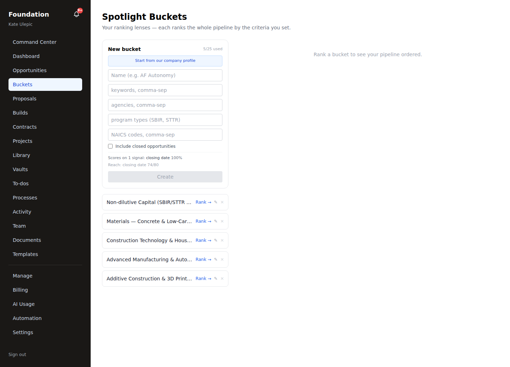

A bucket is a saved thesis — agency, program type, keywords. Every card is scored **within every
bucket**, so you can watch several theses at once. Your workspace starts **empty**: you author the
buckets you want, up to an authoring budget your rep can raise. A `tenant_admin`, or a designee
granted `can_manage_buckets`, maintains them.

New buckets rescore the whole feed and reshuffle the ranking — that is the point of them.

## 3.3 Buy a portal

Pinning tracks an opportunity. **Purchasing a proposal portal** is what opens a build workspace.

1. On the card, click **Build →**
2. Enter the comp code and confirm — this records a **$0 purchase**
3. Your portal opens in **"Waiting for RFP Expert Curation"** with a live countdown of up to **72
   hours**
4. When the expert releases it, your workspace opens already populated

> **What the 72 hours is for.** The clock covers **expert setup** — the compliance matrix, the
> volumes, and the formatted blank "molds" for your opportunity. It is not your drafting time. If
> the skeleton was already built for an earlier buyer of the same opportunity, release is usually
> **minutes**, not days.

---

# Part 4 · Starting a build

## 4.1 Your Builds page

`/portal/{slug}/portals` — **Builds** in the sidebar, titled **Proposal Portals**.

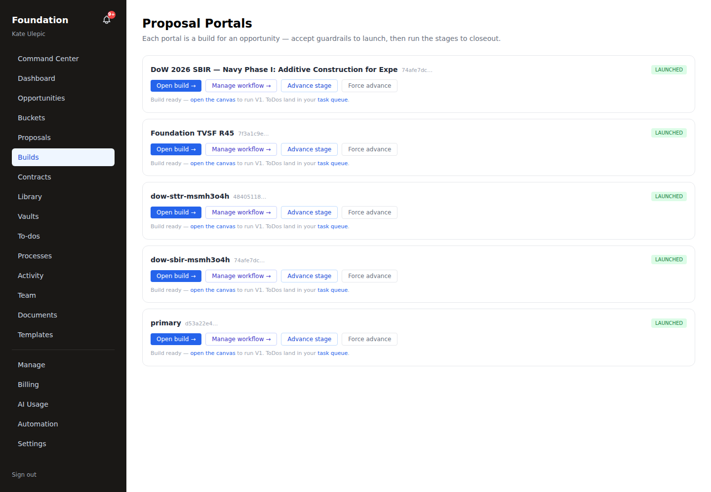

Each row shows its state (**LAUNCHED**) and four actions — **Open build →**, **Manage workflow →**,
**Advance stage**, **Force advance** — with a line telling you where you are.

## 4.2 Accept your workflow (required, once per portal)

`/portal/{slug}/portals/{portalId}` — raised as a **required to-do** the moment your portal is
released, and reachable from **Manage workflow →**.

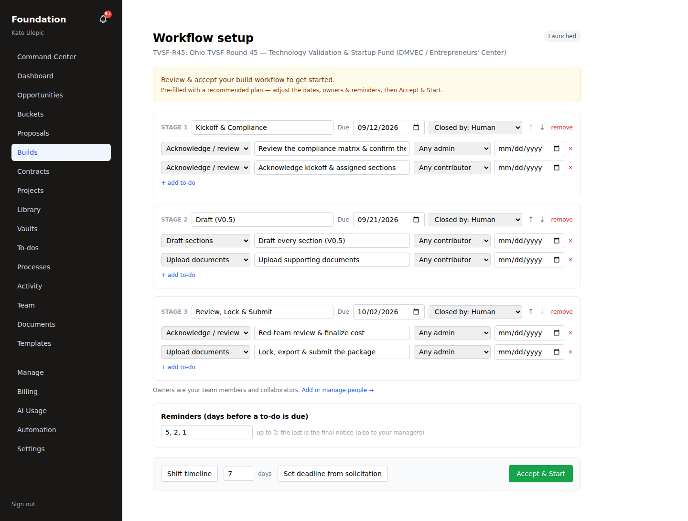

This is not optional: the build does not start until a `tenant_admin` or a delegated manager accepts
a plan. You're shown a **pre-filled recommendation**, inferred from **your own** prior accepted plans
for similar opportunities — never from anyone else's.

| Control | What it does |
|---|---|
| **Stage name + Due date** | Three stages by default — *Kickoff & Compliance*, *Draft (V0.5)*, *Review, Lock & Submit* — each with an absolute date, reorderable and removable |
| **Closed by** | Who closes the stage gate: **Human**, or an **AI-manager** that advances it |
| **Per-to-do row** | Type, title, **owner** (a named person *or* a role like *Any admin*), and its own due date |
| **+ add to-do** | Add a step the recommendation didn't include |
| **Reminders** | Up to three nudges, in days before due (default `5, 2, 1`); the last also copies your managers |
| **Shift timeline / Set deadline from solicitation** | Re-baseline every date at once — move ±N days, or anchor to the solicitation's close |

Everything stays editable after launch. Edits re-project onto the live to-dos, so moving a due date
re-arms its reminders instead of leaving stale ones behind.

## 4.3 The proposal workspace

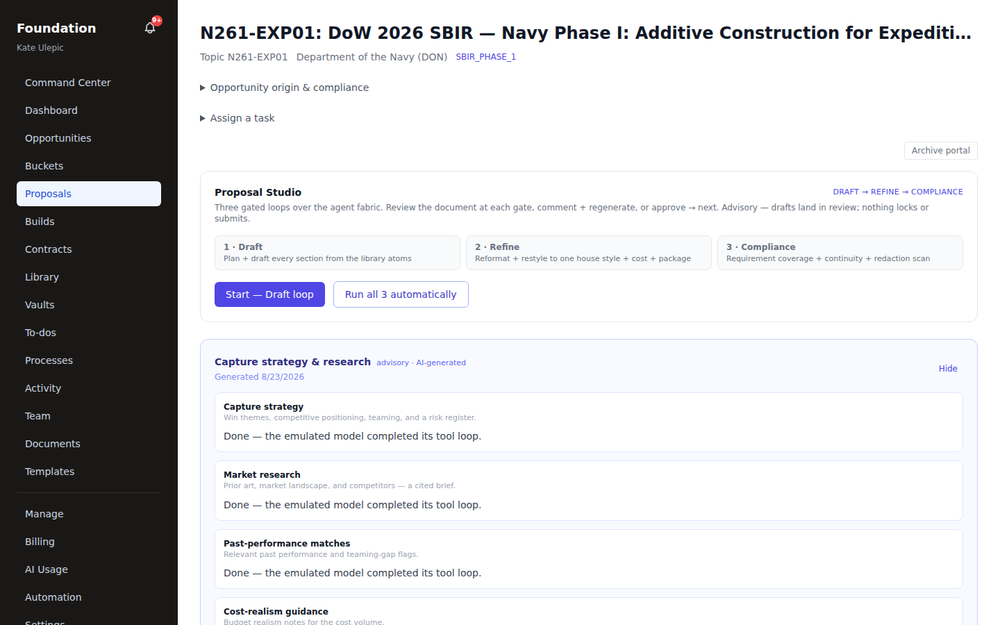

The header carries the title, topic number, agency, program type and close date. Your build advances
**V0 → V0.5 → V1**, shown as **Draft → Final → Submitted**.

The **Proposal Studio** panel sits above the tabs — three gated loops (**Draft → Refine →
Compliance**) you can step through, or **Run all 3 automatically**. It is advisory throughout:
drafts land in review; nothing locks or submits on its own.

### The four tabs, and which one you land on

| You are | You open on | Why |
|---|---|---|
| A **tenant-wide** member (`tenant_admin`, or staff with whole-workspace access) | **Document** | The whole proposal as one continuous canvas — the normal place to work |
| A **scoped collaborator** (assigned to specific sections) | **My Sections** | You see only what is yours |

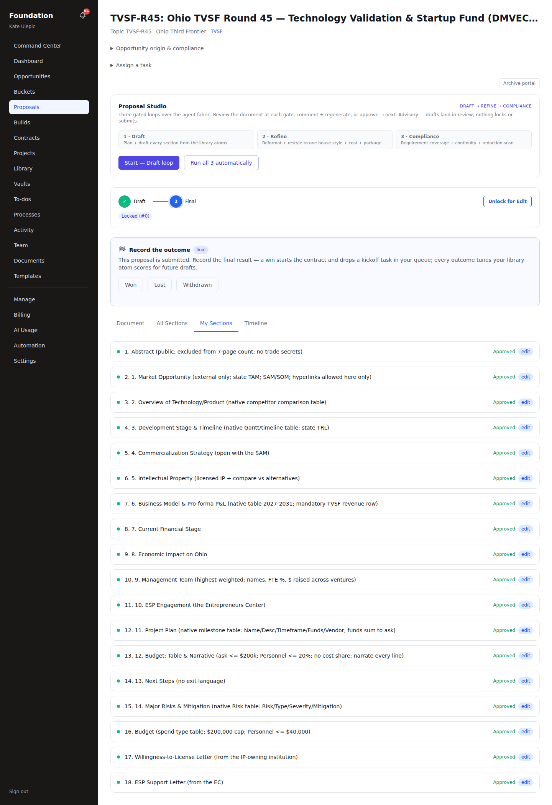

**All Sections** is the flat list with per-section status; **Timeline** is the build's history.

---

# Part 5 · The canvas

This is the part worth reading slowly. Everything you write in RFP Pipeline — proposal sections,
decks, budgets, fliers, whitepapers — is one document model rendered on one of three surfaces. Learn
it once and it applies everywhere.

## 5.1 One canvas, three surfaces

A document is a **canvas**: a page geometry (size, margins, header, footer, default font, page or
slide limits) plus an ordered list of typed **nodes** (heading, paragraph, list, table, image, chart,
callout, equation, code, signature, shape, text box …).

The document's **format** decides which surface renders it:

| Format | Surface | What it feels like |
|---|---|---|
| `letter` · `custom` | **Fluid document** | Continuous pages at real dimensions — Word, but paginated live |
| `slide_16_9` · `slide_4_3` | **Slide editor** | A thumbnail rail and one slide at a time — PowerPoint |
| `spreadsheet` | **Sheet editor** | A grid with a formula bar and a formatting ribbon — Excel |

All three share the same overlay chips, the same insert vocabulary, the same library panel, the same
compliance sidebar, and the same export gate. The differences are only where the differences are
real.

> **Where each one comes from.** Proposal sections are `letter` (an agency volume is a page).
> Decks come from a deck template or the blank **Slide deck** preset. Workbooks come from the blank
> **Workbook** preset. Note that agency **cost forms** — SF-424A, the DoD burden waterfall, a state
> budget form — are `letter`, not `spreadsheet`: the agency's form *is* a page, so it renders as a
> spreadsheet-style table inside the fluid document, and exports as `.xlsx` when you want a workbook.

## 5.2 The Document tab — the whole proposal as one canvas

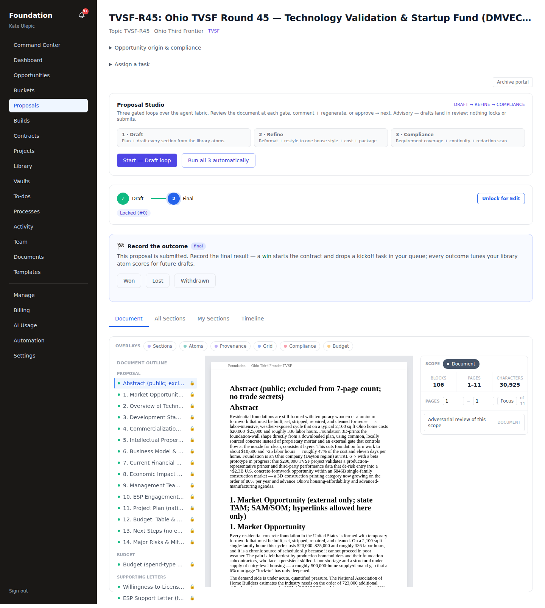

The whole build, assembled in order, with the **document outline** down the left carrying each
section's status and a 🔒 on the ones already locked. Edits autosave; the bar tells you what's
unsaved and offers **Save N sections** when you want to flush by hand.

This is where most work happens. The per-section editor (§5.7) is the close-up.

## 5.3 Overlays — structure on demand

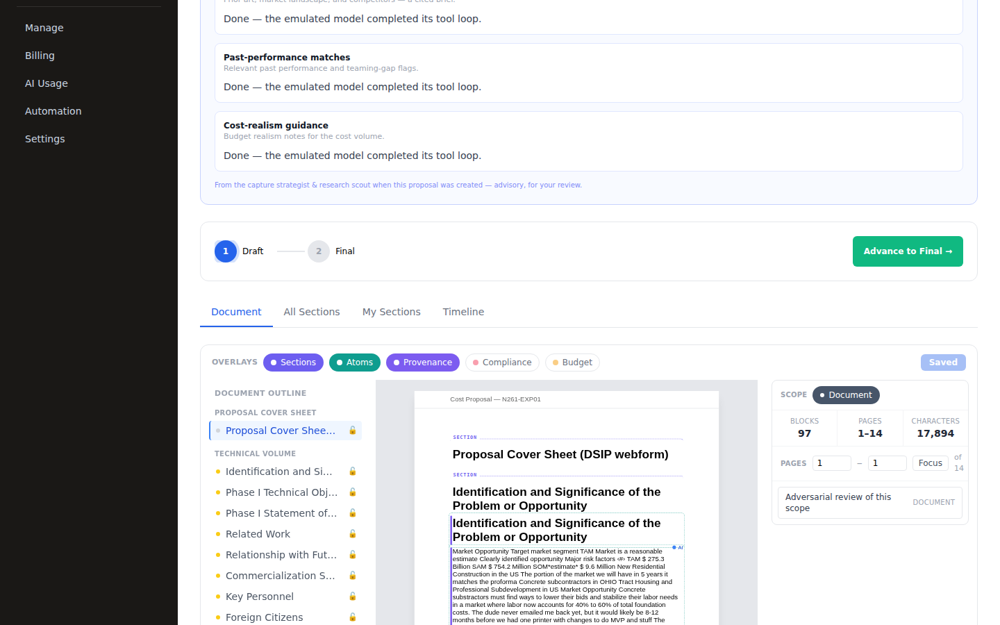

The chip row summons structure over your content. **Everything is off by default** — you get a clean
document until you ask a question.

| Chip | What it paints |
|---|---|
| **Sections** | A dotted boundary and a label at each section start |
| **Atoms** | A dotted outline around every content primitive |
| **Groups** | Runs that came from one library atom — a solid rail means "moves as one block" |
| **Provenance** | A source gutter: **AI** · **Library** · **Reuse** |

Groups appears only on documents that actually carry the group layer. A toggle that provably paints
nothing is worse than an absent one: it invites you to conclude the document has no groups, when
what it really means is that this shape of document can't express them.

The same chip bar appears on the section editor and on the sheet — it is one overlay layer over
every surface, not a per-screen gimmick.

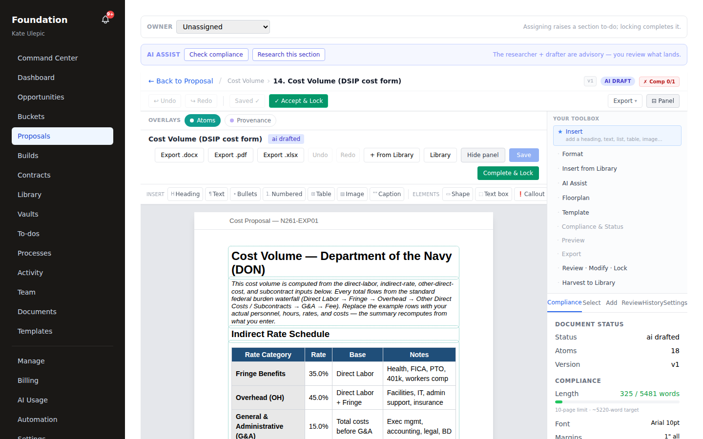

## 5.4 Compliance and Budget — the same idea over real data

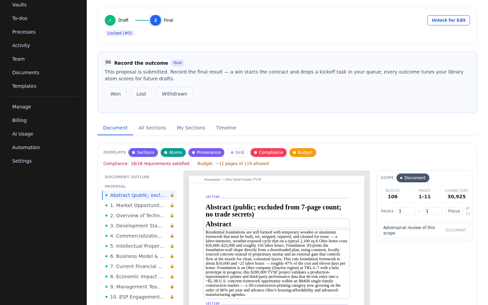

Two more chips, summoned the same way, but backed by live data rather than by geometry:

- **Compliance** — *"N of M requirements satisfied"* across the proposal, from the compliance matrix
  the RFP expert built at curation.
- **Budget** — *"~N pages of M allowed"*, and it says **over limit** in red when you are. This
  reads the same page ruler the download gate enforces.

## 5.5 Scope — the ladder that everything acts on

Click a block and the right-hand bar re-focuses on it. The ladder is a breadcrumb, innermost first:

> **Element** ‹ **Group** ‹ **Section** ‹ **Pages** ‹ **Document**

Click any rung to widen or narrow. The containment relationship is shown rather than hidden in a
dropdown because it is the point: this element sits in this group, in this section.

Under it, three numbers for whatever is focused — **Blocks**, **Pages**, **Characters** — and they
are the *same* numbers the rest of the product uses. The page count comes from the same paginator
as the compliance gate, so a page-scoped review and a page-limit violation are talking about the
same page. On a multi-page document you also get a **page range** control: type 4–7, press
**Focus**, and act on those pages — the unit the agency actually addresses.

Actions are **filtered by rung, not greyed out**. "Assemble from library" doesn't appear on a single
figure because the assembler builds sections; there is no smaller unit it produces. A greyed button
invites you to wonder what you did wrong; an absent one tells the truth.

Everything the scope bar offers is advisory: it queues a review or proposes a revision. None of it
edits a section, advances a stage, locks, or submits.

## 5.6 Selection is the verb

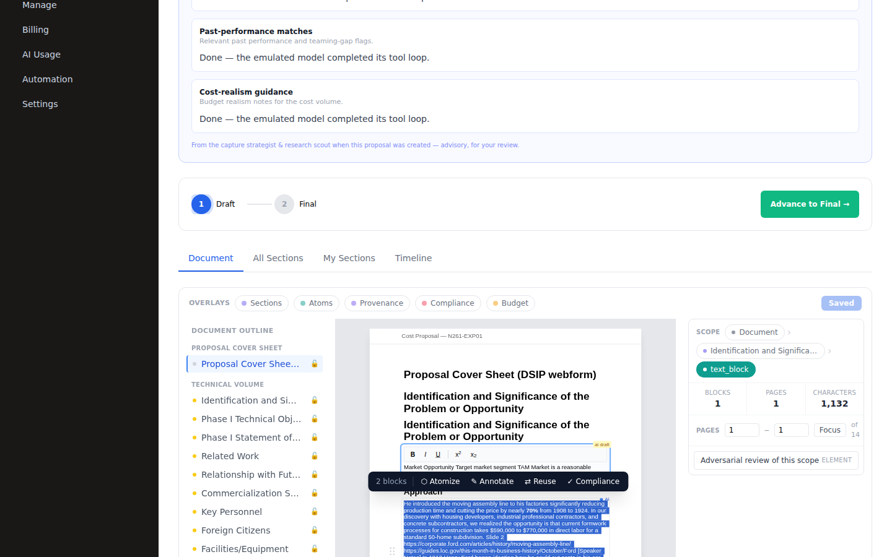

Select a span of text and a compact toolbar floats at the selection, telling you what you've caught
(*"2 blocks"*) and offering:

| Verb | What it does |
|---|---|
| **⬡ Atomize** | Save this selection to your library as a reusable atom, with lineage back to here |
| **✎ Annotate** | Attach a note to exactly this span |
| **⇄ Reuse** | Find a library atom that could replace or strengthen this |
| **✓ Compliance** | Check this span against the solicitation's requirements |

The selection can cross block boundaries and even section boundaries; the toolbar tells you how much
it caught before you act.

## 5.7 The section editor

Click a section to open it on its own.

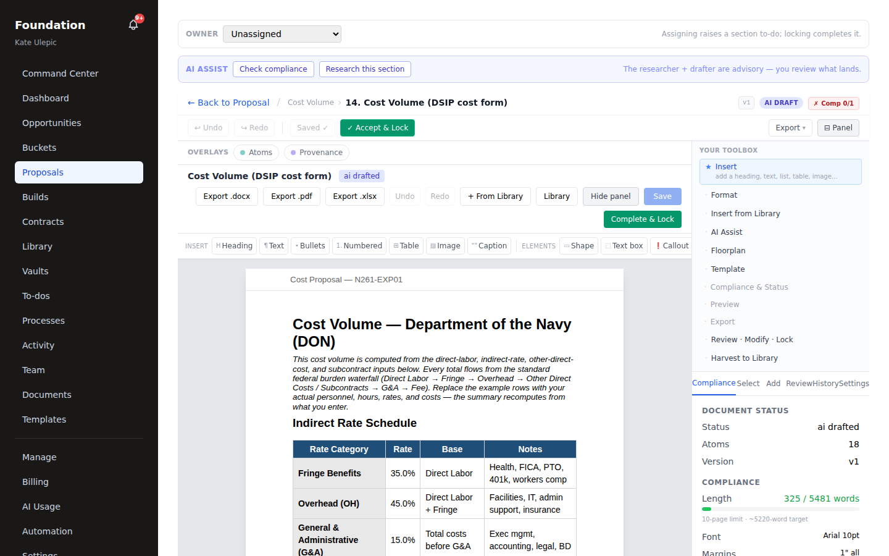

Reading the screen from the top:

- **OWNER** — assign the section to someone. *"Assigning raises a section to-do; locking completes
  it."* The workflow follows the work, not the other way round.
- **AI ASSIST** — **Check compliance** and **Research this section**, with the standing reminder:
  *"The researcher + drafter are advisory — you review what lands."*
- **Breadcrumb and badges** — the volume, the section number and title, then `v1`, **AI DRAFT**, and
  a compliance chip (**✗ Comp 0/1**) telling you how many mapped requirements this section currently
  satisfies.
- **Undo · Redo · Saved ✓ · Accept & Lock**, and **Export ▾** / **Panel**.
- The **overlay chips**, then the section's own export buttons (`.docx` `.pdf` `.xlsx`), **+ From
  Library**, **Library**, **Hide panel**, **Save**, and **Complete & Lock**.
- The **INSERT ribbon** — Heading · Text · Bullets · Numbered · Table · Image · Caption, then
  ELEMENTS — Shape · Text box · Callout · Chart …
- The **page**, at real dimensions, with its running header and footer.

### Your toolbox

The sidebar's top block is **YOUR TOOLBOX** — the tools for *your role* at *this stage*, most likely
first (★). It only ever offers tools that work; a card with nowhere to go is not rendered at all.

| Card | Where it goes |
|---|---|
| **Insert** | The Add tab — the block palette |
| **Format** | The Node tab — the format drawer for the selected block |
| **Insert from Library** | The library candidate panel |
| **AI Assist** | The revision panel |
| **Floorplan** | Settings — margins, header/footer, font floor, page cap |
| **Template** | Save this skeleton as a reusable template |
| **Compliance & Status** | The compliance tab |
| **Preview** | See it as it downloads |
| **Export** | Download `.docx` / `.pptx` / `.xlsx` / `.pdf` |
| **Review · Modify · Lock** | Comment, revise, and complete the section |
| **Harvest to Library** | Return locked content to your library |

A view-or-comment collaborator keeps the read panels and loses **Add** and **Settings**.

## 5.8 Insert — the block palette

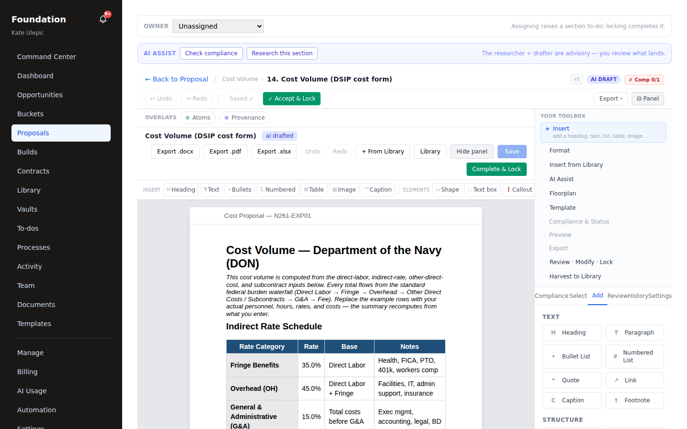

Grouped by what you're doing:

| Group | Blocks |
|---|---|
| **Text** | Heading · Paragraph · Bullet List · Numbered List · Quote · Link · Caption · Footnote |
| **Structure** | Table · Divider · Page Break · Contents · Spacer |
| **Media & objects** | Image · Chart · Shape · Text box · Callout · Code · Equation · Video · Signature |

**Chart** is a real chart node, not a picture of one. It survives export as a native chart object in
`.docx`, `.pptx` and `.xlsx`.

## 5.9 Format — the context-aware drawer

Select a block, and the drawer shows the controls **that block** has. A table gets borders and
column widths; a chart gets series and labels; a callout gets a style and a fill; an equation gets
LaTeX. Across block types the drawer spans Style · Text · Emphasis · Fill · Border · Radius ·
Effects · Arrange · Caption · Citation · Label · Language · Series · Shape.

Persistent formatting — bold, italic, underline, strikethrough, size up/down, text colour,
highlight — lives on the toolbar above the page and applies at block level.

## 5.10 AI Assist

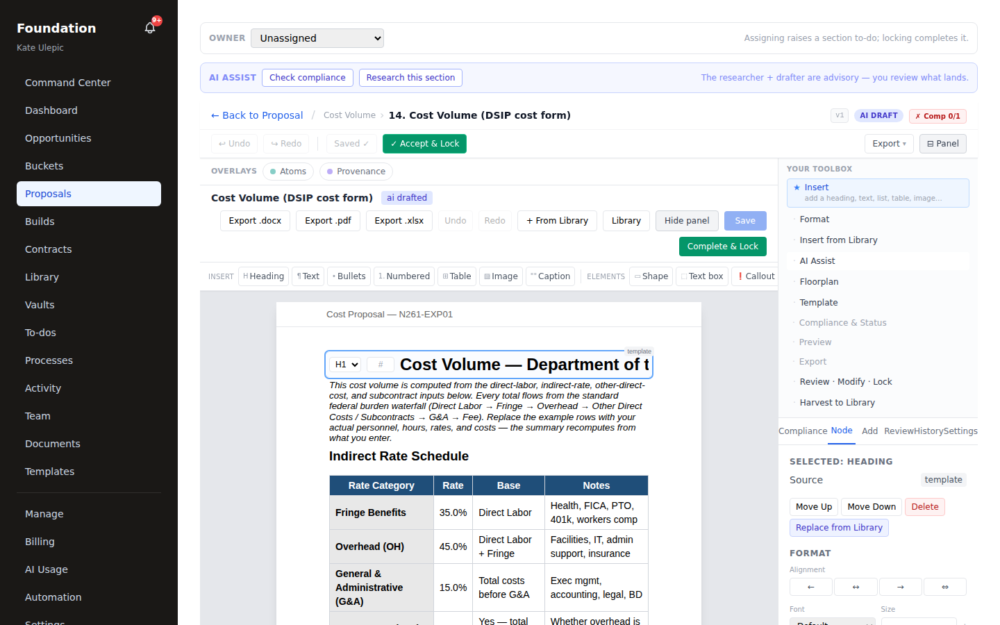

One-click revisions, each acting on the current scope:

| Action | What it does |
|---|---|
| Regenerate | Rewrites from scratch with the same intent |
| Make shorter | Condenses by roughly 30%, keeping the key points |
| Make longer | Expands with detail and supporting evidence |
| More specific | Adds concrete numbers, methods, and metrics |
| Simpler language | Rewrites for a non-specialist reader |
| Stronger opening | Rewrites the first sentence to earn the reviewer's attention |
| Add metrics | Inserts quantitative support where the content allows |
| Fix compliance | Tightens against the solicitation's stated requirements |

Plus a **custom instruction** box — *"Lead with our Phase I results"*, *"Name the Navy end user in
the first paragraph"*.

**Nothing here overwrites your text.** A revision arrives as a proposed version you review; the
**Apply AI-proposed revisions** button is what lands it, and **History** (§5.14) still holds what
came before.

## 5.11 Insert from Library

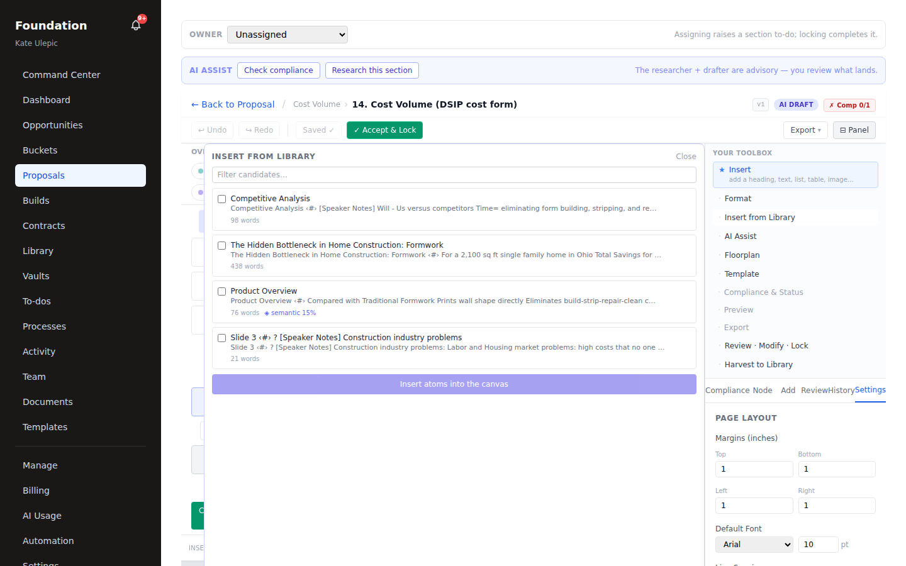

The panel proposes atoms for *this* section, ranked by a blend of taxonomy tags, section context,
and — when semantic retrieval is switched on — **cosine similarity against your own atom
embeddings**. Candidates that matched semantically carry a **◈ semantic N%** badge so you can see
*why* something was suggested.

Filter, tick the ones you want, and **Insert atoms into the canvas**. Inserted content keeps its
lineage: the Provenance overlay will show it as Library, and the atom's usage count goes up.

Two things worth knowing:

- The candidates are **yours only**. Retrieval is scoped to your company at the database, at the
  policy layer, and in the application query — three independent gates.
- Images and structured blocks come across as real nodes, not as flattened text.

## 5.12 Compliance & Status — the page gauge

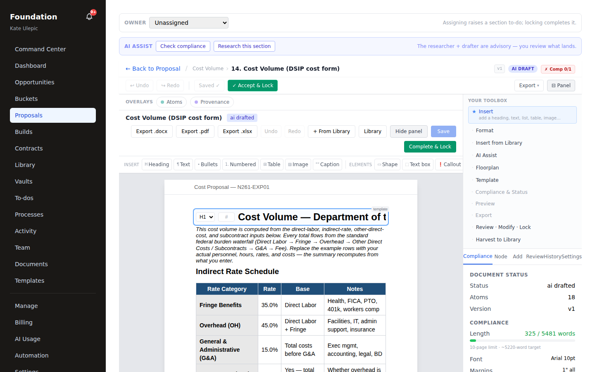

- **DOCUMENT STATUS** — the section's status (`ai drafted`, `in progress`, `approved`), how many
  atoms it holds, and its version.
- **COMPLIANCE** — a live **Length** bar (*"325 / 5,481 words"*) against the section's target, the
  page limit it derives from (*"10-page limit · ~5,220-word target"*), the required **Font**, and
  the **Margins**.
- **CONTENT SOURCES** — where this section's content came from.

The length bar is the gauge to trust. It is computed by the same paginator the export gate runs, so
if the editor says you fit, the download will not refuse you for length — and if it says you're
over, the download *will*.

## 5.13 Floorplan — page layout

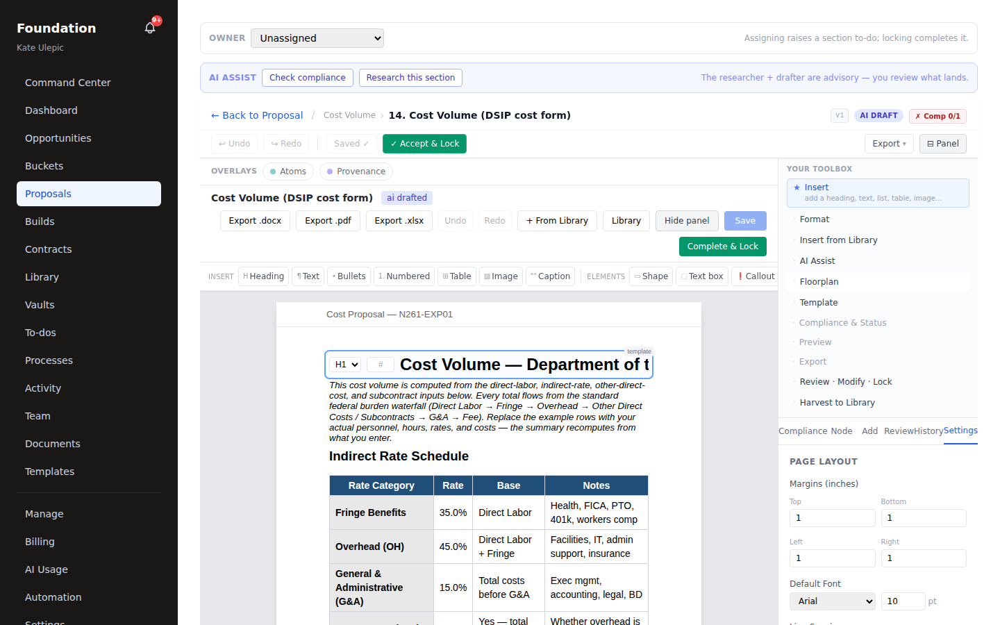

Margins (in inches, per side), default font family and size, line spacing, header and footer
templates, and the page or slide cap. On a proposal section these are set by the solicitation, and
changing them is how you'd deliberately deviate — the compliance panel will tell you that you have.

## 5.14 Review and History

The **Review** tab holds comments — threaded, and anchorable to a specific block or even a specific
span of text, so *"this sentence over-claims"* lands on that sentence rather than on the section.

The **History** tab holds every version, badged by where it came from: **AI Draft** · **Human Edit**
· **AI Revision** · **Library** · **Template** · **System**. Any version can be **restored** — a
restore writes a *new* version rather than rewinding, so nothing is lost either way.

## 5.15 Preview — see it as it downloads

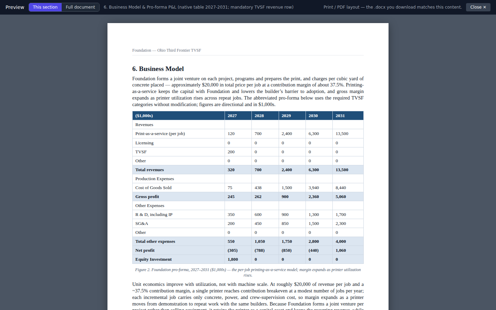

Preview renders through the same path the download uses. Use it before locking; it is where a
header, a page break, or a table that spills becomes obvious.

## 5.16 The trust rules

The canvas is where your work lives, so five behaviours are worth knowing precisely:

1. **Autosave, plus recover-on-reload.** Edits save as you go, and a local draft survives a closed
   tab or a lost connection. `Ctrl-S` flushes on demand.
2. **A concurrent edit never silently wins.** If someone else changed the section since you loaded
   it, your save is **refused with a conflict** and you get an explicit overwrite choice. There is
   no last-write-wins.
3. **Restore is a write, not a rewind.** Restoring an old version creates a new version on top. The
   version you restored *from* is still there.
4. **AI never overwrites.** Every AI output is a proposal you accept. **Accept AI drafts** lands the
   whole staged draft; per-block **Accept** and **Revert** land or discard one block.
5. **Archive is soft and reversible.** Nothing in the product hard-deletes your content.

## 5.17 Slides

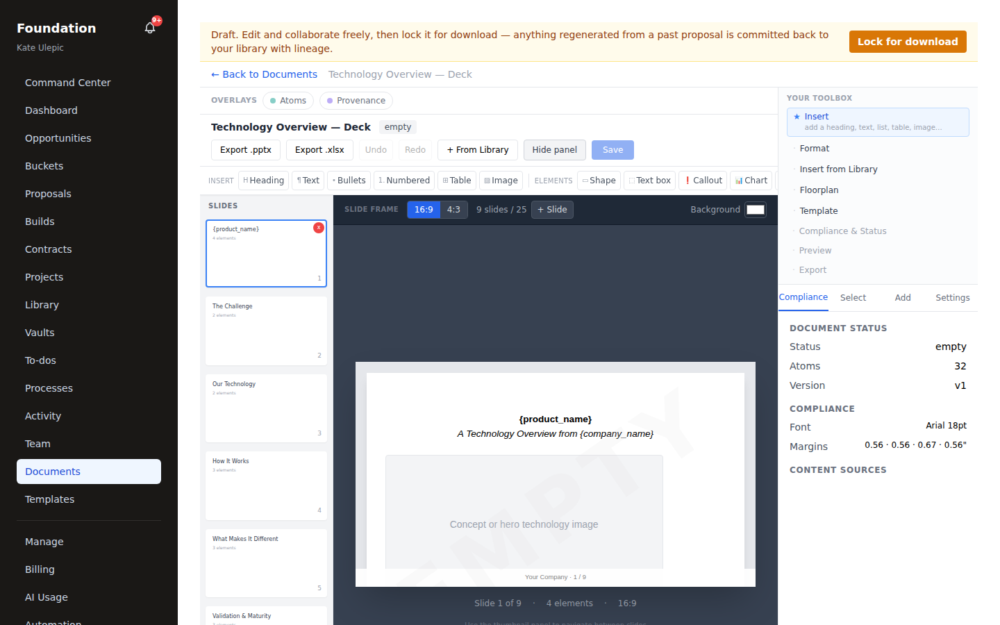

The same canvas, discrete instead of continuous: one section per slide, a thumbnail rail down the
left showing each slide's element count, and the slide itself at frame size.

- **SLIDE FRAME** — switch between **16:9** (960×540) and **4:3** (720×540). Same height, so
  switching only reflows width.
- **9 slides / 25** — the deck budget, exactly like a page limit. The slide ruler is the same engine
  as the page ruler, extended to decks, and it gates export the same way.
- **+ Slide**, **Background**, and the same INSERT / ELEMENTS ribbon.
- **Export .pptx** (and `.xlsx` for tabular slides), **Undo/Redo/Save**, **+ From Library**.

Template variables like `{product_name}` and `{company_name}` stay visible as placeholders while you
edit and resolve on preview and export — so you can see what still needs filling in.

## 5.18 Workbooks

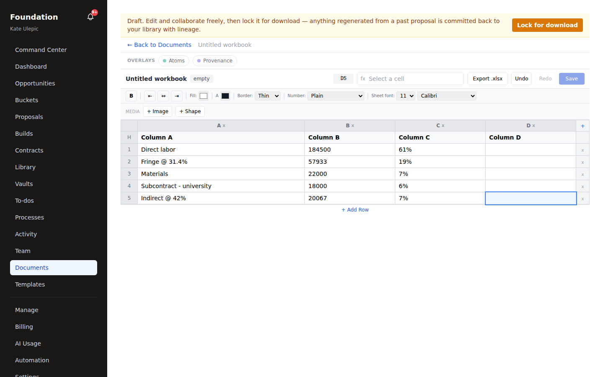

The grid surface, for budgets, pricing sheets and cost tables:

- A **cell reference** and **formula bar** (`fx`) at the top left. Click a cell and start typing —
  the editor opens on the first keystroke, exactly as a spreadsheet should. `Tab` commits and moves
  right, `Enter` commits and moves down, `Escape` cancels.
- A formatting **ribbon**: bold, alignment, cell **Fill**, text colour, **Border** weight,
  **Number** format (Plain / Currency / Percent …), and the **sheet font** family and size.
- **MEDIA** — **+ Image** and **+ Shape** drop into the sheet.
- Column and row headers with **+** to extend, `x` to remove, and **+ Add Row** beneath.
- **Export .xlsx**, **Undo / Redo / Save**.

## 5.19 Standalone documents

Not everything is a proposal section. **Documents** (`/portal/{slug}/documents`) is for the rest —
capability statements, fliers, whitepapers, briefing decks, budgets.

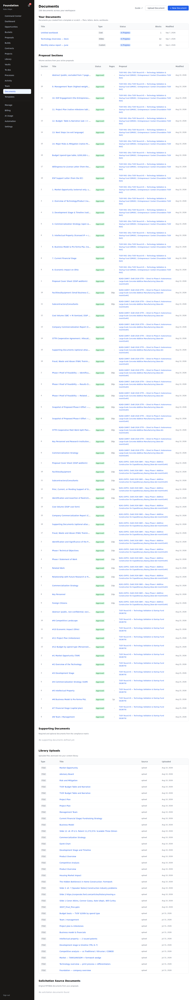

**New document** offers four blank presets and your own saved templates:

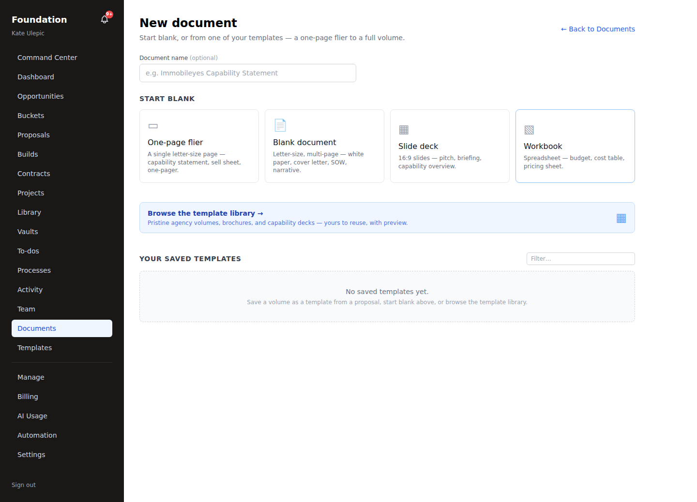

| Preset | Canvas |
|---|---|
| **One-page flier** | Letter, 1-page cap, images allowed |
| **Blank document** | Letter, multi-page |
| **Slide deck** | 16:9 slides |
| **Workbook** | Spreadsheet |

Standalone documents get the **same size checks** as proposal volumes. A 2-page flier that runs to
three pages, or a 10-slide deck that runs to twelve, is flagged on save and at export — measured
against the limits the document declares for itself.

## 5.20 The template gallery

`/portal/{slug}/templates` is your shelf of ready-made skeletons: agency volumes (DoD/DoW SBIR and
STTR, NSF, DOE, NASA, NIH), federal forms (SF-424A, budget justification, biographical sketch,
current & pending support, data management plan), collateral (one-pagers, whitepapers, sales decks),
and cost forms for every common period of performance.

Filter, **Preview** to look inside, then **Use this template** — which creates **a fresh, editable
document in your workspace**. The template is copied in; you are never editing a shared object, and
nothing you do to your copy touches anyone else's.

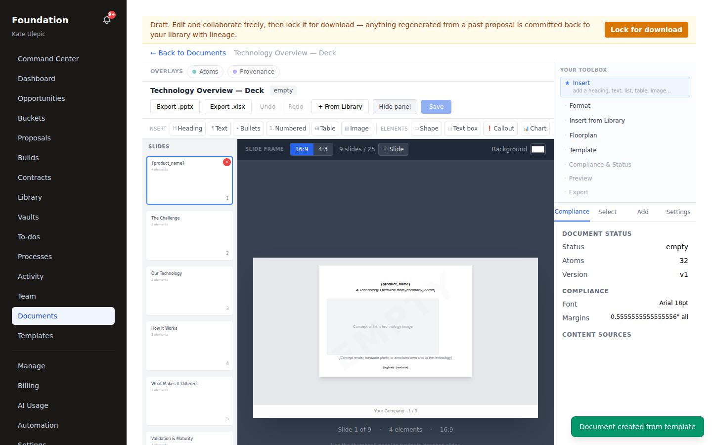

When an admin refreshes a template you already have, your card shows a **Refreshed** badge — the new
skeleton lands on your shelf and **your existing documents are untouched**. Dismiss the badge when
you've seen it.

---

# Part 6 · Finishing

## 6.1 Draft, then review

When your workspace is released, the section drafter has usually already produced a first pass from
the expert's notes and your library atoms — that's **V0**. Plugging your best atoms into the molds
is the **V0 → V0.5** jump, and it is usually a short session rather than a long one.

Per section, the status moves: **Empty → AI Draft → In Progress → Complete → Approved**.

## 6.2 Lock

Lock each section with **Complete & Lock** (or **Accept & Lock** from the top bar). When they're all
ready, **Lock all** — or **Force advance to V1** to finalise without locking every one. Advancing to
V1 auto-locks the workspace and enables the final download. A first unlock is free; further unlocks
may need admin help.

## 6.3 The compliance gate

The download is **gated**. Font, page limits, per-section page budgets, slide counts, image rules
and character caps are checked against what the solicitation requires — using the same ruler as the
editor gauge.

If a volume is over, the download tells you **which rule and by how much** rather than quietly
shipping a package that will be rejected at the agency portal.

## 6.4 Download

A locked build downloads as **json · docx · pdf · zip**:

| Format | What you get |
|---|---|
| `json` | The canvas itself — the machine-readable proposal |
| `docx` | The combined proposal as one Word document |
| `pdf` | The same assembly, rendered |
| `zip` | Per-volume, each in its native format (`.docx` / `.pptx` / `.xlsx`) |

Figures export as **native chart objects**, not screenshots of charts. Images you uploaded survive
into every format. Sections come out in their real order — not string-sorted, which is how
"Section 10" ends up between 1 and 2 in lesser tools.

## 6.5 Record the outcome

When the build is submitted, **Record the outcome** — **Won · Lost · Withdrawn**.

A win starts the contract entity and drops a kickoff task in your queue. Every outcome, win or
lose, tunes your library atoms' scores so the next draft leans on what actually worked.

---

# Part 7 · Around the build

## 7.1 To-dos

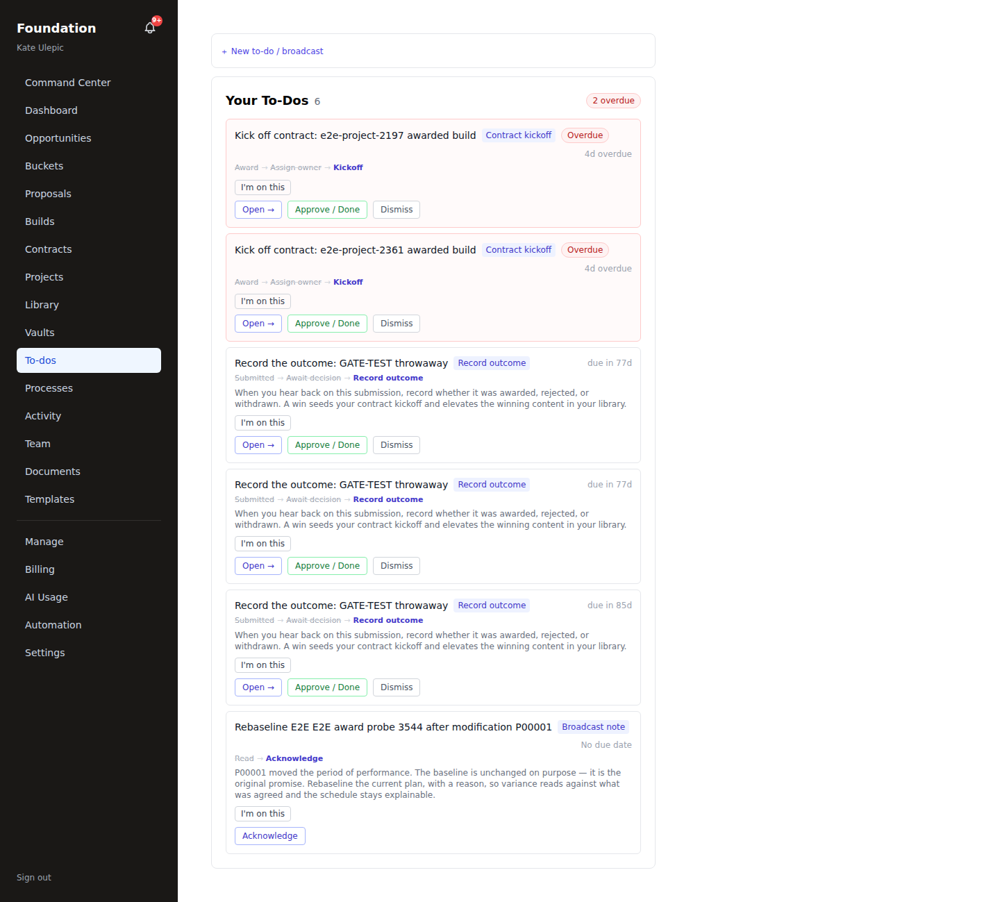

`/portal/{slug}/todos` — one queue for everything the build asks of you: the to-dos your workflow
plan projected, review requests, amendment acknowledgements, and broadcasts from your rep.

When the solicitation is **amended**, the change is detected, confirmed by an expert, and fanned out
to every affected build as an acknowledgement to-do — with a diff of what changed.

## 7.2 Team

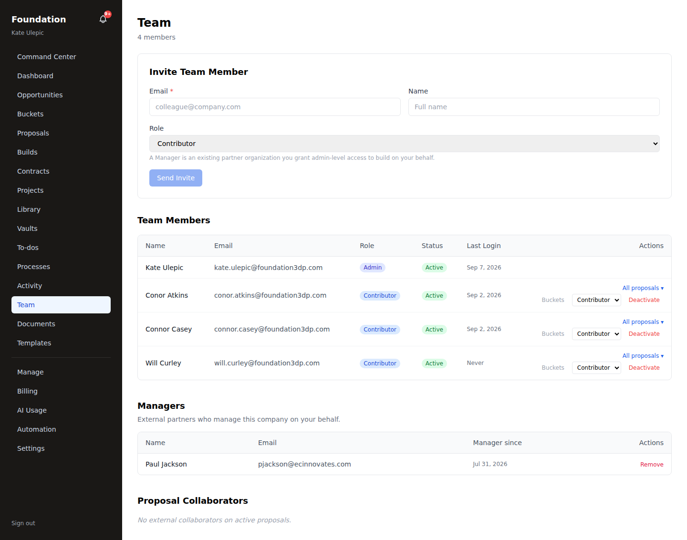

`/portal/{slug}/team` — invite colleagues and external collaborators, and set what each can reach:
the whole workspace, specific builds, or **a single section** to comment on or edit.

Section-level grants are real boundaries, not UI hiding. A collaborator scoped to two sections
opens on **My Sections**, sees those two, and cannot reach the library or the rest of the build.

## 7.3 Everything else in the sidebar

| Surface | What it's for |
|---|---|
| **Vaults** | Sensitive content held apart from the general library |
| **Processes** | Your running workflows, live |
| **Activity** | The event stream for your workspace |
| **Contracts** | What a win turns into |
| **AI Usage** | What the AI has cost you, per build |
| **Automation** | Recipients, timing and escalation for the automated nudges |

---

## Tips

1. **Upload your best past proposals first.** Winning content is the strongest signal the drafter has.
2. **Name files descriptively.** `DARPA_Past_Performance_Autonomy_2024.docx` categorises far better
   than `final_v3.pdf`.
3. **Reject aggressively in review.** Ten minutes here saves hours of revision — and prevents the
   citations-slide problem from §2.3.
4. **Pin early.** Even before you're ready to propose, pinning teaches the ranking what you care about.
5. **Work in the Document tab, zoom into a section when you need the close-up.**
6. **Chain the AI actions.** "Make shorter" then "More specific" is a strong pair.
7. **Harvest back to the library.** Every locked section can return to your library as atoms with
   lineage — that's how the second proposal is faster than the first.
8. **Preview before you lock.** It renders through the export path, so it's where formatting problems
   surface.

---

## Need help?

Contact eric@rfppipeline.com during the founding cohort.

**Related:** [`RFP_ADMIN_OPERATIONS_GUIDE.md`](./RFP_ADMIN_OPERATIONS_GUIDE.md) is the other side of
the same arc — what your RFP expert is doing while you wait.
[`CANVAS_ARCHITECTURE.md`](./CANVAS_ARCHITECTURE.md) is the canvas design in full.
