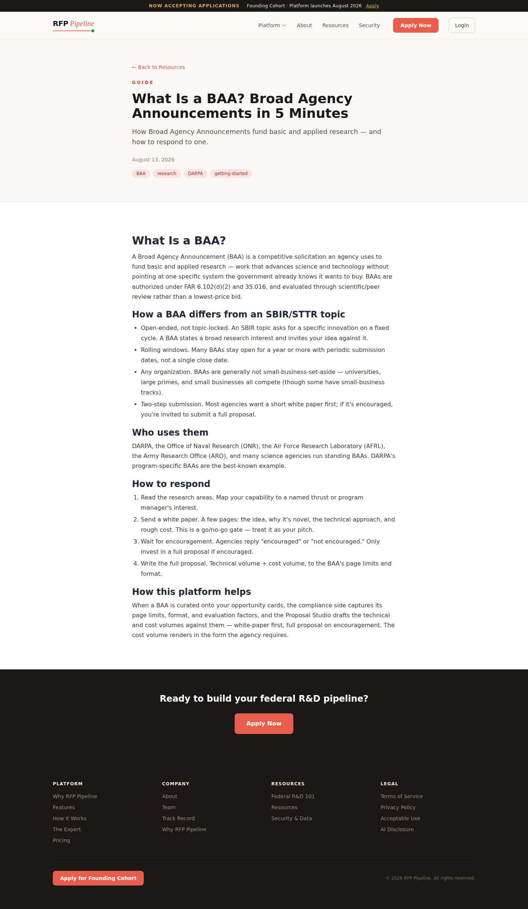
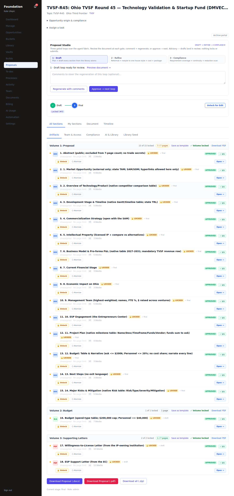
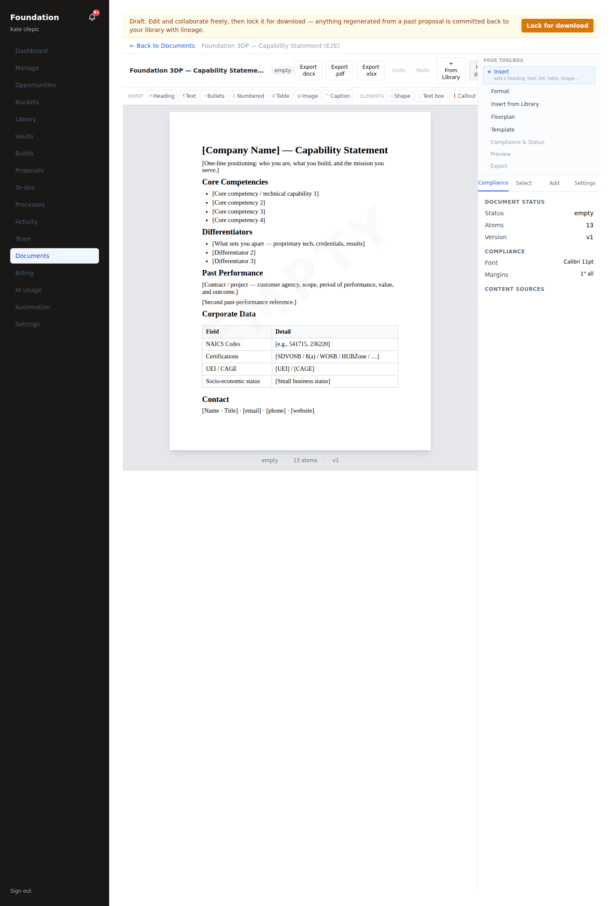

# E2E generative proof — real actors, real process flows (closing sweep)

Every major generative effort — **CMS content · proposal · marketing documents** — driven end-to-end
as the real user on the real process flow, against the live sandbox (frontend :3000 + emulated-Claude
:8787 + Postgres). The generative AI step runs on the emulator (a live key isn't available in-sandbox;
prod runs the identical wiring with the real key — see docs/AI_FLOWS_PROOF.md); everything else —
routes, DB, exports, publish — is the real code path. Scripts: `frontend/scripts/close-e2e-*.mjs`,
`pipeline/scripts/drive_*`.

## 1. CMS content — generate → review → publish → live ✅

| Step | Actor | Evidence |
|---|---|---|
| **Generate** | `content_generator` agent | `tool.content.generate` ran on the emulator → status `completed`, guardrail `apply`. |
| **Review + Publish** | admin (eric) | In the Content Studio, opened a queued guide draft (BAA), clicked **Publish**. |
| **Live** | public site | The guide flipped to `active` and renders on `/resources/what-is-a-baa` (200, real content). |

Precondition asserted (0 active before), draft-gated the whole way. `close-e2e-cms.mjs` — all pass.

## 2. Proposal — AI-built → real actor → compiled package ✅

| Step | Actor | Evidence |
|---|---|---|
| **Build (generative)** | the `OnProposalCreated` cohort | `section_drafter` drafted the 18 TVSF sections; `proposal_architect` · `capture_strategist` · `cost_estimator` · `pp_matcher` · **`research_scout`** (initial market brief) · `market_analyst` (overlay pre-augment, section-anchored) all fire as independent AI_INVOKE step actors — each proven live this session. |
| **Review** | tenant_admin (kate) | Opened the proposal overview (drafted sections + readiness roll-up). |
| **Package** | tenant_admin (kate) | Downloaded the compiled submission package — **DOCX 54,588 B** (PK-zip magic) and **PDF 169,451 B** (`%PDF` magic). Real bytes, not stubs. |

`close-e2e-proposal.mjs` — all pass.

## 3. Marketing documents — mold → real actor → export ✅

| Step | Actor | Evidence |
|---|---|---|
| **Generate from mold** | tenant_admin (kate) | From the New Document chooser, created a **Capability Statement** from the starter mold (`POST /documents` → 201, real `documentId`). |
| **Edit** | tenant_admin (kate) | The editor rendered the interpolated marketing content. |
| **Export** | tenant_admin (kate) | Exported a real **.docx** (9,509 B, PK-zip magic) via the same export engine proposals use. |

`close-e2e-marketing.mjs` — all pass.

## Agent workforce advanced this session (each proven live on the emulator)

- **`opportunity_scout`** — woken dark→live: `stageIntake` emits `finder:opportunities.detected` →
  `OnOpportunitiesDetected` → AI triage prioritization + admin email + triage ToDo.
- **`research_scout`** — mapped as a declarative AI_INVOKE step in `OnProposalCreated` (was queue-only).
- **`market_analyst`** — the AdvisoryOverlay pre-augment fixed: `request_advisory_overlay` now threads a
  market-relevant `section_id`, so `get_section_context` anchors on a real section instead of erroring.

## Verdict

All three generative efforts run end-to-end as real actors on real process flows, with the AI step on
the emulator and every downstream artifact real (public HTML, docx/pdf bytes). Backbone remains green
(`tsc` 0 · `vitest` 1085 · pipeline wiring/validation suites pass). Prod runs the identical wiring with
the live `ANTHROPIC_API_KEY`.
