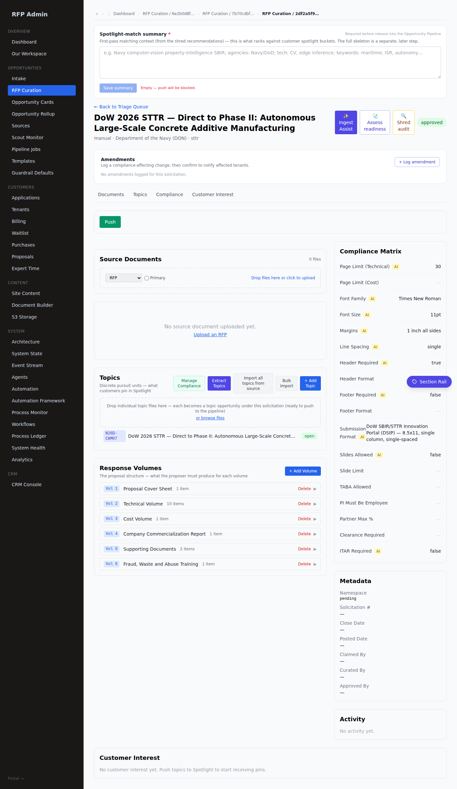
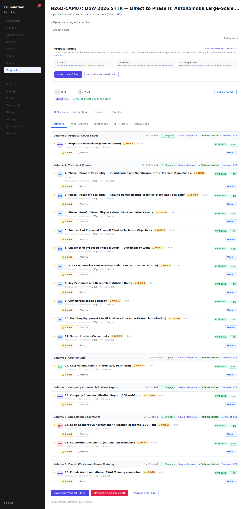

# E2E Launch Proof — three solicitations, admin-author → tenant-build → submission-ready → package

**Scope (#119–121).** Prove the full customer spine end-to-end for three real, structurally different
solicitations: the admin-authored master (volumes + compliance skeleton) → the tenant build (every
section drafted, locked, compliance-satisfied) → a computed **submission-ready** verdict → a downloadable
**package** in every format. Driven through the real routes under real tenant auth (Foundation 3DP,
`kate.ulepic@…` tenant_admin) — no direct-lib shortcuts for the readiness/package proof.

| Track | Program | Master solicitation | Proposal | Volumes / sections |
|---|---|---|---|---|
| **E2E-1 TVSF** | Ohio TVSF (state EDA) | Ohio TVSF Round 45 (`6e2b0d8f`, approved) | `bbd6a058` | 3 vols / 18 secs |
| **E2E-2 SBIR Phase I** | DoW Navy SBIR Phase I | DoW 2026 SBIR — Navy Phase I (`7b70cdbf`, approved) | `73d587b2` | 6 vols / 17 secs |
| **E2E-3 STTR D2P2** | DoW STTR Direct-to-Phase-II | DoW 2026 STTR — D2P2 (`2df2a5f9`, approved) | `fa1461c9` | 6 vols / 16 secs |

## 1. Submission-ready verdict (via `GET …/proposals/[p]/readiness`, as kate)

All three compute **ready = true, 0 blockers, 0 warnings** — every section `is_locked`, every mandatory
compliance requirement `satisfied`, every page/slide budget within cap.

| Track | ready | sections locked | reqs satisfied | page gate | cost | STTR work-split |
|---|---|---|---|---|---|---|
| TVSF | ✅ true | 18/18 | 18/18 | Proposal 7/7 pp | — | — |
| SBIR Phase I | ✅ true | 17/17 | 17/17 | Technical 2/10 pp | — | — |
| STTR D2P2 | ✅ true | 16/16 | 16/16 | Technical 2/30 pp | **$708,916** (computed) | **SB 65% / RI 35%** (≥40/30 ✓) |

## 2. Package download — every format returns real bytes (magic-byte verified)

`POST …/proposals/[p]/package?format=json|docx|pdf|zip`. Each response sniffed: docx/zip start `50 4B`
(PK zip), pdf starts `25 50 44 46` (`%PDF`), json parses. Not stubs — real assembled artifacts.

| Track | json | docx | pdf | zip |
|---|---|---|---|---|
| TVSF | 35 KB ✓ | 53 KB PK ✓ | 165 KB %PDF ✓ | 73 KB PK ✓ |
| SBIR Phase I | 9 KB ✓ | 11 KB PK ✓ | 35 KB %PDF ✓ | 52 KB PK ✓ |
| STTR D2P2 | 12 KB ✓ | 13 KB PK ✓ | 73 KB %PDF ✓ | 59 KB PK ✓ |

The `zip` is **per-volume native**: e.g. the STTR zip carries `V1_Proposal_Cover_Sheet.docx`,
`V2_Technical_Volume.docx`, **`V3_Cost_Volume.xlsx`**, `V4_Company_Commercialization_Report.docx`,
`V5_Supporting_Documents.docx`, `V6_Fraud_Waste_and_Abuse_Training.docx`. The cost volume is a real
7-worksheet workbook whose sheets are `Labor · Rates · ODC · Subs · Summary` and whose strings include the
`Research Institution` subcontractor (Ohio State University Research Foundation) — the structured workbook
rendered natively, not a prose stand-in.

## 3. STTR cost engine — proven end-to-end (finding + fix)

The captured STTR seed carried its **Cost Volume as prose** (`heading`/`text_block` only, no table sheets),
so `parseStructuredCostInputs` returned null and readiness could not confirm the statutory STTR **40% SB /
30% RI** cooperative work-split — the defining STTR compliance dimension. Two corrections made the track a
true end-to-end proof of the cost stack:

1. **Regenerated the STTR Cost Volume through the product's own `buildCostVolume` generator** (the same
   call `provision-proposal.ts` runs), with STTR-realistic inputs whose single research-institution
   subcontract was sized — against the real `computeBudget` engine — to clear the floor. Result: price
   **$708,916**, **SB 65% / RI 35%** (floor MET), rendered as the structured `burden_waterfall` workbook
   (`resolveCostForm(DoW STTR) → burden_waterfall`). Persisted as section version 3 with the prior prose
   archived to `canvas_versions` v2 (version-advance discipline preserved).

2. **Fixed a proven readiness bug the drive surfaced.** With the structured cost volume in place, readiness
   flagged a **hard `format_floor` blocker** — "Body font 9pt below the 10pt RFP minimum" — because the
   font-floor check took the smallest font on *any* node (a 9pt italic instructional note in the cost
   workbook) and treated it as narrative body text. A federal cost **workbook** (xlsx) / web **form** is not
   narrative prose, and the same readiness function already scopes its *page-count* gate to narrative/slide
   artifacts for exactly this reason. Fix (`lib/proposal/submission-readiness.ts`): the per-section
   `font_too_small` blocker now skips `cost`/`form` artifacts. The floor stays a **hard blocker on narrative
   + slide volumes, unchanged** — a 9pt Technical Volume body still fails. After the fix: STTR **ready =
   true, 0 blockers, 0 warnings**.

## 4. Backbone

`npx tsc --noEmit` → **0** · `npx vitest run` → **1038 pass** (121 files) · standalone rebuild green.
Readiness verdicts confirmed both directly (`computeSubmissionReadiness`) and through the live HTTP route.

## 5. Reproduce

- Readiness + package proof: `frontend/_drive-e2e-proof.mjs` (Playwright, real auth; verdicts + package
  magic-byte sniff for all three).
- STTR cost regen: `frontend/_regen-sttr-cost.mts` (product generator + binary-searched RI subcontract).
- Direct readiness verify: `frontend/_verify-readiness.mts`.

(The three `_drive/_regen/_verify` scripts are working harnesses, not committed product code.)

## 6. Screenshots (admin compliance side ↔ tenant build)

Each track pairs the **admin-authored master** (volumes + compliance matrix that seed the build) with the
**tenant build** (every volume locked + approved).

| Track | Admin compliance side | Tenant build |
|---|---|---|
| TVSF | `assets/e2e/tvsf-admin-compliance.png` | `assets/e2e/tvsf-overview.png` |
| SBIR Phase I | `assets/e2e/sbir-admin-compliance.png` | `assets/e2e/sbir-overview.png` |
| STTR D2P2 | `assets/e2e/sttr-admin-compliance.png` | `assets/e2e/sttr-overview.png` |

The STTR admin view shows the 6-volume response structure (Cover Sheet · Technical ×10 · Cost · CCR ·
Supporting Docs · FWA) beside its Compliance Matrix (Page Limit 30, DSIP submission format, ITAR false);
the tenant build shows all 16 sections **locked + approved** across those 6 volumes, with the Proposal
Studio (Draft → Refine → Compliance) and per-volume native downloads.

