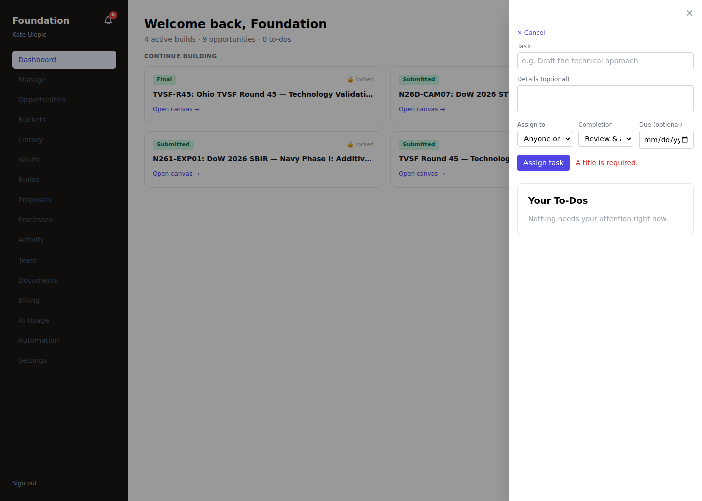
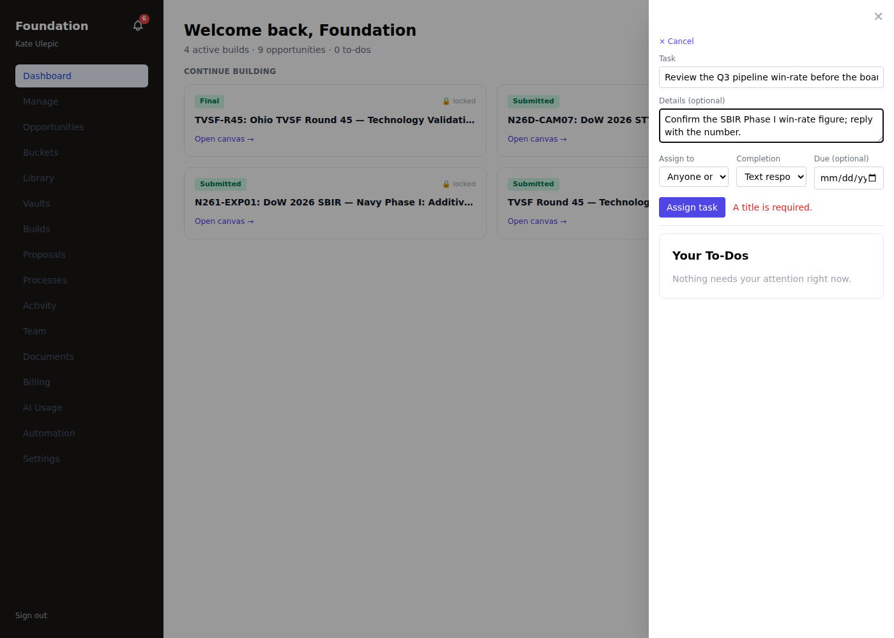
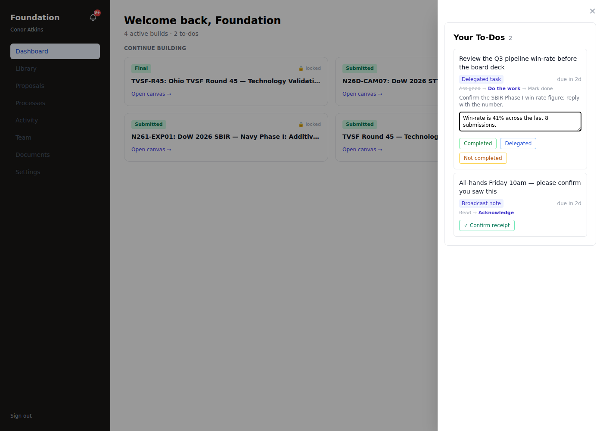
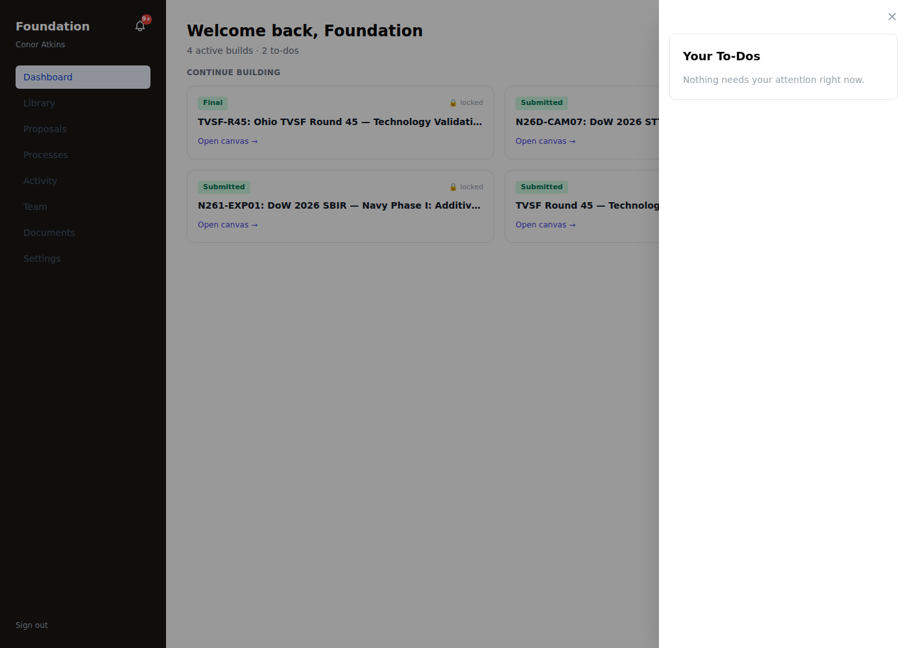
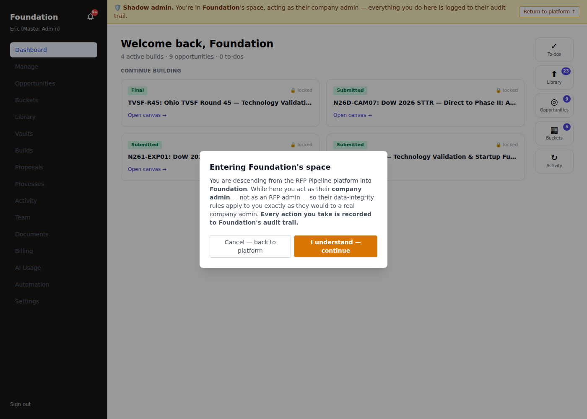
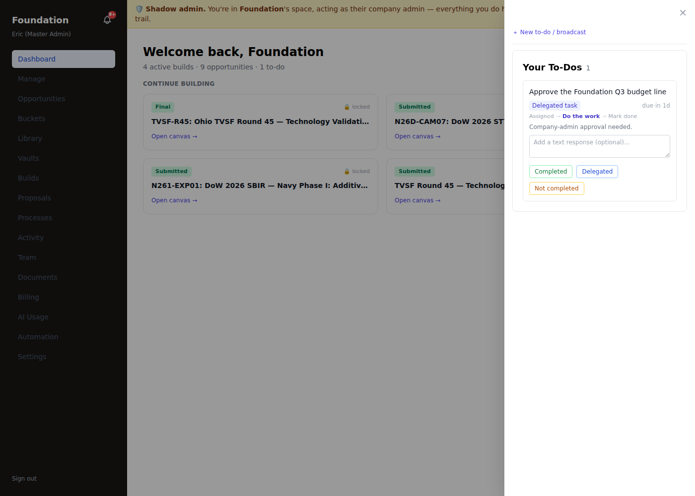

# ToDo / HITL Guide — inline chat, tasking & review (as-run)

A practical, screenshot-backed walkthrough of the human-in-the-loop ToDo system, driven **as real
users** (kate = tenant_admin, conor = tenant_user, eric = shadow-admin) — real execution loops, not
happy paths. Every claim below is backed by a screenshot in `docs/assets/hitl/` and a DB check.
Companion to the framework map/gap/plan in **docs/HITL_FRAMEWORK_MAP.md**.

## 1. The model

Every ToDo is a row in the `tasks` ledger, keyed by `task_type`, surfaced in the assignee's queue
(cockpit **To-dos** drawer for tenants; `/admin/dashboard` for admins), and completed by a **typed
completer**. The catalog `lib/tasks/workflows.ts` is the single source of truth for a ToDo's name,
step trail, and completer; a drift guard (`__tests__/task-catalog-drift.test.ts`) keeps every
producer's `task_type` catalogued. Completers today:

| Completer | Response captured |
|---|---|
| `review` | Approve / Dismiss (+ Open → deep-link to the thing) |
| `upload` | Open to upload → Mark uploaded |
| `form` | fill spec'd fields |
| `acknowledge` | read + acknowledge |
| **`read_receipt`** | **✓ Confirm receipt** — records who + when (the receipt the sender sees) |
| **`text_memo`** | **optional text memo + Completed / Delegated / Not completed** |

The last two are the **generic primitives** — effectively **inline chat + tasking**. Their outcome
(the disposition / receipt + memo) lands in the task `result` AND the `proposal:task.completed`
event, so later automation can trigger off it.

## 2. Compose a ToDo (tenant_admin)

A tenant_admin opens the **To-dos** drawer and clicks **＋ New to-do / broadcast**. The form offers a
title, details, an assignee (a teammate or the whole team), a **completion type**, and a due date.

Empty title is rejected — no happy path:



Composing a **text ToDo** ("Text response — memo + Completed/Delegated/Not-completed"):



kate then sends a **broadcast (read receipt)** the same way. Both land in the team's queue.

## 3. Respond (tenant_user)

conor opens his drawer and sees both. The **text ToDo** shows a memo box + the three close
dispositions; the **broadcast** shows **✓ Confirm receipt**:



He answers the text ToDo with a memo and clicks **Completed**, and confirms the broadcast receipt.
Both close, and the responses persist:

```
broadcast     | kind=read_receipt | status=completed | read=true
text ToDo     | kind=text_memo    | status=completed | disposition=completed | memo="Win-rate is 41%…"
```

The other two dispositions, driven the same way on two more ToDos:



```
Confirm booth logistics  | disposition=delegated     | by=conor
Send the mutual NDA      | disposition=not_completed | by=conor
```

## 4. Roles & visibility (hierarchical + shadow-admin)

Visibility is **hierarchical**: a tenant_admin sees tenant_user ToDos, but a tenant_user does **not**
see a tenant_admin ToDo (verified: conor's drawer never shows the tenant_admin-only "Approve the
Foundation Q3 budget line").

An rfp/master admin who **descends** into a company acts as its **company admin** (bounded to that one
tenant, everything audited). The descent is gated by an explicit interstitial:



After confirming, the shadow-admin's To-dos drawer shows **the company's** ToDos — including the
`tenant_admin`-only one — with the badge matching the drawer, and can complete it:



```
Approve the Foundation Q3 budget line | tenant_admin | completed | by=eric@rfppipeline.com (shadow)
```

## 5. Guardrails (proven, not assumed)

The visibility/completion change broadened the same-tenant **role** match to hierarchical; the
cross-tenant guard + tenant belt in `completeTask` are unchanged. Live proof
(`scratchpad/drive-hitl-p2.mts`, 15/15) + this UI drive establish:

- tenant_user **cannot** complete a tenant_admin ToDo (no upward escalation).
- tenant_admin A **cannot** see or complete tenant B's ToDo (cross-tenant denied, both directions).
- tenant_admin **cannot** complete an rfp_admin-bucket ToDo (no escalation to admin).
- a descended shadow-admin is **bounded to the descended tenant** (never sees another tenant's ToDos).

## 6. Where this goes next

The `text_memo` disposition and `read_receipt` are emitted on `proposal:task.completed`, so a future
automation trigger can react to "a ToDo was delegated / not completed / read" — turning this inline
chat + tasking into a first-class event source for the workflow engine (the natural follow-on to the
`resolveGatePolicy` nudge/escalation layer). The remaining framework follow-ups (portal-stage advance
hook, partner_user self-surface, single admin-triage inbox) are tracked in docs/HITL_FRAMEWORK_MAP.md.
