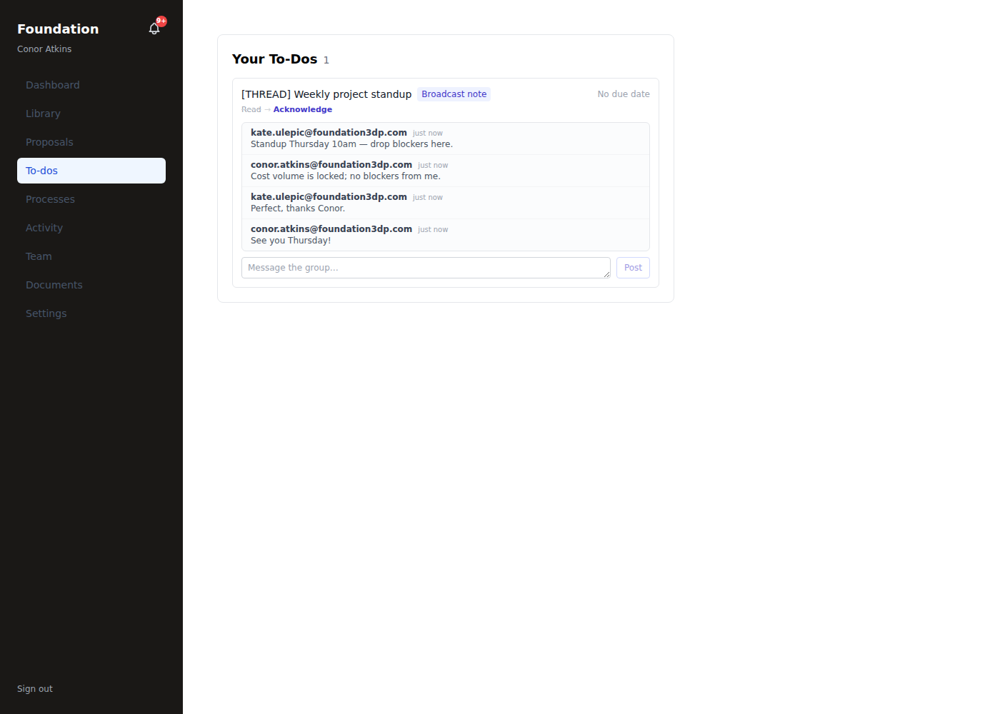
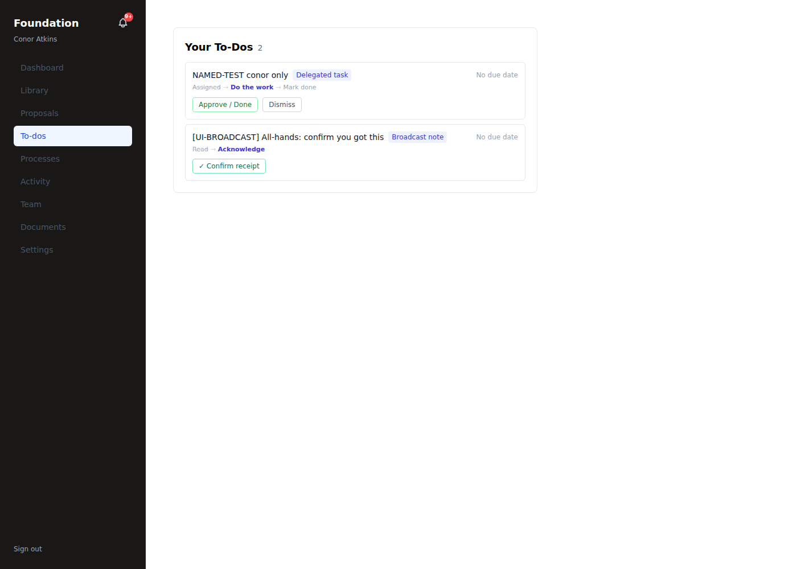
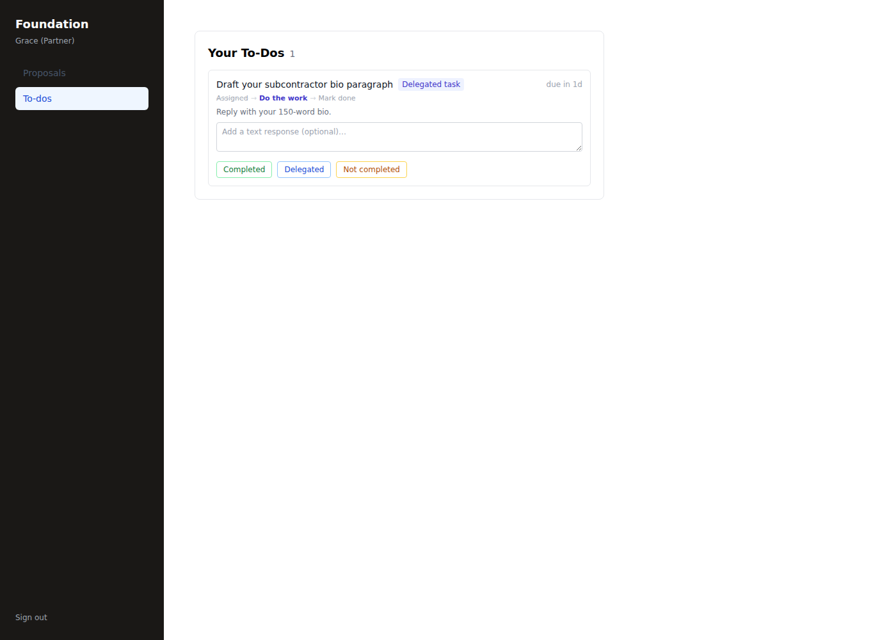
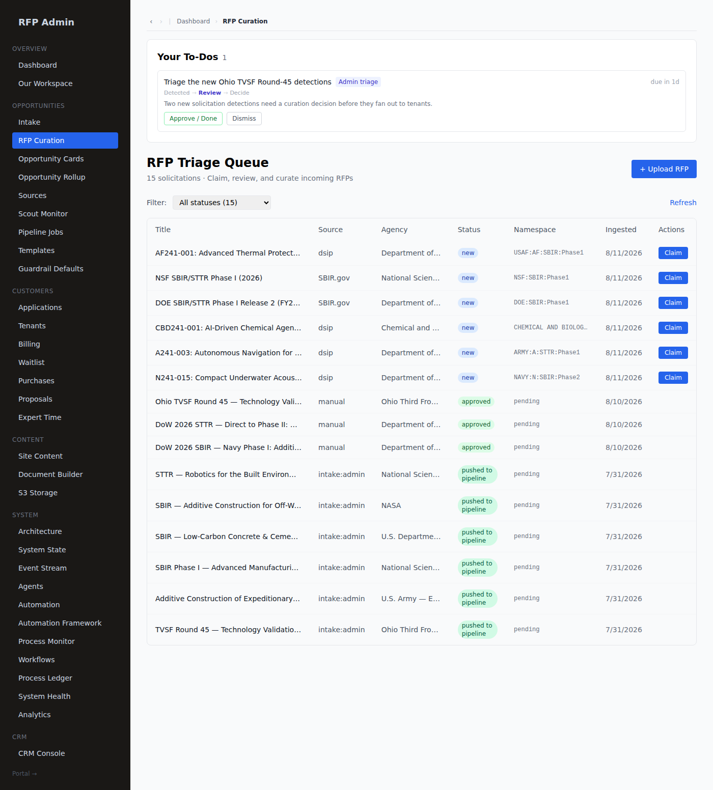
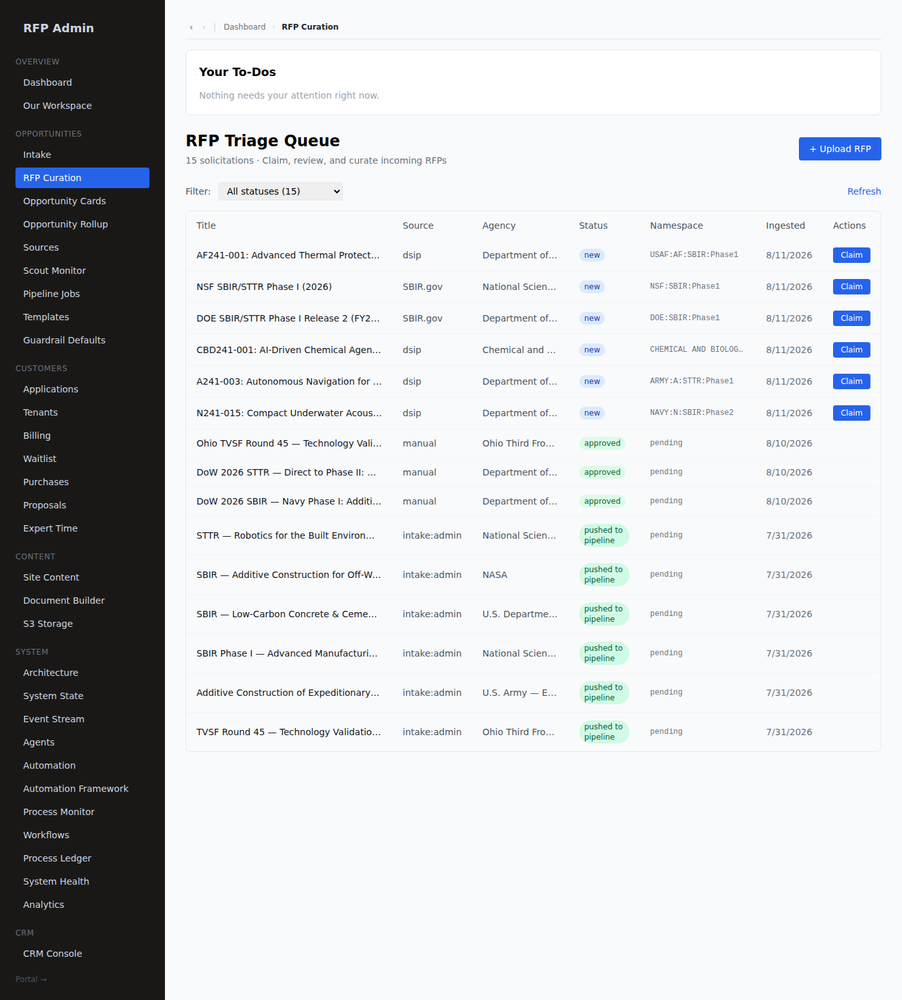

# ToDo / HITL Guide — inline chat, tasking & review (as-run)

A practical, screenshot-backed walkthrough of the human-in-the-loop ToDo system, driven **as real
users** (kate = tenant_admin, conor = tenant_user, eric = shadow-admin) — real execution loops, not
happy paths. Every claim below is backed by a screenshot in `docs/assets/hitl/` and a DB check.
Companion to the framework map/gap/plan in **docs/HITL_FRAMEWORK_MAP.md**.

## 1. The model

Every ToDo is a row in the `tasks` ledger, keyed by `task_type`, surfaced in the assignee's queue
(cockpit **To-dos** drawer for tenants; `/admin/dashboard` for admins), and completed by a **typed
completer**. The catalog `lib/tasks/workflows.ts` is the single source of truth for a ToDo's name,
step trail, and completer; a drift guard (`__tests__/task-catalog-drift.test.ts`) keeps every
producer's `task_type` catalogued. Completers today:

| Completer | Response captured |
|---|---|
| `review` | Approve / Dismiss (+ Open → deep-link to the thing) |
| `upload` | Open to upload → Mark uploaded |
| `form` | fill spec'd fields |
| `acknowledge` | read + acknowledge |
| **`read_receipt`** | **✓ Confirm receipt** — records who + when (the receipt the sender sees) |
| **`text_memo`** | **optional text memo + Completed / Delegated / Not completed** |

The last two are the **generic primitives** — effectively **inline chat + tasking**. Their outcome
(the disposition / receipt + memo) lands in the task `result` AND the `proposal:task.completed`
event, so later automation can trigger off it.

### Targeting — broadcast to all, or named to a user

A human-composed tenant ToDo has exactly **two targeting modes** (the compose form offers only these;
role buckets stay reserved for engine-produced ToDos):

- **Broadcast to all** — no named assignee (`assignee_role` + `assignee_user_id` both NULL, scoped to
  the tenant, mig 174). **Every member of the company receives it** — tenant_admin, tenant_user, AND
  partner_user collaborators — and so does a **descended shadow admin** (an RFP/master admin) and a
  **partner shadow admin** (a partner-manager descended into the company), *as though they were the
  company's admin*. Each viewer **acknowledges independently**: their receipt is appended to
  `result.receipts[]` (atomically, in one UPDATE), which drops the ToDo from **that** person's queue
  while it stays standing for everyone else. One person's ack never clears it for the rest.
- **Named to a user** — `assignee_user_id` set. **Private to that one person**; a shadow admin does
  NOT auto-receive it (they receive the *broadcasts*, per above). Completed once, by that user.

**Broadcast → group thread (`kind='thread'`).** A broadcast can be a lightweight **group chat**: it
renders the message **chain** (`result.chain[]`) and anyone in the tenant (incl. a descended shadow
admin) can **post a timestamped message** — nobody is required to respond, it never closes, and it is
**not (yet) a trigger item**. The chain entries are **typed** (`type: 'message' | 'ack'`, extensible),
so future workflows can append their own entry types — a proposed meeting time, an RSVP, a task — and
render them as cards. The thread is the substrate those "schedule a meeting / PM task" extensions plug
into. Proven (real lib): a 5-message thread (one author posting twice), every entry timestamped, stays
visible to all 4 viewer kinds after posting, cross-tenant post denied. Live UI (below): the chain
renders per-author with "just now" timestamps and a **Message the group…** reply box; a member's reply
appears in the chain and the thread stays open.



Proven via the real lib (`createTask`/`listOpenTasksForActor`/`completeTask`): a broadcast is seen by
all 5 viewer kinds; conor's ack drops it from conor only; eric (shadow) sees + acks it; a named ToDo
is visible to its user only; a cross-tenant actor is **denied** completion. Live HTTP re-proof: kate
composed a broadcast (assign route → 201), conor + grace (partner) + kate all received it, conor's
"✓ Confirm receipt" dropped it from conor while grace still saw it.



## 2. Compose a ToDo (tenant_admin)

A tenant_admin opens the **To-dos** drawer and clicks **＋ New to-do / broadcast**. The form offers a
title, details, an assignee (a teammate or the whole team), a **completion type**, and a due date.

Empty title is rejected — no happy path:


Composing a **text ToDo** ("Text response — memo + Completed/Delegated/Not-completed"):


kate then sends a **broadcast (read receipt)** the same way. Both land in the team's queue.

## 3. Respond (tenant_user)

conor opens his drawer and sees both. The **text ToDo** shows a memo box + the three close
dispositions; the **broadcast** shows **✓ Confirm receipt**:


He answers the text ToDo with a memo and clicks **Completed**, and confirms the broadcast receipt.
Both close, and the responses persist:

```
broadcast     | kind=read_receipt | status=completed | read=true
text ToDo     | kind=text_memo    | status=completed | disposition=completed | memo="Win-rate is 41%…"
```

The other two dispositions, driven the same way on two more ToDos:


```
Confirm booth logistics  | disposition=delegated     | by=conor
Send the mutual NDA      | disposition=not_completed | by=conor
```

## 4. Roles & visibility (hierarchical + shadow-admin)

Visibility is **hierarchical**: a tenant_admin sees tenant_user ToDos, but a tenant_user does **not**
see a tenant_admin ToDo (verified: conor's drawer never shows the tenant_admin-only "Approve the
Foundation Q3 budget line").

An rfp/master admin who **descends** into a company acts as its **company admin** (bounded to that one
tenant, everything audited). The descent is gated by an explicit interstitial:


After confirming, the shadow-admin's To-dos drawer shows **the company's** ToDos — including the
`tenant_admin`-only one — with the badge matching the drawer, and can complete it:


```
Approve the Foundation Q3 budget line | tenant_admin | completed | by=eric@rfppipeline.com (shadow)
```

## 5. Guardrails (proven, not assumed)

The visibility/completion change broadened the same-tenant **role** match to hierarchical; the
cross-tenant guard + tenant belt in `completeTask` are unchanged. Live proof
(`scratchpad/drive-hitl-p2.mts`, 15/15) + this UI drive establish:

- tenant_user **cannot** complete a tenant_admin ToDo (no upward escalation).
- tenant_admin A **cannot** see or complete tenant B's ToDo (cross-tenant denied, both directions).
- tenant_admin **cannot** complete an rfp_admin-bucket ToDo (no escalation to admin).
- a descended shadow-admin is **bounded to the descended tenant** (never sees another tenant's ToDos).

## 6. Where this goes next

The `text_memo` disposition and `read_receipt` are emitted on `proposal:task.completed`, so a future
automation trigger can react to "a ToDo was delegated / not completed / read" — turning this inline
chat + tasking into a first-class event source for the workflow engine (the natural follow-on to the
`resolveGatePolicy` nudge/escalation layer). The framework follow-ups that were tracked in
docs/HITL_FRAMEWORK_MAP.md — portal-stage advance hook (G8), partner_user self-surface, single
admin-triage inbox — are now **all landed** (see §7).

## 7. Surface polish (confirmed + tested)

Two surface gaps closed, each proven as the real user in the browser.

**partner_user self-surface (G4).** A `partner_user` is a per-proposal collaborator with no cockpit
drawer, so they previously had **no** way to see a ToDo assigned to them. There is now a direct
**To-dos** page on every portal (`/portal/[slug]/todos`), and the tenant tasks route is opened to
`partner_user+` (still scoped, by `listOpenTasksForActor` + `completeTask`, to their own hierarchical
bucket + own-id in their own tenant). Grace (Partner) sees only **her** ToDo — never the
`tenant_admin`-only one, never another tenant_admin's — and completes it with the text-memo completer:



```
Draft your subcontractor bio paragraph | partner_user | completed | disp=completed | by=grace.partner@skyline-e2e.test
(admin-only + other tenant_admin ToDos seen by grace: 0 / 0 — scoped correctly)
```

**Single completable admin-triage inbox (G5).** The `/admin/rfp-curation` triage panel was a
read-only list (completion lived only on the dashboard). It now mounts the same `TaskQueue`
(`apiBase=/api/admin/tasks`), so an admin working in the curation workspace sees **and** completes
their ToDos in place — one queue component, the workflow label + step trail + deep-links, above the
intact RFP Triage Queue:



After **Approve / Done**, the ToDo clears from the queue in place:



```
Triage the new Ohio TVSF Round-45 detections | admin_review | completed | approved=true | by=eric@rfppipeline.com
proposal:task.completed emitted (taskType=admin_review)
```
