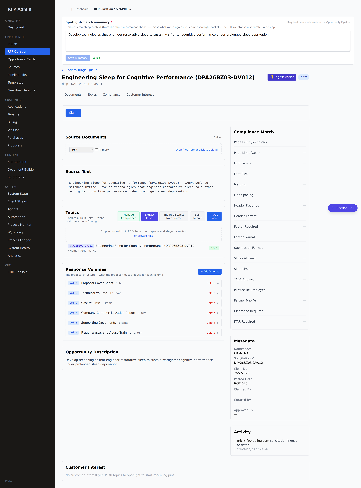
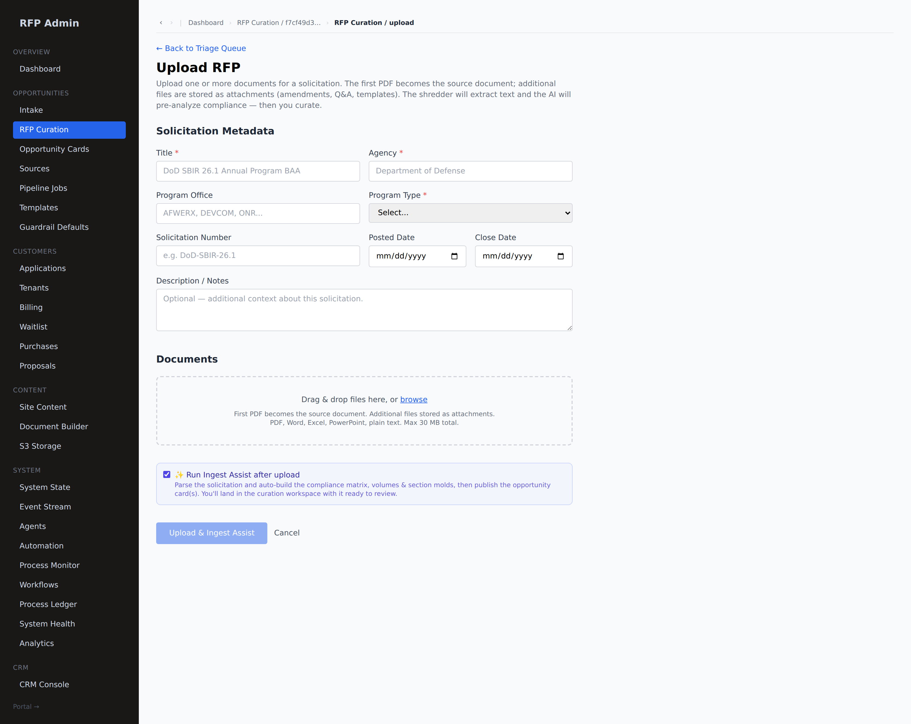

# Ingest Assist — the ingest/parse SOP

One RFP-admin action turns a solicitation into a live OPP: **parse → build the
compliance matrix + volumes + section molds → publish the card(s)**. It is the
same materializer the **Scouts** will feed when they place new OPPs.

## Where

Two entry points:
- **RFP curation workspace** (`/admin/rfp-curation/[solId]`) → the **✨ Ingest
  Assist** button (top-right). One click builds the whole skeleton on the
  solicitation:

  

- **Upload flow** (`/admin/rfp-curation/upload`) → the **✨ Run Ingest Assist
  after upload** checkbox (on by default). The button reads **Upload & Ingest
  Assist**, and you land in the workspace with the matrix already built:

  

## What it does (the SOP)

1. **Parse** (`lib/ingest/parse-solicitation.ts`) — the solicitation's `full_text`
   → a structured `ParsedSolicitation` via the AI (same Anthropic call pattern as
   the Source Scout). If no API key or the parse is thin, it falls back to the
   **DoW SBIR/STTR CSO default skeleton** — so one click always yields a sound,
   compliant structure the curator can refine.
2. **Materialize** (`lib/ingest/materialize.ts`, deterministic + idempotent) —
   writes:
   - `solicitation_compliance` (page limit, font floor, margins, ITAR, format)
   - `solicitation_volumes` + `volume_required_items` (the 6-volume CSO structure
     → the section molds → the compliance matrix at provision)
   - `opportunities` + **cards** — one per topic; a **suite of cards** for a
     multi-topic solicitation. Drives the product's own `publishAndFanOut` so the
     cards land ranked on every tenant.
3. **Provision reads exactly what this writes** — releasing a purchased card
   yields the full multi-volume canvas build (see `provision-proposal.ts`).

## The default DoW SBIR/STTR CSO skeleton

`DEFAULT_SBIR_CSO_SKELETON` (in `lib/ingest/skeleton.ts`) — the 6 volumes and the
CSO-mandated 12-section Technical Volume order:

1. **Proposal Cover Sheet** — cover sheet + Technical Abstract + certifications
2. **Technical Volume** (the white paper) — 12 sections: Identification &
   Significance · Technical Objectives · Statement of Work · Related Work ·
   Relationship w/ Future R&D · Commercialization Strategy · Key Personnel ·
   Foreign Citizens · Facilities/Equipment · Subcontractors/Consultants · Prior/
   Current/Pending Support · Data-Rights Assertions
3. **Cost Volume** — Base + Option, costed separately
4. **Company Commercialization Report** (CCR)
5. **Supporting Documents** — Foreign Nationals disclosure, Letters of Support,
   DD Form 2345, Technical Data Rights, Reps & Certs
6. **Fraud, Waste, and Abuse Training** certification

The AI refines page limits, topic-specific items, cost caps, and extracts the
topic(s) from the actual text when a real key is present.

## API

`POST /api/admin/rfp-curation/[solId]/ingest-assist` (rfp_admin)
Body: `{ parsed?: ParsedSolicitation, publish?: boolean }`
- `parsed` — an admin-reviewed structure (skip the AI parse; commit as-is).
- `publish` — default `true`; `false` builds the skeleton without fanning cards.
Returns `{ data: { source, volumes, items, topics, cards } }`.

## Reference instance — Immobileyes CUAS

`scripts/seed-cuas-immobileyes.mts` is the hand-run of this exact SOP for the
uploaded **DON26BX03-NP002** NAVAIR/NAVSEA Counter-UAS CSO: it builds the real
6-volume / 22-section matrix (10-page white paper; Phase I base 6 mo ≤ $200K +
option 6 mo ≤ **$115K** per the topic) and publishes the card to Immobileyes.
A dress-rehearsed provision yields 22 section canvases across 6 volume artifacts.

## Verified

`__tests__/ingest-skeleton.test.ts` (pure) + `scripts/ingest-assist-e2e.mts`
(sandbox: default single-topic → 22 molds; multi-topic → suite of cards). tsc
clean; production build green.
