# RFP Admin Operations Guide

**For eric@rfppipeline.com (master_admin) and future rfp_admin users**

> **Every screenshot below was taken from the running product**, driven as a real `master_admin`
> through the real login. Re-capture them with
> `cd frontend && node scripts/capture-guides.mjs --only admin`, which visits each documented route
> as that actor and **fails the run** if any surface 404s, redirects elsewhere, or renders an error
> boundary. Where a screenshot contradicted the text, the text was corrected — those corrections are
> marked inline.

---

## Overview

As an RFP Pipeline admin, you are the expert human in the loop. The AI assists with text extraction, compliance detection, and draft generation — but you decide what gets released to customers. Your curation quality directly determines the quality of every proposal the system produces.

**Your responsibilities:**
- Accept customer applications into the system
- Upload and curate RFP documents (solicitations, BAAs, CSOs)
- Build compliance matrices linking RFP requirements to their source
- Define topics, volumes, and required sections for each solicitation
- **Release 1 — Spotlight:** push approved opportunities to customer opportunity-card feeds
- **Release 2 — Proposal portal:** build the reusable master skeleton (compliance matrix + volumes + blank molds) so a purchased portal provisions per tenant
- Resolve **"purchase needs curation" ToDos** — the shadow-admin curation that provisions a buyer's workspace
- Monitor system activity and respond to customer needs

> **How this maps to the current architecture.** There is **one master opportunity** on the RFP
> side, mirrored to every customer as a denormalized card over a **forward-only bridge**; the only
> thing that flows back "up" is a **ToDo** that routes you (a shadow admin) down into a specific
> tenant to do work there. Each opportunity is released **twice** — once to **Spotlight** (discovery)
> and once as a **proposal portal** (build). Read
> [`MASTER_MIRROR_OPP_DESIGN.md`](./MASTER_MIRROR_OPP_DESIGN.md) for the architecture,
> [`HITL_IMMOBILEYES_CLICKPLAN.md`](./HITL_IMMOBILEYES_CLICKPLAN.md) for the exact Monday
> click-spine, and [`ALPHA_HITL_RUNBOOK.md`](./ALPHA_HITL_RUNBOOK.md) for the full test script.

### Pricing (launch target: August 2026)

| Product | Price | Notes |
|---|---|---|
| Spotlight | **$499/mo** | 3-month minimum (no month-to-month) |
| Proposal portal — Phase I | **$1,999** | per portal |
| Proposal portal — Phase II | **$4,999** | standalone (no linked Phase I) |
| Proposal portal — Phase II (linked) | **$3,999** | when a linked Phase I is already in the system + library |

Founding-cohort buyers currently purchase with the **comp code `rfppipelinetest`** (a $0 recorded
purchase); live self-serve Stripe checkout is **⚠ future** (descoped for now).

---

## 1. First Login (Master Admin Bootstrap)

The master_admin account is created automatically when the pipeline service first boots.

### How it works:

1. The pipeline service starts on Railway
2. It checks: does a `master_admin` user already exist?
3. If not, it creates one:
   - **Email**: `eric@rfppipeline.com`
   - **Temp password**: randomly generated (16 characters, crypto-safe)
   - **temp_password flag**: set to `true` (forces password change)
4. The temp password is printed **once** to the pipeline boot logs:

```
================================================================
[seed] BOOTSTRAP: master_admin user created
[seed] email:    eric@rfppipeline.com
[seed] password: <16 random chars>
[seed]
[seed] Use these credentials ONCE at /login.
[seed] You will be forced to set a permanent password
[seed] on first sign-in. This is the only time this
[seed] temp password will ever be printed.
================================================================
```

### To log in:

1. Go to Railway dashboard → pipeline service → Logs
2. Find the bootstrap banner, copy the temp password
3. Navigate to `/login`
4. Enter `eric@rfppipeline.com` and the temp password
5. You'll be redirected to `/change-password`
6. Enter current (temp) password + new permanent password (12+ chars) + confirm
7. Click **Change Password**
8. You're redirected to the portal. Navigate to `/admin/dashboard`

### Your console

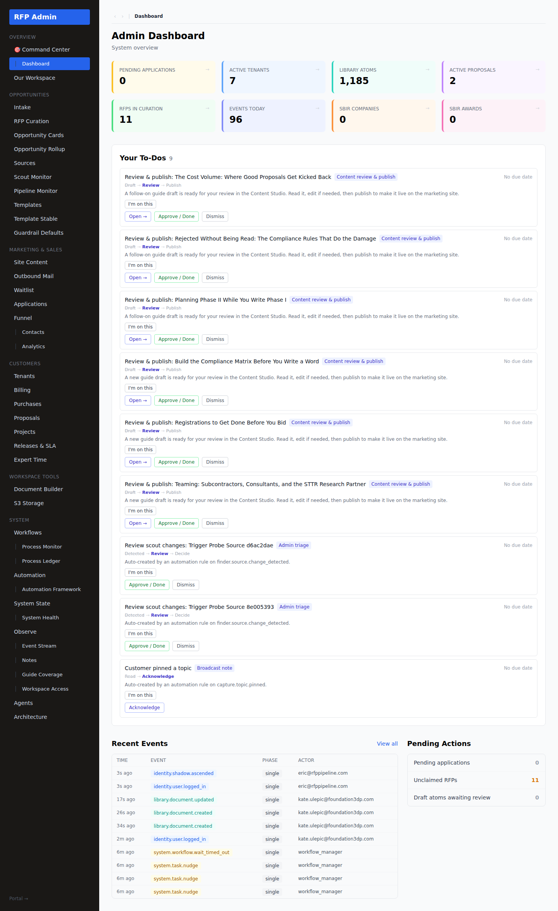

The left rail is the whole job, grouped:

| Group | Items |
|---|---|
| **Overview** | Command Center · Dashboard · Our Workspace |
| **Opportunities** | Intake · RFP Curation · Opportunity Cards · Opportunity Rollup · Sources · Scout Monitor · Pipeline Monitor · Templates · Template Stable · Guardrail Defaults |
| **Customers** | Applications · Tenants · Billing · Waitlist · Purchases · Proposals · Releases & SLA · Expert Time |
| **Content** | Site Content · Document Builder · S3 Storage |
| **System** | Workflows (Process Monitor · Process Ledger) · Automation (Automation Framework) · System State · System Health · Event Stream · Agents · Analytics · Architecture |
| **CRM** | CRM Console |

**Command Center** (`/admin/command`) is the "what changed since I last looked" view across all of
it, with an unread watermark — the fastest way back in after a day away.

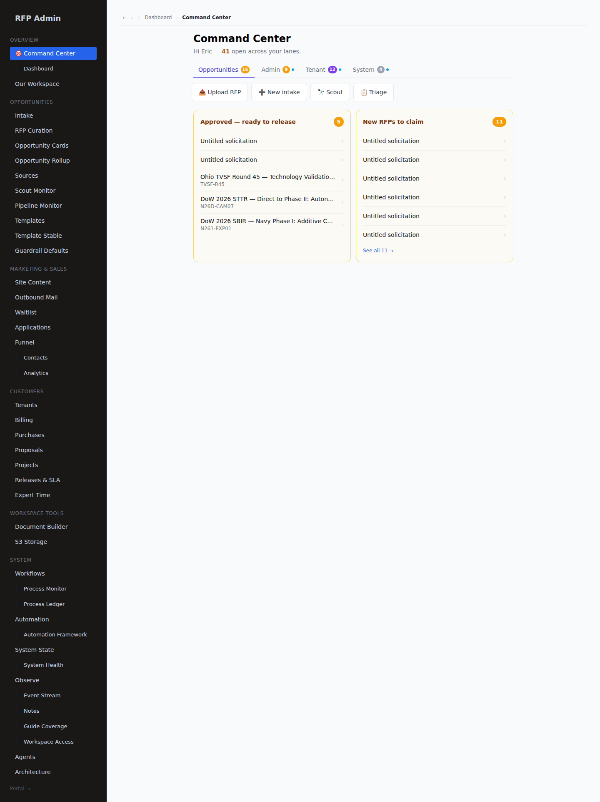

### If you lose the temp password:

```sql
-- Run in Railway Postgres Query tab:
DELETE FROM users WHERE email = 'eric@rfppipeline.com';
```

Then restart the pipeline service. A new temp password will be generated and printed to logs.

---

## 2. Accept Customer Applications

**Path:** `/admin/applications`

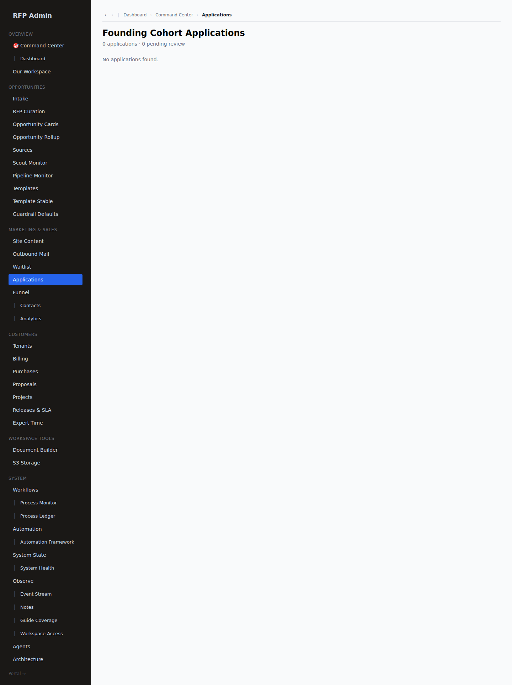

### What you see:

A list of pending applications with company information submitted via the public application form.

> **One application, one to-do.** A submitted application raises exactly one typed
> `application_triage` to-do, linked to the application itself, and **accepting or rejecting closes
> it**. (Until migration 204 a second, entity-less copy was raised by an automation rule; it could
> never be closed by any decision, so the queue only grew. That rule is retired.)

### For each application, review:

| Field | What to check |
|---|---|
| Company Name | Legitimate business? |
| Contact Email | Valid email? (this becomes their login) |
| Phone | Reachable number? |
| NAICS Codes | Relevant to federal R&D? |
| SAM Registration | Active SAM.gov registration? |
| CAGE Code | Valid if provided? |
| Tech Focus Areas | Aligned with topics we're curating? |
| Target Agencies | Agencies we have RFPs for? |
| Team Size / Years | Realistic for SBIR/STTR? |

### Accept an application:

1. Click **"Accept"** on the application
2. The system automatically:
   - Creates a **tenant** (company workspace) with an auto-generated slug (e.g., `ubihere`)
   - Creates a **user account** with the applicant's email
   - Generates a **temporary password**
   - Sets `temp_password = true` (forces password change on first login)
3. The API response includes the temp password
4. **You must manually send the temp password to the customer** (email or phone)
   - Example: "Welcome to RFP Pipeline! Your login: eric.c.wagner@gmail.com / [temp password]. Go to [URL]/login to get started."

### Reject an application:

Click **"Reject"** — the application is archived. No tenant or user is created.

### For the Ubihere test:

- Application from: `eric.c.wagner@gmail.com`
- After accepting, the tenant slug will be `ubihere` (or similar)
- Customer portal: `/portal/ubihere/dashboard`
- Send the temp password to yourself at your personal email

---

## 3. Upload RFPs to the System

**Path:** `/admin/rfp-curation` → **+ Upload RFP** (top right of the triage queue) →
`/admin/rfp-curation/upload`

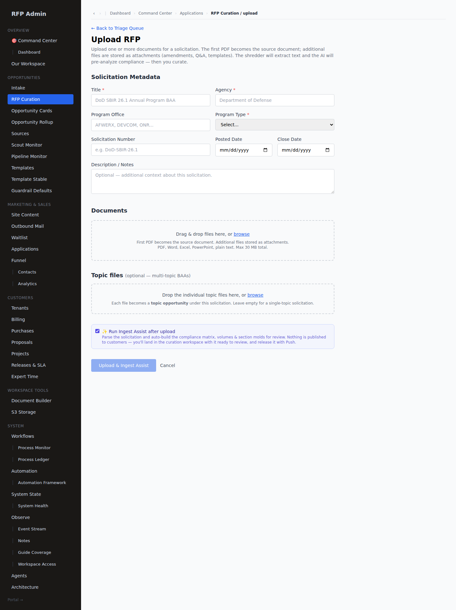

### Manual upload flow:

1. Click **+ Upload RFP** on the curation page
2. Use the upload form to add RFP PDFs (one or more per solicitation)
3. For each uploaded file, the system:
   - Stores the PDF to S3 at `rfp-admin/inbox/...`
   - Creates an **opportunity** record (or links to existing one)
   - Creates a **curated_solicitations** record
   - Creates a **solicitation_documents** record linking file to solicitation
   - Queues a **shredder job** for text extraction

### What to upload:

For the Ubihere test, upload real SBIR/STTR BAAs from the `/docs/` folder:
- `DoW 2026 SBIR BAA FULL_R1_04132026.pdf` — Department of the Workforce
- `DoD 25.2 SBIR BAA FULL_04212025.pdf` — Department of Defense
- Any of the CSO files (AF, DoD, etc.)

### After upload:

The RFP appears in the triage queue. The shredder job runs asynchronously — it extracts the text, splits into sections, and stores the artifacts in S3.

---

## 4. Triage Incoming RFPs

**Path:** `/admin/rfp-curation`

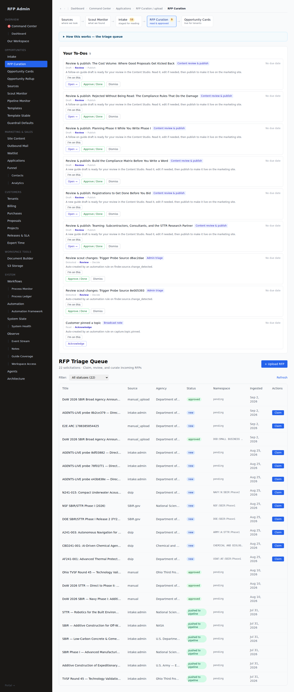

This one page is where a shift starts. Top to bottom:

1. **The four intake stages**, as tabs with live counts — **Sources** (*where we look*) ·
   **Scout Monitor** (*what we found*) · **Intake** (*staged for reading*) · **RFP Curation**
   (*read & approved*) · **Opportunity Cards** (*live for tenants*).
2. **Your To-Dos** — the admin inbox, inline, with an overdue count. Each row is typed and carries
   its route: a `Proposal setup` task shows *Purchases → Curate & release → Draft sections →
   Review* with **Open →** / **Approve / Done** / **Dismiss**; a `Broadcast note` shows *Read →
   Acknowledge*; an `Application triage` shows *Approve / Done* / **Dismiss**; a
   `Content review & publish` shows *Draft → Review → Publish*. This is the single completable
   admin inbox — you do not go hunting for work on other screens.
3. **RFP Triage Queue** — *"N solicitations · Claim, review, and curate incoming RFPs"*, with a
   status filter, **Refresh**, and columns **Title · Source · Agency · Status · Namespace ·
   Ingested · Actions**. A `new` row carries a **Claim** button.

### States:

| State | Meaning | Actions |
|---|---|---|
| `new` | Just uploaded, nobody owns it | Claim or Dismiss |
| `claimed` | You own it, curation in progress | Open workspace |
| `in_review` | Curation complete, under review | Approve or Reject |
| `approved` | Ready to push to customers | Push to Spotlight |
| `pushed` | Live in customer Spotlight feeds | Monitor |
| `dismissed` | Not relevant, hidden | Can re-claim if needed |

### Triage workflow:

1. **Claim** solicitations you want to curate (assigns them to you)
2. **Dismiss** solicitations that aren't relevant to your customer base
3. Only claimed solicitations can be curated

---

## 5. Curate a Solicitation — The Curation Workspace

**This is the most important screen in the system.** Open a claimed solicitation to enter the curation workspace.

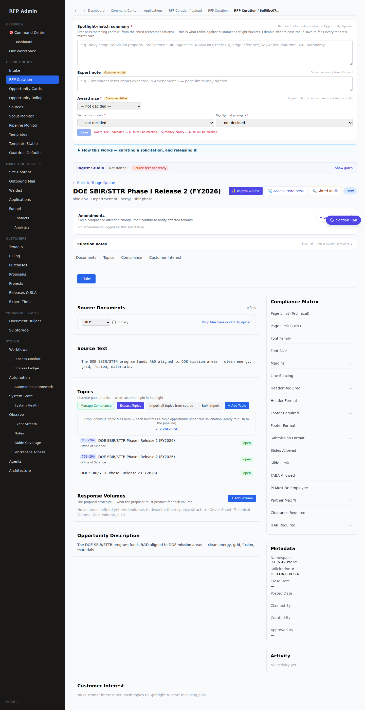

### Layout:

> **Corrected against the screenshot.** This used to be drawn as a two-pane "PDF viewer left,
> compliance matrix right". It isn't. The workspace is a single scrolling page with release gates at
> the top, a two-column body, and the PDF reachable from the **Section Rail** rather than pinned
> beside you.

Top to bottom:

| Band | What it is |
|---|---|
| **Spotlight-match summary** ⭑ | The plain-language "why this matches", first-passed from the shred. **Required before release** — while it's empty the page says *"Summary empty — push will be blocked."* Editable after release too; saving re-fans every tenant's mirror card. |
| **Expert note** `Customer-visible` | A short note shown on every tenant's card (e.g. *"Component instructions expected in Amendment 3 — page limits may tighten."*) |
| **Ingest Studio** | The shred state — *Not started* / *Source text not ready* — with **Show gates** |
| **Title bar** | Solicitation title, agency and program, plus **✨ Ingest Assist**, **Assess readiness**, **Shred audit**, and the status chip (`new`) |
| **Amendments** | *"Log a compliance-affecting change, then confirm to notify affected tenants"* + **Log amendment** |
| **Curation notes** | Internal — never customer-visible |
| **Tabs** | **Documents · Topics · Compliance · Customer Interest** |
| **Claim** | Take ownership; only a claimed solicitation can be curated |

Then the body, in two columns:

- **Left** — **Source Documents** (typed upload with a Primary flag) · **Source Text** (what the
  shredder actually read) · **Topics** · **Response Volumes** · **Opportunity Description**
- **Right** — **Compliance Matrix**, **Metadata** (namespace, solicitation #, close/posted dates,
  claimed/curated/approved by), and **Activity**
- **Bottom** — **Customer Interest**

### 5a. Building the Compliance Matrix

The compliance matrix captures every requirement from the RFP as a structured variable.

**How to add a compliance variable:**

1. Read the RFP in the left PDF panel
2. **Select text** that specifies a requirement (e.g., "not to exceed 15 pages, Times New Roman 12pt")
3. A **tag popover** appears with:
   - Searchable list of existing compliance variables
   - Option to **Add new variable** with name, category, data type
4. Select or create a variable
5. The highlighted text becomes the variable's **value**
6. A **source anchor** is automatically captured: document ID, page number, excerpt text, character offsets

**The matrix is a fixed list of named rules**, not a free-form set of categories. As shipped it
carries: *Page Limit (Technical)* · *Page Limit (Cost)* · *Font Family* · *Font Size* · *Margins* ·
*Line Spacing* · *Header Required* · *Header Format* · *Footer Required* · *Footer Format* ·
*Submission Format* · *Slides Allowed* · *Slide Limit* · *TABA Allowed* · *PI Must Be Employee* ·
*Partner Max %* · *Clearance Required* · *ITAR Required*. An unfilled rule shows an em dash.

*(Corrected: an earlier draft of this guide described five free-form categories — Format, Content,
Eligibility, Submission, Budget. That is not what the workspace shows.)*

**AI pre-fill and where the value came from.** **Ingest Assist** fills the matrix from the shredded
source, and every field records **how** it was filled:

| Provenance | Badge | Meaning |
|---|---|---|
| `pattern_match` | **Read from source** | A deterministic extractor lifted an unambiguously-stated rule, and cited it — rule, page, excerpt, character offset, and which document |
| `ai` | **Read from source** | The model read it out of the text |
| *deferral* | **Set elsewhere** | The source explicitly points somewhere else (*"the page limit lives in the Component-specific instructions"*). The default is **cleared**, and the citation is shown. |
| `default` | **Default — unverified** (red) | Nobody read this. It is a guess. |

The rule behind all of it: **a value the product did not read from the solicitation must never look
like one it did.** Trust order is `hitl > verified > override > pattern_match > ai > default`.

Assist **refuses an unshredded solicitation** (409 `SOURCE_TEXT_NOT_READY`) rather than inventing a
skeleton; the upload form polls readiness instead of racing the shred.

When you see a suggestion: **Accept** if correct, **Correct** if wrong — the correction is saved to
curation memory under `{agency}:{program_office}:{type}:{phase}` and pre-fills the next solicitation
from that program. The first few need real work; by the tenth the AI handles most of it.

### 5b. Adding Topics

A solicitation may contain multiple topics. Each topic is a pursuable opportunity that customers see in their Spotlight.

**How to add topics:**

- **Manual**: Click "Add Topic" and fill in the fields:
  - Topic number (e.g., AF251-001)
  - Title
  - Description
  - Tech areas (comma-separated)
  - Funding amount
  - Phase (Phase I, Phase II, etc.)
- **AI extraction**: Click "Extract Topics from PDF" — the AI parses the document and suggests topics
- **Bulk import**: Paste or upload structured topic data

The Topics card offers **Manage Compliance · Extract Topics · Import all topics from source ·
Bulk Import · + Add Topic**, plus a drop zone — each dropped file becomes a topic opportunity under
this solicitation, ready to push. Open a topic to see and edit it:

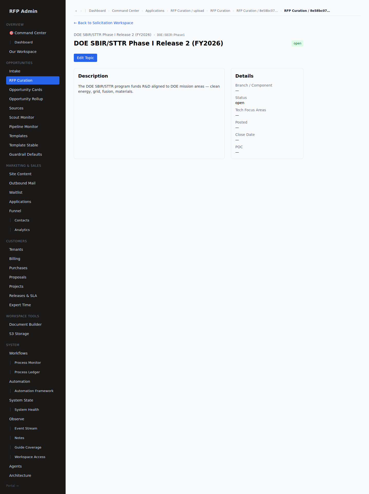

**For SBIR BAAs:** These typically have dozens or hundreds of topics. Use the AI extraction + bulk import workflow. Review the extracted topics for accuracy.

**For CSOs:** These typically have a single broad topic. Create one topic manually.

### 5c. Defining Volumes and Required Items

Volumes define the structure of the proposal a customer will write.

**Common volume structure for SBIR Phase I:**

| Volume | Required Items |
|---|---|
| Technical Volume | Executive Summary, Technical Approach, Schedule & Milestones, Key Personnel, Facilities |
| Cost Volume | Cost Breakdown, Budget Justification, Subcontract Costs |
| Supporting | Cover Sheet, DD Form 2345, Commercialization Plan |

**How to add:**

1. Click "Add Volume" in the Volumes panel
2. Name it (e.g., "Technical Volume")
3. Set `applies_to_phase` (Phase I, Phase II, or both)
4. Add required items to each volume:
   - Item name (e.g., "Technical Approach")
   - Page limit (e.g., 15)
   - Format instructions (e.g., "Times New Roman 12pt, single-spaced")
5. These become the proposal sections when a customer creates a proposal

> **This is the master skeleton (Release 2).** It is built **once on the master solicitation** and
> **reused by every buyer** — the blank **molds** carry the guardrails (font, margins, page limit,
> type) so a "1-page technical summary" mold is really a formatted Word doc the customer fills. Link
> a `document_template` to a required item via `template_id` and attach an `expert_note`; at provision
> the mold interpolates (`{company_name}` → tenant name) into each tenant's sections. Build it any
> time in advance; if it is not done when the **first** portal is purchased, the 72h SLA (§8) fires.

> **Customer Interest tab (real demand).** The workspace's **Customer Interest** tab shows the
> tenants who **pinned** this solicitation's topics — pin date, whether they purchased a portal,
> and build stage. It reads the opportunity-card spine (`tenant_opportunity_cards`), not the
> retired pins table, so it **populates again** — use it to prioritize what customers are
> actually waiting on.

---

## 6. Approve and Push to Spotlight

After curation is complete:

1. Click **"Request Review"** — moves solicitation to `in_review` state
2. Review the complete package:
   - Compliance matrix fully populated?
   - Topics accurate with proper numbering?
   - Volumes and required items match the RFP?
   - Source anchors pointing to correct PDF locations?
3. Click **"Approve"** — marks as `approved`
4. Click **"Push to Spotlight"** — releases to customer feeds

Once pushed, the topic is live on tenant cards. `/admin/opportunities` is the master list behind
every one of those mirrors:

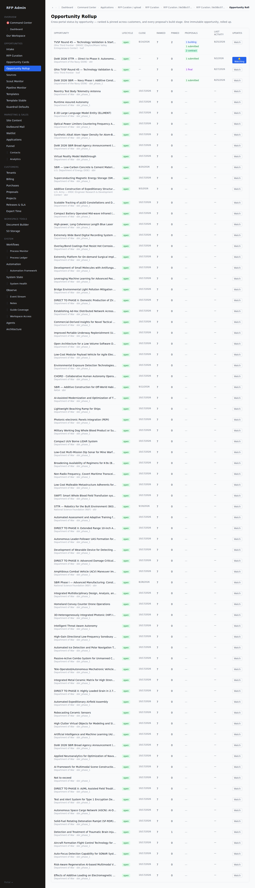

### What happens on push:

- All topics from this solicitation become visible in customer Spotlight feeds
- Topics are scored against each customer's profile (tech areas, agencies, programs)
- Customers with high match scores see the topics ranked near the top
- The compliance matrix and volume structure are frozen at this point (changes need a new push)

> **This is Release 1 (Spotlight) of two.** Push makes the opportunity **discoverable and ranked** on
> every customer's card feed (`/portal/[slug]/cards`). It does **not** build the proposal skeleton —
> that is **Release 2** (§5c and §8), built once on the master and reused per buyer. The push gate now
> also requires a non-empty **`spotlight_summary`** (the plain-language "why this matches") in addition
> to `submission_format`.

---

## 7. Monitor Customer Activity

**Path:** `/admin/events` (**Event Stream**) — with `/admin/system-state` for the infrastructure
view and `/admin/analytics` for the roll-ups. *(Corrected: the old text pointed at `/admin/system`.)*

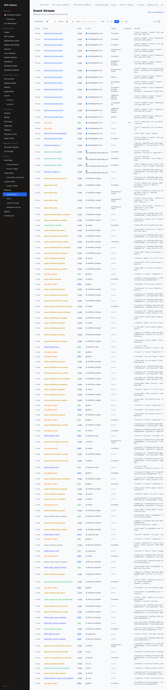

Filter by **namespace**, **phase**, free-text **type**, and a time window (1h / 6h / 24h / 7d / 30d);
**Live** polls. The **phase** column is the start/end bracket in the data: a `tool.invoke` writes one
`start` row and one `end` row of the *same type*, and the `end` carries the duration (`12ms`, `32ms`
in the shot above). A one-shot event like `identity.user.logged_in` is `single`. Every row's payload
carries a `correlationId` so a whole operation can be pulled back together.

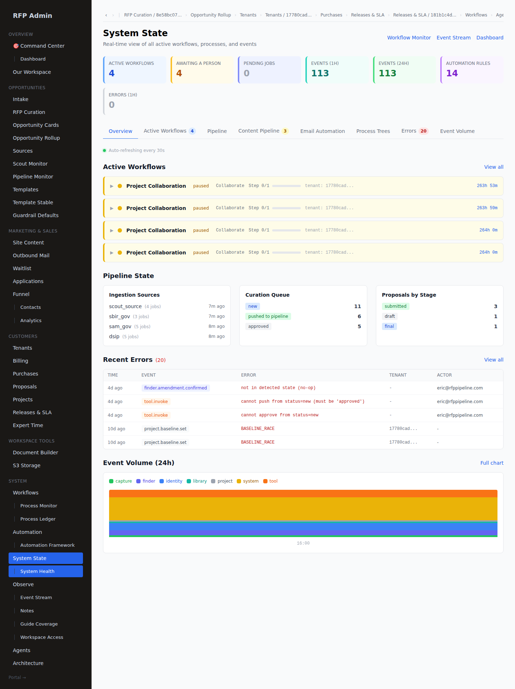

The event stream shows all system activity:

| Event | What it means |
|---|---|
| `capture:application.submitted` | New customer applied |
| `capture:application.accepted` | Application accepted → tenant + user created, card river mirrored |
| `library:file.uploaded` | Customer uploaded documents |
| `library:document.atomized` | Documents atomized into the library |
| `capture:topic.pinned` | Customer pinned an opportunity card (copies the OPP's files into their space) |
| `capture:purchase.completed` | Customer purchased a proposal portal (comp code) |
| `capture:workspace.released` | Admin released the portal from curation → workspace provisioned (V0) |
| `proposal:section.saved` | Customer saved canvas content |
| `finder:solicitation.claimed` | Admin claimed an RFP |
| `finder:solicitation.pushed` | Admin pushed to Spotlight (Release 1) |
| `finder:annotation.saved` | Admin saved a compliance variable / annotation |

> **Namespace note.** Events use the namespaces `finder` (admin), `capture` (customer),
> `identity` (auth), `proposal`, `library`, `system`, `tool` — never `admin`, `cms`, or `spotlight`.
> A long-running operation writes **two rows of the same type** — a start and an end — with the
> phase in the `phase` column and the end carrying `duration_ms`; the phase is never baked into the
> type name. Full contract: [`EVENT_CONTRACT.md`](./EVENT_CONTRACT.md).

### Watching the other customer surfaces

| Screen | Path | What it answers |
|---|---|---|
| **Tenants** | `/admin/tenants` | Who is on the platform, and their licence state |
| **Purchases** | `/admin/purchases` | Every paid and comped build, with its promo code |
| **Opportunities** | `/admin/opportunities` | The master OPP list behind every tenant's cards |
| **Scout Monitor** | `/admin/scouts` | The review→release queue for crawler and HITL scout findings, classified NEW vs UPDATE |
| **Site Content** | `/admin/site` | Draft→publish→archive for everything front-facing |

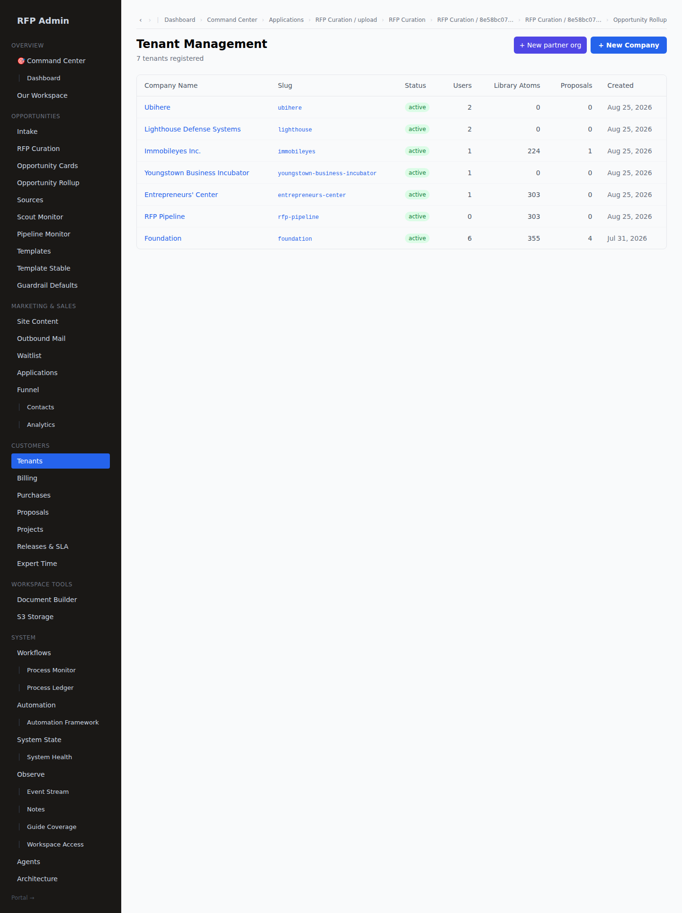

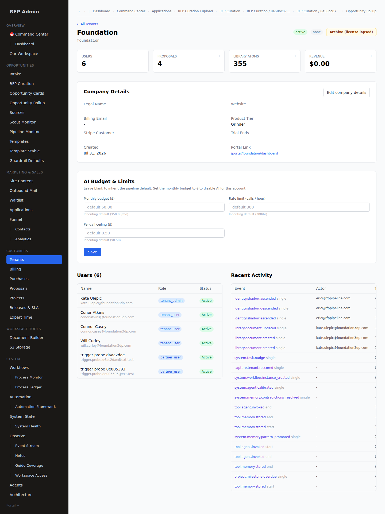

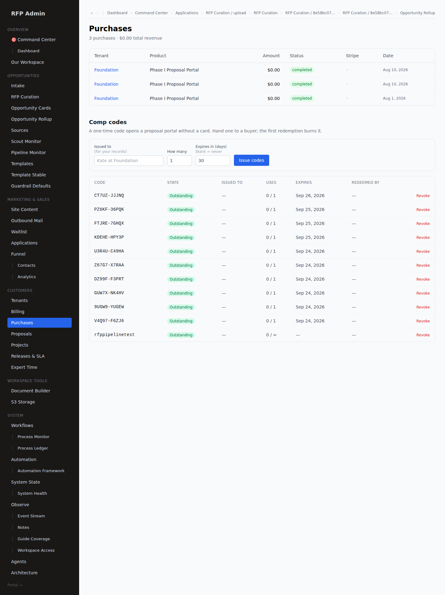

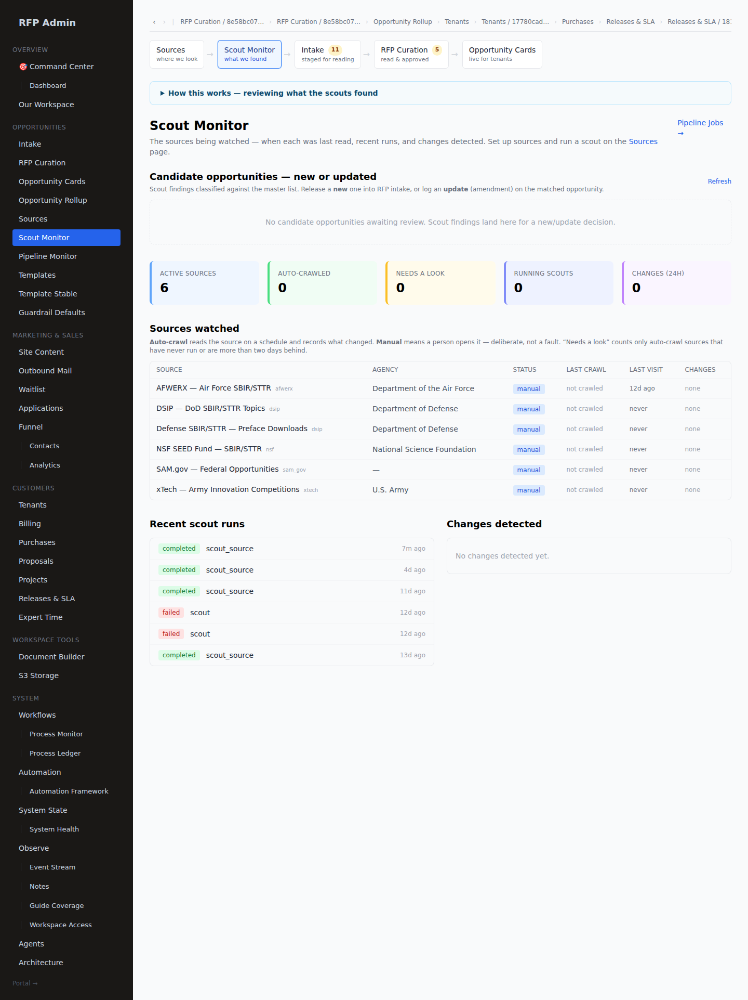

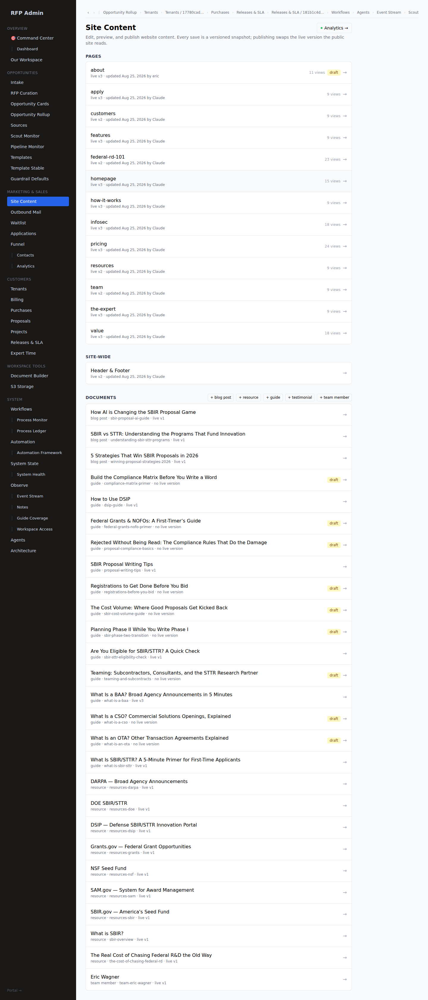

---

## 8. Portal Build Flow — Purchase → Curation → Release → V0→V1

This is the **Release 2** path. It runs on the **comp-code purchase loop**, not silent
admin-provision. The authoritative click-by-click sequence is
[`HITL_IMMOBILEYES_CLICKPLAN.md`](./HITL_IMMOBILEYES_CLICKPLAN.md); the design is
[`MASTER_MIRROR_OPP_DESIGN.md`](./MASTER_MIRROR_OPP_DESIGN.md).

### The flow

1. **Customer pins** the opportunity card, then clicks **Purchase** and enters the comp code
   `rfppipelinetest`. `POST /api/portal/[slug]/purchase`:
   - opens a `proposal_portals` row at **`curation_pending`** with a **72-hour SLA**
     (`curation_due_at = now()+72h`),
   - writes a **$0 completed `purchases`** row (promo code stamped),
   - grants a **shadow-admin** row (`shadow_admin_grants`, `source='t_and_c'`),
   - emits **`capture:purchase.completed`**, and
   - parks a **72h `proposal_setup` ToDo** for `rfp_admin`.
   The customer's portal shows **"Waiting for RFP Expert Curation" + a live 72h countdown.**
2. **Resolve the ToDo.** The **"Curate + release the purchased proposal workspace"**
   (`proposal_setup`) task appears in **Your To-Dos** on `/admin/rfp-curation`, showing its route —
   *Purchases → Curate & release → Draft sections → Review*. It deep-links to the
   **provisioning cockpit** (below). Clicking through routes you, as the **shadow admin**, down into
   the buyer's RLS-scoped tenant. *(⚠ security: today `verifyTenantAccess` still grants admins a
   global god-view that `shadow_admin_grants` was meant to replace — the grant is
   auditable/revocable metadata, not yet the enforced gate.)*
3. **Work the provisioning cockpit** — `/admin/provisioning`, and per buyer
   `/admin/provisioning/[portalId]`. This is the screen that lands the 72h SLA.

   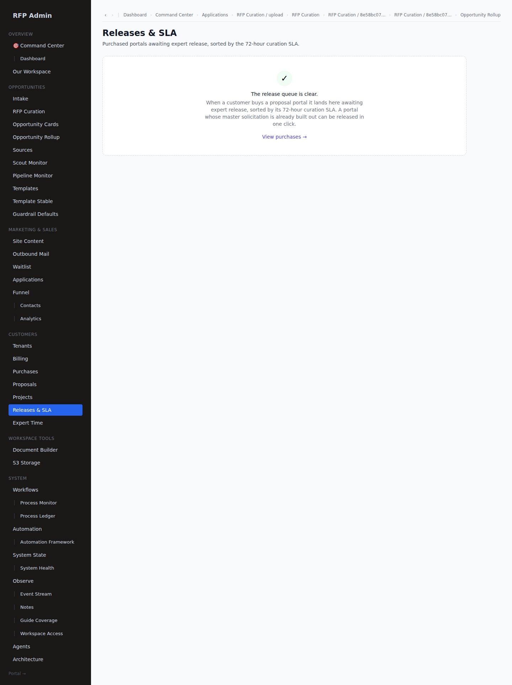

   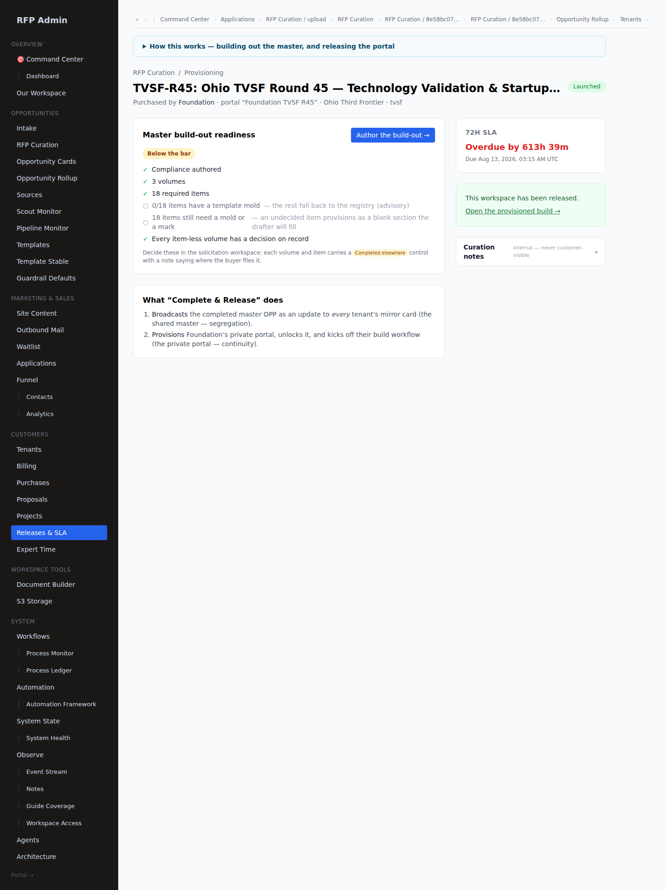

   It shows the buyer, a **live SLA countdown**, and the master **build-out readiness bar**
   (compliance filled · at least one volume · at least one required item), deep-links into the
   authoring workspace, and ends in one two-outcome **Complete & Release**:

   1. **`completeBuildOut`** marks the *master* built out and broadcasts an `updated` fan-out to
      **every** tenant's mirror card (`provisionReady=true`) — the shared master, so everyone
      watching that opportunity learns it is ready.
   2. **`provisionAndReleasePortal`** provisions **this** buyer's private portal, flips
      `curation_pending → launched`, and starts their workflow — the private portal, so continuity
      belongs to them alone.

   If you built the skeleton in advance (§5c), step 1 is a **~15-minute review**. If not, build it
   now — the **72h clock covers skeletoning only**, not the draft.
4. **Release** to the customer (`action=release`): `curation_pending → launched` →
   `provisionProposalForPortal` provisions the workspace **UNLOCKED** — `proposals` +
   `proposal_artifacts` per volume + `proposal_sections` per required item + a per-tenant
   `proposal_compliance_matrix` (rows `not_addressed`), with molds interpolated (`{company_name}` →
   tenant name). `OnProposalCreated → draft_v0` then auto-drafts sections via the `section_drafter`
   agent. This is **V0** — the instantiated skeleton. Emits **`capture:workspace.released`**.
5. **The buyer accepts their workflow.** Release also raises a **required tenant Workflow Setup**
   to-do (`guardrail_config._setup = pending`). Their `tenant_admin` opens
   `/portal/[slug]/portals/[portalId]`, reviews a plan recommended from *their own* prior accepted
   plans, and presses **Accept & Start**. Until they do, the build has no live stages. Editing it
   later re-projects onto the live task rows and re-arms the nudges. See the customer guide's
   Step 8b for the screen they see.
6. **Customer builds V0 → V0.5 → V1** (see the version model below).

> **Comp a build instead of a purchase.** On the tenant's **Portals** page (expert view) the
> **"Approve free portal"** form comps the paid build for an opportunity: it records a **$0
> audited `purchases` row** (`metadata.grant='admin'`, emits `capture:purchase.completed`) and
> opens the workspace — auditing exactly like a real purchase. It **validates the opportunity
> exists first** (`opportunities` carries the FK; `proposal_portals.opportunity_id` does not), so
> a bad UUID can't orphan a build. It's the only manual portal-create form and is
> **rfp_admin-gated** — customers always go through the comp-code purchase.

### Version model

| Stage | What it is | Clock |
|---|---|---|
| **→ V0** | skeleton instantiated for the tenant (matrix + molds + guardrails, blank) | the 72h (skeletoning only) |
| **V0 → V0.5** | **library plug-and-play** — atoms pulled into the molds → first draft (~15 min) | none |
| **V0.5 → V1** | draft, compliance, finalize; **Force-advance to V1** available | none |

### Reuse — the second buyer is instant

Because the skeleton is built **once on the master solicitation** and reused per tenant, a second
customer who buys the same opportunity skips the 72h build — molds already exist, so it's a fast
release straight to V0. **⚠ future:** today every purchase still opens `curation_pending`; an
automatic skip for already-skeletoned opportunities is on the backlog.

### Your role during proposal build

Today the shadow admin bootstraps the build (draft, lock, force-advance). The intended end state is
**mostly customer-executed** via the tenant's own accepted workflow plan (stage gates, per-to-do
owners and nudges) — see step 5 above. Agent coverage as shipped: `section_drafter` auto-drafts on
release, `compliance_reviewer` runs inline in the AI route, and `color_team_reviewer` runs off the
advance queue. *(Corrected: `color_team_reviewer` was described here as "defined but not wired".)*

---

## 8b. Workflows and Agents — the oversight plane

### Workflows

**Path:** `/admin/workflows`

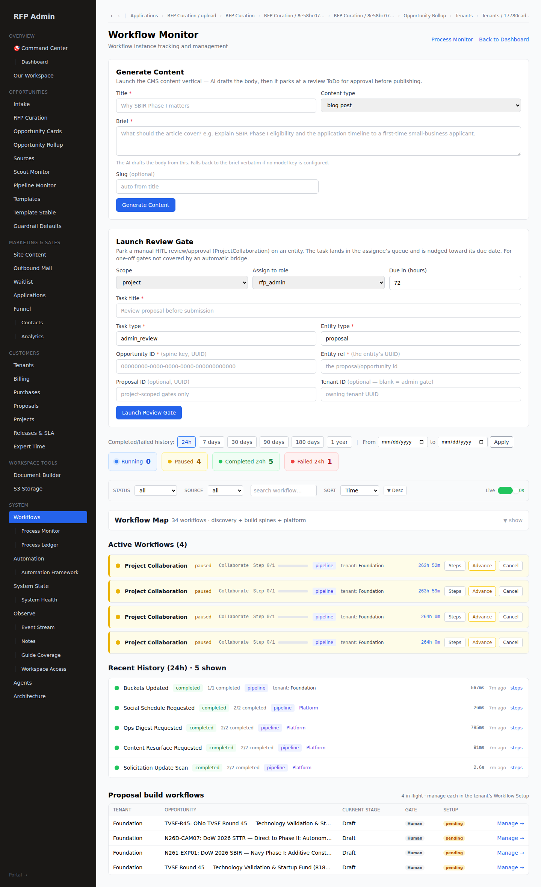

Three things on one screen:

- **Workflow Map** — every template rendered as a dependency graph, grouped by the two spines
  (discovery · build) plus platform
- **Live instance graphs** — the same DAG with a per-step status overlay for a running instance
- **A sortable, filterable monitor** with a Live mode

Operator detail, including how to instantiate and how to unstick a paused instance:
[`WORKFLOW_ADMIN_GUIDE.md`](./WORKFLOW_ADMIN_GUIDE.md).

### Agents

**Path:** `/admin/agents`

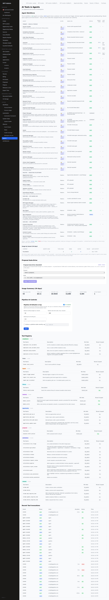

The roster of every archetype, with per-tenant usage over the forward-only bridge. This page is also
where the **Proposal Auto-Drive doorbell** lives — it fires the same full-draft trigger a tenant's
own portal button does, recorded with `source='admin_doorbell'` so a draft you started is
distinguishable from one they started.

The non-negotiables, in one line each: a tenant-space agent is **tenant-bound**; its output is
**advisory** and lands only through a guardrail into review; untrusted tenant content is
**injection-fenced**; and the runtime bounds runaway work without ever dead-ending a workflow.
Full contract: [`AGENT_WORKFORCE.md`](./AGENT_WORKFORCE.md).

---

## 9. Onboarding a New RFP Admin

To bring on a pro-bono expert as an `rfp_admin`:

### V1 method (direct database):

```sql
-- Generate a bcrypt hash of a temp password first:
-- In Python: import bcrypt; bcrypt.hashpw(b"TempPass123!", bcrypt.gensalt(12)).decode()

INSERT INTO users (email, name, role, password_hash, is_active, temp_password)
VALUES (
  'expert@example.com',
  'Expert Name',
  'rfp_admin',
  '$2b$12$[paste the bcrypt hash here]',
  true,
  true
);
```

### What rfp_admin can do:

- Everything in this guide (upload, curate, approve, push, monitor)
- View and manage all solicitations and customer data

### What rfp_admin cannot do (master_admin only):

- System configuration and capacity settings
- User management (creating/deactivating users)
- Railway deployment settings
- Database migrations

### Onboarding steps for the new expert:

1. Create their user row (SQL above)
2. Send them their temp password
3. They log in at `/login` → forced to `/change-password`
4. Walk them through this guide
5. Assign their first solicitation to curate (claim it for them, or have them claim it)

---

## 10. Daily Operations Checklist

```
Morning:
  [ ] /admin/command — what changed since you last looked (one screen, unread-watermarked)
  [ ] /admin/rfp-curation — work Your To-Dos down, oldest overdue first
  [ ] Anything on the SLA clock: /admin/provisioning, sorted by time remaining
  [ ] /admin/applications for new applications → accept or reject (this closes their to-do)
  [ ] /admin/scouts — release or dismiss what the scouts found overnight

Curation block (1-2 hours):
  [ ] Claim new solicitations
  [ ] Run Ingest Assist, then CHECK THE BADGES — every red "Default — unverified" is a
      value nobody read from the source. Fix it or accept it knowingly.
  [ ] Add topics (manual or AI-assisted extraction)
  [ ] Define volumes and required items — this is the reusable master skeleton
  [ ] Write the spotlight-match summary (push is blocked without it)
  [ ] Push completed solicitations to Spotlight

Monitoring:
  [ ] /admin/events, phase=error — anything that started and did not finish
  [ ] /admin/workflows — any instance paused or failed
  [ ] Verify recently pushed solicitations appear on tenant cards
  [ ] Review AI compliance suggestions — correct any errors (each correction trains the next one)

Weekly:
  [ ] Upload new solicitations from SAM.gov, SBIR.gov, Grants.gov
  [ ] Archive expired solicitations
  [ ] Review customer activity for engagement patterns
```

---

## Key Concepts

| Term | Definition |
|---|---|
| **Solicitation** | The parent document — a BAA, CSO, or RFP that contains one or more pursuable topics |
| **Topic** | A specific opportunity within a solicitation that a customer can pursue (e.g., AF251-001) |
| **Compliance Matrix** | Structured extraction of all requirements from the RFP, each linked to its source location |
| **Source Anchor** | Provenance link from a compliance value back to the exact PDF page, excerpt, and character offset |
| **Curation Memory** | Every admin correction is stored as episodic memory — the AI uses it to pre-fill variables on future solicitations from the same agency/program |
| **Volume** | A required submission component (Technical Volume, Cost Volume, etc.) |
| **Required Item** | A specific section within a volume (Technical Approach, Key Personnel, etc.) |
| **Atom** | A reusable content unit in a customer's library — a paragraph, bio, past performance narrative, etc. |
| **Spotlight** | The customer-facing feed of scored, relevant opportunities |
| **Canvas** | The WYSIWYG document editor where proposals are written, with typed nodes (headings, paragraphs, lists, tables) |

---

## Troubleshooting

### Can't log in

```sql
-- Check the user exists:
SELECT email, role, is_active, temp_password FROM users WHERE email = 'eric@rfppipeline.com';

-- Reset temp password:
UPDATE users SET temp_password = true,
  password_hash = '$2b$12$[new bcrypt hash]'
WHERE email = 'eric@rfppipeline.com';
```

### Customer can't see Spotlight topics

1. Verify the solicitation is in `pushed` state
2. Verify the customer's profile matches (tech areas, agencies, programs)
3. Check that topics were added to the solicitation
4. Check that the customer's tenant is active: `SELECT * FROM tenants WHERE slug = 'ubihere'`

### Uploaded PDF not showing in viewer

The PDF viewer loads from S3. If the viewer is blank:
1. Check S3 connectivity: visit `/api/health`
2. Check the document record: `SELECT * FROM solicitation_documents WHERE solicitation_id = '...'`
3. Verify the S3 key exists in the bucket

### AI suggestions seem wrong

Correct them. Every correction writes to curation memory with the namespace key `{agency}:{program_office}:{type}:{phase}`. After correcting the same variable across 2-3 solicitations from the same agency, the AI will pre-fill correctly.

### Shredder job not completing

1. Check pipeline logs in Railway for errors
2. The shredder requires: PDF in S3, `pymupdf4llm` installed, valid solicitation record
3. If the pipeline crashed during extraction, restart the service — jobs will be re-queued

### A page looks broken but the URL is fine

Two failure shapes render as a red card while the server reports success, because they throw in the
browser rather than on the server:

- **"Something went wrong — this page failed to load."** A React component threw. Nothing will be in
  the server log. Reload once; if it repeats, it is a defect on that route with that data — capture
  the browser console and file it.
- **A page that renders and then blanks.** A hydration mismatch (React error #418 and friends):
  the server and the browser produced different text for the same element.

Both were live in this codebase until the guide pass drove the pages and *looked at them*
(bug log B78, B79). `cd frontend && node scripts/verify-surfaces.mjs` drives every page under
`/admin` and `/portal/[slug]` as the right actor and fails on either shape — run it after a deploy.

### An action seemed to do nothing

Several admin actions that used to fail **silently** now surface an **inline error** instead — so
if a click appears to no-op, look for the red message and retry; the write didn't happen. This
covers **Accept & Lock / Lock volume / Lock all / Force-advance** on a proposal (e.g. *"Could not
lock this scope — some sections may not be ready"* or *"N of M sections could not be locked"*),
editing a **spotlight-match summary**, saving **guardrail defaults**, and saving **source notes /
instructions**. Customer opportunity-card actions (pin / unpin / resync) behave the same way.

---

## For the Ubihere Test (reference script)

> **Note.** The current single-operator end-to-end is
> [`HITL_IMMOBILEYES_CLICKPLAN.md`](./HITL_IMMOBILEYES_CLICKPLAN.md) (Immobileyes → Navy, comp-code
> purchase → shadow curation → V0→V1). The Ubihere script below is kept for reference; its
> purchase/build steps have been aligned to the comp-code flow. Admin steps 4–6 build the **Release 2**
> master skeleton; step 7 is the **Release 1** push.

### As admin (eric@rfppipeline.com):

1. Log in at `/login`
2. Upload `DoW 2026 SBIR BAA FULL_R1_04132026.pdf` at `/admin/rfp-curation`
3. Claim the solicitation
4. Build a basic compliance matrix (at least: page limit, font, due date)
5. Add 2-3 topics from the BAA
6. Define a Technical Volume with required items (Technical Approach, Key Personnel, Past Performance)
7. Approve and push to Spotlight
8. Go to `/admin/applications` and accept the Ubihere application
9. Send yourself the temp password at eric.c.wagner@gmail.com

### As customer (eric.c.wagner@gmail.com):

1. Apply at the homepage
2. Log in with temp password → set permanent password
3. Upload a few company documents (create simple test docs if needed)
4. Review and accept atoms
5. Browse the opportunity **cards** feed (`/portal/<slug>/cards`) → pin a topic
6. **Purchase** the portal on the pinned card → enter comp code `rfppipelinetest` → the portal opens
   **`curation_pending`** with a live 72h countdown
7. *(switch to admin)* Resolve the **"Purchase — needs curation"** ToDo at `/admin/rfp-curation` →
   **Release** (`action=release`) → the workspace provisions **unlocked** (V0) and auto-drafts
8. *(back as customer)* Library plug-and-play into the molds (V0 → V0.5), then **Lock all** /
   **Force advance to V1**
9. Review in canvas editor → **Download Proposal (.docx)**

That's the full loop. Every step has an event in the system_events table.
