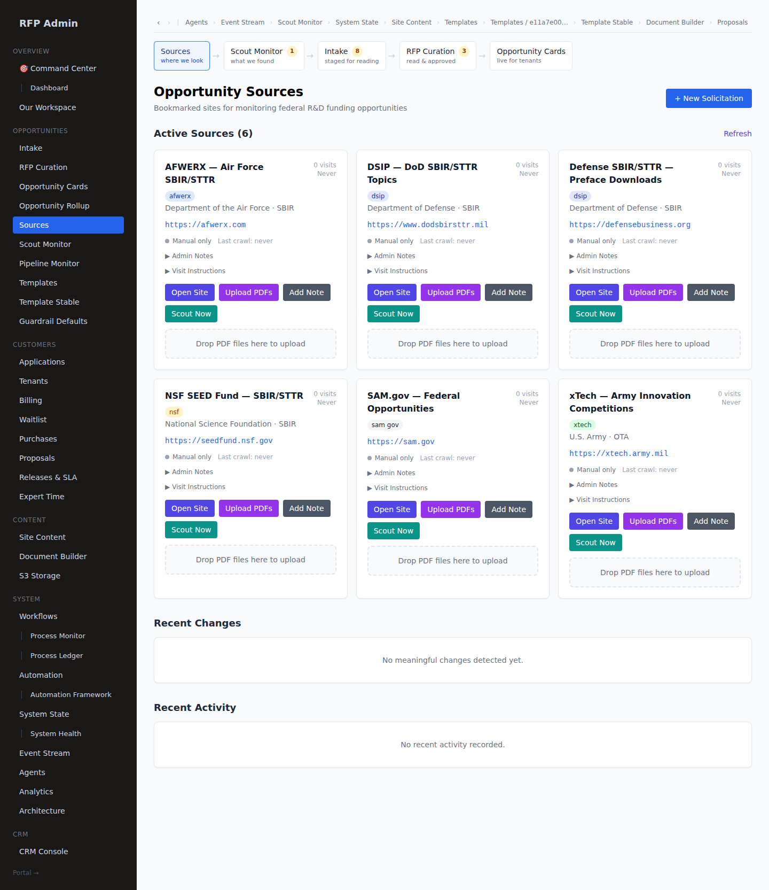
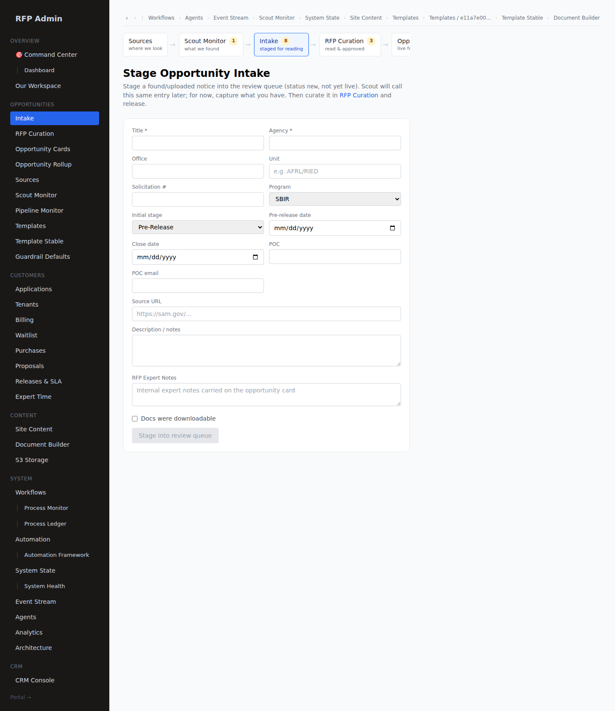
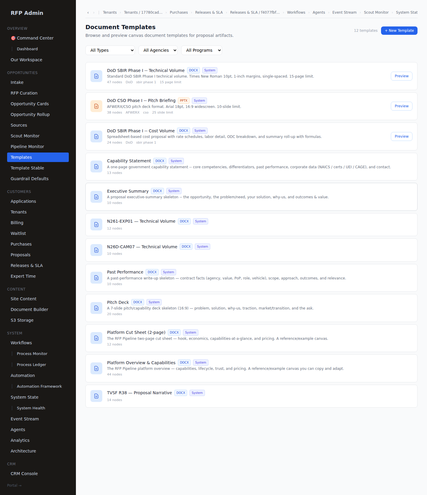
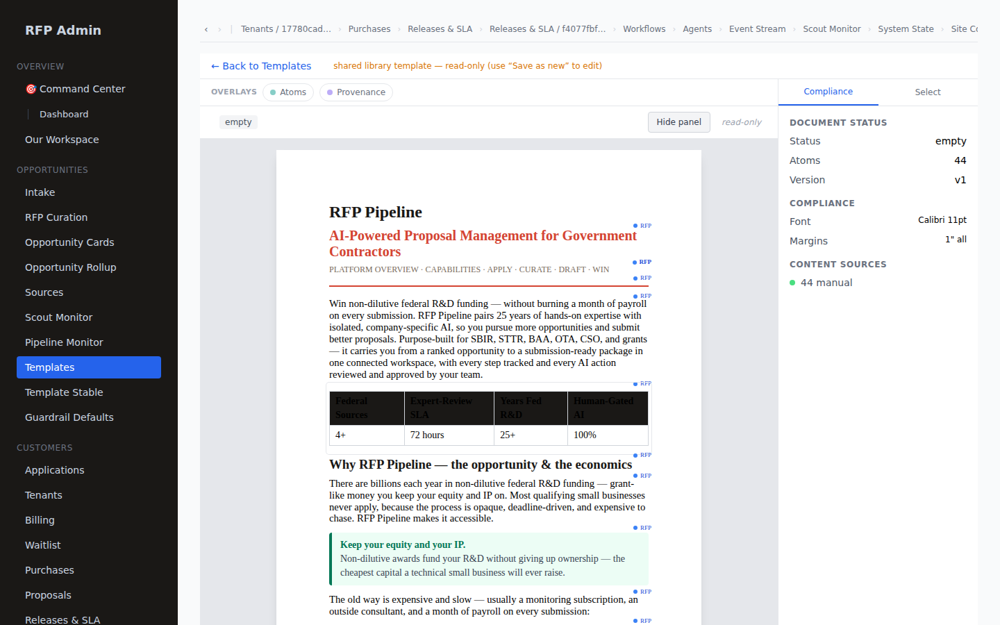
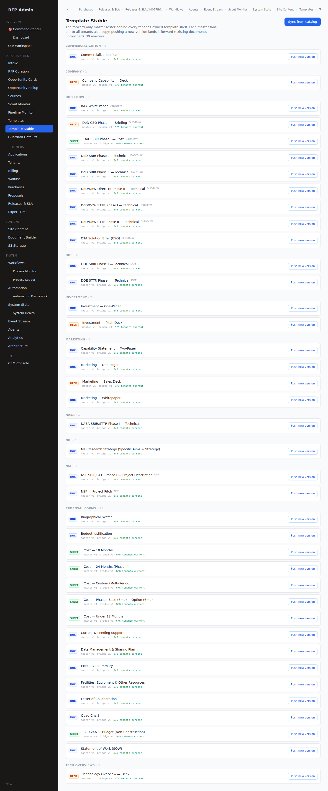
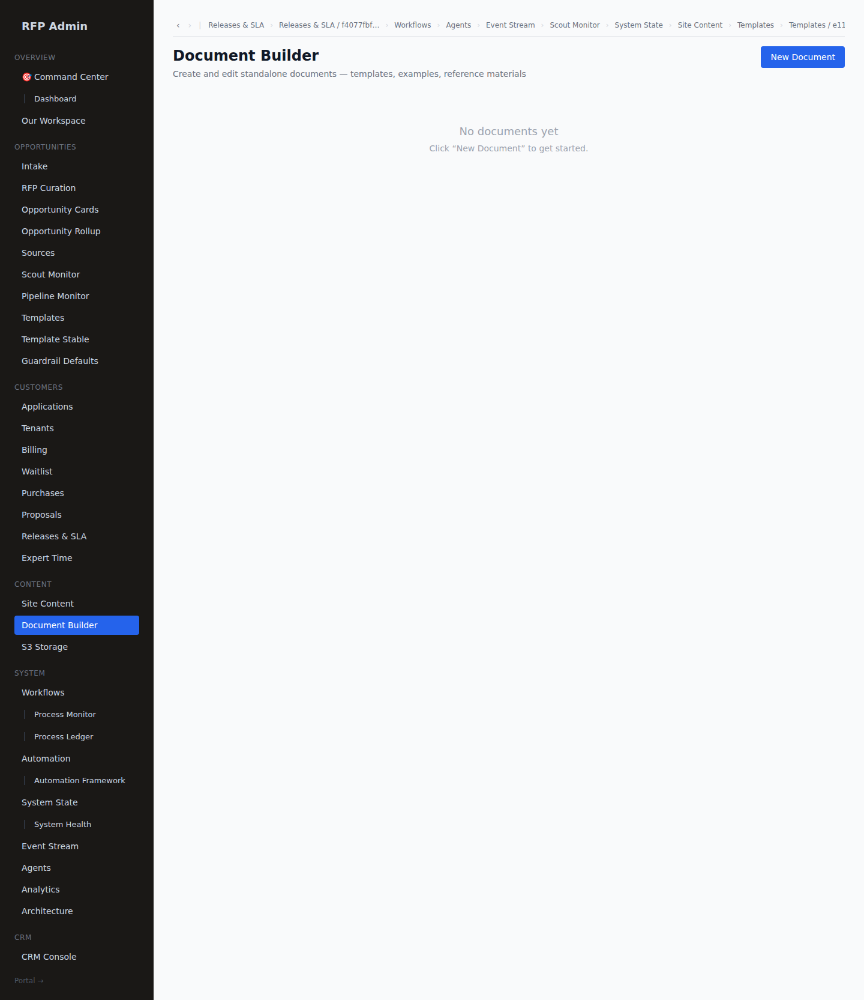
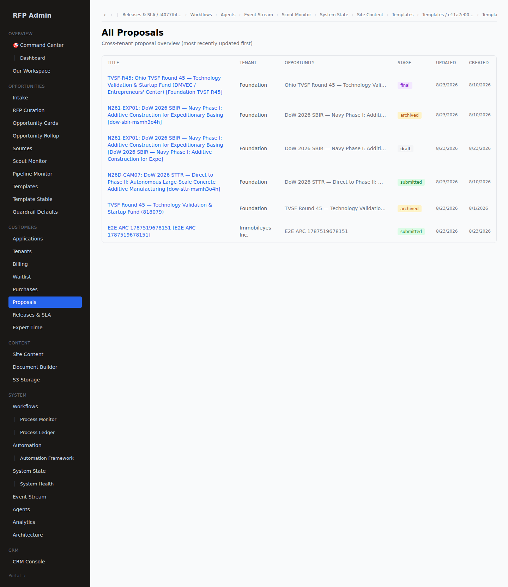
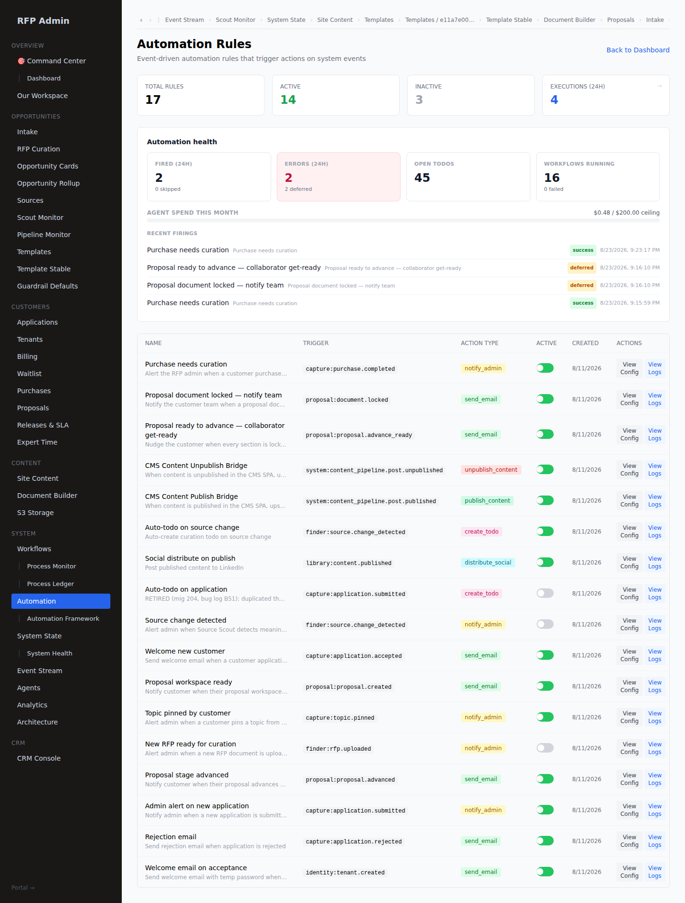

# RFP Admin Operations Guide

**For `master_admin` and `rfp_admin` — ingest, curate, release, and everything you author along the way.**

> **Every screenshot in this guide was taken from the running product**, driven as a real
> `master_admin` through the real login.
>
> Re-capture with `cd frontend && node scripts/capture-guides.mjs --only admin`. It visits every
> documented route as that actor and **fails the run** if a surface 404s, redirects somewhere the
> guide doesn't say, or renders an error boundary — including the two shapes that return HTTP 200
> while showing a red card (see §12.5). A figure here is a figure that harness produced on the
> current build.

---

## Contents

| Part | What it covers |
|---|---|
| **1 · Your console** | Bootstrap, the left rail, the Command Center |
| **2 · Customers in** | Applications → tenants |
| **3 · Solicitations in** | Sources, scouts, intake, upload, triage |
| **4 · Curation** | The workspace, the compliance matrix, provenance, topics |
| **5 · Authoring the skeleton** | Volumes, required items, molds — and the canvas you build them in |
| **6 · Release 1 — Spotlight** | Approve and push |
| **7 · Release 2 — the portal** | Purchase → cockpit → Complete & Release |
| **8 · The canvas, admin side** | Templates, the stable, the bridge, standalone documents |
| **9 · The oversight plane** | Workflows, agents, automation rules, events |
| **10 · Content** | Site content, the content queue |
| **11 · Onboarding a new admin** | Roles and what each can do |
| **12 · Daily ops, concepts, troubleshooting** | |

---

## What your job actually is

You are the expert human in the loop. The AI extracts text, proposes compliance values, and drafts
prose — but **you decide what reaches a customer**, and your curation quality sets the ceiling on
every proposal the system produces downstream.

Three architectural facts shape the whole job:

1. **One master, many mirrors.** There is one master opportunity on your side. It is mirrored to
   every customer as a denormalised card over a **forward-only bridge**. The only thing that flows
   back "up" is a **to-do** that routes you — as a shadow admin — down into one tenant to do work
   there.
2. **Two releases, not one.** Every opportunity is released **twice**: once to **Spotlight**
   (discovery — it becomes visible and ranked), and once as a **proposal portal** (build — the
   skeleton a buyer fills in). They are separate gates with separate work.
3. **Nothing crosses tenants.** Not reads, not writes. Templates, opportunities and starter content
   move **by copy into a tenant**, never as a shared object two companies both point at. When you
   see a "read-only, use Save as new to edit" banner on a shared template, that is this rule
   showing its face.

Design references: [`MASTER_MIRROR_OPP_DESIGN.md`](./MASTER_MIRROR_OPP_DESIGN.md) ·
[`INGEST_PROVENANCE.md`](./INGEST_PROVENANCE.md) ·
[`PROVISIONING_WORKSPACE_DESIGN.md`](./PROVISIONING_WORKSPACE_DESIGN.md) ·
[`TEMPLATE_BRIDGE_DESIGN.md`](./TEMPLATE_BRIDGE_DESIGN.md).

### Pricing (launch target: August 2026)

| Product | Price | Notes |
|---|---|---|
| Spotlight | **$499/mo** | 3-month minimum |
| Proposal portal — Phase I | **$1,999** | per portal |
| Proposal portal — Phase II | **$4,999** | standalone |
| Proposal portal — Phase II (linked) | **$3,999** | when a linked Phase I is already in the system + library |

Founding-cohort buyers purchase with the **comp code** — a $0 recorded purchase. Live self-serve
Stripe checkout is descoped for now.

---

# Part 1 · Your console

## 1.1 Bootstrap

The `master_admin` account is created when the pipeline service first boots. It prints a temporary
password **once**, to the boot logs:

```
================================================================
[seed] BOOTSTRAP: master_admin user created
[seed] email:    eric@rfppipeline.com
[seed] password: <16 random chars>
[seed]
[seed] Use these credentials ONCE at /login.
[seed] You will be forced to set a permanent password
[seed] on first sign-in. This is the only time this
[seed] temp password will ever be printed.
================================================================
```

Sign in at `/login`, set a permanent password (12+ characters), then go to `/admin/dashboard`.

If the temp password is lost: delete the user row and restart the pipeline service; a new one is
generated and printed.

## 1.2 The left rail


| Group | Items |
|---|---|
| **Overview** | Command Center · Dashboard · Our Workspace |
| **Opportunities** | Intake · RFP Curation · Opportunity Cards · Opportunity Rollup · Sources · Scout Monitor · Pipeline Monitor · Templates · Template Stable · Guardrail Defaults |
| **Customers** | Applications · Tenants · Billing · Waitlist · Purchases · Proposals · Releases & SLA · Expert Time |
| **Content** | Site Content · Document Builder · S3 Storage |
| **System** | Workflows (Process Monitor · Process Ledger) · Automation (Automation Framework) · System State · System Health · Event Stream · Agents · Analytics · Architecture |
| **CRM** | CRM Console |

## 1.3 The Command Center


`/admin/command` — "what changed since I last looked" across everything above, with an unread
watermark. The fastest way back in after a day away, and the first thing on the daily checklist.

---

# Part 2 · Customers in

## 2.1 Applications

`/admin/applications`


Each submitted application raises **exactly one typed to-do**, which is closed by accepting or
rejecting — you don't close it separately.

Review, per application: company identity (legal name, UEI/DUNS, CAGE), SAM registration, size and
years in business, tech focus areas, target agencies and program types, past performance, and what
they want out of the platform.

**Accept** creates the tenant, the `tenant_admin` user, and a temporary password, and mirrors the
current card river into their new workspace so their feed isn't empty on day one. **Reject** closes
the to-do and sends the rejection.

## 2.2 Tenants


`/admin/tenants` — who is on the platform and their licence state.


The detail page is where you descend into a tenant as a shadow admin, and where **licence slumber**
(archiving a tenant) is applied — a reversible state that darkens every surface for them and
cascades to their workflows, without touching a single proposal.

## 2.3 Purchases


`/admin/purchases` — every paid and comped build, with its promo code. A comped build records a
**$0 audited purchase row** and emits the same `capture:purchase.completed` event a paid one does,
so a comp audits exactly like a sale.

---

# Part 3 · Solicitations in

There are four ways a solicitation reaches your triage queue, and they are four tabs with live
counts across the top of the curation page:

> **Sources** (*where we look*) · **Scout Monitor** (*what we found*) · **Intake** (*staged for
> reading*) · **RFP Curation** (*read & approved*) · **Opportunity Cards** (*live for tenants*)

## 3.1 Sources — where we look



`/admin/sources` — the crawl targets and the notes and instructions attached to each. A detected
change on a watched source raises a curation to-do automatically.

## 3.2 Scout Monitor — what we found


`/admin/scouts` — one review→release queue for everything the scouts surface: crawler leads and the
HITL source-scout's extracted opportunities. Each finding is deterministically classified **NEW vs
UPDATE** against what you already hold, and you either:

- **Release as new** → it becomes a staged intake, or
- **Release as update** → it is logged as an amendment on the matched opportunity, or
- **Dismiss** it.

Scout findings are **advisory and injection-fenced**: text a crawler pulled off the open web is
never treated as an instruction. See [`SCOUT_INTAKE_QUEUE.md`](./SCOUT_INTAKE_QUEUE.md).

## 3.3 Intake — staged for reading



`/admin/intake` — solicitations staged and awaiting a read. Releasing a scout finding as new lands
here, and so does a manual upload.

Staging an intake emits `finder:opportunities.detected`, which wakes the **opportunity scout** — it
reads the current backlog, prioritises triage, and raises a `triage_new_opportunities` to-do plus an
email. Advisory, guardrail-gated, and it never decides anything on its own.

## 3.4 Upload by hand


`/admin/rfp-curation` → **+ Upload RFP**. Add one or more PDFs per solicitation. For each file the
system stores the PDF to object storage, creates or links an **opportunity**, creates a
**curated solicitation** record and a **solicitation document** row, and queues a **shredder job**
for text extraction.

The shred is asynchronous. The upload form **polls readiness** rather than racing it, which matters
for the next step.

## 3.5 Triage


`/admin/rfp-curation` is where a shift starts. Top to bottom:

1. **The four intake stages** as tabs with live counts (above).
2. **Your To-Dos** — the admin inbox, inline, with an overdue count. Each row is typed and carries
   its route: a *Proposal setup* task shows *Purchases → Curate & release → Draft sections → Review*
   with **Open →** / **Approve · Done** / **Dismiss**; a *Broadcast note* shows *Read →
   Acknowledge*; an *Application triage* shows *Approve · Done* / **Dismiss**; a *Content review &
   publish* shows *Draft → Review → Publish*. **This is the single completable admin inbox** — you
   do not go hunting for work on other screens.
3. **RFP Triage Queue** — a status filter, **Refresh**, and columns **Title · Source · Agency ·
   Status · Namespace · Ingested · Actions**. A `new` row carries **Claim**.

| State | Meaning | Actions |
|---|---|---|
| `new` | Just arrived, nobody owns it | Claim · Dismiss |
| `claimed` | You own it; curation in progress | Open workspace |
| `in_review` | Curation complete, under review | Approve · Reject |
| `approved` | Ready to push | Push to Spotlight |
| `pushed` | Live on customer feeds | Monitor |
| `dismissed` | Not relevant, hidden | Can be re-claimed |

Only a **claimed** solicitation can be curated.

---

# Part 4 · Curation

**This is the most important screen in the system.**


It is one scrolling page: release gates at the top, a two-column body, and the source PDF reachable
from the Section Rail rather than pinned beside you.

| Band | What it is |
|---|---|
| **Spotlight-match summary** ⭑ | The plain-language "why this matches", first-passed from the shred. **Required before release** — while it is empty the page says *"Summary empty — push will be blocked."* Editable after release; saving re-fans every tenant's mirror card. |
| **Expert note** `Customer-visible` | A short note shown on every tenant's card — *"Component instructions expected in Amendment 3 — page limits may tighten."* |
| **Ingest Studio** | The shred state — *Not started* / *Source text not ready* — with **Show gates** |
| **Title bar** | Title, agency, program, plus **✨ Ingest Assist**, **Assess readiness**, **Shred audit**, and the status chip |
| **Amendments** | *"Log a compliance-affecting change, then confirm to notify affected tenants"* + **Log amendment** |
| **Curation notes** | Internal. Never customer-visible. |
| **Tabs** | Documents · Topics · Compliance · Customer Interest |
| **Claim** | Take ownership |

The body, in two columns:

- **Left** — Source Documents (typed upload with a Primary flag) · Source Text (what the shredder
  actually read) · Topics · Response Volumes · Opportunity Description
- **Right** — Compliance Matrix · Metadata (namespace, solicitation number, close and posted dates,
  claimed/curated/approved by) · Activity
- **Bottom** — Customer Interest

## 4.1 The compliance matrix

The matrix captures every requirement from the RFP as a structured, named rule. It is a **fixed
list**, not free-form categories:

> *Page Limit (Technical)* · *Page Limit (Cost)* · *Font Family* · *Font Size* · *Margins* ·
> *Line Spacing* · *Header Required* · *Header Format* · *Footer Required* · *Footer Format* ·
> *Submission Format* · *Slides Allowed* · *Slide Limit* · *TABA Allowed* · *PI Must Be Employee* ·
> *Partner Max %* · *Clearance Required* · *ITAR Required*

An unfilled rule shows an em dash.

**To fill one by hand:** select the text in the source that states the requirement, and a tag
popover appears — pick an existing variable or add a new one. The highlighted text becomes the
value, and a **source anchor** is captured automatically: document, page, excerpt, character
offsets.

## 4.2 Ingest Assist, and the rule behind it

**Ingest Assist** fills the matrix from the shredded source. Every field records **how** it was
filled, and the badge tells you:

| Provenance | Badge | Meaning |
|---|---|---|
| `pattern_match` | **Read from source** | A deterministic, key-free extractor lifted an unambiguously-stated rule and cited it — rule, page, excerpt, character offset, and which document |
| `ai` | **Read from source** | The model read it out of the text |
| *deferral* | **Set elsewhere** | The source explicitly points somewhere else (*"the page limit lives in the Component-specific instructions"*). The default is **cleared**, and the citation is shown |
| `default` | **Default — unverified** (red) | Nobody read this. It is a guess |

**The non-negotiable behind all of it: a value the product did not read from the solicitation must
never look like one it did.** Trust order is `hitl > verified > override > pattern_match > ai >
default`.

Two behaviours follow from it that are worth knowing precisely:

- **Absence is a finding.** A deferral does not fall back to a plausible number. It clears the
  default and says *"Set elsewhere"* with the citation. A fabricated page limit is worse than a
  blank one.
- **Assist refuses an unshredded solicitation** — `409 SOURCE_TEXT_NOT_READY` — rather than
  inventing a skeleton from nothing. There is an explicit opt-in if you genuinely want a default
  skeleton, and it is explicit precisely because it produces unverified values.

**When you see a suggestion: Accept if correct, Correct if wrong.** Every correction is written to
curation memory under `{agency}:{program_office}:{type}:{phase}` and pre-fills the next solicitation
from that program. The first few from an agency need real work; by the tenth, Assist handles most
of it.

> **Check the badges before you push.** Every red *"Default — unverified"* is a value nobody read
> from the source. Fix it, or accept it knowingly — but do not let it ride unseen into a customer's
> compliance matrix, because that is the number their export gate will enforce.

## 4.3 Topics

A solicitation may contain many topics; each is a pursuable opportunity a customer sees.

The Topics card offers **Manage Compliance · Extract Topics · Import all topics from source · Bulk
Import · + Add Topic**, plus a drop zone — each dropped file becomes a topic under this
solicitation.

- **SBIR/STTR BAAs** carry dozens or hundreds of topics: use extraction plus bulk import, then
  review for accuracy.
- **CSOs** are usually one broad topic: create it by hand.


## 4.4 Customer Interest

The **Customer Interest** tab shows which tenants **pinned** this solicitation's topics — pin date,
whether they purchased a portal, and build stage. It reads the live opportunity-card spine, so it
tells you what customers are actually waiting on. Use it to prioritise.

## 4.5 Amendments

When a solicitation changes, **Log amendment** captures the change; confirming it fans an
acknowledgement to-do out to every affected build, with a diff of what changed. Customers
acknowledge; you can see who has and who hasn't.

---

# Part 5 · Authoring the skeleton

This is **Release 2** work, and it is the part that most determines what a customer's first draft
looks like. It is built **once on the master solicitation** and **reused by every buyer**.

## 5.1 Volumes and required items

A **volume** is a submission component; a **required item** is a section within it.

A typical SBIR Phase I:

| Volume | Required items |
|---|---|
| Technical Volume | Executive Summary · Technical Approach · Schedule & Milestones · Key Personnel · Facilities |
| Cost Volume | Cost Breakdown · Budget Justification · Subcontract Costs |
| Supporting | Cover Sheet · DD Form 2345 · Commercialization Plan |

For each item you set the name, the page limit, and the format instructions. These become the
customer's proposal sections at provision.

## 5.2 Molds — the blank formatted section

A required item can carry a **mold**: a blank but fully formatted document that already obeys the
guardrails — font, margins, page limit, item type. So *"1-page technical summary"* is not a note in
a table; it is a real one-page Word document with the right font and the right footer, waiting to be
filled.

Link a `document_template` to a required item and attach an **expert note**. At provision the mold
is interpolated per tenant (`{company_name}` → their name) into each of their sections.

Build this any time in advance. If it is not done when the **first** portal is purchased, the 72-hour
SLA clock (Part 7) is what you are racing.

## 5.3 Cost volumes are computed, not typed

The cost/budget volume is generated by one deterministic burden engine and then rendered in whatever
**common government form** the solicitation requires:

| Form | Used by |
|---|---|
| `burden_waterfall` | DoD / DoW SBIR and STTR |
| `sf424a` | NSF, DOE, and grants.gov programs |
| `otf_state_budget` | Ohio TVSF and state EDA programs |

Direct labour → fringe → overhead → other direct costs / subcontracts → G&A → fee, computed to the
cent, with the totals recomputing from whatever the customer types into the input rows. Readiness
rolls up the computed price and the work split. Canonical:
[`COST_VOLUME_FORMS.md`](./COST_VOLUME_FORMS.md).

## 5.4 Assess readiness

**Assess readiness** on the title bar runs the ingest manager over the solicitation: it reads the
current ingest state, infers the stage, and plans which specialist agents to run next. It is
advisory, injection-fenced, platform-scope, and it **never descends into a tenant**. See
[`ADMIN_AGENT_DESIGN.md`](./ADMIN_AGENT_DESIGN.md).

---

# Part 6 · Release 1 — Spotlight

1. **Request Review** → `in_review`
2. Check the package: is the matrix filled and are its badges honest? Are the topics accurate and
   correctly numbered? Do the volumes and required items match the RFP? Do the source anchors point
   at the right pages?
3. **Approve** → `approved`
4. **Push to Spotlight** → live


`/admin/opportunities` is the master list behind every tenant's mirrored cards.

**On push:** every topic becomes visible on customer feeds, scored against each customer's profile,
and ranked within each of their buckets.

> **The push gate.** Push is blocked without a non-empty **spotlight summary** and a
> **submission format**. Those are the two things a customer cannot work without, so they are the
> two the gate insists on.

> **This is discovery only.** Push does **not** build the proposal skeleton. That is Release 2
> (Part 5 and Part 7), built once on the master and reused per buyer.

---

# Part 7 · Release 2 — the proposal portal

## 7.1 The flow

1. **The customer buys.** They pin the card, click **Build →**, and enter the comp code. That opens
   a portal at `curation_pending` with a **72-hour SLA**, writes a **$0 completed purchase** row,
   grants a **shadow-admin** row, emits `capture:purchase.completed`, and parks a 72-hour
   `proposal_setup` to-do for you. Their portal shows *"Waiting for RFP Expert Curation"* and a live
   countdown.

2. **Work the to-do.** It appears in **Your To-Dos** on `/admin/rfp-curation` with its route
   (*Purchases → Curate & release → Draft sections → Review*) and deep-links to the provisioning
   cockpit.

3. **The provisioning queue** — `/admin/provisioning` (**Releases & SLA** in the rail), sorted by
   time remaining.

   

4. **The cockpit, per buyer** — `/admin/provisioning/{portalId}`. This is the screen that lands the
   SLA.

   

   It shows the buyer, a **live SLA countdown**, and the master **build-out readiness bar**
   (compliance filled · at least one volume · at least one required item), deep-links into the
   authoring workspace, and ends in one two-outcome **Complete & Release**:

   | Step | What it does | Whose |
   |---|---|---|
   | **1 · Complete build-out** | Marks the *master* built out and broadcasts an `updated` fan-out to **every** tenant's mirror card (`provisionReady = true`) | The shared master — everyone watching that opportunity learns it is ready |
   | **2 · Provision & release** | Provisions **this** buyer's private portal, flips `curation_pending → launched`, and kicks off their workflow | The private portal — continuity belongs to them alone |

   If you built the skeleton in advance, step 1 is a **short review**. If not, build it now — the
   clock covers **skeletoning only**, never the customer's drafting.

5. **What provisioning creates.** A `proposals` row, a `proposal_artifacts` row per volume, a
   `proposal_sections` row per required item, and a **per-tenant compliance matrix** with every row
   at `not_addressed` — with the molds interpolated into the sections. The section drafter then
   auto-drafts. This is **V0**: the instantiated skeleton. Emits `capture:workspace.released`.

6. **The buyer accepts their workflow.** Release also raises a **required tenant Workflow Setup**
   to-do. Until their `tenant_admin` presses **Accept & Start**, the build has no live stages. See
   the customer guide's Part 4.2 for the screen they see.

7. **The customer builds V0 → V0.5 → V1.**

## 7.2 The version model

| Stage | What it is | Clock |
|---|---|---|
| **→ V0** | Skeleton instantiated for the tenant — matrix, molds, guardrails, blank | The 72 hours (skeletoning only) |
| **V0 → V0.5** | Library plug-and-play — their atoms into the molds → a real first draft | None |
| **V0.5 → V1** | Draft, compliance, finalise. **Force-advance to V1** available | None |

## 7.3 The second buyer is fast

Because the skeleton is built once on the master and reused per tenant, a second customer who buys
the same opportunity skips the build entirely — the molds already exist, so it is a fast release
straight to V0.

## 7.4 Comping a build

On a tenant's Portals page (expert view) **Approve free portal** comps a paid build: it records a
**$0 audited purchase** (`metadata.grant='admin'`, emitting `capture:purchase.completed`) and opens
the workspace — auditing exactly like a real purchase. It validates that the opportunity exists
*before* writing anything, so a bad id cannot orphan a build. It is the only manual portal-create
form, and it is admin-gated; customers always go through the comp-code purchase.

## 7.5 Your role during the build

The shadow admin bootstraps (draft, lock, force-advance). The intended end state is
**mostly customer-executed** through their own accepted workflow plan — stage gates, per-to-do
owners, nudges.

Agent coverage as shipped: `section_drafter` auto-drafts on release, `compliance_reviewer` runs
inline in the AI route, and `color_team_reviewer` runs off the advance queue.

---

# Part 8 · The canvas, admin side

The customer's canvas and yours are the same canvas — one document model, three surfaces (fluid
pages · slides · grid). See the customer guide, Part 5, for the surfaces themselves. This part is
what is *different* about authoring from the admin plane.

## 8.1 Templates — the shared catalog



`/admin/templates` — the shared skeletons: agency volumes (DoD/DoW SBIR and STTR, NSF, DOE, NASA,
NIH), federal forms (SF-424A, budget justification, biographical sketch, current & pending support,
data management plan), collateral (one-pagers, whitepapers, sales decks), and cost forms for every
common period of performance.

## 8.2 The template canvas — and why it's read-only



Opening a shared template shows the banner:

> **shared library template — read-only (use "Save as new" to edit)**

That is the cross-tenant rule enforced at the editor. The catalog row is a **source shelf**, not a
document anyone edits in place. "Save as new" makes a copy, and you edit the copy.

Everything else is the familiar canvas: the overlay chips, the page at real dimensions, the
provenance gutter marking each block's source, and the compliance sidebar showing the template's
status, atom count, version, and its declared font and margins.

## 8.3 The template stable and the bridge



`/admin/template-stable` is where a master template is **published**, and publishing fans it
**forward-only** onto every tenant's template card shelf.

The direction matters. A tenant's card is not a window onto your master; it is a **copy** with its
own version. When you publish a new version:

- the refreshed skeleton lands on their shelf, and their card shows a **Refreshed** badge;
- **their existing documents are untouched** — nothing you publish rewrites work a customer has
  already done.

They can dismiss the badge, or use the new version to start a fresh document. Canonical:
[`TEMPLATE_BRIDGE_DESIGN.md`](./TEMPLATE_BRIDGE_DESIGN.md).

## 8.4 Standalone documents



`/admin/documents` (**Document Builder**) is the platform's own standalone documents — platform
overviews, cut sheets, capability decks, the material you send prospects.

Same canvas, same size checks. A document that declares itself a 2-page cut sheet is measured
against two pages, on save and at export, exactly like a customer's volume.

> **The editor route is not illustrated here, and the reason is worth recording.**
> `/admin/documents/{documentId}` is backed by the **object-storage document index**, not by a
> database table — the two document routes just happen to name the segment the same thing. The
> sandbox this guide is captured from has an empty admin document store, so the capture run reports
> the route as **not addressable** rather than shooting something. An earlier pass *did* shoot it,
> by handing it a database id: the page rendered a red **"Document not found"**, the harness scored
> it a clean 200, and the picture sat in this section captioned as a working canvas until someone
> looked at it. Both harnesses now share one definition of "this page is broken" and both catch it.

## 8.5 Watching a customer's build



`/admin/proposals` is every build on the platform, with its stage and its readiness. From here you
can open one as a shadow admin — and the **Proposal Auto-Drive doorbell** on `/admin/agents` (§9.2)
fires the same full-draft the customer's own button does, recorded as `source='admin_doorbell'` so
the two are distinguishable in the audit trail.

The **Proposal Studio** breaks that engine into three gated loops — **Draft → Refine → Compliance**.
Each lands in review, then a simple gate where you either comment and regenerate (comments thread
through as guidance) or approve and move on. Or run all three automatically. It is advisory
throughout: it never advances a stage, locks, or submits.

---

# Part 9 · The oversight plane

## 9.1 Workflows


`/admin/workflows` — three things on one screen:

- **Workflow Map** — every template as a dependency graph, grouped by the two spines (discovery ·
  build) plus platform
- **Live instance graphs** — the same DAG with a per-step status overlay for a running instance
- **A sortable, filterable monitor** with a Live mode

Operator detail, including how to instantiate one and how to unstick a paused instance:
[`WORKFLOW_ADMIN_GUIDE.md`](./WORKFLOW_ADMIN_GUIDE.md).

## 9.2 Agents


`/admin/agents` — the roster of every archetype, with per-tenant usage carried over the forward-only
bridge. The **Proposal Auto-Drive doorbell** lives here.

The non-negotiables, one line each:

- A tenant-space agent is **tenant-bound**. Its tool schemas do not even expose a tenant id.
- Its output is **advisory** and lands only through a guardrail, into review.
- Untrusted tenant content is **injection-fenced**.
- The runtime bounds runaway work (rounds, cost, rate, budget) and **never dead-ends a workflow** —
  a broken step safe-skips rather than hanging the build.

Full contract: [`AGENT_WORKFORCE.md`](./AGENT_WORKFORCE.md).

## 9.3 Automation rules



`/admin/automation` — the event-driven rules that turn system events into actions. The page carries:

- **Counts** — total rules, active, inactive, executions in the last 24 hours
- **Automation health** — fired and skipped, **errors and deferrals**, open to-dos, workflows
  running and failed
- **Agent spend this month**, against its ceiling
- **Recent firings**, each stamped `success` / `deferred`
- **The rule table** — name, the **trigger event type** (`capture:purchase.completed`,
  `proposal:document.locked`, `finder:source.change_detected` …), the **action type**
  (`notify_admin`, `send_email`, `create_todo`, `publish_content`, `distribute_social` …), an
  **active toggle**, and **View Config** / **View Logs**

A retired rule stays in the table with its toggle off and its reason in the description, rather than
disappearing — so "why doesn't this fire any more" has an answer on the screen.

## 9.4 Events


`/admin/events` — filter by **namespace**, **phase**, free-text **type**, and a window (1h / 6h /
24h / 7d / 30d). **Live** polls.

**The phase column is the start/end bracket.** A long-running operation writes **two rows of the
same type** — a `start` and an `end` — and the `end` carries the duration. A one-shot like
`identity.user.logged_in` is `single`. The phase is never baked into the type name. Every payload
carries a `correlationId`, so a whole operation can be pulled back together.

| Event | What it means |
|---|---|
| `capture:application.submitted` | New customer applied |
| `capture:application.accepted` | Accepted → tenant + user created, card river mirrored |
| `library:file.uploaded` | Customer uploaded documents |
| `library:document.atomized` | Documents atomized into the library |
| `capture:topic.pinned` | Customer pinned a card |
| `capture:purchase.completed` | Portal purchased (or comped) |
| `capture:workspace.released` | Portal released → workspace provisioned (V0) |
| `proposal:section.saved` | Customer saved canvas content |
| `finder:solicitation.claimed` | Admin claimed an RFP |
| `finder:solicitation.pushed` | Admin pushed to Spotlight (Release 1) |
| `finder:annotation.saved` | Admin saved a compliance value or annotation |

> **Namespaces** are `finder` (admin) · `capture` (customer) · `identity` (auth) · `proposal` ·
> `library` · `system` · `tool`. Never `admin`, `cms`, or `spotlight`. Full contract:
> [`EVENT_CONTRACT.md`](./EVENT_CONTRACT.md).


`/admin/system-state` is the infrastructure view; `/admin/analytics` has the roll-ups.

---

# Part 10 · Content


`/admin/site` — everything front-facing, in one versioned store: **documents** (blog posts,
resources, guides, testimonials, team members) and **dynamic pages** (the page-block editor), on a
draft → publish → archive lifecycle.

Content is authored **canvas-native**: the CanvasDocument is the source of truth, and the public
HTML body is projected from it on save. So the same editor you use for a proposal section writes the
marketing site. Design: [`CONTENT_STUDIO_DESIGN.md`](./CONTENT_STUDIO_DESIGN.md).

Drafts queued by the content agents arrive as a **Content review & publish** to-do in your inbox —
draft-gated, so nothing is public until you publish it.

---

# Part 11 · Onboarding a new RFP admin

To bring on an expert as an `rfp_admin`:

```sql
-- Generate a bcrypt hash of a temp password first, e.g.
--   python3 -c "import bcrypt;print(bcrypt.hashpw(b'TempPass123!', bcrypt.gensalt(12)).decode())"

INSERT INTO users (email, name, role, password_hash, is_active, temp_password)
VALUES ('expert@example.com', 'Expert Name', 'rfp_admin',
        '$2b$12$[paste the bcrypt hash here]', true, true);
```

| `rfp_admin` can | `master_admin` only |
|---|---|
| Everything in this guide — upload, curate, approve, push, provision, monitor | System configuration and capacity settings |
| View and manage all solicitations and customer data | User management (creating and deactivating users) |
| | Deployment settings |
| | Database migrations |

Then: send them the temp password, they log in and are forced to `/change-password`, walk them
through this guide, and give them their first solicitation to claim.

### The other admin-adjacent roles

| Role | Reach |
|---|---|
| `partner_admin` | A **partner manager** — an EconDev organisation running a stable of client companies from the owner-scoped `/partner` console. Ranks *below* `rfp_admin` and has **no `/admin` reach**. New companies go through your approval; existing ones via a manager-request handshake. See [`PARTNER_MANAGER_DESIGN.md`](./PARTNER_MANAGER_DESIGN.md) |
| `tenant_admin` | Manages one tenant, invites the team, buys portals |
| `tenant_user` | Access per their admin's grant |
| `partner_user` | Stage-scoped, per proposal — view, comment, or edit |

---

# Part 12 · Daily operations

## 12.1 The checklist

```
Morning:
  [ ] /admin/command — what changed since you last looked
  [ ] /admin/rfp-curation — work Your To-Dos down, oldest overdue first
  [ ] /admin/provisioning — anything on the SLA clock, sorted by time remaining
  [ ] /admin/applications — accept or reject (this closes their to-do)
  [ ] /admin/scouts — release or dismiss what the scouts found overnight

Curation block (1–2 hours):
  [ ] Claim new solicitations
  [ ] Run Ingest Assist, then CHECK THE BADGES — every red "Default — unverified"
      is a value nobody read from the source. Fix it, or accept it knowingly.
  [ ] Add topics (manual or extracted)
  [ ] Define volumes and required items — the reusable master skeleton
  [ ] Attach molds to the required items that need real formatting
  [ ] Write the spotlight-match summary (push is blocked without it)
  [ ] Push completed solicitations to Spotlight

Monitoring:
  [ ] /admin/events, phase=error — anything that started and did not finish
  [ ] /admin/workflows — any instance paused or failed
  [ ] /admin/automation — errors and deferrals in the last 24h; agent spend vs ceiling
  [ ] Verify recently pushed solicitations actually appear on tenant cards
  [ ] Review AI compliance suggestions — every correction trains the next one

Weekly:
  [ ] Upload new solicitations from SAM.gov, SBIR.gov, Grants.gov
  [ ] Archive expired solicitations
  [ ] Review customer activity for engagement patterns
```

## 12.2 Key concepts

| Term | Definition |
|---|---|
| **Solicitation** | The parent document — a BAA, CSO, or RFP containing one or more pursuable topics |
| **Topic** | A specific opportunity within a solicitation |
| **Compliance matrix** | Structured extraction of every requirement, each linked to its source |
| **Source anchor** | Provenance from a compliance value back to the exact page, excerpt and character offset |
| **Provenance** | *How* a value was filled — `pattern_match` / `ai` / *deferral* / `default` — and what the badge says about it |
| **Curation memory** | Every correction, stored as episodic memory and used to pre-fill the next solicitation from the same agency and program |
| **Volume** | A required submission component |
| **Required item** | A section within a volume |
| **Mold** | A blank but fully formatted document attached to a required item, carrying the guardrails |
| **Atom** | A reusable content unit in a customer's library |
| **Canvas** | The document model everything is written in — typed nodes on a page geometry |
| **Bridge** | The forward-only path from a master record to per-tenant copies. Carries messages; moves data by copy |

## 12.3 Troubleshooting — a customer can't see pushed topics

1. Is the solicitation in `pushed` state?
2. Does the customer's profile match — tech areas, agencies, programs?
3. Were topics actually added to the solicitation?
4. Is their tenant active (not in licence slumber)?

## 12.4 Troubleshooting — an uploaded PDF won't display

The viewer loads from object storage. Check `/api/health` for connectivity, check the document row
exists for the solicitation, and check the key exists in the bucket.

## 12.5 Troubleshooting — a page looks broken but the URL is fine

**Two failure shapes render as a red card while the server reports HTTP 200**, because they throw in
the browser rather than on the server:

- **"Something went wrong — this page failed to load."** A React component threw. **Nothing will be
  in the server log.** Reload once; if it repeats it is a defect on that route with that data —
  capture the browser console and file it.
- **A page that renders and then blanks.** A hydration mismatch: the server and the browser produced
  different text for the same element.

Both were live in this codebase until a guide pass drove the pages and *looked at them*. A status
code cannot catch either. `cd frontend && node scripts/verify-surfaces.mjs` drives every page under
`/admin` and `/portal/{slug}` as the right actor and fails on either shape — run it after a deploy.

## 12.6 Troubleshooting — an action seemed to do nothing

Admin actions that used to fail **silently** now surface an **inline error**. If a click appears to
no-op, look for the red message and retry — the write did not happen. This covers **Accept & Lock /
Lock volume / Lock all / Force-advance** on a proposal, editing a **spotlight-match summary**,
saving **guardrail defaults**, and saving **source notes and instructions**. Customer card actions
(pin, unpin, resync) behave the same way.

## 12.7 Troubleshooting — Ingest Assist won't run

If it returns `409 SOURCE_TEXT_NOT_READY`, the shred has not finished — that refusal is deliberate,
not a bug. Check the pipeline logs; the shredder needs the PDF in storage and a valid solicitation
record. If the service crashed mid-extraction, restart it and the job re-queues.

## 12.8 Troubleshooting — AI suggestions are wrong

Correct them. Each correction writes to curation memory keyed by
`{agency}:{program_office}:{type}:{phase}`. After correcting the same variable across two or three
solicitations from one agency, the pre-fill comes out right.

---

## Related

| Document | What it is |
|---|---|
| [`CUSTOMER_ONBOARDING_GUIDE.md`](./CUSTOMER_ONBOARDING_GUIDE.md) | The other side of this arc — what the buyer sees, and the canvas in full |
| [`WORKFLOW_ADMIN_GUIDE.md`](./WORKFLOW_ADMIN_GUIDE.md) | Instantiating, visualising and unsticking workflows |
| [`HITL_TODO_GUIDE.md`](./HITL_TODO_GUIDE.md) | Every to-do type, who raises it and who closes it |
| [`MASTER_MIRROR_OPP_DESIGN.md`](./MASTER_MIRROR_OPP_DESIGN.md) | The master + mirror architecture |
| [`INGEST_PROVENANCE.md`](./INGEST_PROVENANCE.md) | The provenance contract behind the badges |
| [`AGENT_WORKFORCE.md`](./AGENT_WORKFORCE.md) | The agent roster and its safety contract |
| [`EVENT_CONTRACT.md`](./EVENT_CONTRACT.md) | Namespaces, type format, start/end pairing |
| [`CANVAS_ARCHITECTURE.md`](./CANVAS_ARCHITECTURE.md) | The canvas, in full |
