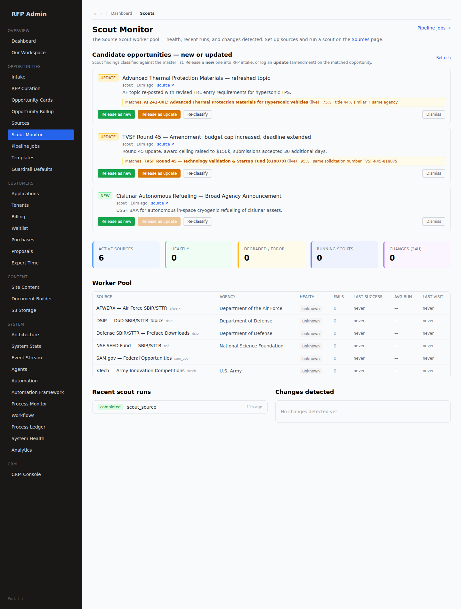
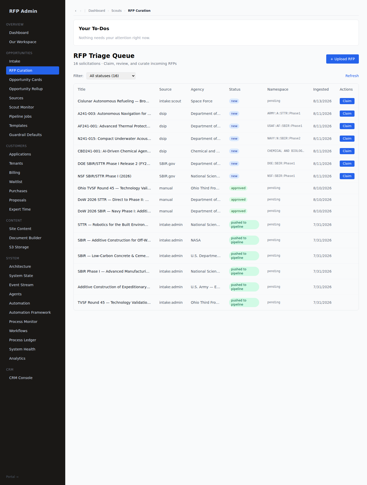

# Scout-Intake — the "potential NEW or UPDATED OPP" review→release queue (#176)

The head of the RFP river. Scouts DISCOVER opportunity leads; this queue is where an rfp_admin
decides, per lead, **new or updated**, and **releases** it into the right pipeline — or dismisses it.
Before #176 the leads dead-ended (displayed, never actionable) and nothing classified them.

## The two producers → one queue

Both scout producers now feed the single reviewable surface `scout_findings` (purpose in
`opportunity`/`both`), platform-scope (no tenant_id), forward-only:

| Producer | What it writes | How it reaches the queue |
|---|---|---|
| **Crawler worker** (`scout_sources`, mig 118) | `scout_findings` (purpose=opportunity) | writes directly; the `opportunity_scout` agent also reads these to advise |
| **HITL source-scout** (`source_profiles` → `source_diffs.extracted_opportunities`, mig 025) | Claude-extracted opportunities on a diff | `lib/tools/source-scout.ts` now calls `materializeExtractedOpportunities` → one `scout_findings` row per extracted opp (dedup_hash, injection-fenced), classified on arrival |

Previously the `source_diffs` extracted opps could only be "marked reviewed" and the crawler
`scout_findings` had **no admin UI at all**. Now they land in one queue with a decision attached.

## Classification — deterministic NEW vs UPDATE (`lib/scout/classify.ts`)

A pure, DB-free matcher scores a candidate against the existing `opportunities` master list and
picks the strongest signal. It is the **hard anchor**; the `opportunity_scout` agent's advisory
`possible_update` judgment (pipeline, human-gated) rides on top — it never overwrites the row.

Signals, strongest first:
1. **same source notice** (`source` + `source_id` both equal) → 0.98 — the same posting re-crawled
2. **same solicitation number** (normalized) → 0.95 — an amendment / re-post of a known solicitation
3. **identical title** (+ same agency) → 0.92 / 0.85
4. **fuzzy title** (token Jaccard; same-agency corroboration lifts it into the update band) → ≤0.9

Bands: `≥0.6` → **update** (match set) · `[0.4,0.6)` → **unknown** (possible match surfaced, admin
decides) · `<0.4` → **new**. Stored on the finding: `classification`, `match_opportunity_id`,
`similarity_score`, `match_reason`, `classified_at` (mig 175). Candidate text is UNTRUSTED — it is
only normalized + compared, never interpreted (proven by the injection-safety unit test).

## Release — routing to the right pipeline (`lib/scout/candidates.ts`)

| Action | Effect | Lands in |
|---|---|---|
| **Release as new** | `lib/intake.stageIntake` → staged `opportunity` (is_active=false) + `curated_solicitation` (status `new`) + `finder:opportunity.staged` | **RFP Triage Queue** → admin curates → releases (push to the bridge) |
| **Release as update** | `lib/amendments.logAmendment` on the matched opportunity's curated solicitation (status `detected`) | **Amendment review** → admin confirms → fan-out to every built proposal → tenant acks |
| **Dismiss** | `status='dismissed'`, outcome recorded | — |

Every finding then carries its OUTCOME: `status='pursued'`, `released_kind` (new/update),
`released_ref` (the intake opportunity_id or the amendment_id), `reviewed_by`/`reviewed_at`. Each
transition posts a `finder:candidate.{classified,released,dismissed}` `system_event` (tenantId=null),
so the whole chain is auditable + automatable. Release is **compare-and-swap** on `status IN
('new','reviewed')` — re-releasing a resolved finding is refused (idempotent).

## Surfaces

- **`/admin/scouts`** → "Candidate opportunities — new or updated" panel (`components/scout/candidate-queue.tsx`):
  each row shows the NEW/UPDATE badge, the matched opportunity + similarity, and Release-as-new
  (inline title/agency editor — agency is required to stage intake), Release-as-update (enabled only
  when matched), Re-classify, Dismiss. Resolved rows drop out.

  

  Above: two UPDATEs (TVSF R45 matched 95% by solicitation number; the AF thermal topic matched 75%
  by title-similarity + same agency — "Release as update" enabled) and one NEW (Cislunar BAA — no
  match, "Release as update" disabled). Releasing the NEW candidate as intake lands it at the top of
  the **RFP Triage Queue** (`source: intake:scout`, status `new`), proven via the real UI:

  
- **Routes** (rfp_admin | master_admin): `GET /api/admin/scout-review` (list), `POST
  /api/admin/scout-review/[findingId]` (`classify` | `release_new` | `release_update` | `dismiss`).

## Guardrails

Platform-scope, injection-fenced (candidate text is data), advisory landing (release stages a review
row — it never auto-pushes to the bridge or auto-confirms an amendment; a human still curates /
confirms). No tenant descent. Data-segregation untouched — findings are platform master data.

## Proof (live, `scripts/drive-scout-intake.mts`, all pass)

Seeded a genuinely-NEW finding, an UPDATE finding (matches the live TVSF Round-45 opp), and a noise
finding; drove all three to their terminal landing:
- NEW → classified `new` (0.21) → released → **curated_solicitation `new` in the Triage Queue** +
  staged opportunity `is_active=false`; finding `pursued`/`released_kind=new`.
- UPDATE → classified `update` via **same solicitation number `TVSF-R45-818079` (0.95)**, matched the
  correct live opp → released → **solicitation_amendment `detected`** on its curated solicitation;
  finding `pursued`/`released_kind=update`.
- NOISE → dismissed. Re-releasing a resolved finding is refused. Full `finder:candidate.*` audit
  chain present. Resolved findings drop from the default queue.

Backbone: `tsc` 0 · `vitest` 1085 pass (incl. 8 new classifier tests) · mig 175 applied.
