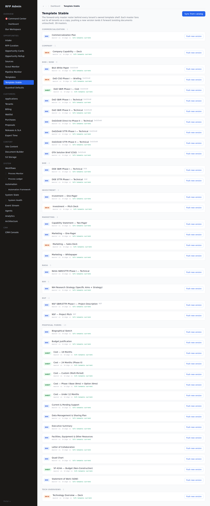
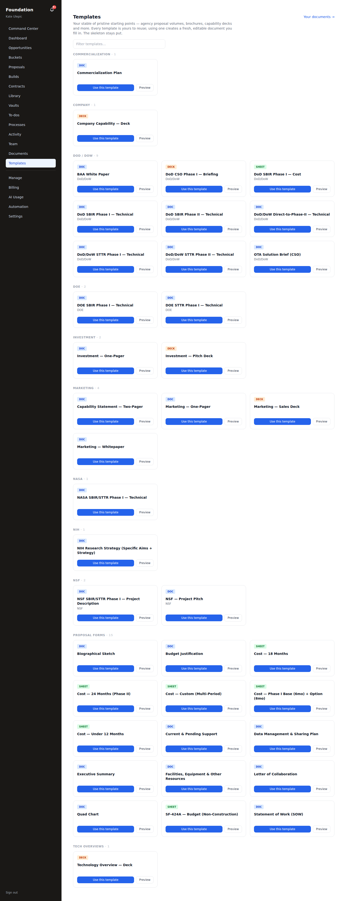
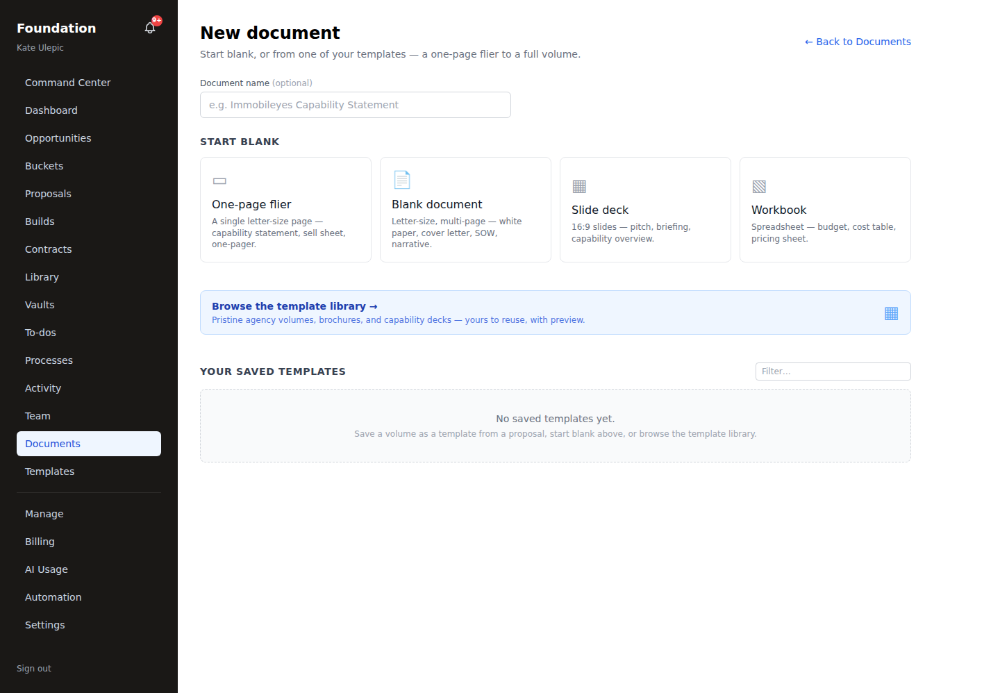
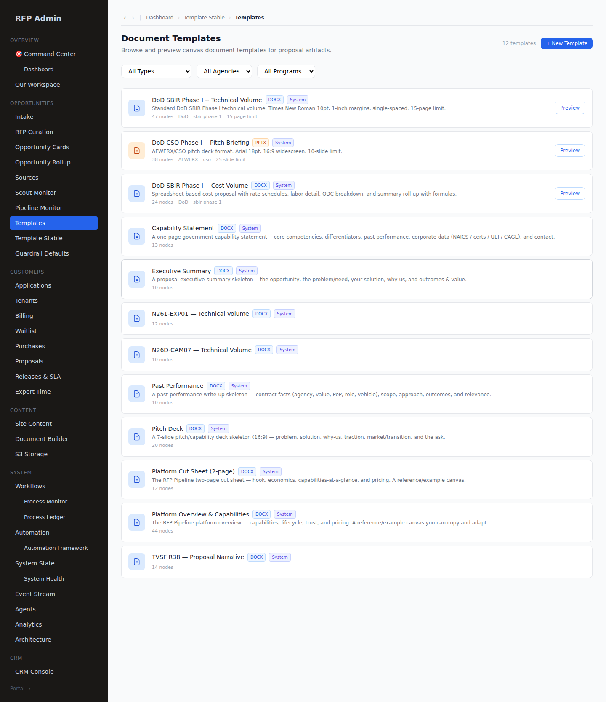

# Templates — launch walkthrough (#151)

Templates ("molds") are the structured canvas skeletons that pre-populate a proposal volume or a
standalone document with the right headings, tables, page and slide budgets, and `{merge_field}`
placeholders. **39 of them ship**, and this is where they live and how they get to a customer.

> **What changed since the first version of this document.** It described 18 molds reached from the
> tenant **New Document** chooser. Both halves went stale: the catalog grew to 39 (the whole
> `forms` category did not exist yet), and template-bridge Phase 5 deliberately **narrowed** the
> New Document chooser to the tenant's own *saved* templates. A reader following the old
> walkthrough was sent to a page where none of this appears. The surfaces below are captured live
> by `frontend/scripts/capture-templates.mts`, which fails if a page does not render or does not
> show what the tables hold.

---

## The chain, end to end

```
lib/templates/*.ts                 39 CanvasDocument builders
  → TemplateKey union              tsc enforces this one
  → TEMPLATE_MAP                   getTemplate(key) resolves a body
  → TEMPLATE_CATALOG               a human can SEE it
      → syncTemplateStableFromCatalog()        ← admin presses "Sync from catalog"
      → master_templates (39 active)           ← the master roster
      → forward-only bridge (mig 177/178)      ← publish / version-up, fan out
      → tenant_template_cards                  ← a COPY each tenant owns
      → "Use this template" → library_atoms / a new document
```

The bridge is the point. A tenant's shelf is **theirs** — a copy, taken at fan-out — so a customer
never reads a live shared object, and pushing a new master version never edits a document they have
already started. That is the same copy-inward rule the rest of the platform runs on
(docs/TEMPLATE_BRIDGE_DESIGN.md).

## What ships — 39 molds

| Category | n | Molds |
|---|---|---|
| **Proposal Forms** | 15 | Biographical Sketch · Budget Justification · Cost — Under 12 Months · Cost — 18 Months · Cost — 24 Months (Phase II) · Cost — Phase I Base (6mo) + Option (6mo) · Cost — Custom (Multi-Period) · Current & Pending Support · Data Management & Sharing Plan · Executive Summary · Facilities, Equipment & Other Resources · Letter of Collaboration · Quad Chart · SF-424A — Budget (Non-Construction) · Statement of Work (SOW) |
| **DoD / DoW** | 9 | SBIR Phase I — Technical · SBIR Phase I — Cost · SBIR Phase II — Technical · STTR Phase I — Technical · STTR Phase II — Technical · Direct-to-Phase-II — Technical · CSO Phase I — Briefing · BAA White Paper · OTA Solution Brief (CSO) |
| **Marketing** | 4 | One-Pager · Capability Statement (Two-Pager) · Whitepaper · Sales Deck |
| **NSF** | 2 | Project Pitch · SBIR/STTR Phase I — Project Description |
| **DOE** | 2 | SBIR Phase I — Technical · STTR Phase I — Technical |
| **Investment** | 2 | One-Pager · Pitch Deck |
| **NASA** | 1 | SBIR/STTR Phase I — Technical |
| **NIH** | 1 | Research Strategy (Specific Aims + Strategy) |
| **Commercialization** | 1 | Commercialization Plan |
| **Company** | 1 | Capability — Deck |
| **Tech Overviews** | 1 | Technology Overview — Deck |

Each carries a format — **DOC**, **DECK** or **SHEET** — which decides the canvas surface it opens
in (`CanvasRenderer` / `SlideEditor` / `SheetEditor`).

---

## Surface 1 — admin: the Template Stable (`/admin/template-stable`)

The master roster, grouped by category, each row showing its **master version**, its **bridge
version**, and its **fan-out reach** (`5/5 tenants current`). Two write actions, both forward-only:
**Sync from catalog** pushes new or changed molds out of the TypeScript catalog into
`master_templates`, and per-row **Push new version** versions a single master and fans it forward.



## Surface 2 — the customer's own shelf (`/portal/[tenantSlug]/templates`)

Where a customer actually meets the molds. Same 11 categories, 39 cards, each with **Use this
template** and **Preview**. The page states the contract in its own words: *"Every template is
yours to reuse; using one creates a fresh, editable document you fill in. The skeleton stays put."*



## Surface 3 — New Document (`/portal/[tenantSlug]/documents/new`)

**This is not the mold picker, and that is deliberate.** Phase 5 retired the shared `is_system`
reads here; the route now returns only the tenant's *own saved* templates — skeletons extracted
from their past proposals. The pristine starter stable is Surface 2. On a tenant with no saved
templates of their own this list is legitimately empty.



## Surface 4 — admin `document_templates` (`/admin/templates`)

The older admin-managed catalog (9 system rows), filterable by Type / Agency / Program with a live
**Preview**. These are what a curated solicitation's items reference by `template_id` at
provisioning, and the target of "Save as template" from a proposal section.



---

## How a mold reaches a proposal without anyone choosing it

At provision, `resolveTemplateKey(programType, itemType, itemName)` maps a solicitation's program
and volume to the right mold, and `interpolateTemplate` fills `{company_name}`, `{topic_number}`,
`{pi_name}` and the rest from the tenant profile and the opportunity.

The resolver carries a **guard** worth knowing about: cover sheets, certifications, cost sheets, CCR
and SF-424 items never inherit a narrative template. Without it a one-page cover sheet gets a
fifteen-page technical skeleton — a bug class that looks like a formatting problem and is really a
resolution problem.

## What is enforced, and where

A mold lives in four places and the compiler only knows about one of them. Miss the `TEMPLATE_MAP`
entry and the key type-checks but returns `undefined` at runtime; miss the `TEMPLATE_CATALOG` row
and the mold is fully built, fully working, and **invisible — nobody can choose it**. Neither
failure raises an error anywhere.

`__tests__/template-registry-complete.test.ts` pins exactly that, and it exists because the catalog
was once found at 39 rows against 41 declared keys. With the skeleton and admin-catalog tests it is
**55 assertions**, green.

The live surfaces are checked separately, because a green unit test says nothing about whether a
page renders. `frontend/scripts/capture-templates.mts` drives all four as the real actors and
refuses to treat HTTP 200 as evidence (bug log B78/B79): it reads rendered text, fails on an error
surface or a client throw, and compares a random sample of real titles from each table against what
the page shows — a page that renders its chrome and none of its rows would pass a count check and
fails this one.

It also checks the **negative** space, and the first version of that check could not fail. Looking
for a foreign tenant's card *title* finds nothing, because every tenant holds copies of the same 39
masters and the titles are identical everywhere — so it reported "nothing to test with" and printed
a tick, which is decoration, not evidence. What a leak would actually look like, given identical
titles, is **duplication**: one title appearing once per tenant holding it. That is observable, and
it is what the check now asserts (`"DOE STTR Phase I — Technical" held by 5 tenants, appears 1× on
the page`).

```
✓ admin template stable renders
✓ the stable page lists the molds the table holds — 6/6 sampled titles present
✓ admin document_templates catalog renders
✓ tenant template-card gallery renders
✓ the gallery lists this tenant's own cards — 6/6 sampled card titles present
✓ the gallery shows each card ONCE, not once per tenant holding it
✓ tenant New Document chooser renders
```

## Pristine pass — page furniture, figures, full pages (#152)

Furniture lives in the shared `CANVAS_PRESETS`, so every mold referencing a preset inherits it —
one place, no per-mold drift.

- **Page furniture.** Multi-page narratives carry a running header and a page footer
  (`letter_sbir_phase1` / `letter_sbir_phase2`: `{topic_number} — {company_name}` +
  `{company_name} | Page {n} of {N}`; `letter_agency`: `{company_name} — {project_title}` with the
  11pt NSF floor; `letter_collateral`). One-pagers and decks (`letter_onepager`, `slide_deck`) carry
  a footer and **no running header by design** — a header on a single page or a slide is clutter.
  The cost workbook furnishes its own inline. The null-furniture presets (`letter_standard`,
  `slide_cso`, `custom`, `spreadsheet`) are referenced by **no** mold, so there is no
  furniture-less mold.
- **Banners and figures.** Every narrative and collateral mold carries 1–5 `image` figure
  placeholders.

#152 remains open for the full-page pass across the molds added since — it was verified across 18,
and there are now 39.

## Verdict

39 molds registered, reachable, and **owned by each tenant as a copy** rather than read from a
shared object. All four surfaces render and show what their tables hold, driven as real actors.
Registration pinned by 55 unit assertions; backbone green (`tsc` 0 · `vitest` 1844).
