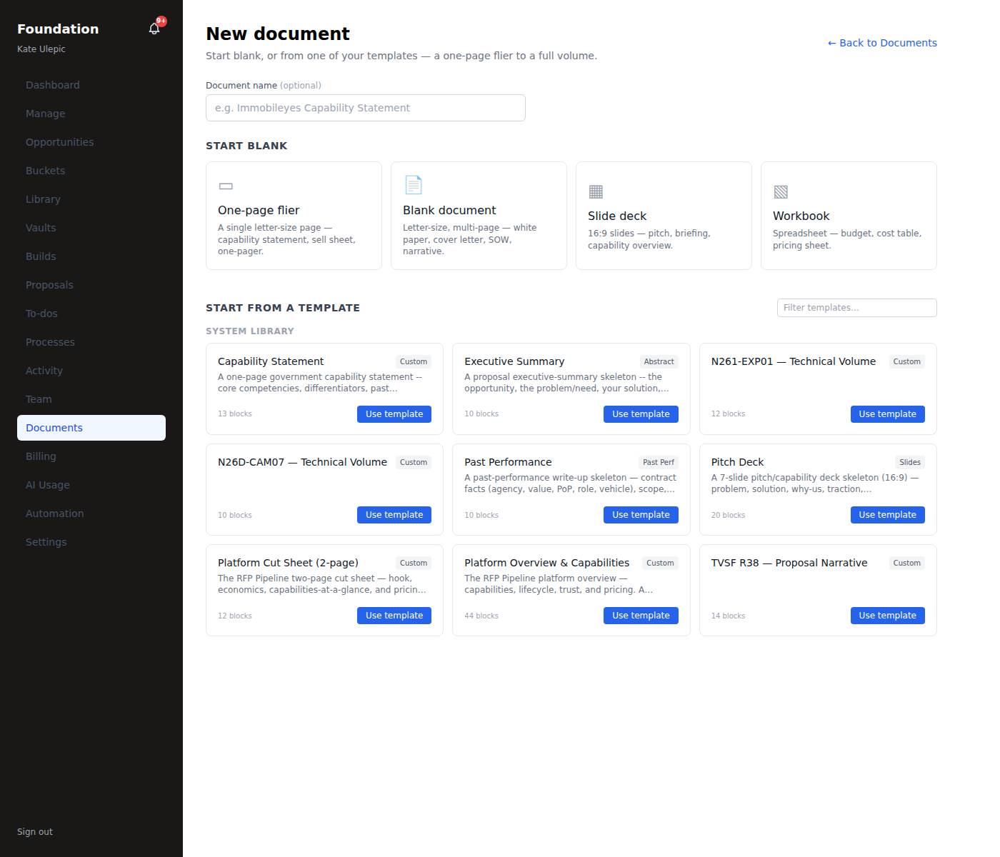
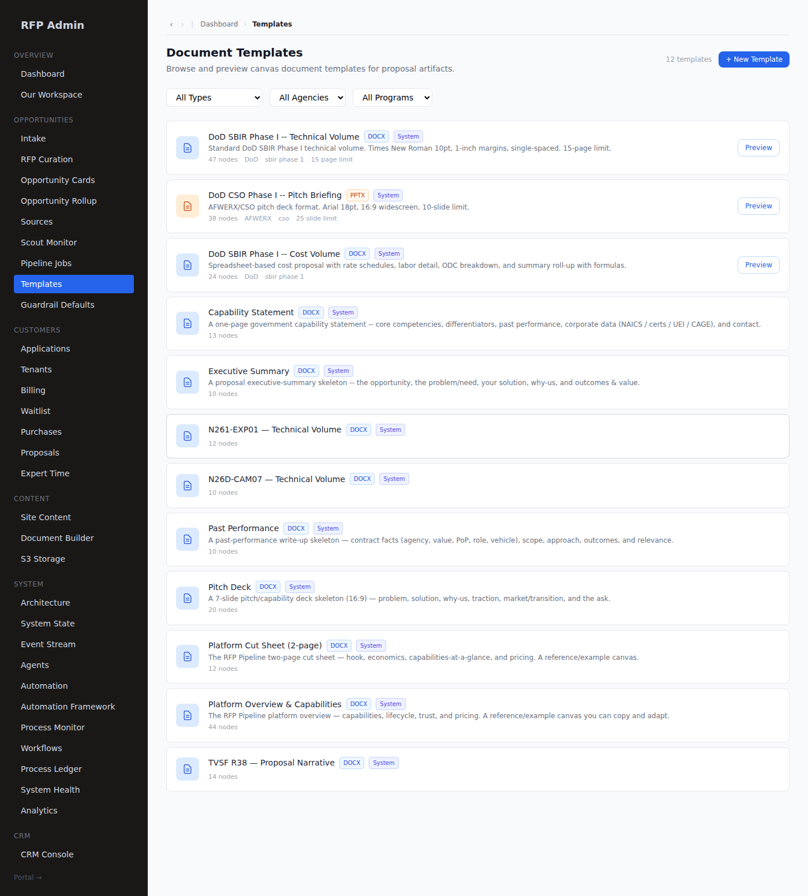

# Templates — launch walkthrough (#151)

The starter templates ("molds") are the structured canvas skeletons that pre-populate a proposal
artifact or a standalone document with the right headings, tables, page/slide budgets, and
`{merge_field}` placeholders. Two complementary systems, both wired and reachable:

## 1. Code catalog — `lib/templates/` (18 molds)

The launch-facing starter catalog (`TEMPLATE_CATALOG` in `lib/templates/index.ts`), grouped by
category, each with a `title` + `format` (document / deck / spreadsheet):

| Category | Molds |
|---|---|
| **DoD/DoW** | SBIR Phase I — Technical · SBIR Phase I — Cost · SBIR Phase II — Technical · STTR Phase I — Technical · STTR Phase II — Technical · Direct-to-Phase-II — Technical · CSO Phase I — Briefing (deck) |
| **NSF** | Project Pitch · SBIR/STTR Phase I — Project Description |
| **DOE** | SBIR Phase I — Technical · STTR Phase I — Technical |
| **Marketing** | One-Pager · Capability Statement (Two-Pager) · Whitepaper · Sales Deck |
| **Commercialization** | Commercialization Plan |
| **Investment** | One-Pager · Pitch Deck |

- **Reached from:** the tenant **New Document** chooser (`/portal/[slug]/documents/new` — all 18 surface,
  verified) and proposal creation (`/api/portal/[slug]/proposals/create`).
- **Auto-selected at provision:** `resolveTemplateKey(programType, itemType, itemName)` maps a solicitation's
  program + volume to the right narrative/cost/deck mold — with a **guard** so cover sheets / certs / cost
  sheets / CCR / SF-424 never inherit a narrative template (the "15-page template in a 1-page cover sheet"
  bug class).
- **Interpolation:** `interpolateTemplate` fills `{company_name}`, `{topic_number}`, `{pi_name}`, etc. from
  the tenant profile + opportunity at create time.

## 2. DB templates — `document_templates` (admin-managed)

The **admin Templates** surface (`/admin/templates`) lists the `document_templates` rows (system molds +
captured proposal/collateral canvases), filterable by Type / Agency / Program, each with a live **Preview**.
These are the templates a curated solicitation's items reference by `template_id` at provisioning, and the
"Save as template" target from a proposal section (Studio publish-to-library, #100).

## Verdict
All 18 code molds surface in the tenant chooser; the admin catalog renders + previews the DB templates;
provisioning auto-resolves the right mold per volume with the form-item guard; merge fields interpolate.
Backbone green (tsc 0 · vitest 1038). The molds are launch-ready.

## 3. Pristine pass — page furniture, figures, full pages (#152)

Verified across all 18 molds (the furniture lives in the shared `CANVAS_PRESETS`, so every mold that
references a preset inherits it — one place, no per-mold drift):

- **Page furniture (header + footer).** Every mold's preset carries proper furniture:
  - Multi-page narratives — `letter_sbir_phase1` / `letter_sbir_phase2` (running header
    `{topic_number} — {company_name}` + footer `{company_name} | Page {n} of {N}`), `letter_agency`
    (`{company_name} — {project_title}` + page footer, 11pt NSF floor), `letter_collateral`.
  - One-pagers / decks — `letter_onepager` and `slide_deck` carry a **footer** (contact / page-of-N) with
    **no running header by design** (a header on a single page / a slide is clutter).
  - The cost workbook furnishes its own header/footer inline.
  - The null-furniture presets (`letter_standard`, `slide_cso`, `custom`, `spreadsheet`) are referenced by
    **no mold** — so there is no furniture-less mold.
- **Banners / figures.** Every narrative/collateral mold carries **1–5 `image` figure placeholders** (plus
  tables) — e.g. STTR/DOE technical molds 5 images + 3–4 tables; marketing/investment pieces 1–5 each.
  `images_allowed: true` on the collateral/agency/one-pager/deck presets.
- **Full pages.** Molds are substantive, not skeletal — 16–65 canvas nodes each (headings + prose + tables
  + figures + page/slide breaks + TOC on the long narratives), so a provisioned artifact opens as a full
  drafted document, not an empty outline.

Confirmed live earlier: the STTR **Technical Volume** and the TVSF **Proposal** — both mold-provisioned —
render with header/footer + figures + native tables through the docx/pdf package export (docs/E2E_LAUNCH_PROOF.md).
