# TVSF Proposal Pipeline — Build Guide (for Paul)

**Audience:** Paul Jackson (EC / DMVEC shadow-admin for Foundation) and the Foundation team
(Kate, Connor). **Goal:** take an Ohio Third Frontier **TVSF** opportunity from the moment it
lands on Foundation's cards through a finished, downloadable 3‑volume application — the way the
EverTrack and HydroSmart winners are structured.

This is a *functional* manual: every screenshot below was captured by driving the live portal as
Paul (`e2e/hitl-tvsf-build-guide.spec.ts`), signed in at `pjackson@ecinnovates.com`. If a screen
changed, the shot was regenerated — they cannot silently drift.

> **The canonical TVSF shape** (see `docs/TVSF_SPEC.md`) is three volumes:
> 1. **Narrative** — Abstract (unnumbered) + Questions **1–14**, **7‑page** limit, .75″ margins,
>    11 pt Times New Roman. Four tables are mandatory: the **competitor comparison** (Q2), the
>    **pro‑forma P&L** (Q6), the **milestone table** (Q11), and the **budget by spend type** (Q12).
> 2. **Willingness‑to‑License Letter** — from the IP‑owning institution (≤ 1 page). *Required on
>    every TVSF* — it is listed in the compliance matrix with a template example.
> 3. **ESP Support Letter** — from the Entrepreneurial Services Provider / EC (≤ 1 page).

---

## The cast — who touches what

| Actor | Identity | Authority |
|---|---|---|
| **Paul Jackson** | `pjackson@ecinnovates.com` — EC shadow‑admin, *external* (no home tenant) | Enters Foundation's account as `tenant_admin`; drives discovery, drafting, review, export |
| **Kate Ulepic** | `kate.ulepic@foundation3dp.com` — Foundation, bound `tenant_admin` | Owns the tenant; edits sections, invites the team |
| **Connor Casey** | `connor.casey@foundation3dp.com` — Foundation `tenant_user` | Edits assigned sections |

Demo password for all three: `DemoPass123!`.

---

## Step 1 — Discovery: from dashboard to the scored Opp Card

Paul lands on Foundation's **dashboard**, the home base for the tenant.

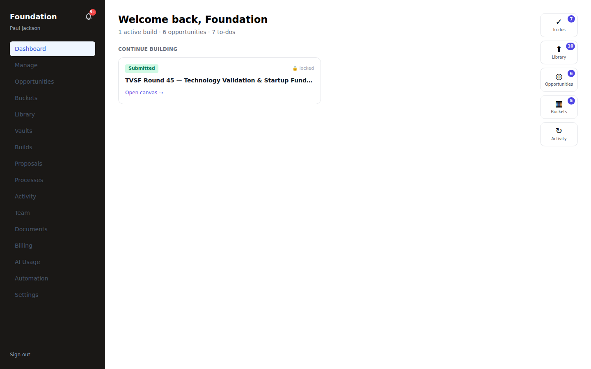

Opportunities are auto‑scored into **spotlight buckets** on arrival, so the TVSF round rises to the
top of what Foundation should chase.

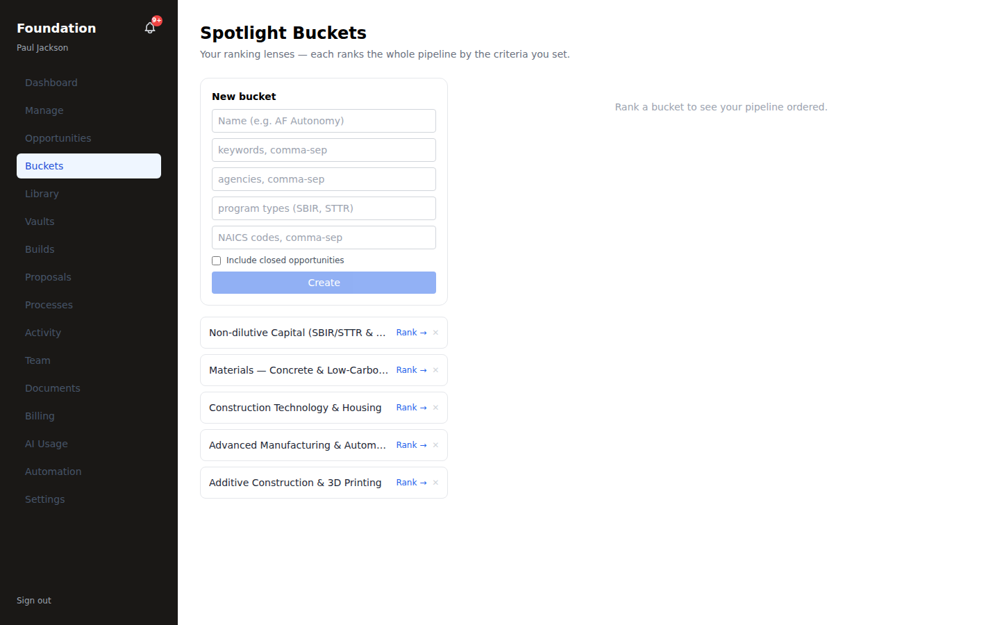

The **Opportunity Cards** surface is the canonical customer view — one denormalized card per
activated opportunity. The **TVSF Round 45** card carries its Ohio Third Frontier / DMVEC origin,
the Aug 14 2026 close, and the compliance shape the proposal will inherit.

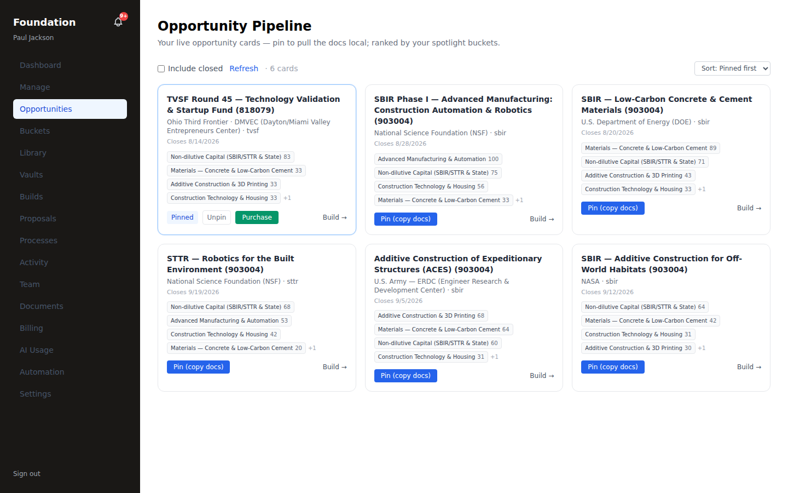

---

## Step 2 — Open the proposal workspace

From **Proposals**, Paul opens the TVSF build. This is the spine of the whole exercise.

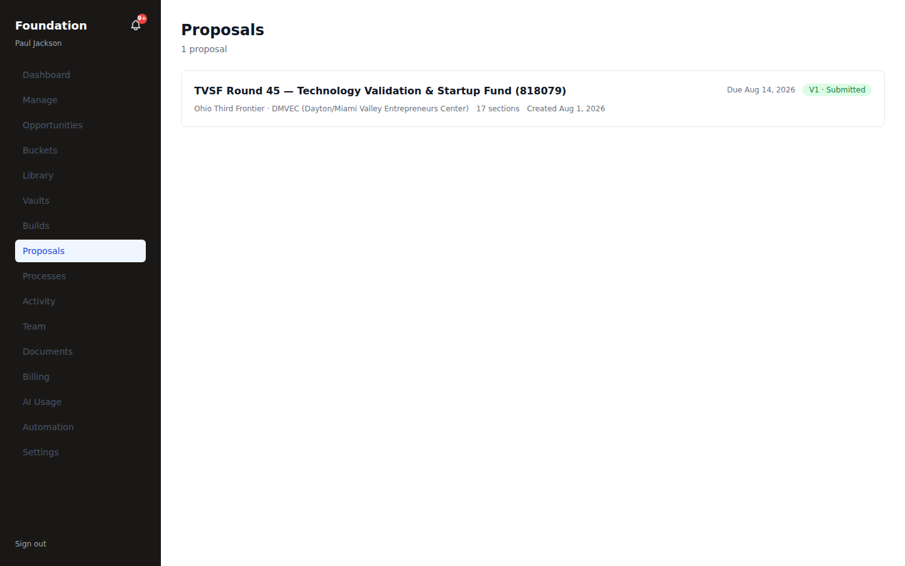

The workspace shows the **three volumes** in order — Narrative (Abstract + Q1–14), the
Willingness‑to‑License Letter, and the ESP Support Letter — each section with its draft status, the
**Draft → Final** gate, and the compliance matrix under the **Compliance** tab. Sections list in
true document order (Abstract, 1, 2, … 14 — never string‑sorted "10" before "2").

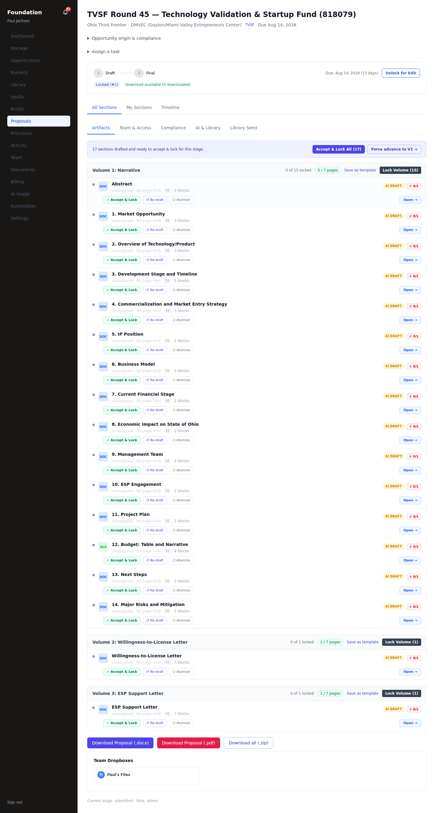

At the bottom sit the three **downloads** — `.docx`, `.pdf`, and `.zip` (each volume in its native
format). They unlock once the proposal is locked or submitted.

---

## Step 3 — Draft in the canvas (the heart)

Each section opens in the **canvas editor**. The canvas is the document itself — headings, text,
tables, figures — rendered exactly as it will export.

**Q2 — Overview of Technology/Product** carries the mandatory **competitor comparison table**
(Foundation vs conventional formwork vs mortar‑extrusion printers):

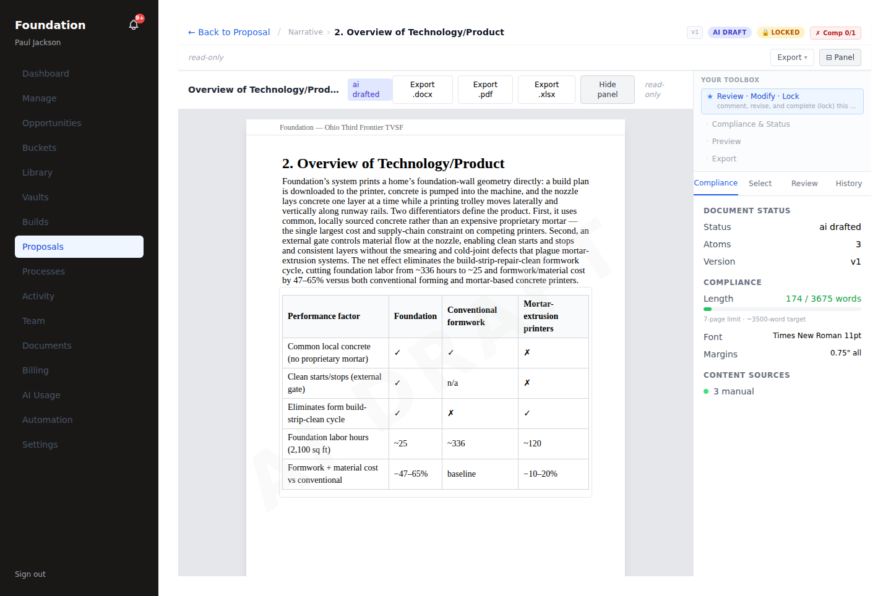

**Q3 — Development Stage and Timeline** shows a real **figure** — the 12‑month milestone schedule
(MS1–MS8), which maps one‑for‑one to the Q11 milestone table:

**Q6 — Business Model** pairs the **pro‑forma P&L table** with a **revenue & gross‑profit chart**,
so the recurring lease‑plus‑build‑fee model is both tabulated and visualized:

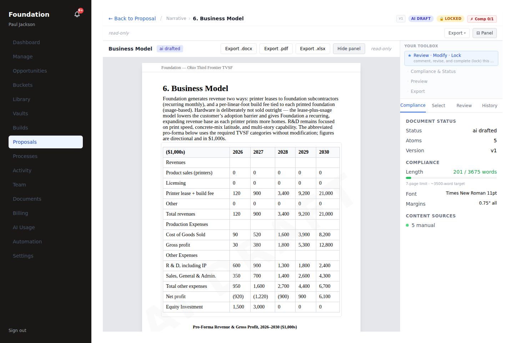

Foundation team members (Kate, Connor) edit their assigned sections here the same way; edits are
versioned and the **color‑team / compliance** agents review on advance (see *Agents*, below).

---

## Step 4 — Preview it "as it downloads"

The right‑hand toolbox has a **Preview**. It renders the section — or the **whole document** — in
the exact print/PDF layout the customer will download, so there are no surprises at export time.

**Section preview:**

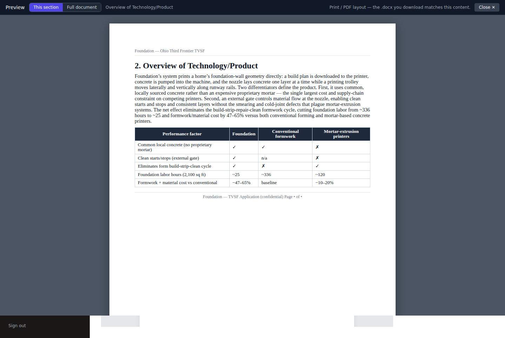

**Full‑document preview** — every volume, in order, clean numbering, header/footer, tables and
figures. The banner says it plainly: *"Print / PDF layout — the .docx you download matches this
content."*

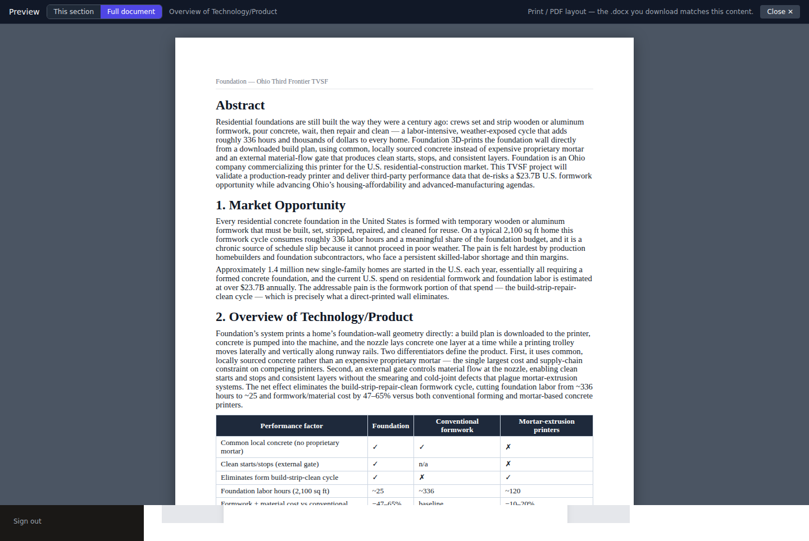

---

## Step 5 — Build from Foundation's library atoms

Reusable, taxonomy‑tagged **library atoms** (uploaded material, atomized) are the raw stock the
drafter and the team pull from. Everything is visibility‑enforced to Foundation.

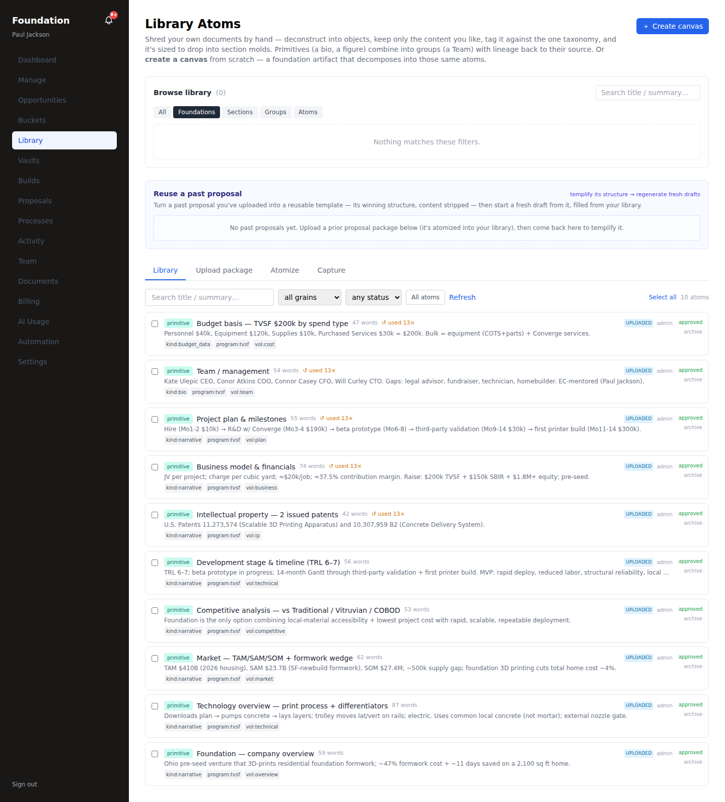

---

## Step 6 — The Foundation team

Paul and Kate manage the team from **Team** — inviting Foundation members and scoping their access.

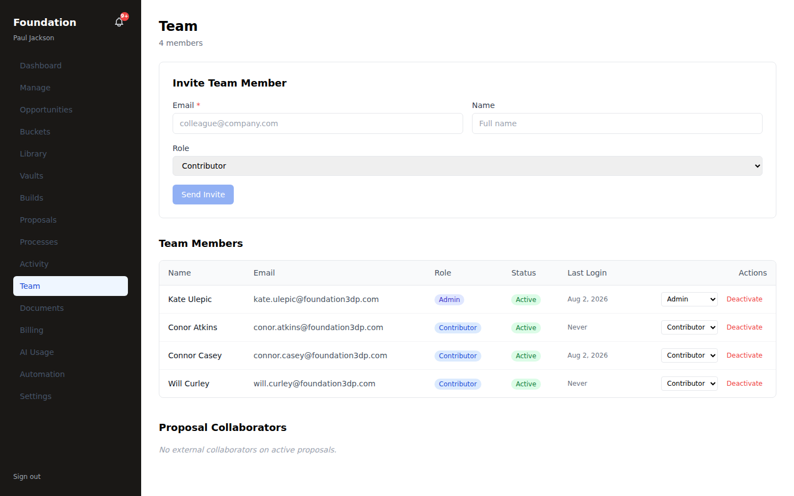

---

## Step 7 — Export the finished application

Back in the workspace, the three download buttons produce:

- **Download Proposal (.docx)** — one assembled Word document, all sections combined, tables and
  figures embedded.
- **Download Proposal (.pdf)** — one print‑fidelity PDF (Chromium render): repeating header/footer,
  real page numbers, tables, and the inline figures at full resolution.
- **Download all (.zip)** — each volume exported in its *native* format (the narrative as `.docx`,
  the budget grain as `.xlsx`, etc.), bundled — lossless for a mixed proposal.

The delivered Foundation application is **6 pages**: Abstract + Q1–14 with all four mandatory
tables and both figures, followed by the Willingness‑to‑License and ESP Support letters — numbering
clean end to end.

---

## The brain & nervous system — agents and automation

The build isn't manual busywork. The pipeline's agent workforce plugs into the workflow engine
(`docs/AGENT_WORKFORCE.md`, `docs/AUTOMATION_SPINE_MAP.md`):

- **`section_drafter`** drafts each section from the library atoms on release/provision
  (`draft_v0 → markdown_to_canvas → publish_section_draft`) — that's how the Q1–14 drafts and the
  letters arrive as `ai_drafted`.
- **`compliance_reviewer`** runs inline (`ai/compliance`) against the matrix — including the
  Willingness‑to‑License and ESP letter requirements.
- **`color_team_reviewer`** reviews on advance via the `agent_task_queue`.
- **`librarian`** atomizes uploads into `library_atoms`; **`scoring_strategist`** feeds the buckets.

Every agent is **advisory → guardrail → land‑or‑review**: it never auto‑writes the business tables,
tenant content is injection‑fenced, and a run is tenant‑bound. Oversight lives at
`/admin/agents` (Agent Workforce).

---

## Appendix — the TVSF compliance checklist

| # | Requirement | Where |
|---|---|---|
| — | Abstract (unnumbered, excluded from the 7‑page count) | Narrative |
| 1–14 | The 14 numbered questions | Narrative |
| Q2 | Competitor comparison **table** | Narrative |
| Q6 | Pro‑forma P&L **table** (+ revenue chart) | Narrative |
| Q11 | Milestone **table** (+ Q3 schedule figure) | Narrative |
| Q12 | Budget by spend type **table** | Narrative |
| — | **Willingness‑to‑License letter** (IP owner, ≤ 1 page) | Volume 2 |
| — | **ESP support letter** (the EC, ≤ 1 page) | Volume 3 |
| — | Format: 7‑page narrative, .75″ margins, 11 pt Times New Roman, 12 pt spacing | all |

To refresh the demo proposal to this canonical shape at any time:
`DATABASE_URL=… node scripts/rebuild-tvsf.mjs`.
