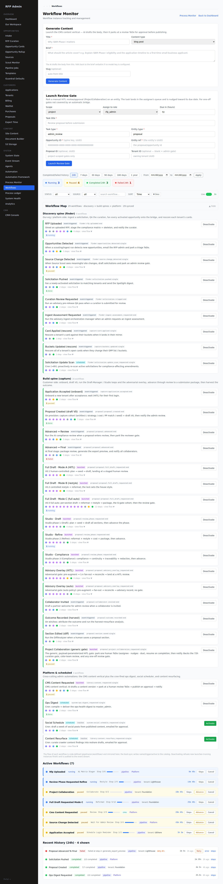
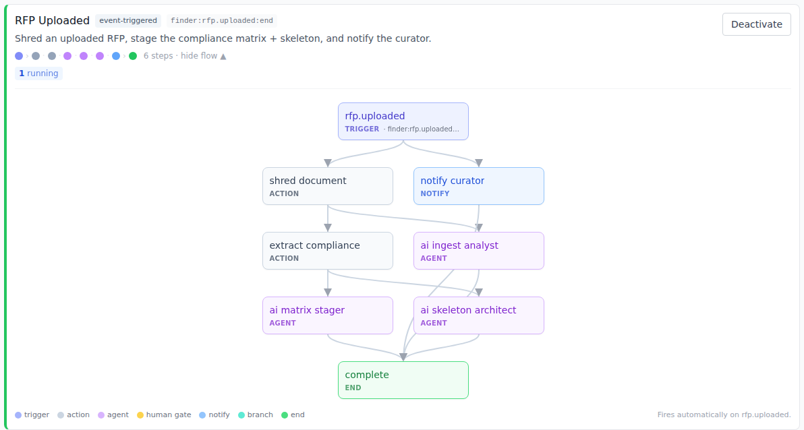
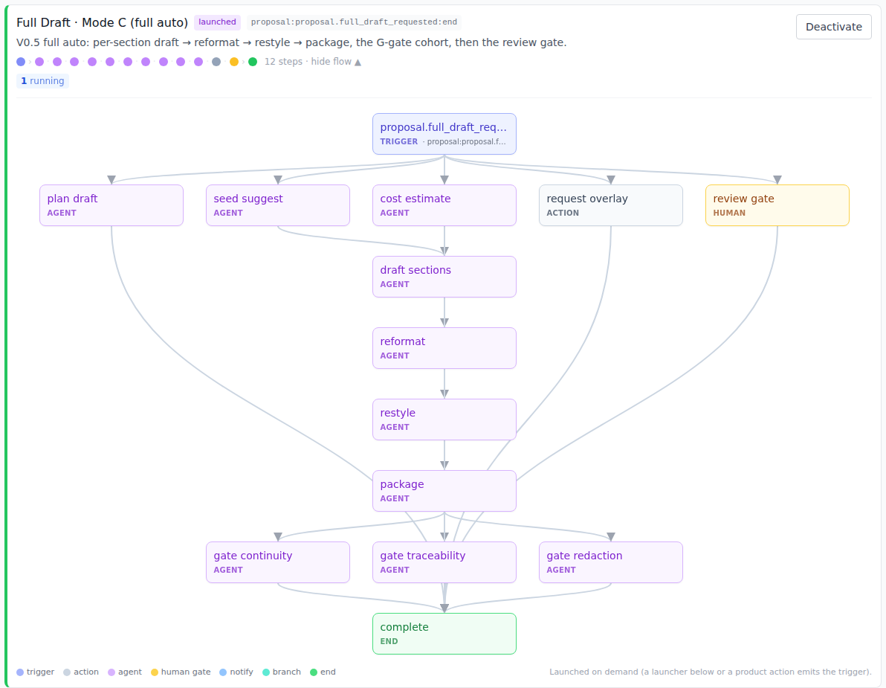
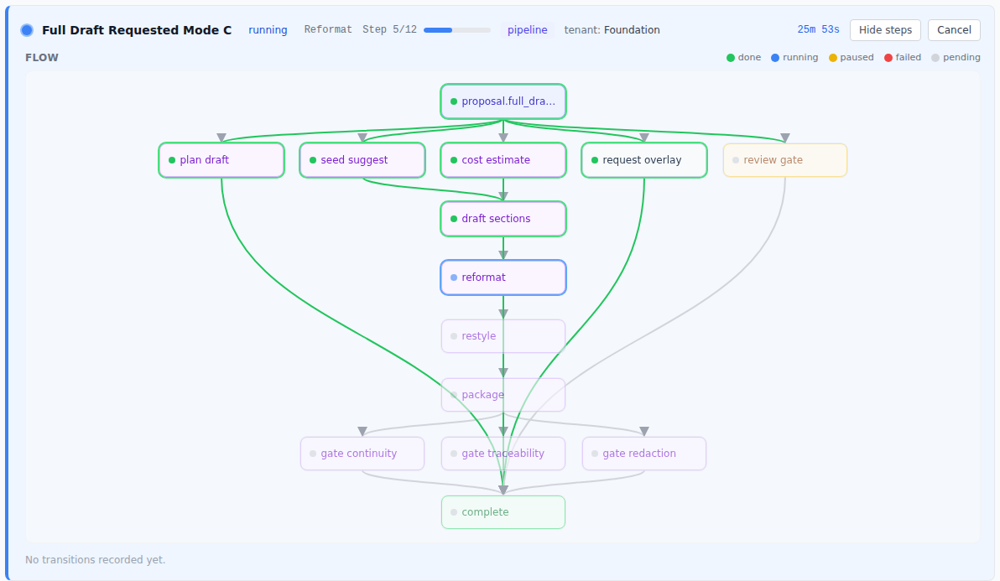
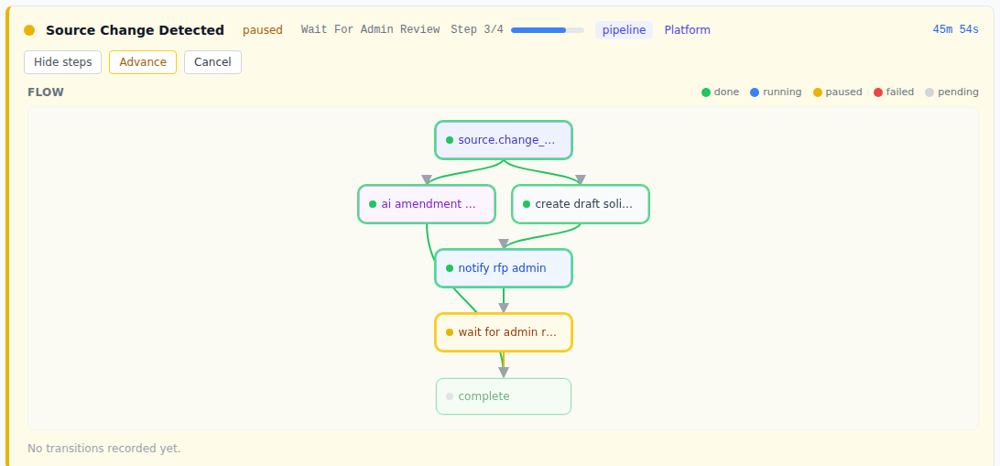

# Workflow Admin Guide — Operating Both Spines

**Audience:** `rfp_admin` / `master_admin`.
**Where:** `/admin/workflows` (nav: **System → Workflows**) — the one page from which you
**instantiate · visualize · monitor · manage** every workflow the platform runs.

This guide covers the workflow engine end to end and then walks **both lifecycle spines** —
the **Discovery spine** (finder / our-org side) and the **Build spine** (capture / customer
side) — plus the cross-cutting **Platform** lane. It is the operator companion to the
engineering docs (`docs/AUTOMATION_SPINE_MAP.md`, `docs/START_END_FRAMEWORK.md`,
`docs/AGENT_WORKFORCE.md`).

---

## 1. The engine in one page

A **workflow** is a declarative **template**: a **trigger** (an event on the `system_events`
river) plus an ordered **DAG of steps**. When the trigger fires, the engine creates a
**process instance** (`process_instances`) and walks the steps, recording each move in
`process_instance_transitions`. Steps come in a handful of kinds:

| Kind | Colour | Meaning |
|---|---|---|
| **trigger** | indigo | the event that starts the workflow |
| **action** | slate | a deterministic engine action (shred, rescore, export…) |
| **agent** | purple | an `AI_INVOKE` — a pipeline agent does advisory work |
| **human gate** | amber | a `TODO` / `HITL_WAIT` — parks for a person, resumes on completion |
| **notify** | blue | an email / in-app notification |
| **end** | green | the workflow completed |

Three things every admin should internalize:

1. **Templates are code-defined.** The step DAG lives in `pipeline/src/workflows/*`; the
   pipeline **boot-sync** writes each template's *name / trigger / active* flag into the
   `process_templates` catalog (it does **not** store the DAG — the console mirrors the DAG
   from the code). So "activate/deactivate" is a catalog switch; the shape is the code.
2. **Instances are per-tenant or platform.** A build-spine instance carries a `tenant_id`;
   a discovery/platform instance is `Platform` (tenant-null).
3. **Agents are advisory.** An `agent` step never auto-writes a business table — it produces
   advice that lands or waits for a human gate. Runaway/round/budget caps bound every agent.

### The two spines (+ platform)

- **Discovery spine (finder).** Our-org / platform side: **ingest** a solicitation → **QA**
  the curation → **fan** every activated opportunity onto the bridge → **rescore** each
  tenant's cards. Instances here are `Platform`.
- **Build spine (capture).** Customer side: **onboard** → **draft V0** → the **Draft-Manager
  / Studio** loops and the **adversarial overlay** → advance through **review** to a
  **submission package** → **harvest** the outcome. Instances carry the customer's `tenant_id`.
- **Platform & scheduled.** Cross-cutting admin automations: the **CMS content** vertical
  plus the cron-fired **ops digest**, **social scheduler**, and **content resurfacing**.

---

## 2. The Workflow Map — see every workflow, by spine

Open **Workflow Map** on `/admin/workflows`. Every registered workflow is listed under its
spine, with a launch badge (`event-triggered` / `launched` / `scheduled`), its trigger key, a
one-line description, a **step-kind ribbon**, live counts, and an **Activate/Deactivate**
switch. Click any row's **view flow** to expand its full DAG.

*The map is the roster + the activation control. A workflow the boot-sync hasn't written yet
still shows its designed flow, tagged `designed`.*

### Reading a designed flow

Expanding a row draws the template's DAG — trigger at the top, steps flowing down to
`complete`, coloured by kind. Two examples, one per spine:

**Discovery — `OnRfpUploaded`** (fires automatically on `rfp.uploaded`):

**Build — `OnFullDraftRequestedModeC`** (the full-auto draft; launched on demand):

---

## 3. Instantiate — how a workflow starts

There are **three** ways an instance is born. The map's launch badge tells you which applies:

1. **`event-triggered`** — fires automatically when a product action emits its trigger event
   (e.g. an admin activating a solicitation emits `finder:solicitation.pushed`, which starts
   `OnSolicitationPushed`). You don't launch these by hand; you watch them.
2. **`launched`** — started on demand. The operator surfaces are on this same page and at
   `/admin/agents`:
   - **Generate Content** (top of the page) → launches `OnCmsContentRequested`.
   - **Launch Review Gate** (top of the page) → launches the generic `ProjectCollaboration`
     HITL gate on any entity (pick scope, assignee role, due-in hours). This is the guarded
     way to park a manual review; it always produces a well-formed task.
   - **Proposal Auto-Drive doorbell** (`/admin/agents`) → launches `OnFullDraftRequestedMode*`
     against a proposal from up top (same trigger the customer's portal uses).
3. **`scheduled`** — fired on a cron cadence by the pipeline (ops digest, social schedule,
   content resurface, the 6-hourly solicitation update scan).

> **What "launch" does under the hood:** a launcher **emits the trigger event** (with the
> overlay frozen); the pipeline processor picks it up and creates the `process_instance`. The
> launch itself is audited to the event stream, so every instantiation is on the record.

---

## 4. Visualize + Monitor — watch a workflow move

Below the map, the **live monitor** lists **Active Workflows** and **Recent History** with a
stats bar, and **filter · sort · Live** controls (status/source filters, name search, sort by
time/workflow/status/tenant/duration, and a 10-second Live auto-refresh you can freeze).

Click **Steps** on any instance to open its **live DAG** — the template's flow with each step
coloured by *this instance's* actual status: **done** (green), **running** (blue, pulsing),
**paused** (amber), **failed** (red), **pending** (dim). The completed path is traced in
green, so you can see at a glance exactly where the workflow is.

**A running build instance** — `OnFullDraftRequestedModeC`, mid-flight at `reformat`:

**A paused HITL gate** — `OnSourceChangeDetected`, parked at `wait for admin review`:

The same instance data also drives the **Process Ledger** (`/admin/processes`, a health-first
table) and the **Active Workflows** tab of **System State**; the **Process Monitor**
(`/admin/process`) shows the raw `system_events` start/end pairs behind it all.

---

## 5. Manage — the four controls

| Action | Where | What it does | Safety |
|---|---|---|---|
| **Activate / Deactivate** | Workflow Map row | Toggles whether new instances of a template may launch. Running instances finish. | Audited to the event stream. |
| **Advance** | a *paused* instance | Pushes a HITL-parked instance past its gate — you act as the human it waited for. | Compare-and-swap on `status='paused'`; expires the sibling task. |
| **Cancel** | any active instance | Stops an instance. | — |
| **Retry** | a *failed* instance | Re-runs from the failed step after you've fixed the cause. | Records `retry_count`; the error + failing step are shown. |

Deactivating a template is the right lever when a workflow is misfiring in volume; advancing
is how you clear a stuck human gate; retry is for a transient failure (e.g. the export PDF
render timed out) once the cause is addressed.

---

## 6. Walkthrough — the Discovery spine

The finder lifecycle, in the order an opportunity travels it. All instances are `Platform`.

1. **`OnRfpUploaded`** — you upload a solicitation; it's shredded, the compliance matrix +
   skeleton are staged by agents, and the curator is notified. *Watch:* the three agent steps
   fan out from `shred_document` / `extract_compliance`.
2. **`OnSourceChangeDetected`** — Source Scout finds a meaningful site change → drafts
   solicitations → **parks an admin review gate** (`wait_for_admin_review`). *Do:* review the
   drafts, then **Advance** the gate.
3. **`OnOpportunitiesDetected`** — a scouting/ingest run finds new opportunities → emails you
   → parks a triage ToDo.
4. **`OnSolicitationReviewRequested`** — when a curation is submitted for review, an advisory
   QA pass runs and notifies the reviewer.
5. **`OnSolicitationPushed`** — on activation, the solicitation is fanned to matching tenants
   and the Spotlight digest is sent. This is the hand-off onto the bridge.
6. **`OnCardApplied` / `OnBucketsUpdated`** — rescore a tenant's card(s) when a card lands or
   when they change their OPP list / buckets.
7. **`OnIngestAssessmentRequested`** — you ask (from the curation workspace) for an ingest
   readiness assessment; the ingest manager agent advises which specialists to run next.
8. **`OnSolicitationUpdateScan`** *(cron ≈6h)* — re-scans active solicitations for
   compliance-affecting amendments.

---

## 7. Walkthrough — the Build spine

The capture lifecycle, from onboarding to outcome. Instances carry the customer's `tenant_id`.

1. **`OnApplicationAccepted`** — onboard a new tenant; an `HITL_WAIT` step waits for their
   first login.
2. **`OnProposalCreated`** — on provision, the capture cohort runs (architect / strategy /
   cost / past-performance match / library seed) and V0 sections are drafted, then you're
   notified for the 72-hour review.
3. **Draft Manager — `OnFullDraftRequestedMode{A,B,C}`** — the admin- or portal-driven full
   draft: **A** is human-controlled (HITL), **B** a controlled restyle, **C** full-auto
   (per-section draft → reformat → restyle → package → the G-gate cohort → a review gate).
   Launch from the **Proposal Auto-Drive doorbell** on `/admin/agents`.
4. **Studio — `OnReviewPhaseRequested{Draft,Refine,Compliance}`** — the three gated Studio
   loops; each lands in review, then you comment+regenerate or approve→next.
5. **Adversarial overlay — `AdvisoryOverlay` / `AdvisoryOverlayAuto`** — pre-augment → 1:n
   fan-out → reconcile → land at a HITL review (or record automatically). Advisory; never
   advances a gate on its own.
6. **`OnProposalAdvancedToReview` → `OnProposalAdvancedToFinal`** — AI compliance review parks
   the reviewer gate; at final, package review + export preview + notify collaborators.
7. **`OnCollaboratorInvited`** — drafts a partner welcome for your review when a collaborator
   is invited.
8. **`OnProposalSectionEdited`** — runs the DiffAnalyzer when a human saves a section.
9. **`OnProposalOutcomeRecorded`** — on win/loss, attributes the outcome and runs the
   harvest→resurface analysis.
10. **`ProjectCollaboration`** — the generic HITL gate that backs the 72h curation gate,
    color-team review, and any one-off review you launch from **Launch Review Gate**.

---

## 8. The Platform lane

- **`OnCmsContentRequested`** *(launched)* — the CMS content vertical: AI drafts a version →
  parks a human review ToDo → publishes on approval → notifies. Launch from **Generate
  Content**.
- **`OnOpsDigestRequested`** *(cron)* — compiles + delivers the ops-health digest to
  `master_admin`.
- **`OnSocialScheduleRequested`** *(cron)* — drafts a week of social posts for approval.
- **`OnContentResurfaceRequested`** *(cron)* — curates crawler findings into reshare drafts.

---

## 9. Troubleshooting

- **An instance is stuck `paused`.** It's at a human gate. Open its Steps to see which (amber)
  step, then **Advance** it (or complete the underlying ToDo in the assignee's queue).
- **An instance `failed`.** Open Steps — the failing step and error are shown. Fix the cause,
  then **Retry** (re-runs from the failed step).
- **A template is firing too much / misbehaving.** **Deactivate** it on the map; running
  instances finish, new ones are refused, and the toggle is audited.
- **A workflow isn't in the catalog (shows `designed`).** The pipeline boot-sync hasn't
  written it yet — its flow is still visible (mirrored from code); activation appears once the
  pipeline has booted against this database.
- **Nothing spawns after I launch.** A launch emits the trigger event (visible in **Event
  Stream**); the pipeline processor turns it into an instance. If the processor isn't running,
  the event is recorded but no instance appears until it is.

---

## 10. Full workflow reference (all 29)

<!-- Generated from app/admin/workflows/workflow-shapes.ts — the code-defined catalog. -->

### Discovery spine (finder) — 9 workflows

| Workflow | Trigger | Launch | Steps | What it does |
|---|---|---|---|---|
| `OnRfpUploaded` | `finder:rfp.uploaded:end` | event | 6 (action·action·agent·agent·agent·notify) | Shred an uploaded RFP, stage the compliance matrix + skeleton, and notify the curator. |
| `OnOpportunitiesDetected` | `finder:opportunities.detected:single` | event | 3 (agent·notify·todo) | When a scouting/ingest run detects new opportunities, email the RFP admin and park a triage ToDo. |
| `OnSourceChangeDetected` | `finder:source.change_detected:single` | event | 4 (agent·action·notify·todo) | When Source Scout sees meaningful site changes, draft solicitations and park an admin review gate. |
| `OnSolicitationPushed` | `finder:solicitation.pushed:single` | event | 2 (action·notify) | Fan a newly-activated solicitation to matching tenants and send the Spotlight digest. |
| `OnSolicitationReviewRequested` | `finder:solicitation.triaged:end` | event | 2 (agent·notify) | Run an advisory pre-release QA pass when a curation is submitted for review. |
| `OnIngestAssessmentRequested` | `finder:ingest.assessment_requested:end` | event | 2 (agent·notify) | Run the advisory ingest-orchestration manager when an admin requests an ingest assessment. |
| `OnCardApplied` | `capture:card.applied:single` | event | 1 (action) | Rescore a tenant’s card against their buckets when it lands in their mirror. |
| `OnBucketsUpdated` | `capture:buckets.updated:single` | event | 1 (action) | Rescore all of a tenant’s open cards when they change their OPP list / buckets. |
| `OnSolicitationUpdateScan` | `finder:solicitation.update_scan_requested:single` | scheduled | 2 (agent·notify) | Cron (≈6h): proactively re-scan active solicitations for compliance-affecting amendments. |

### Build spine (capture) — 16 workflows

| Workflow | Trigger | Launch | Steps | What it does |
|---|---|---|---|---|
| `OnApplicationAccepted` | `capture:application.accepted:end` | event | 2 (agent·wait) | Onboard a new tenant after acceptance; wait (HITL) for their first login. |
| `OnProposalCreated` | `proposal:proposal.created:end` | event | 7 (agent·agent·agent·agent·agent·action·notify) | On provision: capture cohort (architect / strategy / cost / PP match / seed) + draft V0, then notify the admin review. |
| `OnProposalAdvancedToReview` | `proposal:proposal.advanced:end` | event | 3 (agent·notify·todo) | Run the AI compliance review when a proposal enters review, then park the reviewer gate. |
| `OnProposalAdvancedToFinal` | `proposal:proposal.advanced:end` | event | 3 (agent·action·notify) | At final stage: package review, generate the export preview, and notify all collaborators. |
| `OnFullDraftRequestedModeA` | `proposal:proposal.full_draft_requested:end` | imperative | 4 (agent·agent·agent·todo) | V0.1 human-controlled: plan → seed → draft, landing at a staged human review. |
| `OnFullDraftRequestedModeB` | `proposal:proposal.full_draft_requested:end` | imperative | 4 (agent·agent·agent·todo) | V0.2 controlled restyle + reformat; the lock sets the house style. |
| `OnFullDraftRequestedModeC` | `proposal:proposal.full_draft_requested:end` | imperative | 12 (agent·agent·agent·agent·agent·agent·agent·agent·agent·agent·action·todo) | V0.5 full auto: per-section draft → reformat → restyle → package, the G-gate cohort, then the review gate. |
| `OnReviewPhaseRequestedDraft` | `proposal:review_phase.requested:end` | imperative | 4 (agent·agent·agent·action) | Studio phase 1 (Draft): plan + seed + draft all sections, then advance the phase. |
| `OnReviewPhaseRequestedRefine` | `proposal:review_phase.requested:end` | imperative | 5 (agent·agent·agent·agent·action) | Studio phase 2 (Refine): reformat + restyle + cost + package, then advance. |
| `OnReviewPhaseRequestedCompliance` | `proposal:review_phase.requested:end` | imperative | 5 (agent·agent·agent·agent·action) | Studio phase 3 (Compliance): compliance + continuity + traceability + redaction, then advance. |
| `AdvisoryOverlay` | `proposal:proposal.advisory_overlay_requested:end` | imperative | 6 (agent·agent·agent·agent·agent·todo) | Adversarial gate: pre-augment → 1:n fan-out → reconcile → land at a HITL review. |
| `AdvisoryOverlayAuto` | `proposal:proposal.advisory_overlay_requested:end` | imperative | 6 (agent·agent·agent·agent·agent·action) | Adversarial gate (auto policy): pre-augment → fan-out → reconcile → advisory record, no gate. |
| `OnCollaboratorInvited` | `proposal:collaborator.invited:end` | event | 2 (agent·notify) | Draft a partner welcome for admin review when a collaborator is invited. |
| `OnProposalOutcomeRecorded` | `proposal:outcome.recorded:end` | event | 2 (action·agent) | On win/loss: attribute the outcome and run the harvest→resurface analysis. |
| `OnProposalSectionEdited` | `proposal:section.saved:single` | event | 1 (action) | Run the DiffAnalyzer when a human saves a proposal section. |
| `ProjectCollaboration` | `proposal:project.collaboration_requested:single` | imperative | 2 (todo·notify) | The generic, payload-parameterized HITL gate: park one human ToDo (assignee · nudges · due), resume on completion, then notify. Backs the 72h curation gate, color-team review, and any one-off review gate. |

### Platform & scheduled — 4 workflows

| Workflow | Trigger | Launch | Steps | What it does |
|---|---|---|---|---|
| `OnCmsContentRequested` | `library:content.requested:single` | imperative | 5 (agent·action·todo·action·notify) | CMS content vertical: AI drafts a content version → park at a human review ToDo → publish on approval → notify. |
| `OnOpsDigestRequested` | `system:ops.digest_requested:single` | scheduled | 2 (agent·notify) | Cron: compile + deliver the ops-health digest to master_admin. |
| `OnSocialScheduleRequested` | `system:social.schedule_requested:single` | scheduled | 2 (agent·notify) | Cron: draft a week of social posts from published content, emailed for approval. |
| `OnContentResurfaceRequested` | `library:content.resurface_requested:single` | scheduled | 2 (agent·notify) | Cron: curate crawler content findings into reshare drafts, emailed for approval. |
