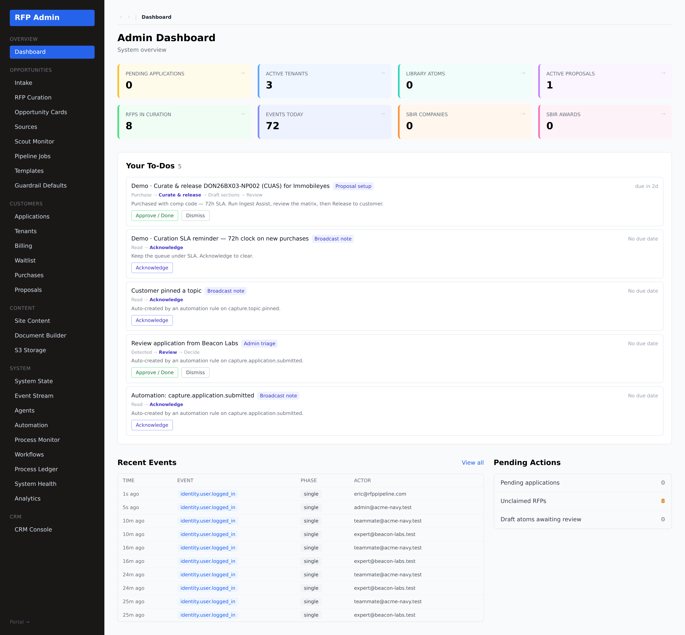
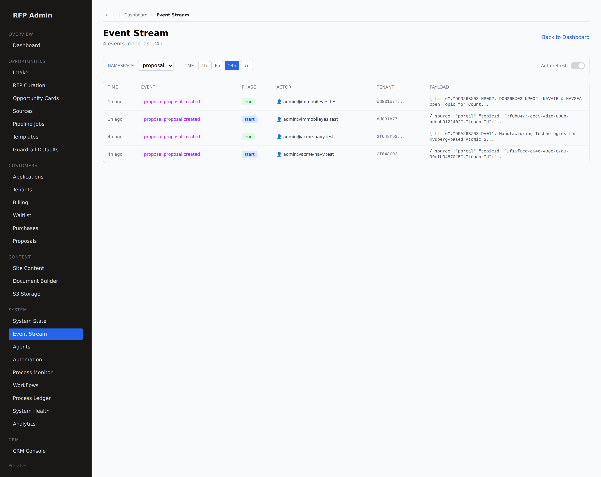
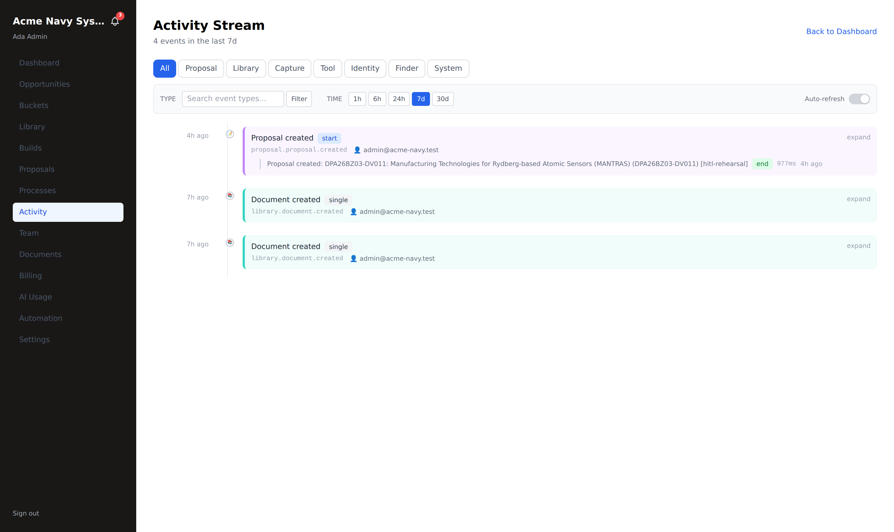
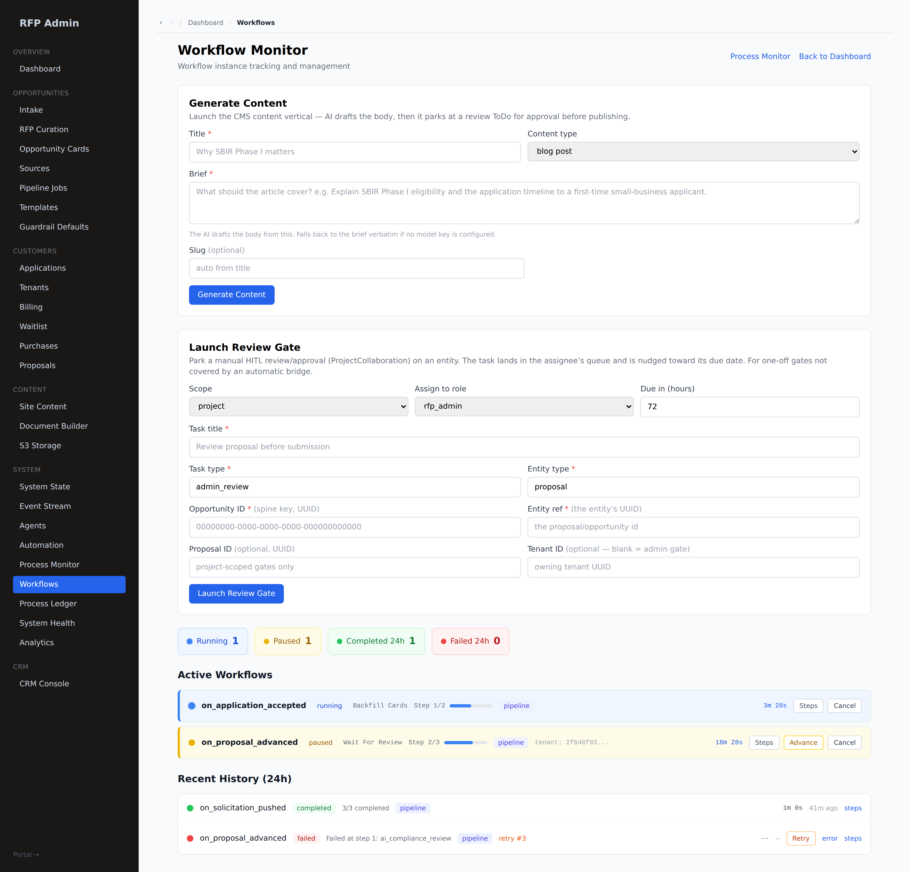
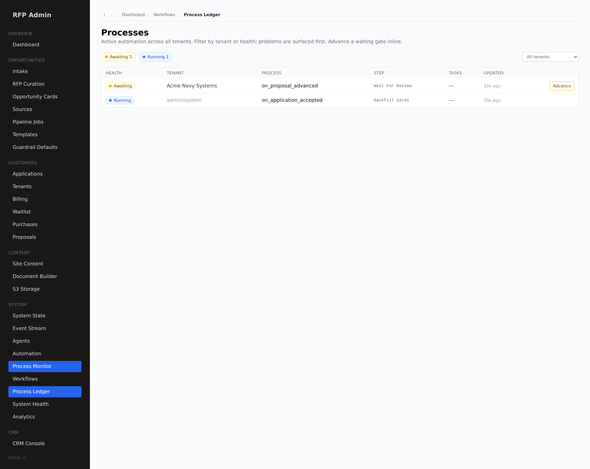
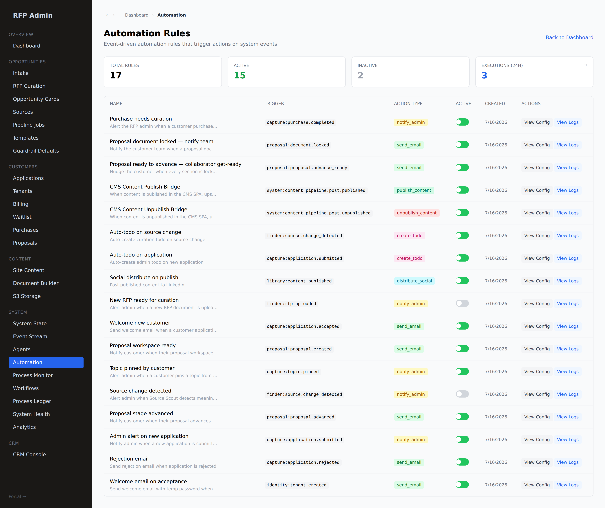

# Admin observability — dashboard, ToDos & the event stream

**Who this is for:** the RFP Pipeline team (`rfp_admin`, `master_admin`).
**What you'll learn:** where your open work lives (ToDos), and how to see **every
action by every actor** across the platform on one immutable audit queue.

> **Two sides, one spine.** Every significant action — an admin claiming a
> solicitation, a tenant locking a section, an automation firing, an Ingest Assist
> run — is emitted to the same immutable `system_events` queue. Admins see the
> whole platform; customers see their own tenant's slice (see the customer
> [Activity](./getting-started.md) feed). Nothing is mutated or deleted; the log is
> append-only.

---

## 1. The admin dashboard + ToDos

`/admin` opens on the dashboard — system state at a glance plus **Your To-Dos**,
the same unified queue the customer portal shows, scoped to your admin work (new
solicitations to claim, purchases awaiting curation + release, anything holding up
a customer).

ToDos are computed from live state (the `tasks` spine + urgency), so the list is
always what actually needs you — clearing to empty when there's nothing pending.

### 1a. Every ToDo is a step in a defined workflow

A ToDo is never a loose one-off — it is always **one step in a named workflow**.
Each card shows the **workflow it belongs to** (the blue chip) and a **step trail**
beneath the title, with completed steps struck through and **the step you're on in
bold**:

- **Proposal setup** — `Purchase → `**`Curate & release`**` → Draft sections → Review`
  (the admin curation gate: run Ingest Assist, review the matrix, Release).
- **Section review & lock** — `Draft → `**`Review`**` → Edit on canvas → Accept & Lock`.
- **Proposal build** — `Provisioned → `**`Draft sections`**` → Review → Lock & export`.

Completing the ToDo advances its workflow — and, when the ToDo is a parked engine
step, resumes the paused `process_instance` with your decision.

> **The atomic floor — a broadcast note.** The smallest possible ToDo is a
> **Broadcast note**: a message to read and acknowledge, `Read → `**`Acknowledge`**,
> cleared with a single **Acknowledge** click. Anything that isn't a richer defined
> workflow collapses to this, so a ToDo can never be workflow-less — even an FYI is
> a one-step workflow.

> **Where ToDos come from.** Today they're raised by a person (a manager delegating)
> or the workflow **engine** (a HITL step parking for a human). The catalog also
> declares **automation** and **agent** as producers, so when event-trigger rules
> and the agent workforce start raising ToDos, each still arrives as a step in one
> of these same defined workflows.

---

## 2. The Event Stream (audit)

**System → Event Stream** (`/admin/events`) is the platform audit log — the
immutable queue rendered as a timeline.

Each row is one event:

- **Time** — when it happened.
- **Event** — `namespace.type` (e.g. `proposal.proposal.created`,
  `library.template.extracted`, `finder.solicitation.ingest_assisted`).
- **Phase** — `start` / `end` for long-running actions (so you see duration and
  failures).
- **Actor** — the user or system/agent that did it (with an actor icon), and their
  email.
- **Tenant** — which customer it belongs to (blank for platform-wide admin events).
- **Payload** — the structured detail of the action.

**Filter** by **namespace** (finder · capture · proposal · library · system · tool
· identity) and **time window** (1h / 6h / 24h / 7d), and flip **Auto-refresh** for
a live tail.

> **Namespaces** map to areas: `finder` (admin ingest/curation), `capture`
> (customer actions), `proposal` (the build workspace), `library` (content),
> `identity` (auth), `system` (infra), `tool` (invocations). This is the same set
> automations subscribe to.

---

## 3. The customer side — tenant Activity

Customers get the same audit, scoped to their tenant, at **Activity**
(`/portal/[tenant]/activity`) — who on their team did what, and when.

Because both feeds read the one `system_events` queue, the admin and customer
views never disagree — they're two windows onto the same immutable record.

---

## 4. Workflow managers — driving the OPP-bridge automations

Behind the ToDos and the event stream runs the **workflow engine**: long-running
processes that fan a solicitation out to tenants, provision a new customer, and
run the proposal review gates. Two admin surfaces manage them — both sides of the
OPP bridge (admin curation/release **and** customer build) in one place.

### 4a. Workflow Monitor (`/admin/workflows`)

**System → Workflows** is the control room. It **launches** workflows, shows every
**active** instance with live step progress, and keeps a **24-hour history**.

- **Status rollup** — Running / Paused / Completed 24h / Failed 24h at a glance.
- **Active Workflows** — each instance shows its `workflow_name`, current **step
  N/total** with a progress bar, source, and (for a tenant workflow) the tenant.
  A **paused** HITL gate (e.g. `on_proposal_advanced` at *Wait For Review*) gets an
  **Advance** button — the same paused→retrying resume the ToDo queue uses. Every
  instance has **Steps** (drill into per-step status) and **Cancel**.
- **Recent History (24h)** — completed and failed instances; a **failed** one
  (e.g. *Failed at step 1: ai_compliance_review*, retry #3) offers **Retry**.
- **Launchers** — **Generate Content** (the CMS content vertical: AI drafts → parks
  a review ToDo) and **Launch Review Gate** (park a manual HITL review/approval on
  any entity — for one-off gates not covered by an automatic bridge).

> The instances above span the bridge: `on_solicitation_pushed` (admin fan-out),
> `on_application_accepted` (admin provisioning), and `on_proposal_advanced`
> (customer build review).

### 4b. Process Ledger (`/admin/processes`)

**System → Process Ledger** is the cross-tenant roll-up — *active automation across
all tenants, problems surfaced first*, filterable by tenant or health.

- **Health** — Awaiting / Running / stalled / failed, using the **same** classifier
  as the customer-side ledger, so badges never disagree across views.
- **Advance** a waiting gate **inline** without opening the full monitor.
- Filter by **tenant** (or All tenants) to scope to one customer.

> **Process Monitor** (`/admin/process`) is the deeper single-pane view of active +
> completed processes; the Ledger is the fast cross-tenant triage board.

---

## 5. Automation — rules that fire off the event queue

**System → Automation** (`/admin/automation`) is the rule book: **event-driven rules
that trigger actions** the moment a matching event lands on the queue.

Each rule pairs a **trigger** (`namespace:type`, e.g. `capture:application.submitted`)
with an **action** and an **active** toggle. When an event is emitted, the engine
finds enabled rules whose trigger matches, checks the rule's **conditions** against
the payload, honours its **cooldown** and **hourly rate limit**, runs the action,
and records the outcome — the **Executions (24h)** stat and each rule's **View
Logs** come straight from that record.

**What actually fires today:**

- **`create_todo`** → an admin ToDo (`admin_review` — a defined [workflow](#1a-every-todo-is-a-step-in-a-defined-workflow)),
  its title filled from the event (e.g. *"Review application from {company_name}"*).
- **`notify_admin`** → an admin **broadcast** ToDo (acknowledge-on-read).

Both land in the admin **ToDo queue** — so *automation feeds the same workflow
spine as everything else*. Other actions (**`send_email`**, **`distribute_social`**,
**`publish_content`**) are **recorded** on each match but executed by their own
routes/services, so nothing double-sends.

> This closes the loop you'll hear described as *"preferences → real triggers off
> the event queue."* The rules were always here; now they **fire**.

---

## Related

- Purchases & the curation queue → [RFP admin](./admin-rfp.md)
- Ingest Assist (auto-build a solicitation's matrix + skeleton) → [`../INGEST_ASSIST.md`](../INGEST_ASSIST.md)
