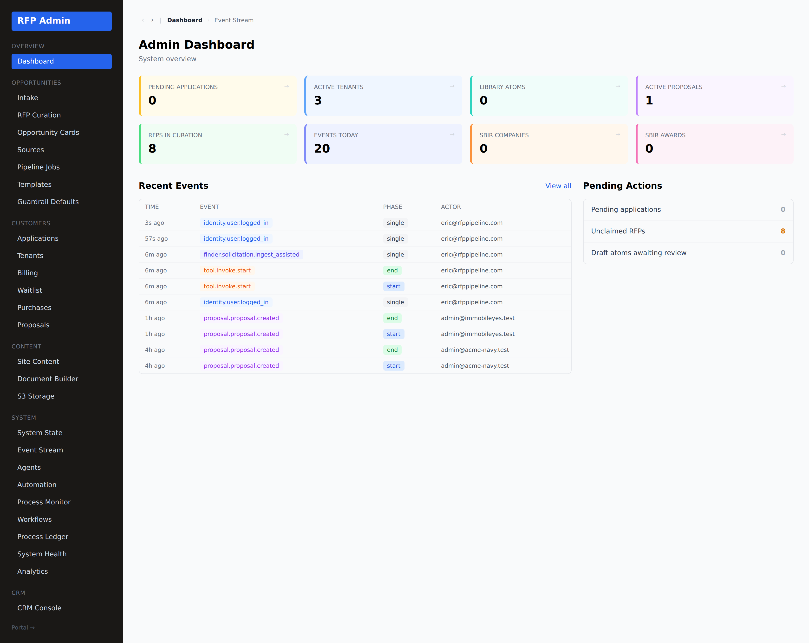

# Admin observability — dashboard, ToDos & the event stream

**Who this is for:** the RFP Pipeline team (`rfp_admin`, `master_admin`).
**What you'll learn:** where your open work lives (ToDos), and how to see **every
action by every actor** across the platform on one immutable audit queue.

> **Two sides, one spine.** Every significant action — an admin claiming a
> solicitation, a tenant locking a section, an automation firing, an Ingest Assist
> run — is emitted to the same immutable `system_events` queue. Admins see the
> whole platform; customers see their own tenant's slice (see the customer
> [Activity](./getting-started.md) feed). Nothing is mutated or deleted; the log is
> append-only.

---

## 1. The admin dashboard + ToDos

`/admin` opens on the dashboard — system state at a glance plus **your open
triage ToDos** (new solicitations to claim, purchases awaiting curation +
release, anything holding up a customer).

ToDos are computed from live state (the `tasks` spine + urgency), so the list is
always what actually needs you — clearing to empty when there's nothing pending.

---

## 2. The Event Stream (audit)

**System → Event Stream** (`/admin/events`) is the platform audit log — the
immutable queue rendered as a timeline.

Each row is one event:

- **Time** — when it happened.
- **Event** — `namespace.type` (e.g. `proposal.proposal.created`,
  `library.template.extracted`, `finder.solicitation.ingest_assisted`).
- **Phase** — `start` / `end` for long-running actions (so you see duration and
  failures).
- **Actor** — the user or system/agent that did it (with an actor icon), and their
  email.
- **Tenant** — which customer it belongs to (blank for platform-wide admin events).
- **Payload** — the structured detail of the action.

**Filter** by **namespace** (finder · capture · proposal · library · system · tool
· identity) and **time window** (1h / 6h / 24h / 7d), and flip **Auto-refresh** for
a live tail.

> **Namespaces** map to areas: `finder` (admin ingest/curation), `capture`
> (customer actions), `proposal` (the build workspace), `library` (content),
> `identity` (auth), `system` (infra), `tool` (invocations). This is the same set
> automations subscribe to.

---

## 3. The customer side — tenant Activity

Customers get the same audit, scoped to their tenant, at **Activity**
(`/portal/[tenant]/activity`) — who on their team did what, and when.

Because both feeds read the one `system_events` queue, the admin and customer
views never disagree — they're two windows onto the same immutable record.

---

## Related

- Purchases & the curation queue → [RFP admin](./admin-rfp.md)
- Ingest Assist (auto-build a solicitation's matrix + skeleton) → [`../INGEST_ASSIST.md`](../INGEST_ASSIST.md)
