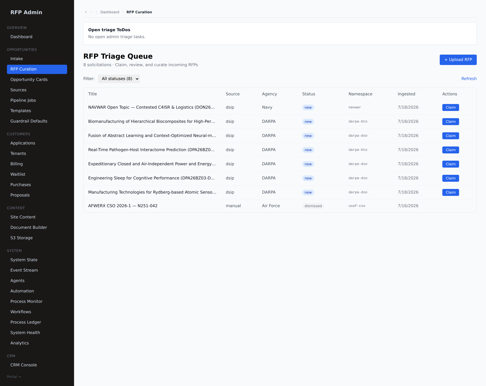
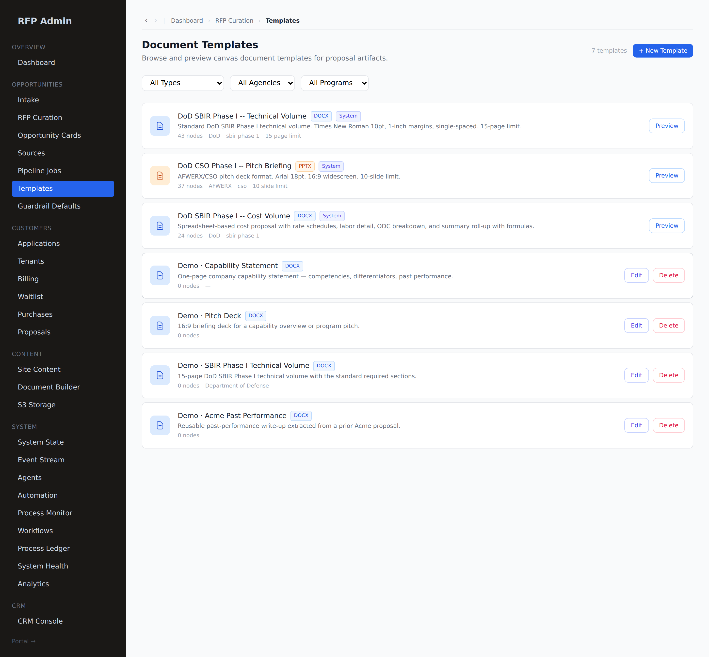

# RFP admin — ingest, curate, release

**Who this is for:** the RFP Pipeline team (`rfp_admin`, `master_admin`) who bring
opportunities into the system, curate them, onboard customers, and release
purchased proposals.
**What you'll accomplish:** take an RFP from raw notice to a released,
build-ready proposal portal in a customer's account — and know where every admin
lever lives.

**Prerequisites:** an `rfp_admin` or `master_admin` login. You land in **`/admin`**.

---

## 1. The admin console

The admin nav is grouped by area: **Overview**, **Opportunities** (Intake, RFP
Curation, Opportunity Cards, Sources, Pipeline Jobs, Templates, Guardrail
Defaults), **Customers** (Applications, Tenants, Billing, Waitlist, Purchases,
Proposals), **Content**, **System**, and **CRM**. A **Portal →** link at the
bottom jumps you into the customer portal (including a tenant shadow).

---

## 2. Ingest an RFP

Two ways in, both under **Opportunities**:

- **Intake** — record a no-file notice (title, agency, topic).
- **RFP Curation → + Upload RFP** — upload the RFP PDF; the system extracts text
  and topics and creates the opportunity + solicitation.

New solicitations land in the **RFP Triage Queue**.

Each row shows the title, **source** (here `dsip`), agency (DARPA, Navy, …),
status (`new`), namespace, and ingest date. The queue above holds real current
**DoD SBIR 2026 (DSIP)** topics — DARPA DSO/BTO and NAVWAR releases; a superseded
notice is shown `dismissed`. Click **Claim** to take a solicitation and open its
curation workspace.

---

## 3. Curate the compliance skeleton

In the curation workspace you author the **skeleton** every customer build will be
provisioned from (you author the skeleton, not per-proposal rows):

- **Compliance Matrix** — set/confirm the required elements.
- **Volumes** — *Add volume* (Technical, Cost, Supporting…), then *Add required
  item* under each (the section molds). Set page/slide limits and fonts per item.
- **Templates** — point a required item at a **template** (below) so its section
  starts from a real skeleton.
- **Expert notes** — per-volume / per-section guidance that grounds the AI draft.

> **What just happened:** when a customer's portal is later released, the
> per-proposal **compliance matrix + section molds are materialized automatically**
> from this skeleton.

---

## 4. Author templates (Template Studio)

**Opportunities → Templates** is the template library that both the curation
skeleton and the customer [Documents](./documents.md) browser draw from.

- Filter by **Type / Agency / Program**.
- **System** templates (e.g. *DoD SBIR Phase I — Technical Volume*, *DoD CSO Pitch
  Briefing*, *Cost Volume*) are shared across all tenants; **Preview** them.
- **+ New Template** opens the WYSIWYG canvas editor to build one; existing
  non-system templates have **Edit** / **Delete**.
- Each card shows the export format (DOCX / PPTX / XLSX), a **node count** (a
  filled skeleton) or an outline, and page/slide limits.

> Customers can also create their own templates by **saving a built volume as a
> template** — those show up in their portal's template browser.

---

## 5. Onboard a customer & release their build

1. A customer **purchases a proposal portal** with a comp code — it lands in
   **Customers → Purchases** as `curation_pending` with a 72-hour SLA, and parks
   an admin triage task.
2. Curate the solicitation (steps 3–4) if you haven't already.
3. **Release** the portal from the tenant's **`/portal/[tenant]/portals`** page
   (click **Release to customer**). Release **provisions the build UNLOCKED** — the
   proposal, its volumes, section molds, and the compliance matrix are instantiated
   from your skeleton.

> **Friction note:** the Release button lives on the tenant's portal page — use
> **Portal →** / navigate to the tenant URL to click it (no `/admin` deep-link
> yet).

The customer can now build (see [Proposal build](./proposal-build.md)).

---

## 6. Act inside a tenant (shadow / god-view)

Use **Portal →** to enter a tenant's portal and act on their behalf —
upload/atomize their library, provision a portal, or troubleshoot a build. This is
the same portal the customer sees, under their tenant's row-level security.

---

## Admin surfaces at a glance

| Area | Use it to… |
|---|---|
| **Intake / RFP Curation** | Bring in and curate solicitations |
| **Opportunity Cards** | See what's being spotlighted to tenants |
| **Sources / Pipeline Jobs** | Manage ingestion sources and runs |
| **Templates** | Author the shared template library |
| **Tenants / Applications / Waitlist** | Manage customer accounts and access |
| **Purchases** | Triage new buys → curate → release |
| **Proposals** | Cross-tenant view of every build |
| **System State / Event Stream / Process Monitor** | Observe the platform |
| **Agents / Workflows** | The agent workforce and workflow engine* |

\* *Agent workforce is partly wired — `section_drafter` is live end-to-end;
`compliance_reviewer` runs inline; the rest are registered but dormant. Don't
promise customers the dormant archetypes yet.*

---

## Troubleshooting

- **Can't find the Release button in `/admin`.** It's on the tenant's
  `/portal/[tenant]/portals` page — jump via **Portal →**.
- **A purchase is stuck in `curation_pending`.** It's awaiting an admin to curate
  + release; the 72-hour SLA is counting down on the customer's card.
- **Self-serve checkout isn't available.** Stripe checkout is descoped — customers
  purchase with a comp code; you release from the shadow account.
