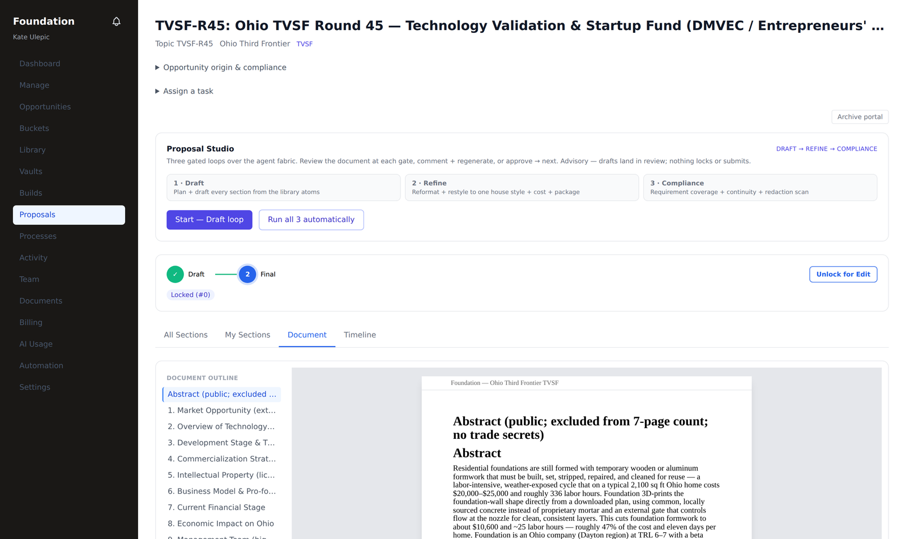
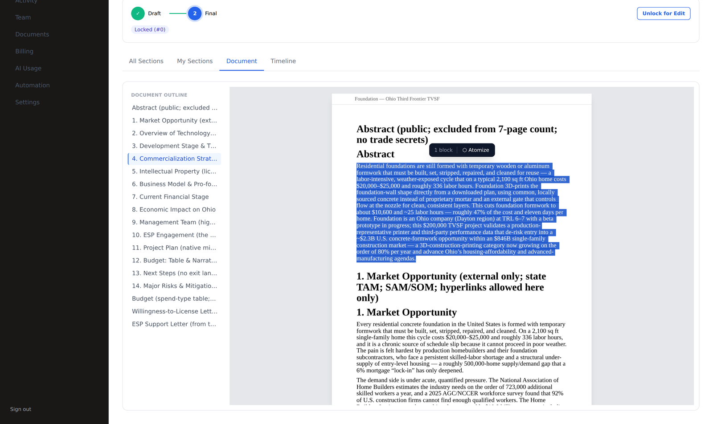
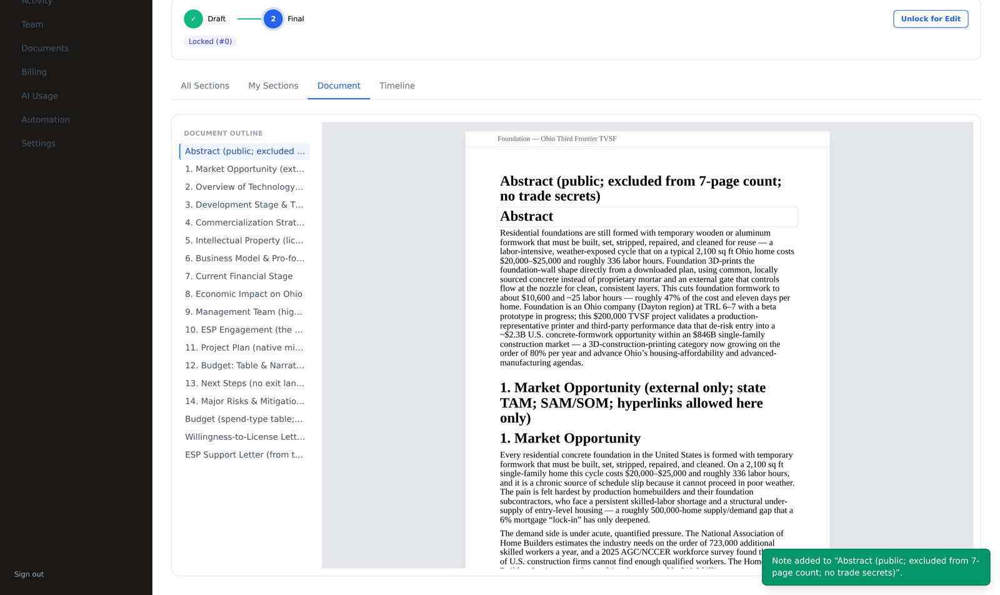
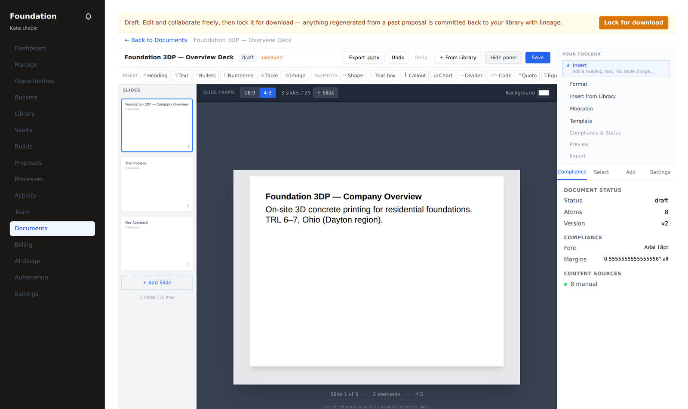
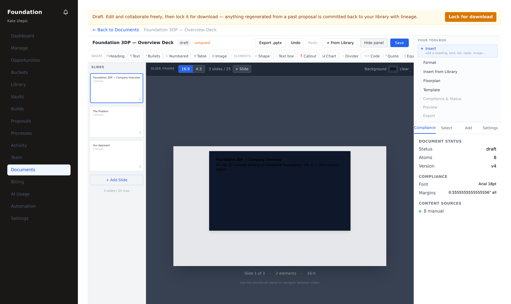
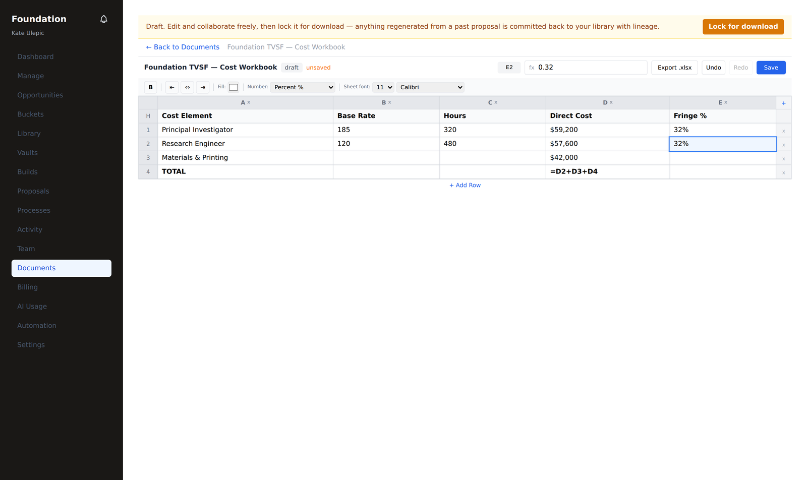
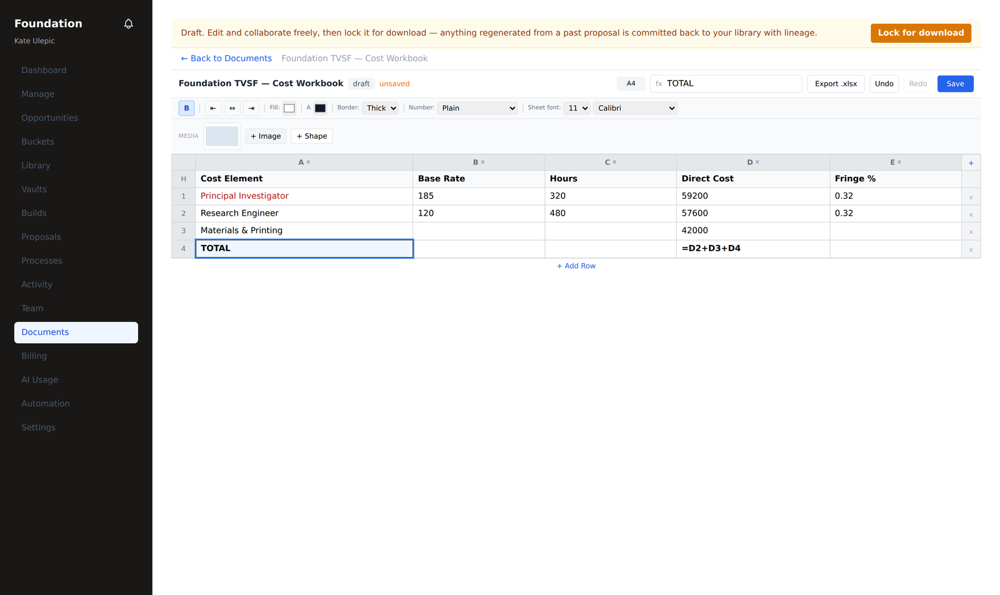

# Creating documents — from opportunity to export, agents at your elbow

**Who this is for:** the two people who make documents in RFP Pipeline —

- the **RFP Pipeline admin** (`rfp_admin` / `master_admin`), who authors the *master*
  side: the solicitation, its compliance shell, section molds, and reusable templates; and
- the **tenant admin** and teammates (`tenant_admin` / `tenant_user`), who build the
  *customer* side: proposal volumes and standalone documents — with the agent workforce
  drafting, reviewing, and reconciling alongside them.

**What you'll accomplish:** create and style any of the four document surfaces the canvas
supports — a **narrative document** (Word/PDF), a **slide deck** (PowerPoint), and a **cost
workbook** (Excel) — read a whole proposal as one fluid document, act on any highlighted
span, and export a file that looks exactly like what you saw on screen.

**The one rule that makes it trustworthy:** *what you see is what exports.* Every
background, shape, image, number format, and border you set in the editor is carried into
the `.docx` / `.pdf` / `.pptx` / `.xlsx`. And every agent is **advisory** — it drafts into a
review lane you accept or discard; it never silently overwrites your work.

---

## The two chairs

There are two vantage points, and the canvas is the same object seen from each.

| | **RFP Pipeline admin** | **Tenant admin (+ agents)** |
|---|---|---|
| **You author** | the master solicitation, the compliance matrix, section molds, templates | proposal volumes for your opportunity, and standalone documents |
| **You start from** | `/admin` → the curation workspace | your portal → an opportunity card, or **Documents → + New** |
| **Agents help you** | ingest assessment, section molds, compliance shells | full-draft (Studio), per-section drafting, review, atomize-to-library |
| **What you hand off** | a released, unlocked build with a compliance matrix + molds | a locked, submission-ready package |

The rest of this guide follows the tenant admin (the busier chair), and calls out where the
RFP admin's flow differs.

---

## 1. The canvas, and its four surfaces

Every document — a proposal section, a flier, a deck, a budget — is a **canvas**: a typed
tree of blocks (headings, text, lists, tables, images, shapes, charts, callouts, …) on a
page frame with margins, header/footer, and a size budget. One model, four modalities:

| Surface | Format | Editor | Exports to |
|---|---|---|---|
| **Narrative document** | letter / custom | flowing page + the fluid Document view | `.docx`, `.pdf` |
| **Slide deck** | 16:9 / 4:3 | slide editor (thumbnails + one slide) | `.pptx` |
| **Cost workbook** | spreadsheet | sheet editor (grid + tabs) | `.xlsx` |

You pick the surface when you create the document (**Documents → + New**: One-page flier,
Blank document, Slide deck, Workbook), or it's set for you when a proposal volume is
provisioned from the master solicitation.

---

## 2. Tenant admin: build a proposal, agents at your elbow

### 2.1 From the opportunity card to a build

When your opportunity is released, buy the proposal portal with the comp code
(`rfppipelinetest`). An RFP admin releases it and the build provisions **unlocked**, with a
compliance matrix and one **mold** per required item already in place. Open it from
**Proposals**.

### 2.2 Let the Studio draft the whole thing

The **Proposal Studio** runs the agent workforce over your build in three gated loops —
**Draft → Refine → Compliance** — each landing in a review you steer:

1. **Start — Draft loop.** The workforce plans and drafts every section from your **library
   atoms** (your uploaded, atomized content). It lands as a draft on the page.
2. **Review the gate.** Read it. Then either **comment + regenerate** (your comments thread
   in as guidance for the next pass) or **approve → next**.
3. **Refine**, then **Compliance** repeat the pattern — restyle to one house voice + the cost
   volume, then requirement coverage + continuity + a redaction scan.

Prefer hands-off? **Run all 3 automatically** chains the loops end to end and still lands
everything in review. Nothing locks or submits on its own.

> **Advisory, always.** The agents draft into a review lane. You **Accept AI drafts** to
> land them onto the page, or discard. This is the safety contract behind every agent in the
> product.

### 2.3 Read the whole proposal as one document

Section-by-section cards are good for *assigning* work; they're poor for *reading*. Open the
**Document** tab on the proposal to see the whole thing as one continuous, fluid document —
every section inline, in the real page frame, with a left **outline rail** that tracks where
you are as you scroll.

### 2.4 Highlight a span → act on it

In the Document view (and in any section editor), **selection is the verb.** Highlight any
run of text — even across sections — and a floating toolbar offers:

- **⬡ Atomize** — save the selection to your library as a reusable **atom**, with lineage
  back to the section it came from. It's immediately available to draft the next proposal.
- **✎ Annotate** — attach a note to the selection; it lands as a comment on the owning
  section, quoting the span, for your teammates.
- **↻ Regenerate** *(in the section editor)* — have AI re-draft the span; it lands as a
  reviewable revision you Accept or Revert.

---

## 3. Slide decks (PowerPoint)

A deck isn't a scroll — it's discrete slides. The slide editor gives you thumbnails on the
left, one slide in the center, and a **Slide frame** bar for the things a deck actually
needs: **size · ratio · count · background.**

- **Aspect ratio** — switch **16:9 ↔ 4:3**; the surface and thumbnails reflow instantly.
- **Slides** — the count (and your limit, if the RFP sets one) with **+ Slide**.
- **Background** — one click sets the deck background color; it renders on every slide **and
  exports to the `.pptx`**.

Everything else is styling and primitives, from the toolbar above the slide:

- **Shapes** — rectangle, ellipse, arrow, line, star, … each with **fill, border, opacity,
  rotation, shadow**, and free **placement** (drag or set X/Y/W/H in the Arrange panel).
- **Images** — upload a logo or figure; position, border, and rotate it. It exports placed
  exactly as shown (not force-centered).
- **Text, tables, charts, callouts** — the same block palette as documents, sized for slides.

---

## 4. Cost workbooks (Excel)

A workbook is a **fancy table.** The sheet editor is a real grid — cell references, a
formula bar (`fx`), multiple sheet tabs, add/delete rows and columns — plus the styling a
cost volume needs.

### 4.1 Cells and numbers

- **Formulas** — type `=D2+D3+D4`; it stays a live formula and exports as one Excel computes
  on open.
- **Number format** — pick **Currency / Percent / Thousands** per cell. `59200` shows as
  **$59,200**, `0.32` shows as **32%** — while the formula bar still shows the raw value you
  edit. The same format code drives the `.xlsx`, so display and export never disagree.

### 4.2 Simple styling

From the format bar: **bold**, **alignment**, **fill** (cell background), **text color**, and
a per-cell **border** (none / thin / thick — e.g. a bordered total row). Every one is
honored in the exported `.xlsx`.

### 4.3 Images and shapes in a workbook

Need a logo or a figure? The **Media** strip above the grid adds an **image** (uploaded) or
a **shape** — previewed in place and exported as a floating picture in the `.xlsx`.

---

## 5. RFP Pipeline admin: authoring the master side

The admin flow uses the same canvas, aimed upstream:

1. **Curate the solicitation.** In `/admin`, work the ingested opportunity. Use **Assess
   ingest readiness** to have the `rfp_ingest_manager` agent read the ingest state and
   recommend which specialist agents to run next — advisory, never descending into a tenant.
2. **Author the compliance shell + molds.** Define the volumes, required items, and page
   budgets. Each becomes a **mold** the tenant's build is provisioned from.
3. **Templates.** Author reusable document templates (letter, deck, workbook, narrative);
   publish a Studio-built document to the shared library so tenants can start from it.
4. **Release.** Approving the build fans the opportunity onto every tenant's board and, on
   purchase, provisions the tenant's build unlocked with the matrix + molds in place.

The admin can also ring the **Proposal Auto-Drive doorbell** from `/admin/agents` to run a
tenant's full draft from up top — the same advisory, land-in-review flow, just triggered by
the platform rather than the customer.

---

## 6. Agents, and the safety contract

The workforce (36 archetypes) shows up as helpers, never as a hand on your keyboard:

- **Section drafter** drafts a section from your atoms.
- **Proposal Studio** plans + drafts + refines + compliance-checks the whole build.
- **Compliance reviewer** and the **color-team reviewer** critique; they advise, they don't
  advance a gate.
- **Librarian** turns your accepted spans into library atoms.

Three invariants hold for every one of them:

- **Advisory → review → land.** Output arrives in a review lane. *You* accept it.
- **Tenant-bound.** A tenant's agents act only inside that tenant; they never see another's.
- **Fenced + bounded.** Your content is quoted safely to the model, and runs are capped so
  nothing runs away or dead-ends a workflow.

---

## 7. Export, and the compliance floor

Lock or complete a section, then download the document or the whole proposal package:

| Surface | Formats |
|---|---|
| Narrative document / proposal | `.docx`, `.pdf`, `.json`, `.zip` |
| Slide deck | `.pptx` |
| Cost workbook | `.xlsx` |

The **compliance floor** checks the size ruler as you work and again at export — font,
page/slide counts, per-section page budgets, images, header/footer — against what the RFP
requires. The gauge in the editor and the export gate share one engine, so they can't
disagree. Over-budget reads red before you ever hit download.

And because the editor and the exporters share the same model, the file you download carries
every background, shape, image, number format, and border you set — exactly as you saw it.

---

### Where to go next

- [Documents — create, template, export](./documents.md) — the standalone-document hub.
- [Proposal build](./proposal-build.md) — the full opportunity → submission flow.
- [Library atoms](./library-atoms.md) — how atomize feeds your reusable library.
- [Getting started](./getting-started.md) — signing in and finding your way around.
