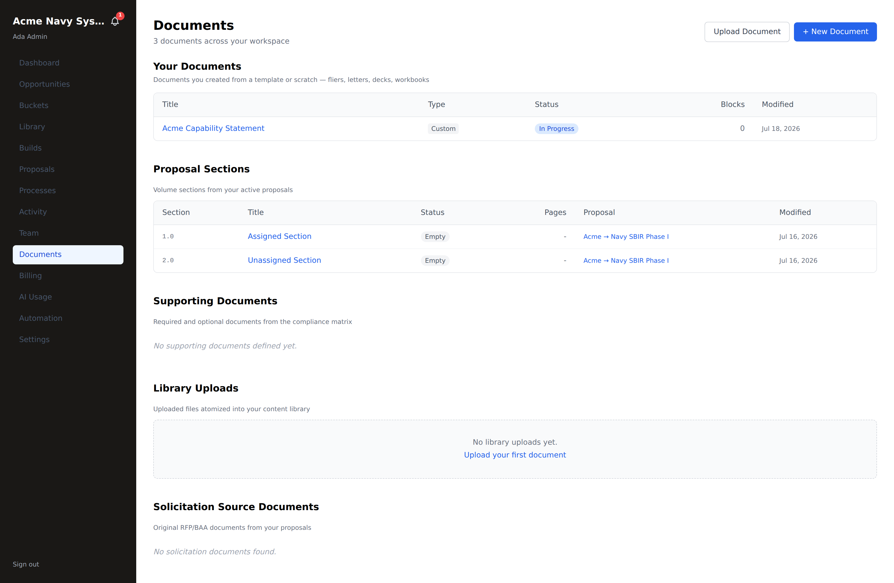
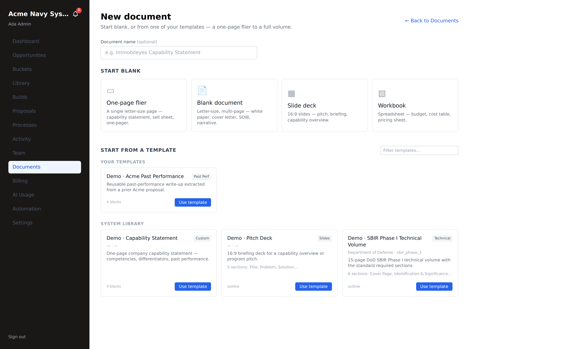
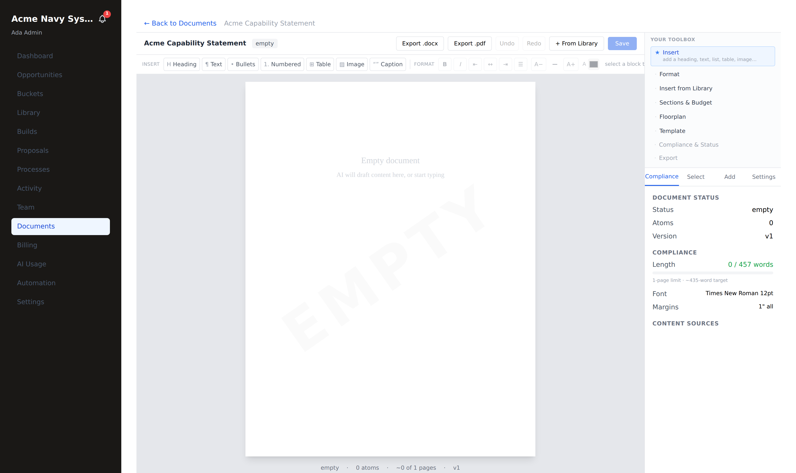

# Documents — create, template, export

**Who this is for:** tenant admins and teammates (`tenant_admin`, `tenant_user`).
**What you'll accomplish:** create a standalone document — a one-page flier, a
letter, a slide deck, a workbook, or a full write-up from one of your templates —
edit it in the canvas, and export it to Word / PowerPoint / Excel / PDF. **No
proposal or opportunity required.**

> Standalone documents are separate from *proposal volumes* (which belong to an
> opportunity and a compliance matrix). Use documents for capability statements,
> sell sheets, white papers, cover letters, briefings — anything you want to
> write and send on its own.

**Prerequisites:** you're signed in to your portal (see
[Getting started](./getting-started.md)) with at least `tenant_user` access.

---

## 1. Open the Documents hub

From the left nav, click **Documents**. The hub lists everything document-shaped
in your workspace. The top section, **Your Documents**, is your standalone
documents — each row links straight into the editor.

Click **+ New Document** (top right) to start one.

---

## 2. Choose how to start

The **New document** screen gives you two ways to begin. Name it first (optional)
in the **Document name** field.

**Start blank** — pick a format:

| Preset | What you get |
|---|---|
| **One-page flier** | A single letter-size page — capability statement, sell sheet, one-pager |
| **Blank document** | Letter-size, multi-page — white paper, cover letter, SOW, narrative |
| **Slide deck** | 16:9 slides — pitch, briefing, capability overview |
| **Workbook** | A spreadsheet — budget, cost table, pricing sheet |

Clicking a preset creates the document and drops you straight into the editor.

---

## 3. …or start from a template

Scroll to **Start from a template** to reuse a skeleton instead of a blank page.
Two groups appear:

- **Your templates** — skeletons your team extracted from prior proposals
  (e.g. *"save this volume as a template"* during a build).
- **System library** — shared, ready-made starters (SBIR technical volume,
  capability statement, pitch deck, …).

Each card shows the document **type**, the agency/program if set, a short
description, and either **N blocks** (a filled skeleton), an **outline** (section
headings you'll fill in), or **page rules** (just the format). Use the **Filter
templates…** box to search by name, agency, or type. Click **Use template** to
create a document from it.

> **What just happened:** the template's page rules (margins, fonts, page limit)
> and any body/outline are copied into a brand-new document. The original
> template is untouched — you can reuse it as many times as you like.

---

## 4. Write in the canvas

Every document — blank or from a template — opens in the **same canvas editor**
you use for proposal sections. Only the tools change to match a standalone
document.

- **Top bar:** the document title + status, **Export .docx** / **Export .pdf**,
  **Undo** / **Redo**, **+ From Library**, and **Save**.
- **Insert toolbar:** Heading · Text · Bullets · Numbered · Table · Image · Caption.
- **Format toolbar:** bold / italic, alignment, size (A− / A+), color — applied to
  the selected block.
- **Your toolbox** (right rail, most-useful tool on top): **Insert**, **Format**,
  **Insert from Library**, **Sections & Budget**, **Floorplan** (margins / header /
  footer / page cap), **Template** (save this as a reusable template),
  **Compliance & Status**, **Export**.
- **Compliance panel:** live page/word budget against the format's limit, plus
  font and margins.

**Insert from your library.** Click **+ From Library** (or the *Insert from
Library* toolbox card) to drop reusable atoms — a past-performance blurb, a bio,
a boilerplate paragraph — straight into the page. This is the *"from template
**and** library"* workflow: start from a skeleton, fill it with your own vetted
content.

> **Note:** proposal-only tools (Complete & Lock, comments, harvest-to-library,
> AI-revise) are intentionally hidden for standalone documents — there's no
> compliance matrix or review workflow behind a flier. Insert-from-library stays
> on, because reusing your content is the whole point.

**Save** commits your edits (with an optimistic lock, so two people can't silently
overwrite each other). The document now shows under **Your Documents** on the hub.

---

## 5. Export

Use **Export .docx** / **Export .pdf** in the top bar, or the **Export** toolbox
card. The format follows the document:

| Document type | Native export | Also |
|---|---|---|
| Flier / letter / write-up | **.docx** | **.pdf** |
| Slide deck | **.pptx** | **.pdf** |
| Workbook | **.xlsx** | — |

Exports are real Office files (generated with the same engines as proposal
volumes), not print-to-PDF. Download and send.

---

## Troubleshooting

- **"This document was changed by someone else."** A teammate saved since you
  opened it. Reload to get the latest, then re-apply your edit. (This is the
  optimistic-lock guard protecting your work.)
- **PDF export says it's temporarily unavailable.** PDF rendering needs the
  headless browser service; use **.docx** and convert, or try again shortly.
- **A template shows "page rules" only.** That template carries just the format
  (margins/fonts/limits), no body — you'll start from a blank page with the right
  page setup. Templates that say **N blocks** come pre-filled.
- **I don't see New Document.** You need at least `tenant_user` access. Ask your
  tenant admin.
