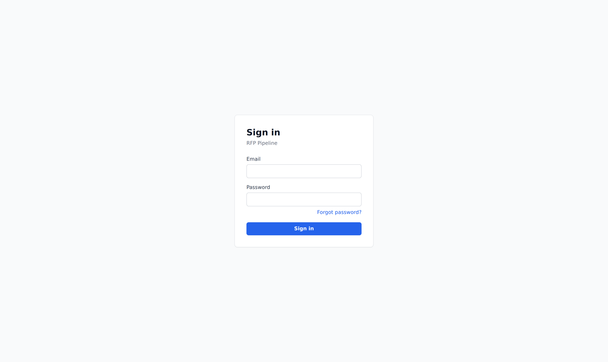
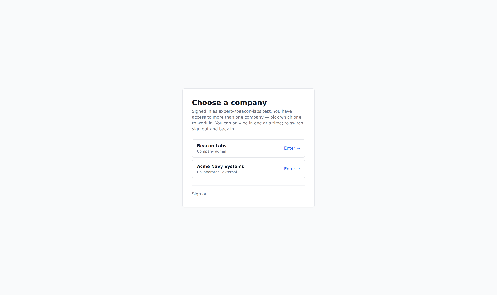
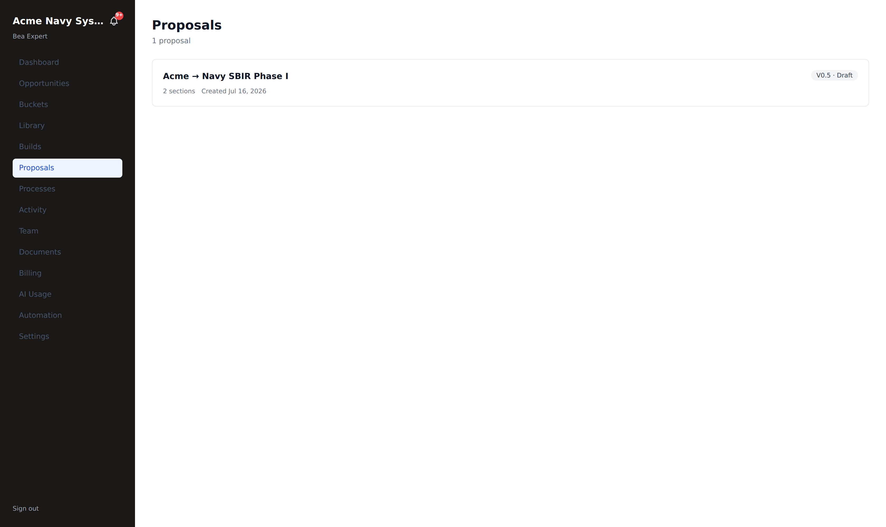
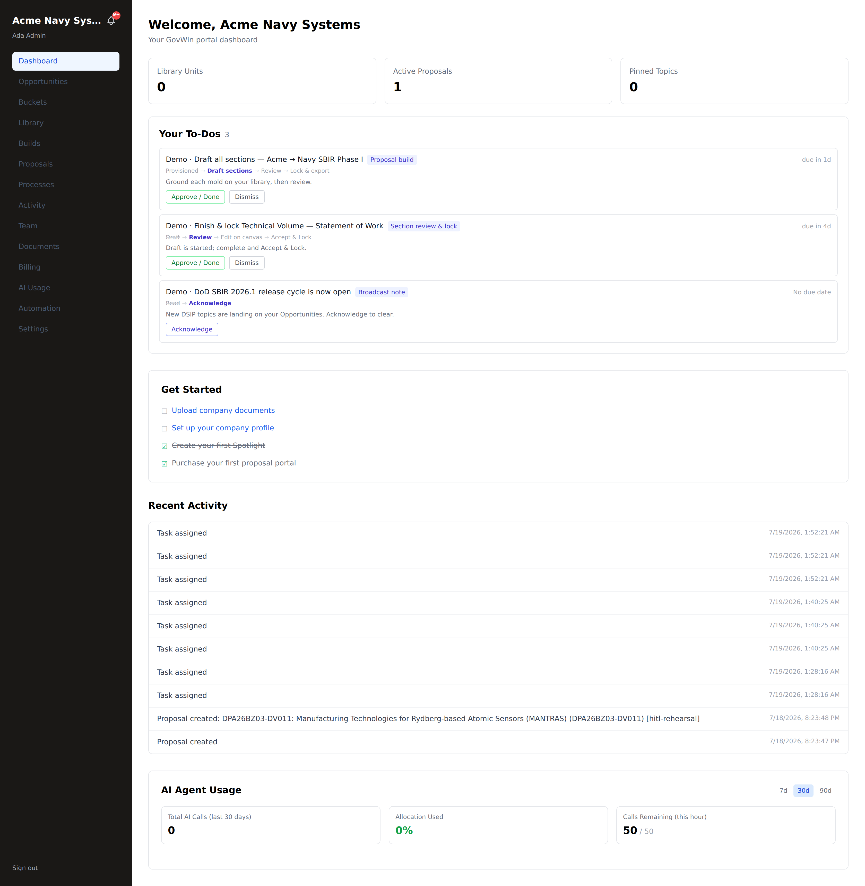

# Getting started + portal tour

**Who this is for:** everyone with a customer login (`tenant_admin`, `tenant_user`,
and invited `partner_user` collaborators).
**What you'll accomplish:** sign in, get oriented on your portal, and know where
every task lives.

---

## 1. Sign in

Go to your portal URL and you'll land on the sign-in screen. Enter your **email**
and **password** and click **Sign in**. Forgot it? Use **Forgot password?** to
reset.

- **Invited to a team?** Your invite email links to a page where you set your own
  password, then you sign in normally.
- **You're routed automatically** to the right home: customers land in their
  portal; RFP/master admins land in `/admin`.

### Choosing a company (if you belong to more than one)

You sign in with **one email**. If that email has access to **more than one
company** — say you're a team member at your own company *and* an outside
collaborator on another company's proposal — you'll pick which one to work in:

- **You work in one company at a time.** Picking a company scopes your whole
  session to it. To work in a *different* company you **sign out and sign back in**
  and pick that one — you're never in two at once (a hard tenant-isolation rule).
- **Most people never see this** — if your email belongs to exactly one company
  you go straight to your home, no extra step.

After you pick, you land in that company — e.g. as an outside collaborator you land
on that company's **Proposals**, scoped to just what you were granted:

---

## 2. The dashboard

After signing in you're on your **Dashboard** — a snapshot of your workspace.

- **Top stats:** Library Units, Active Proposals, Pinned Topics.
- **Your To-Dos:** anything waiting on you (a section to finish, a portal to
  release). Empty means you're clear.
- **Get Started checklist:** the four first steps — upload company documents, set
  up your profile, review your spotlight, purchase your first proposal portal.
- **Recent Activity** and **AI Agent Usage** (calls used vs. your hourly
  allocation).

### Your To-Dos are steps in defined workflows

Every ToDo is **one step in a named workflow**, not a loose task. Each card shows
the **workflow** it belongs to (the blue chip) and a **step trail** with the step
you're on in **bold** and finished steps struck through — e.g. a section shows
**Section review & lock**: `Draft → `**`Review`**` → Edit on canvas → Accept & Lock`.
Completing the ToDo advances that workflow.

> The smallest ToDo is a **Broadcast note** — `Read → `**`Acknowledge`** — cleared
> with one **Acknowledge** click. It's the catch-all: even a simple FYI is a
> one-step workflow, so nothing on your list is ever unstructured.

---

## 3. The navigation — where everything lives

The left rail is your map. Here's what each item is and the guide that covers it:

| Nav item | What it's for | Guide |
|---|---|---|
| **Dashboard** | Your snapshot + to-dos | this page |
| **Opportunities** | Ranked opportunity cards; buy a proposal portal | [Spotlight & purchase](./spotlight-purchase.md) |
| **Buckets** | How opportunities are scored/ranked for you | [Spotlight & purchase](./spotlight-purchase.md) |
| **Library** | Your reusable content atoms (upload → atomize → reuse) | [Library & atoms](./library-atoms.md) |
| **Builds / Proposals** | Your proposal build workspaces | [Proposal build](./proposal-build.md) |
| **Documents** | Standalone documents — fliers, letters, decks, workbooks | [Documents](./documents.md) |
| **Processes** | Workflow instances running behind your proposals | — |
| **Activity** | An audit log of who did what | — |
| **Team** | Invite teammates, set roles, grant section access | [Team & collaborators](./team-collaborators.md) |
| **Billing / AI Usage** | Plan, usage, AI-call allocation | — |
| **Automation / Settings** | Preferences and configuration | — |

> **Labels vs. URLs.** The nav uses friendly names (e.g. **Opportunities** →
> `/cards`, **Library** → `/atoms`). The guides note the underlying page when it
> matters.

---

## 4. Your first hour — the recommended path

1. **Set up your company profile** (**Settings / profile**) — name, capabilities,
   the basics that flow into drafts.
2. **Upload prior proposals** to build your library (**Library → Upload
   package**) — see [Library & atoms](./library-atoms.md). Everything you upload
   becomes reusable content.
3. **Review your opportunity cards** (**Opportunities**) and, when one fits,
   **purchase a proposal portal** with your comp code — see
   [Spotlight & purchase](./spotlight-purchase.md).
4. Once your portal is **released**, **build the proposal** — draft from your
   library, edit on the canvas, lock, and export — see
   [Proposal build](./proposal-build.md).
5. Need a one-off **flier, letter, or deck**? Skip the proposal machinery and use
   [Documents](./documents.md).

---

## Roles at a glance

| You are a… | You can… |
|---|---|
| **Tenant admin** | Everything in your portal — buy, build, lock, export, invite the team, manage the library |
| **Teammate** (`tenant_user`) | Draft, edit, save, comment, export — per the access your admin grants |
| **Collaborator** (`partner_user`) | Only the sections you're invited to, at the level granted (view / comment / edit) |

---

## Troubleshooting

- **"Sign in" bounces back to the login screen.** Double-check email/password;
  if you were just invited, finish setting your password from the invite link
  first.
- **A nav item shows an empty state.** That area just has no data yet — the empty
  state tells you the first action to take (e.g. *"Upload your first document"*).
- **You can't see a section a teammate mentioned.** Collaborators only see
  sections they've been granted; ask the tenant admin to extend your access
  (see [Team & collaborators](./team-collaborators.md)).
