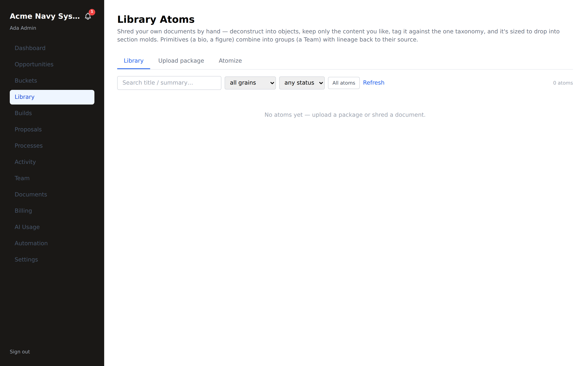
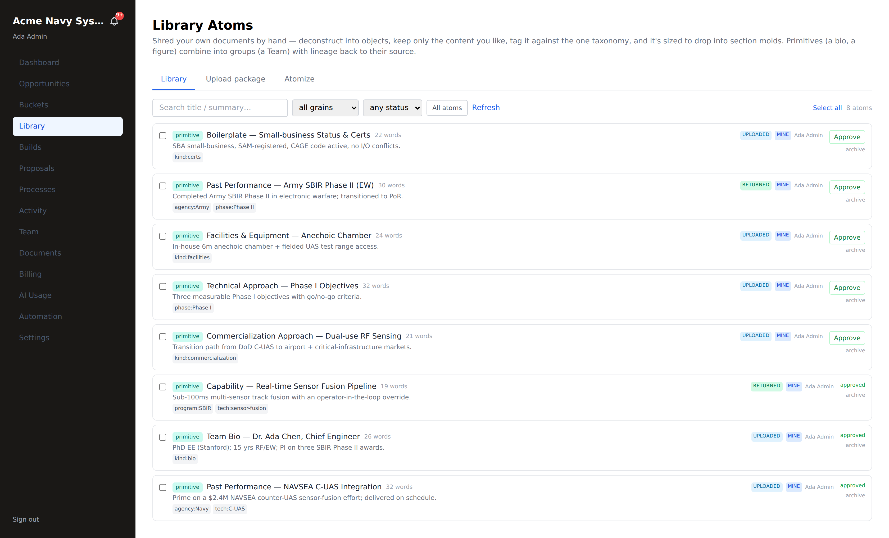
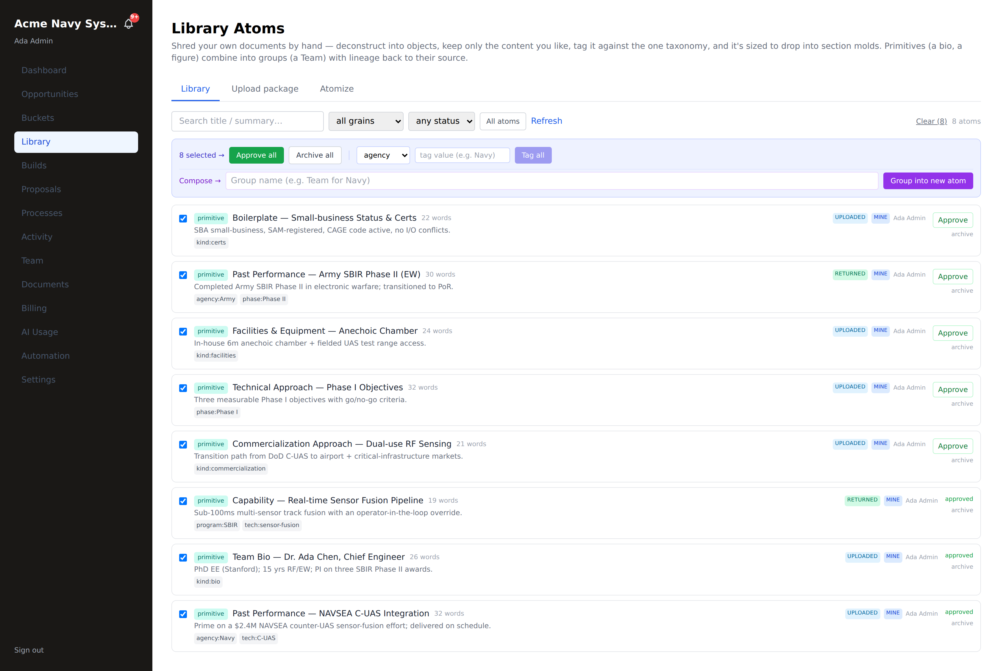
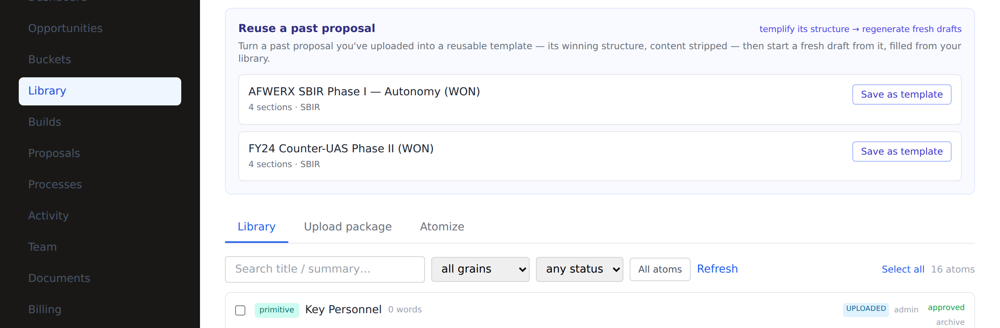
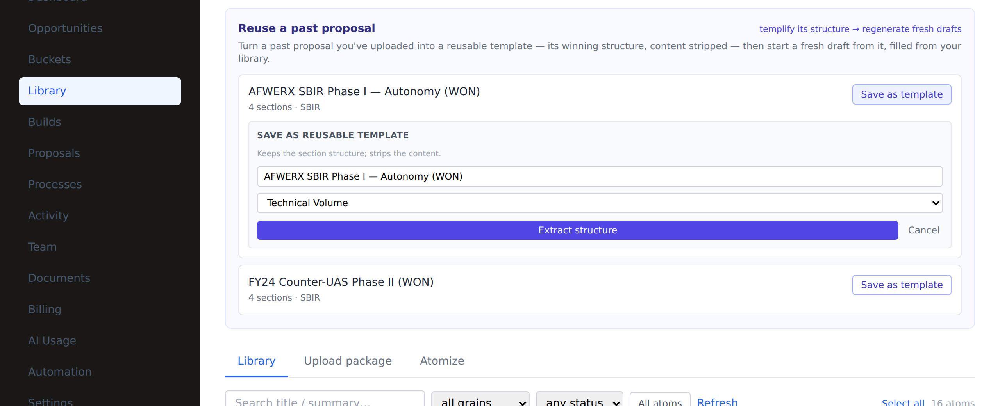
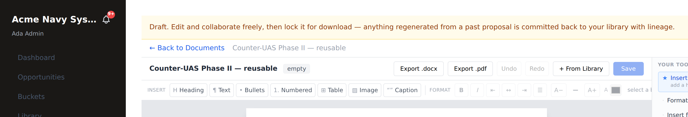

# Library & atoms — upload, atomize, reuse

**Who this is for:** tenant admins building their reusable content library
(`tenant_admin`; teammates can browse).
**What you'll accomplish:** turn your prior proposals into **atoms** — tagged,
reusable pieces of content — so the next proposal assembles from work you've
already done.

> **The value prop in one line:** a completed proposal, uploaded once, becomes the
> atoms that draft the next one.

**Prerequisites:** signed in with `tenant_admin` access; some prior proposals
(docx / pdf / pptx / xlsx / txt) to upload.

---

## 1. Open the Library

Click **Library** in the left nav. It has three tabs — **Library** (browse),
**Upload package** (bulk ingest), and **Atomize** (box-and-tag by hand).

A new library is empty: *"No atoms yet — upload a package or shred a document."*
The page explains the model: *deconstruct documents into objects, keep the content
you like, tag it against the one taxonomy, sized to drop into section molds;
primitives (a bio, a figure) combine into groups (a Team) with lineage back to
their source.*

---

## 2. Upload a package (the fast path)

1. Open the **Upload package** tab.
2. **Drag in a prior proposal set** — up to a dozen files (docx / pdf / pptx /
   xlsx / txt).
3. Fill the optional **package context** (the "FROM" pedigree): agency, program
   (SBIR / STTR / BAA / OTA / CSO / RIF), phase, solicitation, topic. This stamps
   every atom so reuse later ranks by *where it came from*.
4. Click **Atomize package.**

> **What just happened:** each file becomes a **foundational document**, and every
> section becomes a tagged, reusable **atom** — content-classed (kind / volume /
> format) plus your context. Switch to the **Library** tab to see them.

---

## 3. Atomize by hand (precision path)

Prefer to keep only certain pieces? Use the **Atomize** tab to **box, select,
group, and tag** content as you ingest:

- An **image** becomes a figure atom; a **table** or **list** becomes an atom (or
  a group of rows/items).
- Select several primitives and **group** them (e.g. *"Team Bios"*).
- Box a whole **section** (a group of groups).
- The session's FROM-pedigree stamps everything, and each atom keeps **lineage**
  back to its source document.

---

## 4. Browse, filter, and curate

On the **Library** tab:

- **Search** by title/summary; filter by **grain** (all grains / primitive /
  group) and **status** (draft / approved / archived).
- Each atom shows its **word count**, **tags**, **source** (uploaded vs returned),
  and reuse count. Click an atom to open its **detail drawer** — lineage, a content
  preview, tags, and usage.
- **Curate** per atom with **Approve** / **archive**, or adjust tags in the drawer.

### Bulk curation

Curating one-by-one is slow. Tick the checkboxes (or **Select all**) to act on
many atoms at once — the **bulk bar** appears with the whole selection:

- **Approve all** / **Archive all** — set the status on every selected atom in one
  call (one transaction, tenant-scoped — a spoofed id can't touch another tenant).
- **Tag all** — pick a taxonomy **dimension** (agency · program · phase · tech ·
  dept · kind · vol) and a **value**, and confirm that tag across the whole
  selection. This is how you retro-tag an imported batch to the one taxonomy.
- **Group into new atom** (2+ selected) — compose the selection into a group atom
  (e.g. a "Team for Navy") with lineage back to its members.

> Bulk actions clear the selection and refresh the list when they finish, so the
> board always reflects the current state.

---

## 5. Reuse — where atoms flow back in

Your library powers the rest of the product:

- **Draft All Sections** on a proposal grounds each section on the best-matching
  atoms (see [Proposal build](./proposal-build.md)).
- **Insert from Library** drops hand-picked atoms into any section — or into a
  standalone [document](./documents.md).
- **Locking a section harvests it back** into the library as a new atom with
  lineage to the atoms it was built from — non-destructively. Your library
  compounds with every proposal.

---

## 6. Reuse a past proposal — templify, then regenerate

At the top of the Library is **Reuse a past proposal**. Every proposal package you
upload is listed here with its section count; turn a winning one into a reusable
**template** (its structure, content stripped), then spin up fresh drafts from it.

**Save as template (templify).** Click **Save as template**, name it, and pick a type.
The proposal's section structure is extracted into a reusable template that shows up
under **Templates** — and in the RFP-admin curation picker. The content is stripped;
only the winning skeleton is kept.

**New draft (regenerate).** Once templified, the card offers **New draft**. This
*duplicates* the past proposal into a brand-new document **and copies its atoms** as
your own working drafts — each linked by lineage back to the original. You and your
team **mutate and collaborate** on these copies freely; the originals are never touched.

**Full lock for download.** When the document is done, **Lock for download** finalizes
it and commits its working copies to your library as **new foundation atoms** — each
still carrying **lineage back to the seminal proposal**. So a locked document branches
into fresh, reusable, traceable library content, and your originals stay pristine
(non-destructive). Every step is on your **Activity** log.

> **The loop:** upload → atomize → **templify** → **regenerate** (copies + lineage) →
> edit/collaborate → **full lock** (new foundation atoms + lineage back). Your winning
> work compounds without ever overwriting the source.

---

## Troubleshooting

- **"No atoms yet" after uploading.** Make sure you clicked **Atomize package**
  (upload stages the files; atomize creates the atoms). Large packages take a
  moment.
- **A cost spreadsheet didn't atomize.** `.xlsx` cost volumes are supported; check
  the file opens and has content rows.
- **Reuse isn't finding my atoms.** Set the **package context** at upload — reuse
  ranks by volume/kind **and** that pedigree, so context makes matches far better.
