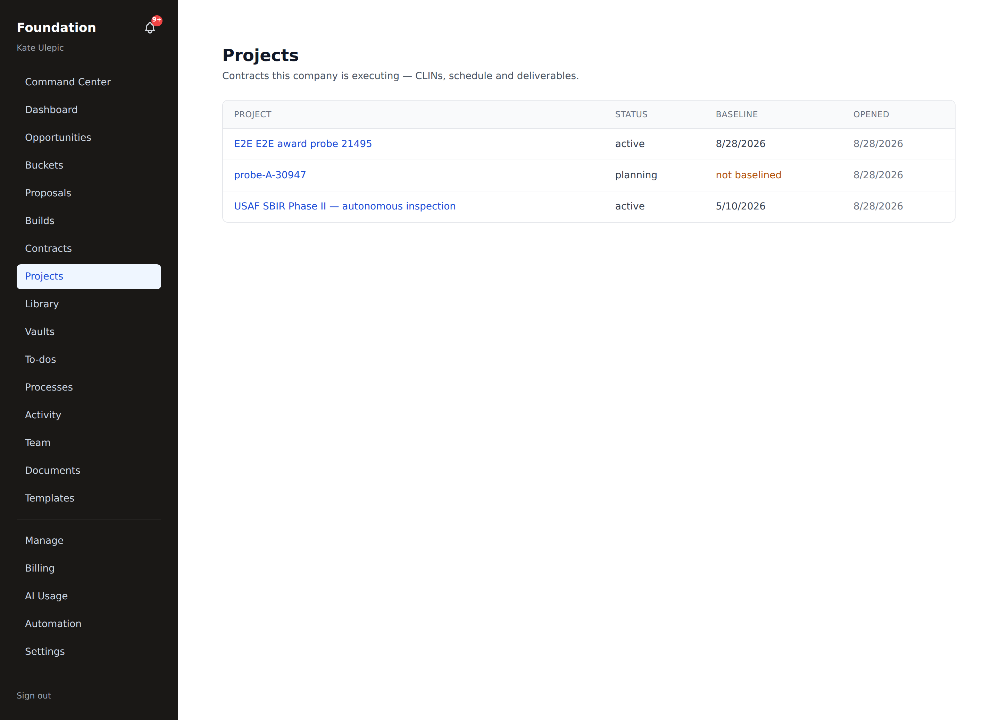
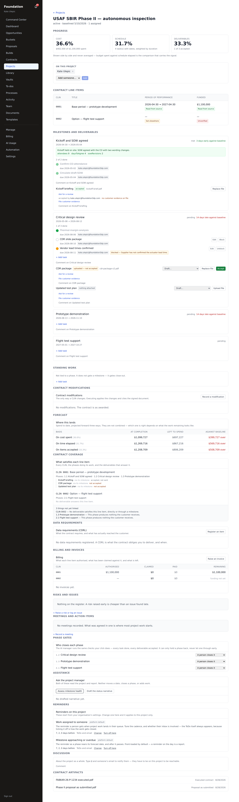

# Projects — after you win

**Audience:** tenant_admin, tenant_user
**Prerequisite:** a proposal whose outcome is **awarded**

Everything before this guide gets you to a submitted proposal. This is what happens when one wins:
the executed contract, the plan, the people, the deliverables the customer actually receives, and
the close-out.

> Screenshots are real captures of the running app, regenerated by
> `frontend/scripts/capture-projects-guide.mjs`. Every target is visited as the real actor through
> the real login; a target that fails is reported rather than illustrated.

---

## 1 · The award raises a ToDo — it does not create the project

When a proposal's outcome is set to **awarded**, the system records a contract and raises a
`project_setup` ToDo in your queue. It stops there **on purpose.**

A project needs two documents that only a person has: the **executed contract** and the **proposal
as submitted**. Creating a project automatically would mean creating one with neither, and every
number in it would then be derived from a working copy of the proposal that stayed editable after
submission. So the ToDo waits for you.

> **Why not just use the proposal?** Because the proposal in the build portal is a *working copy*.
> It is still editable, and what you actually promised the government is the file you sent. The
> project anchors on the uploaded file, not on the proposal spine. `projects.contract_id` is
> navigation — it tells you which contract this came from. It is not the source of truth.

---

## 2 · Open the project

`/portal/[tenant]/projects` lists everything you are on.

You see a project because you are **assigned to it**, not merely because you are in the company.
That is a second layer on top of the usual tenant boundary, and it is enforced in the application
rather than the database — the request carries a tenant, not a person, so the database alone cannot
answer "is *this* user on *this* project".

One consequence worth knowing: a **partner_user** (an external collaborator) is refused project
access outright. Not "shown an empty list" — refused. That is what removes cross-tenant exposure
from the role entirely.

---

## 3 · The workspace

Everything for one contract on one page. Top to bottom:

| Section | What it is for |
|---|---|
| **Progress** | three measures, side by side |
| **On this project** | who is assigned, and how to add someone |
| **Contract line items** | the CLINs, each field carrying where its value came from |
| **Milestones and deliverables** | the plan, and what the customer receives |
| **Standing work** | tasks tied to no phase |
| **Contract modifications** | the only way a CLIN ever changes |
| **Forecast** | estimate at completion, once there is something to project from |
| **Contract coverage** | which CLIN each phase and deliverable answers |
| **Data requirements (CDRL)** | what the contract requires and what has actually been sent |
| **Billing and invoices** | authorised · claimed · paid · remaining |
| **Risks and issues · Meetings · Phase gates · Reminders · Discussion** | the working record |

### Progress is three numbers, never one

**Cost**, **schedule** and **deliverables** are shown together and are never averaged.

They disagree, and the disagreement is the information. "40% of the money, 60% of the time, 25% of
the deliverables" tells a programme manager something; one blended number tells them nothing and
hides which measure is the problem.

A measure with no denominator reads **not measured** — never `0%`. If nothing has been spent, the
forecast says so in words:

> *Nothing to project from yet — no progress recorded on this measure yet, and a projection would be
> division by zero.*

That is deliberate. A confident number you did not read is worse than a blank.

---

## 4 · The baseline freezes once

When the plan is right, you **baseline** it. That freezes the dates *and* the cost.

It can only happen once, and that is enforced by the database, not by a convention in the code —
because the baseline is the one number in the whole project that cannot be recomputed later.

**Rebaselining does not touch it.** `Rebaseline` moves the *current plan*; the baseline stays where
it was. Variance is the distance between the two, so a rebaseline that moved both would report zero
variance forever.

---

## 5 · Milestones are the unit of work

A milestone is a dated segment — start → forecast — with an owner, a **task checklist**, and a
**completion record** (a note plus whatever metrics you want to keep).

One milestone is a dated to-do list with reminders. Ten milestones are that, in series. There is no
"simple mode": the small case is the large one with a length of one.

- **Dates are serial by default.** A new milestone starts the day after the previous one ends. Pin a
  start and that is respected; overlap is allowed.
- **Rescheduling moves what follows.** Move an end date and everything later moves by the same
  amount — the current plan only, never the baseline.
- **Pulling a milestone in refuses and names what it would strand** rather than quietly dragging
  committed task dates with it.
- **Anyone on the project can tick a task off.** Adding tasks and closing a milestone are
  tenant_admin. A checklist only a manager may tick is a status report, not a checklist.

Assigned tasks appear in the **same** `/todos` queue, the same bell and the same Command Center as
everything else in the product, and the same nudge sweeper chases them. The checklist is the source
of truth; the ToDo follows it and never writes back.

### Closing a milestone is gated twice, with different messages

1. **Tasks outstanding** — the work itself.
2. **Deliverables outstanding** — the customer's signature.

Two gates, two messages, because they are two different problems and only one of them is yours to
solve alone.

---

## 6 · Deliverables: uploading is not accepting

This is the separation the whole capability turns on.

| Act | Who | Meaning |
|---|---|---|
| **Attach** a file or an authored document | any assigned employee | here is the work |
| **Send for review** | anyone on the project | please read this |
| **Approve / reject** | the named reviewer, or a tenant_admin | an internal reader is satisfied |
| **Accept** | tenant_admin only | the obligation is met |

**Replacing an attached file revokes acceptance.** You cannot swap the artefact underneath an
accepted deliverable and keep the acceptance.

**A rejection must carry a reason.** "Not yet accepted" and "rejected, for these reasons" are
different states, and only one of them tells the next person what to do. Only the latest review
counts, which is what makes reject → fix → re-request → approve a loop rather than a wall.

A deliverable can be **authored in the product** rather than uploaded — a report, a deck, a
workbook or a PDF, in the same editor, measured by the same size and compliance rules, and exported
by the same engines as a proposal volume. Losing the draft does not delete the obligation.

---

## 7 · The contract changes one way

CLIN values are never edited in place. You **record a modification**: a draft with its list of
changes, which you then execute. Executing applies the changes and cites the signed document.

Once executed, the modification and its change rows are **frozen**. A contract value you can edit in
place is a contract nobody can reconstruct six months later.

---

## 8 · CDRLs have a third state

Data requirements track what the contract *requires* against what has actually reached the customer.

**Submitted is not accepted, and accepted is not submitted.** A deliverable accepted internally but
never sent is the case this exists to make visible — every box ticked and the customer holding
nothing.

---

## 9 · Close-out

Closing a project is milestone completion one scale up: a note, whatever metrics matter, and a
status the database will not let drift from its timestamp.

Three separate refusals, each naming what is in the way:

- **Milestones outstanding**
- **Tasks outstanding** — including standing work that gated no individual phase
- **Deliverables outstanding**

**Reopening keeps the close-out note.** What you wrote when you thought you were finished is part of
the record, not a draft to be discarded.

---

## What the AI does here, and what it will not

Two agents work on projects, and both are **advisory**.

- **Project manager** — reads the plan and reports on milestone health.
- **Status narrator** — drafts the prose of a status report.

Neither advances a stage, closes a gate, or submits anything.

**The status narrator is checked, not trusted.** Before a drafted narrative is offered to you, every
figure in it is recomputed and compared against what the system actually calculated. A draft
containing a number the system never produced is refused, and the number is named so you can see
what was rejected. A prompt asking the model not to invent figures is also in place, and is
deliberately the weaker of the two: an instruction is not an invariant.

**The AI-manager phase gate is opt-in, per milestone, and can only ever say no.** Assign a milestone
to the AI manager and it may close it — but only by the same path a person uses, with the same task
and deliverable checks. Its reach is a strict subset of yours: it can close only what a tenant_admin
could have closed at that moment, and it additionally requires its own conditions. It contributes a
*reason to stop* — an open high-scoring risk, or a deliverable accepted internally but never sent —
not permission to go.

This is the opposite of what people expect from "let the AI decide it's done", and it is worth
being explicit about: **the rows decide it is done; the AI may object.**

---

## Related

- [Proposal build — draft → lock → export](./proposal-build.md) — everything before the award
- [Documents — create, template, export](./documents.md) — the editor a deliverable is authored in
- [Getting started + portal tour](./getting-started.md) — the ToDo queue these tasks land in

## Related

- [On a phone — web and mobile](./mobile.md) — ticking tasks and checking progress from a phone
