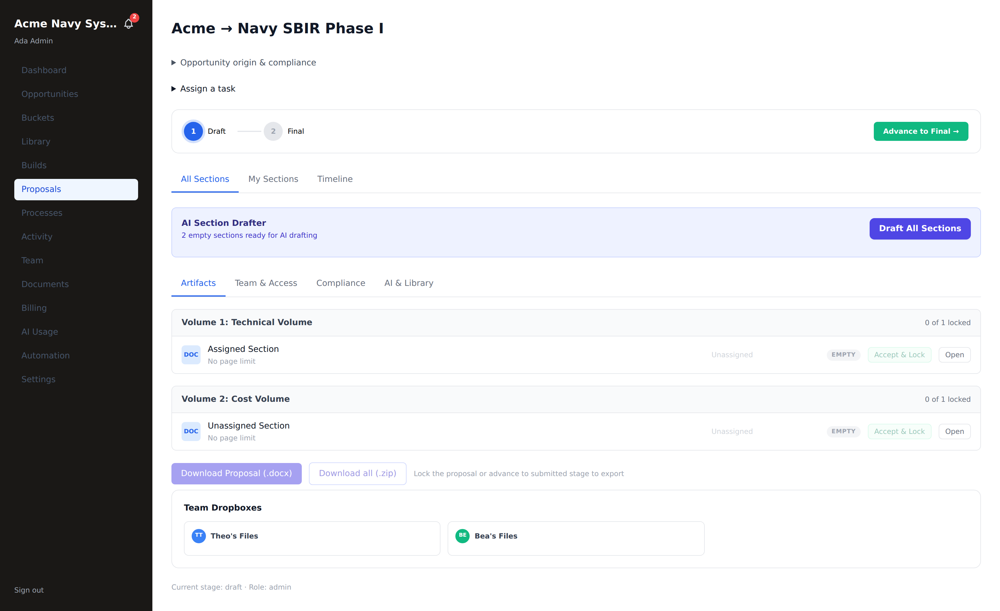
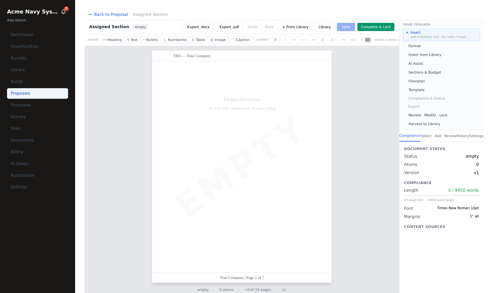

# Proposal build — draft → lock → export

**Who this is for:** tenant admins and teammates building a purchased proposal
(`tenant_admin`, `tenant_user`, and granted `partner_user` collaborators).
**What you'll accomplish:** take a released proposal from empty sections to a
locked, exportable package — drafting from your library, editing on the canvas,
locking, and downloading in every format.

**Prerequisites:** the proposal portal has been **purchased** (see
[Spotlight & purchase](./spotlight-purchase.md)) and **released** by an RFP admin,
so the build is provisioned and unlocked. You'll find it under **Proposals** /
**Builds**.

---

## 1. Open the build workspace

Click **Proposals** in the left nav and open your proposal. The workspace is
mission control for the whole build.

What you're looking at:

- **Stage stepper** (top): *Draft → Final*, with **Advance to Final →** when
  you're ready to move stages.
- **AI Section Drafter:** *"N empty sections ready for AI drafting"* + **Draft All
  Sections**.
- **Tabs:** *All Sections* · *My Sections* (yours to work) · *Timeline*.
- **Artifacts** tab: each **Volume** (Technical, Cost, …) and its **sections**,
  with per-section status (EMPTY / drafted / locked), **Accept & Lock**, and
  **Open**.
- **Download Proposal (.docx)** / **Download all (.zip)** — enabled once locked.
- **Team & Access**, **Compliance**, **AI & Library** tabs, plus **Team
  Dropboxes** for shared files.

---

## 2. Draft from your library

Click **Draft All Sections** to have the AI drafter fill every empty section,
grounded on the **best-matching atoms from your library** (scored by volume/kind
and the context you tagged at upload). Your prior work flows straight into the new
proposal.

> **What just happened:** each section mold is filled with a first draft assembled
> from your own vetted content — not generic boilerplate. You review and refine
> from there. (Prefer to write by hand? Skip this and open a section directly.)

---

## 3. Edit a section on the canvas

Click **Open** on any section to edit it in the canvas. This is the **same editor**
as a [standalone document](./documents.md) — but because it's a proposal section,
more tools light up.

Compared to a standalone document, a proposal section adds:

- **Complete & Lock** (green, top bar) — accept and lock the section.
- **AI Assist** — draft / revise / fit-to-budget a block.
- **Review · Modify · Lock** and **Harvest to Library** toolbox cards.
- **Review**, **History** tabs — comments and version history.

Everything else is identical: the **Insert** and **Format** toolbars, **+ From
Library**, the live **Compliance** panel (here: *0 / 9450 words*, a *15-page
limit*, Times New Roman 10pt, 1″ margins), the page preview with running header
and footer, and **Save**.

**Work the section:**

1. **Insert from Library** (or **+ From Library**) to drop in vetted atoms.
2. **AI Assist** to revise a block or fit it to the budget.
3. Edit directly — headings, text, lists, tables, images — with the Insert/Format
   toolbars.
4. **Comment** (Review tab) to leave notes for teammates.
5. **Save** — versions are archived automatically, and saves are optimistic-locked
   so concurrent edits never silently clobber each other.

---

## 4. Lock — section, volume, or all

Locking marks work **accepted** and is what unlocks export.

- **Complete & Lock** (in the editor) or **Accept & Lock** (on a section row) —
  locks that section. *(Admin action.)*
- **Lock Volume** — locks every section in a volume at once.
- **Lock All** — the whole proposal.

> **What just happened:** every lock (a) advances that item's **compliance-matrix**
> row to *satisfied*, and (b) **harvests the section back into your library** as a
> new atom with lineage to the atoms it was built from — non-destructively (the
> sources are usage-marked, never overwritten). Your finished work becomes reusable
> content for the next pursuit.

---

## 5. Advance the stage

When a stage's sections are done, use **Advance to Final →** (top stepper) to move
the proposal forward. Admins can force-advance when needed.

---

## 6. Export the package

Once locked (or at the submitted stage), download in any format:

- **Per section:** **Export .docx** / **Export .pdf** from the section editor.
- **Per volume:** native **.docx / .pptx / .xlsx** + **.pdf** from the Artifacts tab.
- **Whole proposal:** **Download Proposal (.docx)** (one combined document) or
  **Download all (.zip)** — every volume in its native format, bundled.

These are real Office files, assembled by the same engines throughout — a lossless
"download my proposal."

---

## Roles & access on a build

| You are a… | On a proposal you can… |
|---|---|
| **Tenant admin** | Everything — draft, edit, lock, advance, export, assign sections |
| **Teammate** (`tenant_user`) | Draft, edit, save, comment, export (admin does the locking) |
| **Collaborator** (`partner_user`) | Only your assigned sections, at the level granted (view / comment / edit) — you can't reach another section's content |

---

## Troubleshooting

- **Download is greyed out** ("Lock the proposal or advance to submitted stage to
  export"). Lock at least one section (or the volume/proposal) first — locking is
  what releases export.
- **A section is read-only.** It's locked, or it was completed in a previous
  stage, or you're a collaborator without edit on it. An admin can unlock.
- **"Draft All Sections" seems to do nothing.** It only fills **empty** sections;
  already-drafted ones are left alone so your edits are never overwritten.
- **PDF export unavailable.** The PDF renderer needs the headless-browser service;
  use **.docx**, or grab the volume PDF once the service is back.
