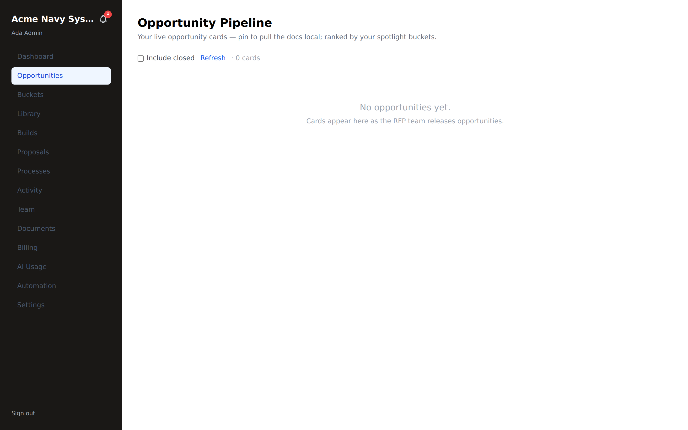
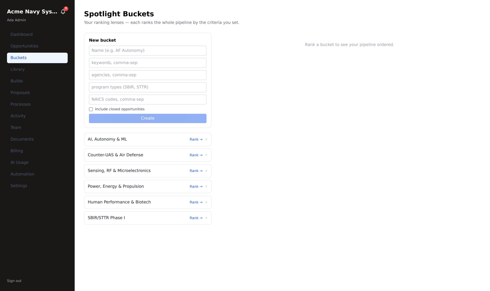

# Spotlight & purchase — cards → comp code

**Who this is for:** tenant admins choosing what to pursue and buying a proposal
portal (`tenant_admin`).
**What you'll accomplish:** read your ranked opportunity cards, pick one that
fits, and purchase a proposal portal with your comp code.

**Prerequisites:** signed in with `tenant_admin` access. Cards appear as the RFP
team releases opportunities to your tenant.

---

## 1. Review your opportunity pipeline

Click **Opportunities** in the left nav. This is your **spotlight** — live
opportunity cards, ranked by your spotlight buckets.

Each **card** shows the opportunity's title and topic code, its component
(DARPA, Navy, …), program/phase, and **close date** — plus **Pin (copy docs)** to
pull its documents local and **Build →** to start a proposal. The cards above are
real current **DoD SBIR 2026 (DSIP)** topics — DARPA's MANTRAS (Rydberg atomic
sensors), ExCAIPE (air-independent power), FALCON (ML + LLMs), and a NAVWAR open
topic, among others.

- **Include closed** toggles closed opportunities in/out.
- **Refresh** re-pulls the latest.
- Open **Buckets** (left nav) to see *how* opportunities are scored and ranked for
  your company.

> **New tenant?** Until the RFP team releases opportunities to you, this reads
> *"No opportunities yet — cards appear here as the RFP team releases
> opportunities."* Cards populate as the pipeline pushes live topics.

---

## 1a. Spotlight buckets — your ranking lenses

Click **Buckets** (left nav). Buckets are the lenses that **rank your whole
pipeline** by criteria you choose. Every new tenant starts with a sensible
**default set** — AI/Autonomy, Counter-UAS, Sensing/RF, Power/Energy, Human
Performance/Biotech, and a broad SBIR/STTR Phase I bucket — so your cards are
ranked from day one; you add or edit buckets from here.

- **Create** a bucket with **keywords**, **agencies**, **program types**, and/or
  **NAICS** — the criteria it scores against.
- Click **Rank →** on any bucket to order the pipeline by that lens.

> **How matching works.** A card's score blends several signals — but the primary
> one is **keyword match against the opportunity's spotlight-match summary** (the
> curated blurb the RFP admin writes for exactly this purpose, required before an
> opportunity is released), plus its title and description. Structured signals —
> **program type**, **agency**, **NAICS**, and the **close-date timeline** — round
> out the score. So a well-written spotlight summary is what makes your ranking
> sharp.

---

## 2. Open a card and assess fit

Click a card to read the opportunity summary — agency, program, topic, key dates,
and why it was ranked where it is. Pinning a card pulls its documents local for a
closer look.

---

## 3. Purchase a proposal portal

When a card fits, **purchase** its proposal portal:

1. On the card, choose **Purchase** and enter your **comp code**
   (`rfppipelinetest`).
2. The purchase creates a proposal portal in **`curation_pending`** with a
   **72-hour SLA**, and notifies the RFP team.

> **Self-serve checkout is not available yet** — Stripe is descoped for now, so the
> comp code is how you buy. Don't look for a credit-card flow.

---

## 4. Wait for release (curation)

After purchase, the opportunity sits in **awaiting-curation** with a countdown. An
RFP admin curates the compliance skeleton and **releases** the portal — at which
point your **build is provisioned, unlocked**, with its volumes, section molds,
and compliance matrix ready.

You'll then find it under **Proposals** / **Builds** — continue in
[Proposal build](./proposal-build.md).

> **What just happened end-to-end:** card → purchase (comp code) → `curation_pending`
> (72h) → RFP admin releases → unlocked build provisioned from the master
> skeleton. See [RFP admin](./admin-rfp.md) for the other side of this handshake.

---

## Troubleshooting

- **No cards at all.** Nothing has been released to your tenant yet — the RFP team
  pushes opportunities as they're activated. Check back, or ask your rep.
- **My comp code was rejected.** Confirm it's `rfppipelinetest` (current standing
  code) and hasn't already been consumed for that opportunity.
- **I purchased but there's no build.** It's in `curation_pending` — an RFP admin
  must curate + release it (the 72-hour SLA is counting down). The build appears
  once released.
