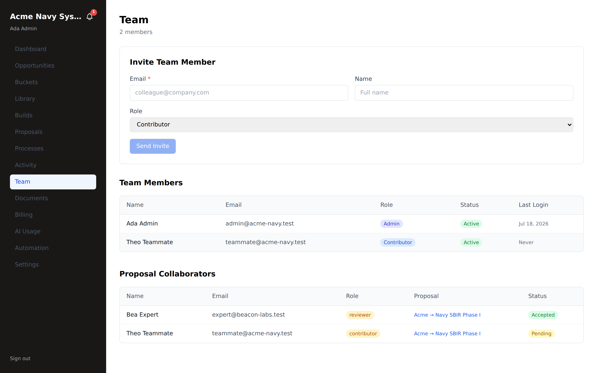
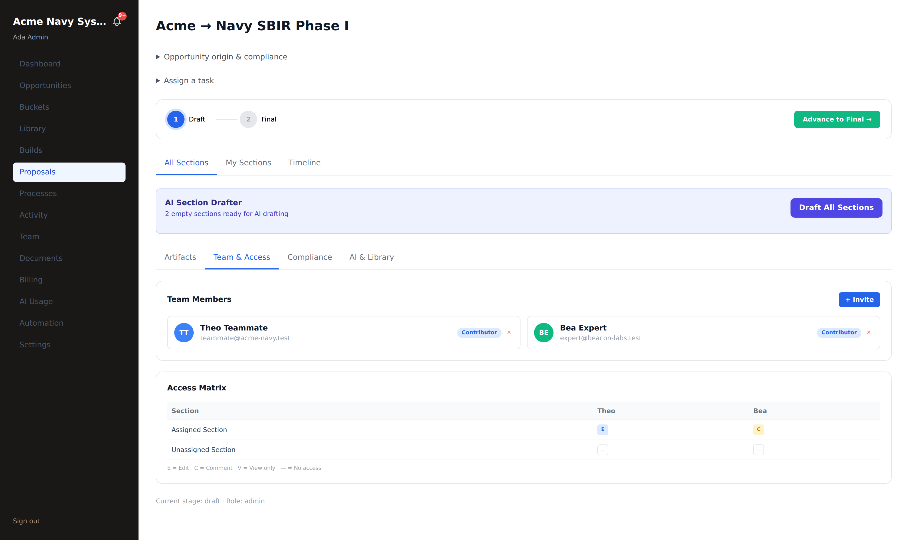
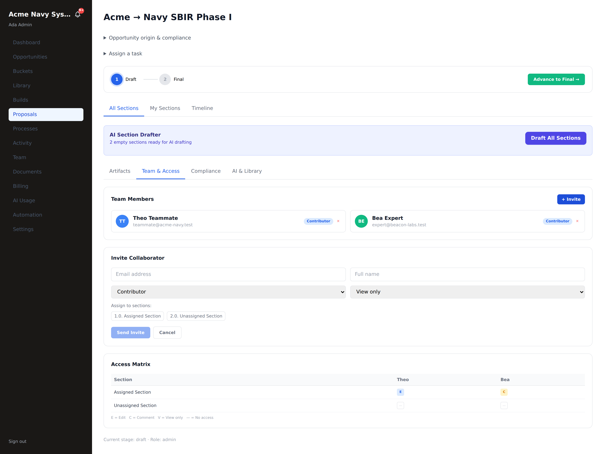
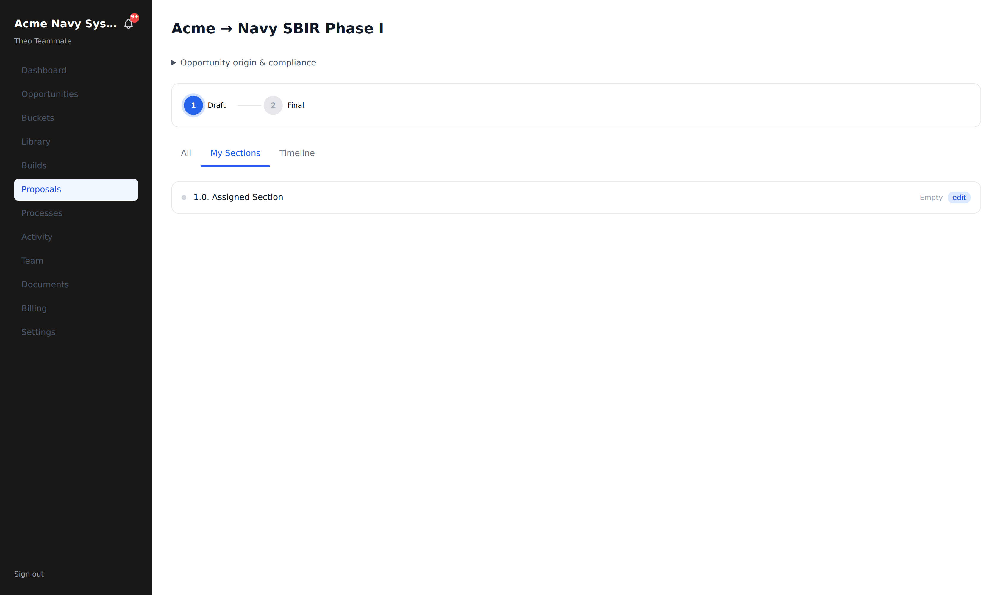

# Team & collaborators

**Who this is for:** tenant admins managing their team (`tenant_admin`), and
external collaborators invited to a proposal (`partner_user`).
**What you'll accomplish:** invite teammates, set their roles, and grant external
collaborators **section-scoped** access to a proposal — plus understand what each
person can and can't reach.

**Prerequisites:** `tenant_admin` access to reach **Team**.

---

## 1. The Team page

Click **Team** in the left nav. It has three parts: an **invite** form, your
**team members**, and your **proposal collaborators**.

- **Invite Team Member:** email, name, and a **role** (e.g. *Contributor*) →
  **Send Invite**.
- **Team Members:** everyone in your tenant, with role (Admin / Contributor),
  status (Active / invited), and last login.
- **Proposal Collaborators:** external people invited to a *specific* proposal,
  with their role (reviewer / contributor), which proposal, and status
  (Accepted / Pending).

---

## 2. Invite a teammate

1. Enter their **email** (and name).
2. Pick a **role**:
   - **Admin** (`tenant_admin`) — full portal access: buy, build, lock, export,
     manage the team and library.
   - **Contributor** (`tenant_user`) — draft, edit, save, comment, export per your
     grant.
3. **Send Invite.** They receive an email, set their own password, and appear as
   *Active* once they sign in.

---

## 3. Grant a collaborator section-scoped access

Collaborators are invited **from inside a proposal** — open the build and click the
**Team & Access** tab. This is where you scope who can touch which section, and at
what level.

The tab has two parts:

- **Team Members** — everyone on this proposal, with their role and a **✕** to
  revoke access instantly.
- **Access Matrix** — a grid of **every section × every collaborator**, showing
  exactly who has **E**dit / **C**omment / **V**iew / **—** (no access) on each
  section. Above, *Theo* has **Edit** on the Assigned Section, *Bea* has **Comment**;
  neither can touch the Unassigned Section.

### Invite + scope, in one form

Click **+ Invite** to open the invite form:

1. Enter their **email** and **name**.
2. Pick a **role** — *Contributor* (internal teammate) or *External* (outside
   partner → `partner_user`).
3. Pick a **permission** level:

   | Grant | They can… |
   |---|---|
   | **View** | Read the section only |
   | **Comment** | Read + leave comments |
   | **Edit** | Read + comment + edit the section content |

4. **Assign to sections** — click the section chips to pick exactly which sections
   this grant covers. Unpicked sections stay invisible to them.
5. **Send Invite.** An existing user is granted immediately; a brand-new email gets
   an acceptance link to set a password, then lands straight in the proposal.

### What the collaborator sees

A collaborator **only ever sees the sections they're granted**. Signed in as *Theo*
(Edit on one section), the workspace shows just that section — the unassigned one
isn't even listed:

This scoping is enforced **everywhere** (save, lock, versions, export, atomize,
comment resolution), not just hidden in the UI — so the collaborator-landing model
is safe by construction. Collaborators also appear back on the **Team** page's
**Proposal Collaborators** table (Accepted / Pending).

### The collaborator's own role can't leak in

The same person may be a **company admin at their own company** and a **collaborator
on yours** — one email, several companies. When they enter *your* company they arrive
as the collaborator you scoped, **not** with their home-company powers: their active
role follows the company they pick at sign-in, so an admin-elsewhere still sees only
the sections you granted here. Below, *Bea Expert* — a company admin at Beacon Labs —
lands in Acme as an external collaborator: a trimmed sidebar (just **Proposals**) and
only her assigned work.

And because a session is pinned to **one company at a time**, she can't be working in
your proposal and her own company at once — to move between them she signs out and
back in. Pricing and any section you didn't grant never appear for her, in either
place.

---

## 4. What each role can do (summary)

| Role | Scope |
|---|---|
| **Admin** (`tenant_admin`) | Everything in the portal |
| **Contributor** (`tenant_user`) | Tenant-wide member; draft/edit/comment/export per grant (admin locks) |
| **Collaborator** (`partner_user`) | Only granted sections, at view / comment / edit |

---

## Troubleshooting

- **An invite shows "Pending" forever.** They haven't accepted yet — resend, or
  confirm the email arrived. Collaborators must accept before their access is live.
- **A collaborator says they can't see a section.** They were granted a *different*
  section, or only *view* where they need *edit*. Update their grant on the
  proposal's **Team & Access** tab.
- **A teammate can't lock a section.** Locking is an **admin** action; contributors
  save and an admin accepts & locks (see [Proposal build](./proposal-build.md)).
